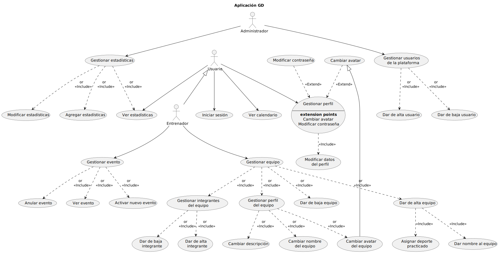

 

# Lab 0 - Familiarización con MarkDown-PlantUML

 

## Soluciones Actividad 2

 

### Supuesto 1: Horarios
En una universidad, el personal del PDI, el personal del PAS y los estudiantes pueden consultar horarios. Por su parte, el personal del PAS puede modificar horarios y dar de alta estudiantes. El personal de PDI puede proponer cambios en los horarios y dar de alta estudiantes. La funcionalidad de dar de alta estudiantes del PAS realiza una verificación de los datos del estudiante. Sin embargo, la funcionalidad de dar de alta estudiantes del PDI, además de verificar los datos también permite de forma excepcional realizar la búsqueda en las listas de clase de sus asignaturas.

 

 

### Supuesto 2: Sistema de Compras
En un sistema de compra, existen cuatro tipos de usuarios: comprador, vendedor, proveedor y administrador. Los compradores pueden agregar productos, consultar precios, finalizar la compra y consultar ofertas. Agregar productos implica marcar esos productos como bloqueados. Los vendedores también pueden consultar ofertas y consultar precios. Los proveedores pueden consultar precios, avisar de nuevos productos y consultar ofertas. Avisar de nuevos productos, de forma excepcional, realiza la incorporación de una oferta. Los proveedores también tienen una funcionalidad para avisar del fin de una oferta. Cuando se avisa del fin de una oferta, se ejecuta la funcionalidad de eliminar la oferta. Ambas funcionalidades de avisar del proveedor tienen en común que se encarga de enviar una notificación. Los administradores pueden consultar precios, consultar ofertas y eliminar productos. La funcionalidad de consultar precios incluye una funcionalidad de buscar productos que es similar a la funcionalidad de consultar productos de los compradores. Sin embargo, la funcionalidad de consultar productos añade una funcionalidad para verificar la disponibilidad. Para realizar una venta, un comprador y un vendedor participan de forma conjunta. En dicha operación, se lleva a cabo el acuerdo de un precio; excepcionalmente, durante la realización de la venta, se consultará el histórico de ventas.

 

 

### Supuesto 3: Compañía hotelera
En una compañía hotelera, el administrador y el comercial pueden consultar reservas. El comercial realiza ofertas y gestiona nuevas reservas. El administrador gestiona nuevas peticiones y también realiza ofertas. La realización de ofertas por parte del comercial conlleva un recálculo de precios. Además, dicha realización de ofertas conlleva opcionalmente el bloqueo temporal de una reserva. Los clientes, los administradores y los comerciales pueden consultar disponibilidades y visualizar ofertas. La consulta de disponibilidades y la consulta de reservas tienen la funcionalidad común de buscar elementos. Por su parte, la consulta de disponibilidades conlleva una funcionalidad que muestra un calendario.

 

 

### Supuesto 4: Fotografía Online
En una aplicación de fotografía online, los clientes pueden visualizar las fotos, donde de forma excepcional se puede realizar una denuncia sobre la foto. Al denunciar una foto, se ha de introducir una explicación sobre la denuncia. Los clientes también pueden llevar a cabo consultas sobre las fotos, operación que es un caso particular de visualizar las fotos. Los controladores de fotos pueden indicar que una foto debe ser revisada. Esta funcionalidad es un caso general de la funcionalidad de denunciar foto. Además, los controladores también pueden editar la información de las fotos. En esta aplicación también participan usuarios de tipo vendedor. Los vendedores pueden escribir a los clientes para hacerles ofertas sobre los productos de la aplicación. De forma excepcional, al hacer una oferta pueden reducir el precio de un producto. Los vendedores también pueden buscar detalles en las fotos, operación que es un caso particular de visualizar fotos. Pero esa búsqueda conlleva la verificación de los datos introducidos. Por otro lado, los gestores de la aplicación pueden ver ofertas, bloquear ofertas, emitir facturas y editar facturas. La emisión de facturas requiere la participación de un software de facturación. El administrador de la tienda puede ver ofertas, emitir facturas, editar facturas, bloquear ofertas, crear usuarios y editar usuarios. Esta funcionalidad de ver ofertas también la pueden realizar los clientes. Editar usuarios tiene características en común con editar facturas. Crear usuarios conlleva el envío de un email en el que es necesario el uso de un gestor de correo.

 

 

### Supuesto 5: Gestión de Incidencias
En un sistema de gestión de incidencias, los técnicos y los operadores pueden dar de alta incidencias, para lo cual, de forma excepcional se enviará un correo (en esta operación participa un sistema de gestión de correo). Los técnicos también atienden llamadas telefónicas y realizan informes sobre las incidencias. Por su parte, los operadores atienden llamadas telefónicas, marcan incidencias como duplicadas y ordenan incidencias. La forma de atender llamadas de los técnicos y los operadores no es exactamente igual, pero tiene similitudes. De forma específica, cuando los técnicos atienden llamadas, comprueban datos de la incidencia en el sistema. Cuando los operadores atienden llamadas, introducen nuevos datos de la incidencia. Los administradores del sistema gestionan categorías de incidencias, consultan incidencias y ordenan incidencias. La ordenación por parte de los administradores conlleva la adición de un comentario. Los técnicos y los operadores también pueden consultar incidencias. La consulta de incidencias por parte técnicos, operadores y administradores puede conllevar, de forma excepcional, la edición de los datos de la incidencia. Los usuarios invitados también pueden consultar incidencias, pero sin la posible edición de los datos. Además, los invitados informan sobre posibles incidencias, se pueden registrar para ver notificaciones y pueden acceder a un listado del histórico de notificaciones. El informe de posibles incidencias conlleva el dar de alta la localización en un mapa, la incorporación de una explicación completa en formato textual y la subida de una foto.

 

  

## Soluciones Actividad 3

 

### Supuesto GD: Aplicación WIMU
Supongamos una aplicación utilizada como herramienta para la obtención y el análisis de los datos en lo referido a competiciones deportivas llamada WIMU. Existen tres actores en el sistema: usuarios, administradores y entrenadores. El actor usuario tiene cuatro operaciones: iniciar sesión, gestionar su perfil, ver calendario y ver estadísticas. En la operación gestionar perfil, el usuario puede modificar los datos de su perfil y, de forma excepcional, también puede cambiar su avatar y modificar su contraseña. El actor entrenador tiene seis operaciones: iniciar sesión, gestionar su perfil, ver calendario, ver estadísticas, gestionar equipo (que incluye dar de alta a un equipo, darlo de baja, gestionar el perfil del equipo y gestionar los integrantes del equipo) y, por último, gestionar eventos. La operación gestionar perfil tiene la misma funcionalidad que la explicada anteriormente para el caso del actor usuario. Por otra parte, dar de alta a un equipo incluye el dar un nombre al equipo y el hecho de asignarle el deporte practicado por el mismo. A su vez, la existencia de la operación gestionar perfil del equipo implica que existe la posibilidad de cambiar el nombre, el avatar (de manera similar al cambio de avatar en un perfil propio) y la descripción. Además, gestionar integrantes del equipo consta de dar de alta o de baja a un usuario en el equipo  y la operación gestionar eventos indica que el entrenador puede ver eventos, activar nuevos eventos y anular eventos. El actor administrador, por su parte, tiene únicamente dos operaciones: gestionar usuarios de la plataforma y gestionar estadísticas (tanto agregar como modificar y ver estadísticas). En la operación gestionar usuario de la plataforma, el administrador puede dar de alta o de baja a un usuario. Dibujar el diagrama de casos de uso óptimo que mejor describa la funcionalidad anterior.

 

 