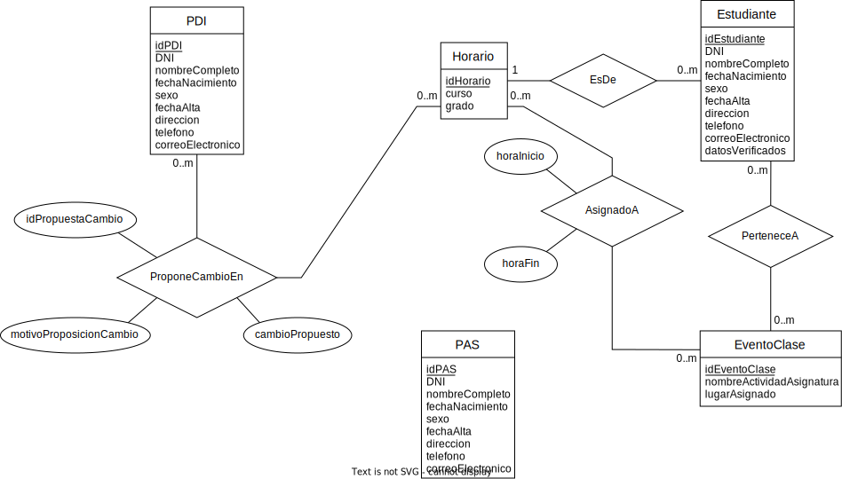
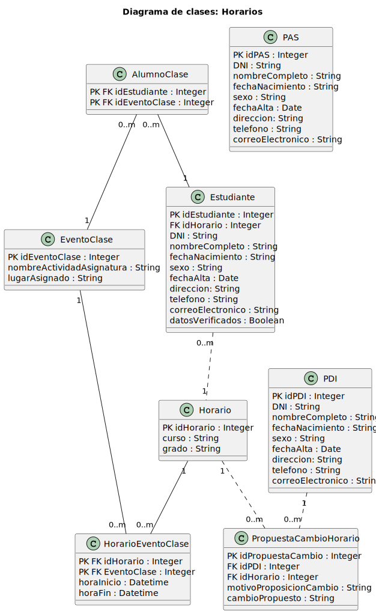

 

# Lab 1 - Definición de casos de uso y requisitos de información

 

## Supuesto 1: Horarios

En una universidad, el personal del PDI, el personal del PAS y los estudiantes pueden consultar horarios. Por su parte, el personal del PAS puede modificar horarios y dar de alta estudiantes. El personal de PDI puede proponer cambios en los horarios y dar de alta estudiantes. La funcionalidad de dar de alta estudiantes del PAS realiza una verificación de los datos del estudiante. Sin embargo, la funcionalidad de dar de alta estudiantes del PDI, además de verificar los datos también permite de forma excepcional realizar la búsqueda en las listas de clase de sus asignaturas.

 

### Modelo Entidad-Relación

 

 

### Diagrama de clases

 

	 

 

### Casos de uso

 

- ### UC-01 _Buscar en lista de clase_

 

<table align = "center">
<tr>
    <td><b>Identificador:</b> 
    UC-01</td>
</tr>
<tr>
    <td><b>Nombre:</b> 
    Buscar en lista de clase</td>
</tr>
<tr>
    <td><b>Autor:</b> 
    Daniel López García</td>
</tr>
<tr>
    <td><b>Fecha:</b> 
    01/10/2022</td>
</tr>
<tr>
    <td><b>Descripción:</b> 
    Posibilita la acción de buscar a un estudiante en las listas de clase de sus asignaturas como paso previo a su dada de alta en el sistema</td>
</tr>
<tr>
    <td><b>Actores:</b> 
    PDI</td>
</tr>
<tr>
    <td><b>Precondiciones:</b> 
    El personal del PDI debe estar autenticado en el sistema y debe encontrarse en la fase inicial del proceso de dada de alta a un estudiante en el mismo</td>
</tr>
<tr>
    <td><b>Flujo Normal:</b> 
    1.- El actor pulsa sobre el botón para buscar a un estudiante en las listas de clase de sus asignaturas 
    2.- El sistema muestra una nueva ventana la cual cuenta con dos cajas de texto para introducir el identificador del estudiante al cual se le quiere dar de alta y el identificador de una asignatura la cual va a ser cursada por el mismo 
    3.- El actor introduce el identificador del estudiante y el de la asignatura 
    4.- El sistema muestra los datos del estudiante además de un botón para cerrar la ventana de resultados de búsqueda 
    5.- El actor pulsa sobre el botón para concluir la operación de búsqueda</td>
</tr>
<tr>
    <td><b>Flujo Alternativo:</b> 
    4.A.- El sistema muestra un mensaje el cual notifica la no presencia del alumno cuyo identificador se corresponde al introducido en la caja de texto en la lista de clase de la asignatura en cuestión, junto con un botón para cerrar la ventana de resultados de búsqueda</td>
</tr>
<tr>
    <td><b>Poscondiciones:</b>  </td>
</tr>
<tr>
    <td><b>Referencias:</b> 
    UC-04, IR-01, IR-06</td>
</tr>
</table>

 

- ### UC-02 _Consultar horario_

 

<table align = "center">
<tr>
    <td><b>Identificador:</b> 
    UC-02</td>
</tr>
<tr>
    <td><b>Nombre:</b> 
    Consultar horario</td>
</tr>
<tr>
    <td><b>Autor:</b> 
    Daniel López García</td>
</tr>
<tr>
    <td><b>Fecha:</b> 
    01/10/2022</td>
</tr>
<tr>
    <td><b>Descripción:</b> 
    Plantea la posibilidad de consultar los horarios personalizados propios</td>
</tr>
<tr>
    <td><b>Actores:</b> 
    Estudiante / PAS / PDI</td>
</tr>
<tr>
    <td><b>Precondiciones:</b> 
    El usuario (estudiante / personal del PAS / personal del PDI) debe haber sido de alta y estar autenticado en el sistema</td>
</tr>
<tr>
    <td><b>Flujo Normal:</b> 
    1.- El actor pulsa sobre el botón para consultar sus horarios 
    2.- El sistema muestra una ventana donde se reflejan los horarios, además de un botón para cerrar la misma 
    3.- El actor pulsa sobre el botón para concluir la operación de consulta</td>
</tr>
<tr>
    <td><b>Flujo Alternativo:</b>  </td>
</tr>
<tr>
    <td><b>Poscondiciones:</b>  </td>
</tr>
<tr>
    <td><b>Referencias:</b> 
    IR-02, IR-04, IR-05, IR-06</td>
</tr>
</table>

 

- ### UC-03 _Dar de alta estudiante_

 

<table align = "center">
<tr>
    <td><b>Identificador:</b> 
    UC-03</td>
</tr>
<tr>
    <td><b>Nombre:</b> 
    Dar de alta estudiante</td>
</tr>
<tr>
    <td><b>Autor:</b> 
    Daniel López García</td>
</tr>
<tr>
    <td><b>Fecha:</b> 
    01/10/2022</td>
</tr>
<tr>
    <td><b>Descripción:</b> 
    Otorga el poder dar de alta a un estudiante en el sistema</td>
</tr>
<tr>
    <td><b>Actores:</b> 
    PAS</td>
</tr>
<tr>
    <td><b>Precondiciones:</b> 
    El personal del PAS debe estar autenticado en el sistema, así como no lo debe estar el nuevo estudiante</td>
</tr>
<tr>
    <td><b>Flujo Normal:</b> 
    1.- El actor pulsa sobre el botón para dar de alta a un nuevo estudiante 
    2.- El sistema muestra diversas cajas de texto para introducir los diferentes datos del estudiante al cual se le quiere dar de alta 
    3.- El actor introduce los datos del estudiante 
    4.- El sistema comprueba la validez de los datos [UC-07] y los almacena una vez determina que son correctos, mostrando un mensaje de confirmación del éxito de la operación junto con un botón para cerrar dicha notificación 
    5.- El actor pulsa sobre el botón para concluir la operación de dada de alta del estudiante</td>
</tr>
<tr>
    <td><b>Flujo Alternativo:</b> 
    4.A.- El sistema considera los datos introducidos como incorrectos, marcando con color rojo las cajas de texto donde se han producido errores de algún tipo para facilitar así su corrección</td>
</tr>
<tr>
    <td><b>Poscondiciones:</b> 
    El estudiante ha sido dado de alta en el sistema de tal manera que sus datos, los cuales han pasado por un proceso de verificación satisfactorio, han sido almacenados en el mismo</td>
</tr>
<tr>
    <td><b>Referencias:</b> 
    UC-04, UC-07, IR-02, IR-05, IR-06</td>
</tr>
</table>

 

- ### UC-04 _Dar de alta estudiante [vista PDI]_

 

<table align = "center">
<tr>
    <td><b>Identificador:</b> 
    UC-04</td>
</tr>
<tr>
    <td><b>Nombre:</b> 
    Dar de alta estudiante [vista PDI]</td>
</tr>
<tr>
    <td><b>Autor:</b> 
    Daniel López García</td>
</tr>
<tr>
    <td><b>Fecha:</b> 
    01/10/2022</td>
</tr>
<tr>
    <td><b>Descripción:</b> 
    Otorga el poder de dar de alta a un estudiante en el sistema</td>
</tr>
<tr>
    <td><b>Actores:</b> 
    PDI</td>
</tr>
<tr>
    <td><b>Precondiciones:</b> 
    El personal del PDI debe estar autenticado en el sistema, así como no lo debe estar el nuevo estudiante</td>
</tr>
<tr>
    <td><b>Flujo Normal:</b> 
    1.- El actor pulsa sobre el botón para dar de alta a un nuevo estudiante 
    2.- El sistema muestra diversas cajas de texto para introducir los diferentes datos del estudiante al cual se le quiere dar de alta junto con un botón cuya función es la de realizar una búsqueda del estudiante en las listas de clase de sus asignaturas 
    3.- El actor introduce los datos del estudiante 
    4.- El sistema comprueba la validez de los datos [UC-07] y los almacena una vez determina que son correctos, mostrando un mensaje de confirmación del éxito de la operación junto con un botón para cerrar dicha notificación 
    5.- El actor pulsa sobre el botón para concluir la operación de dada de alta del estudiante</td>
</tr>
<tr>
    <td><b>Flujo Alternativo:</b> 
    3.A.- El actor pulsa el botón encargado de la búsqueda del estudiante en las listas de clase de sus asignaturas e introduce el identificador de este y el de una asignatura en cuestión en una nueva ventana emergente la cual está compuesta por dos cajas de texto [UC-01]. Si el estudiante ya aparece como resultado de la búsqueda, se detiene el proceso de dada de alta en el sistema. En caso contrario, el sistema notifica lo sucedido y vuelve a mostrar la ventana compuesta por diferentes cajas de texto en las que poder introducir los datos para poder seguir así con el proceso inicial de dada de alta de un estudiante 
    4.A.- El sistema considera los datos introducidos como incorrectos, marcando con color rojo las cajas de texto donde se han producido errores de algún tipo para facilitar así su corrección</td>
</tr>
<tr>
    <td><b>Poscondiciones:</b> 
    El estudiante ha sido dado de alta en el sistema de tal manera que sus datos, los cuales han pasado por un proceso de verificación satisfactorio, han sido almacenados en el mismo</td>
</tr>
<tr>
    <td><b>Referencias:</b> 
    UC-01, UC-03, UC-07, IR-01, IR-02, IR-06 </td>
</tr>
</table>

 

- ### UC-05 _Modificar horario_

 

<table align = "center">
<tr>
    <td><b>Identificador:</b> 
    UC-05</td>
</tr>
<tr>
    <td><b>Nombre:</b> 
    Modificar horario</td>
</tr>
<tr>
    <td><b>Autor:</b> 
    Daniel López García</td>
</tr>
<tr>
    <td><b>Fecha:</b> 
    01/10/2022</td>
</tr>
<tr>
    <td><b>Descripción:</b> 
    Permite realizar modificaciones en los horarios por voluntad propia o atendiendo a peticiones</td>
</tr>
<tr>
    <td><b>Actores:</b> 
    PAS</td>
</tr>
<tr>
    <td><b>Precondiciones:</b> 
    El personal del PAS debe haber sido de alta y estar autenticado en el sistema. 
    También se plantea la necesidad de la existencia de una propuesta de cambio en los horarios en el caso de que la modificación responda a dicha petición</td>
</tr>
<tr>
    <td><b>Flujo Normal:</b> 
    1.- El actor pulsa sobre el botón para modificar los horarios 
    2.- El sistema muestra un calendario con los horarios actuales sobre los cuales se pueden realizar cambios 
    3.- El actor realiza los cambios que cree pertinentes 
    4.- El sistema, tras haber comprobado la validez de las modificaciones, muestra un nuevo botón cuya utilidad es la de confirmar los cambios establecidos 
    5.- El actor pulsa sobre el botón para concluir la operación de modificación de los horarios</td>
</tr>
<tr>
    <td><b>Flujo Alternativo:</b> 
    4.A.- El sistema, al comprobar la validez de las modificaciones, considera que hay uno o más errores, por lo que avisa al actor de ello para facilitarle así su corrección</td>
</tr>
<tr>
    <td><b>Poscondiciones:</b> 
    Los horarios, ya modificados, han sido guardados en el sistema</td>
</tr>
<tr>
    <td><b>Referencias:</b> 
    IR-04, IR-05</td>
</tr>
</table>

 

- ### UC-06 _Proponer cambio de horario_

 

<table align = "center">
<tr>
    <td><b>Identificador:</b> 
    UC-06</td>
</tr>
<tr>
    <td><b>Nombre:</b> 
    Proponer cambio de horario</td>
</tr>
<tr>
    <td><b>Autor:</b> 
    Daniel López García</td>
</tr>
<tr>
    <td><b>Fecha:</b> 
    01/10/2022</td>
</tr>
<tr>
    <td><b>Descripción:</b> 
    Ofrece el medio necesario para realizar la propuesta de efectuar un cambio en los horarios</td>
</tr>
<tr>
    <td><b>Actores:</b> 
    PDI</td>
</tr>
<tr>
    <td><b>Precondiciones:</b> 
    El personal del PDI debe haber sido dado de alta y estar autenticado en el sistema</td>
</tr>
<tr>
    <td><b>Flujo Normal:</b> 
    1.- El actor pulsa sobre el botón para proponer una modificación en los horarios 
    2.- El sistema muestra dos cajas de texto para introducir el motivo por el cual se desea realizar un cambio en los horarios y comentar en qué consiste dicha modificación 
    3.- El actor introduce una breve explicación del cambio solicitado, así como el motivo que da soporte al mismo a modo de argumento de su petición 
    4.- El sistema, tras haber comprobado la validez de las datos, muestra un nuevo botón cuya utilidad es la de confirmar el envío de la propuesta 
    5.- El actor pulsa sobre el botón para concluir la operación de solicitud de cambio en los horarios</td>
</tr>
<tr>
    <td><b>Flujo Alternativo:</b> 
    4.A.- El sistema comprueba la validez de los datos y determina que no son correctos, procediendo a avisar al actor de ello para facilitarle así su corrección</td>
</tr>
<tr>
    <td><b>Poscondiciones:</b> 
    La propuesta ha sido almacenada en el sistema</td>
</tr>
<tr>
    <td><b>Referencias:</b> 
    IR-06, IR-07</td>
</tr>
</table>

 

- ### UC-07 _Verificar datos_

 

<table align = "center">
<tr>
    <td><b>Identificador:</b> 
    UC-07</td>
</tr>
<tr>
    <td><b>Nombre:</b> 
    Verificar datos</td>
</tr>
<tr>
    <td><b>Autor:</b> 
    Daniel López García</td>
</tr>
<tr>
    <td><b>Fecha:</b> 
    01/10/2022</td>
</tr>
<tr>
    <td><b>Descripción:</b> 
    Dispone la posibilidad de confirmar la validez de los datos de un nuevo estudiante el cual está siendo dado de alta</td>
</tr>
<tr>
    <td><b>Actores:</b> 
    PAS / PDI</td>
</tr>
<tr>
    <td><b>Precondiciones:</b> 
    El personal del PAS / PDI debe estar autenticado en el sistema, así como el estudiante cuyos datos van a ser verificados debe estar siendo dado de alta en el sistema</td>
</tr>
<tr>
    <td><b>Flujo Normal:</b> 
    1.- El actor pulsa sobre el botón para verificar los datos 
    2.- El sistema muestra un mensaje de confirmación de la validez de los datos junto con un botón para el cierre de la ventana de dicho mensaje 
    3.- El actor pulsa sobre el botón para concluir la operación de verificación de datos</td>
</tr>
<tr>
    <td><b>Flujo Alternativo:</b> 
    2.A.- El sistema comprueba la validez de los datos y determina que al menos uno de ellos no es correcto, procediendo a notificar al actor de este hecho para facilitarle así su corrección</td>
</tr>
<tr>
    <td><b>Poscondiciones:</b> 
    En la base de datos del sistema se actualiza el controlador de la correcta verificación de los datos del estudiante</td>
</tr>
<tr>
    <td><b>Referencias:</b> 
    UC-03, UC-04, IR-02, IR-05, IR-06</td>
</tr>
</table>

 

### Requisitos de información

 

- ### IR-01 _AlumnoClase_

 

<table align = "center">
<tr>
    <td><b>IR-01:</b></td>
    <td>AlumnoClase</td>
</tr>
<tr>
    <td><b>Versión:</b></td>
    <td>1.0 (Octubre-2022)</td>
</tr>
<tr>
    <td><b>Autor:</b></td>
    <td>Daniel López García</td>
</tr>
<tr>
    <td><b>Fuentes:</b></td>
    <td>Entrevistas y reglamento</td>
</tr>
<tr>
    <td><b>Referencias:</b></td>
    <td>UC-01, UC-04, IR-02, IR-03</td>
</tr>
<tr>
    <td><b>Descripción:</b></td>
    <td>El sistema deberá almacenar la información correspondiente a los alumnos que hay en cada clase de la universidad. En concreto:</td>
</tr>
<tr>
    <td><b>Datos específicos:</b></td>
    <td>- Identificador de estudiante 
    - Identificador de evento / clase</td>
</tr>
<tr>
    <td><b>Importancia:</b></td>
    <td>Muy elevada</td>
</tr>
<tr>
    <td><b>Estado:</b></td>
    <td>Aceptado</td>
</tr>
<tr>
    <td><b>Comentarios:</b></td>
    <td></td>
</tr>
</table>

 

- ### IR-02 _Estudiante_

 

<table align = "center">
<tr>
    <td><b>IR-02:</b></td>
    <td>Estudiante</td>
</tr>
<tr>
    <td><b>Versión:</b></td>
    <td>1.0 (Octubre-2022)</td>
</tr>
<tr>
    <td><b>Autor:</b></td>
    <td>Daniel López García</td>
</tr>
<tr>
    <td><b>Fuentes:</b></td>
    <td>Entrevistas y reglamento</td>
</tr>
<tr>
    <td><b>Referencias:</b></td>
    <td>UC-02, UC-03, UC-04, UC-07, IR-01, IR-04</td>
</tr>
<tr>
    <td><b>Descripción:</b></td>
    <td>El sistema deberá almacenar la información correspondiente a los estudiantes de la universidad. En concreto:</td>
</tr>
<tr>
    <td><b>Datos específicos:</b></td>
    <td>- Identificador de estudiante 
    - Número del documento nacional de identidad 
    - Nombre y apellidos 
    - Fecha de nacimiento 
    - Sexo 
    - Fecha de alta como estudiante 
    - Dirección 
    - Teléfono 
    - Correo electrónico</td>
</tr>
<tr>
    <td><b>Importancia:</b></td>
    <td>Muy elevada</td>
</tr>
<tr>
    <td><b>Estado:</b></td>
    <td>Aceptado</td>
</tr>
<tr>
    <td><b>Comentarios:</b></td>
    <td></td>
</tr>
</table>

 

- ### IR-03 _EventoClase_

 

<table align = "center">
<tr>
    <td><b>IR-03:</b></td>
    <td>EventoClase</td>
</tr>
<tr>
    <td><b>Versión:</b></td>
    <td>1.0 (Octubre-2022)</td>
</tr>
<tr>
    <td><b>Autor:</b></td>
    <td>Daniel López García</td>
</tr>
<tr>
    <td><b>Fuentes:</b></td>
    <td>Entrevistas y reglamento</td>
</tr>
<tr>
    <td><b>Referencias:</b></td>
    <td>IR-01, IR-04</td>
</tr>
<tr>
    <td><b>Descripción:</b></td>
    <td>El sistema deberá almacenar la información correspondiente a los eventos y las clases organizados por la universidad. En concreto:</td>
</tr>
<tr>
    <td><b>Datos específicos:</b></td>
    <td>- Identificador de evento / clase 
    - Nombre de actividad / asignatura 
    - Nombre del lugar asignado</td>
</tr>
<tr>
    <td><b>Importancia:</b></td>
    <td>Muy elevada</td>
</tr>
<tr>
    <td><b>Estado:</b></td>
    <td>Aceptado</td>
</tr>
<tr>
    <td><b>Comentarios:</b></td>
    <td></td>
</tr>
</table>

 

- ### IR-04 _Horario_

 

<table align = "center">
<tr>
    <td><b>IR-04:</b></td>
    <td>Horario</td>
</tr>
<tr>
    <td><b>Versión:</b></td>
    <td>1.0 (Octubre-2022)</td>
</tr>
<tr>
    <td><b>Autor:</b></td>
    <td>Daniel López García</td>
</tr>
<tr>
    <td><b>Fuentes:</b></td>
    <td>Entrevistas y reglamento</td>
</tr>
<tr>
    <td><b>Referencias:</b></td>
    <td>UC-02, UC-05, IR-02, IR-03, IR-05, IR-06, IR-07</td>
</tr>
<tr>
    <td><b>Descripción:</b></td>
    <td>El sistema deberá almacenar la información correspondiente a los horarios de la universidad. En concreto:</td>
</tr>
<tr>
    <td><b>Datos específicos:</b></td>
    <td>- Identificador de horario 
    - Identificador de usuario (Estudiante / PAS / PDI) al que corresponde el horario 
    - Identificador de evento / clase 
    - Hora de inicio de evento / clase 
    - Hora de fin de evento / clase</td>
</tr>
<tr>
    <td><b>Importancia:</b></td>
    <td>Muy elevada</td>
</tr>
<tr>
    <td><b>Estado:</b></td>
    <td>Aceptado</td>
</tr>
<tr>
    <td><b>Comentarios:</b></td>
    <td></td>
</tr>
</table>

 

- ### IR-05 _PAS_

 

<table align = "center">
<tr>
    <td><b>IR-05:</b></td>
    <td>PAS</td>
</tr>
<tr>
    <td><b>Versión:</b></td>
    <td>1.0 (Octubre-2022)</td>
</tr>
<tr>
    <td><b>Autor:</b></td>
    <td>Daniel López García</td>
</tr>
<tr>
    <td><b>Fuentes:</b></td>
    <td>Entrevistas y reglamento</td>
</tr>
<tr>
    <td><b>Referencias:</b></td>
    <td>UC-02, UC-03, UC-05, UC-07, IR-04</td>
</tr>
<tr>
    <td><b>Descripción:</b></td>
    <td>El sistema deberá almacenar la información correspondiente al personal del PAS de la universidad. En concreto:</td>
</tr>
<tr>
    <td><b>Datos específicos:</b></td>
    <td>- Identificador de personal del PAS 
    - Número del documento nacional de identidad 
    - Nombre y apellidos 
    - Fecha de nacimiento 
    - Sexo 
    - Fecha de alta como personal del PAS 
    - Dirección 
    - Teléfono 
    - Correo electrónico</td>
</tr>
<tr>
    <td><b>Importancia:</b></td>
    <td>Muy elevada</td>
</tr>
<tr>
    <td><b>Estado:</b></td>
    <td>Aceptado</td>
</tr>
<tr>
    <td><b>Comentarios:</b></td>
    <td></td>
</tr>
</table>

 

- ### IR-06 _PDI_

 

<table align = "center">
<tr>
    <td><b>IR-06:</b></td>
    <td>PDI</td>
</tr>
<tr>
    <td><b>Versión:</b></td>
    <td>1.0 (Octubre-2022)</td>
</tr>
<tr>
    <td><b>Autor:</b></td>
    <td>Daniel López García</td>
</tr>
<tr>
    <td><b>Fuentes:</b></td>
    <td>Entrevistas y reglamento</td>
</tr>
<tr>
    <td><b>Referencias:</b></td>
    <td>UC-01, UC-02, UC-03, UC-04, UC-06, UC-07, IR-04, IR-07</td>
</tr>
<tr>
    <td><b>Descripción:</b></td>
    <td>El sistema deberá almacenar la información correspondiente al personal del PDI de la universidad. En concreto:</td>
</tr>
<tr>
    <td><b>Datos específicos:</b></td>
    <td>- Identificador de personal del PDI 
    - Número del documento nacional de identidad 
    - Nombre y apellidos 
    - Fecha de nacimiento 
    - Sexo 
    - Fecha de alta como personal del PDI 
    - Dirección 
    - Teléfono 
    - Correo electrónico</td>
</tr>
<tr>
    <td><b>Importancia:</b></td>
    <td>Muy elevada</td>
</tr>
<tr>
    <td><b>Estado:</b></td>
    <td>Aceptado</td>
</tr>
<tr>
    <td><b>Comentarios:</b></td>
    <td></td>
</tr>
</table>

 

- ### IR-07 _PropuestaCambioHorario_

 

<table align = "center">
<tr>
    <td><b>IR-07:</b></td>
    <td>PropuestaCambioHorario</td>
</tr>
<tr>
    <td><b>Versión:</b></td>
    <td>1.0 (Octubre-2022)</td>
</tr>
<tr>
    <td><b>Autor:</b></td>
    <td>Daniel López García</td>
</tr>
<tr>
    <td><b>Fuentes:</b></td>
    <td>Entrevistas y reglamento</td>
</tr>
<tr>
    <td><b>Referencias:</b></td>
    <td>UC-06, IR-04, IR-06</td>
</tr>
<tr>
    <td><b>Descripción:</b></td>
    <td>El sistema deberá almacenar la información correspondiente a las peticiones de cambio, llevadas a cabo por parte del personal del PDI, en los horarios de la universidad. En concreto:</td>
</tr>
<tr>
    <td><b>Datos específicos:</b></td>
    <td>- Identificador de propuesta de cambio en el horario 
    - Identificador de personal del PDI 
    - Identificador de horario 
    - Motivo de la proposición de cambio 
    - Cambio propuesto</td>
</tr>
<tr>
    <td><b>Importancia:</b></td>
    <td>Muy elevada</td>
</tr>
<tr>
    <td><b>Estado:</b></td>
    <td>Aceptado</td>
</tr>
<tr>
    <td><b>Comentarios:</b></td>
    <td></td>
</tr>
</table>

  

## Supuesto 2: Sistema de Compras

En un sistema de compra, existen cuatro tipos de usuarios: comprador, vendedor, proveedor y administrador. Los compradores pueden agregar productos, consultar precios, finalizar la compra y consultar ofertas. Agregar productos implica marcar esos productos como bloqueados. Los vendedores también pueden consultar ofertas y consultar precios. Los proveedores pueden consultar precios, avisar de nuevos productos y consultar ofertas. Avisar de nuevos productos, de forma excepcional, realiza la incorporación de una oferta. Los proveedores también tienen una funcionalidad para avisar del fin de una oferta. Cuando se avisa del fin de una oferta, se ejecuta la funcionalidad de eliminar la oferta. Ambas funcionalidades de avisar del proveedor tienen en común que se encarga de enviar una notificación. Los administradores pueden consultar precios, consultar ofertas y eliminar productos. La funcionalidad de consultar precios incluye una funcionalidad de buscar productos que es similar a la funcionalidad de consultar productos de los compradores. Sin embargo, la funcionalidad de consultar productos añade una funcionalidad para verificar la disponibilidad. Para realizar una venta, un comprador y un vendedor participan de forma conjunta. En dicha operación, se lleva a cabo el acuerdo de un precio; excepcionalmente, durante la realización de la venta, se consultará el histórico de ventas.

 

- ### UC-08 _Acordar precio_

 

<table align = "center">
<tr>
    <td><b>Identificador:</b> 
    UC-08</td>
</tr>
<tr>
    <td><b>Nombre:</b> 
    Acordar precio</td>
</tr>
<tr>
    <td><b>Autor:</b> 
    Miguel Ángel Moncada Álvarez</td>
</tr>
<tr>
    <td><b>Fecha:</b> 
    01/10/2022</td>
</tr>
<tr>
    <td><b>Descripción:</b> 
     Otorga la posibilidad de poder acordar un precio para así poder realizar la venta de un producto</td>
</tr>
<tr>
    <td><b>Actores:</b> 
     Comprador + Vendedor</td>
</tr>
<tr>
    <td><b>Precondiciones:</b> 
    Tanto el comprador como el vendedor deben estar autenticados en el sistema y ambos deben estar tomando parte en el proceso de realizar una venta</td>
</tr>
<tr>
    <td><b>Flujo Normal:</b> 
    1.- El comprador y el vendedor pulsan sobre el botón para acordar el precio de un producto 
    2.- El sistema muestra a ambos actores una nueva ventana emergente la cual contiene un chat común a comprador y vendedor junto con una caja de texto sobre la cual cualquiera de ellos puede escribir su próximo mensaje. Además de lo mencionado, también tienen lugar en dicha ventana dos botones más, uno para confirmar que se ha acordado un precio y otro para cancelar la operación 
    3.- Comprador y vendedor confirman que han llegado a un acuerdo clicando sobre el botón correspondiente</td>
</tr>
<tr>
    <td><b>Flujo Alternativo:</b> 
    3.A.- Comprador o vendedor pulsa sobre el botón cuya función es la de cancelar la acción de acordar un precio. A ambos se les notifica el no acuerdo de tal manera que deben clicar sobre un botón para cerrar dicho mensaje y volver así a la ventana desde la cual pulsaron en un inicio el botón para acordar el precio de un producto
    </td>
</tr>
<tr>
    <td><b>Poscondiciones:</b> 
    El precio acordado ha sido guardado en el sistema para que la compra pueda ser llevada a cabo</td>
</tr>
<tr>
    <td><b>Referencias:</b> 
    UC-24, IR-12, IR-18, IR-19</td>
</tr>
</table>

 

- ### UC-09 _Agregar producto_

 

<table align = "center">
<tr>
    <td><b>Identificador:</b> 
    UC-09</td>
</tr>
<tr>
    <td><b>Nombre:</b> 
    Agregar producto</td>
</tr>
<tr>
    <td><b>Autor:</b> 
    Miguel Ángel Moncada Álvarez</td>
</tr>
<tr>
    <td><b>Fecha:</b> 
    01/10/2022</td>
</tr>
<tr>
    <td><b>Descripción:</b> 
    Permite agregar un producto determinado al carrito de compra</td>
</tr>
<tr>
    <td><b>Actores:</b> 
    Comprador</td>
</tr>
<tr>
    <td><b>Precondiciones:</b> 
    El comprador debe haber sido dado de alta y estar autenticado en el sistema</td>
</tr>
<tr>
    <td><b>Flujo Normal:</b> 
    1.- El actor pulsa sobre el botón para agregar un producto 
    2.- El sistema valida la acción y procede a mostrar un mensaje el cual confirma la correcta agregación del producto en cuestión al carrito de compra junto con un botón sobre el que pulsar para cerrar dicho mensaje. Además, el producto se marca como bloqueado [UC-23] 
    3.- El  actor pulsa sobre el botón para concluir la operación de agregación del producto</td>
</tr>
<tr>
    <td><b>Flujo Alternativo:</b> 
    2.A.- El sistema, al tratar de validar la acción, detecta un error en el acto que se intenta llevar a cabo y lo notifica al actor, junto con un mensaje explicativo de la situación que acaba de acontecer. Además, se muestra un nuevo botón para el cierre de dicha notificación sobre el cual el actor debe pulsar para poder regresar así al estado inicial previo a esta situación</td>
</tr>
<tr>
    <td><b>Poscondiciones:</b> 
    El estado del carrito ha sido actualizado y guardado en el sistema, pues ahora se le ha sumado un nuevo producto, el cual además ha sido marcado como bloqueado</td>
</tr>
<tr>
    <td><b>Referencias:</b> 
    UC-23, IR-12, IR-16</td>
</tr>
</table>

 

- ### UC-10 _Avisar_

 

<table align = "center">
<tr>
    <td><b>Identificador:</b> 
    UC-10</td>
</tr>
<tr>
    <td><b>Nombre:</b> 
    Avisar</td>
</tr>
<tr>
    <td><b>Autor:</b> 
    Miguel Ángel Moncada Álvarez</td>
</tr>
<tr>
    <td><b>Fecha:</b> 
    01/10/2022</td>
</tr>
<tr>
    <td><b>Descripción:</b> 
    Ofrece el medio necesario para avisar a determinados usuarios</td>
</tr>
<tr>
    <td><b>Actores:</b> 
    Proveedor</td>
</tr>
<tr>
    <td><b>Precondiciones:</b> 
    El proveedor debe haber sido dado de alta y estar autenticado el sistema, así como debe haberse producido una determinada acción la cual será notificada</td>
</tr>
<tr>
    <td><b>Flujo Normal:</b> 
    1.- El proveedor pulsa sobre el botón para avisar de un suceso determinado 
    2.- El sistema muestra dos cajas de texto para introducir el motivo por el cual se desea avisar y el propio aviso en sí 
    3.- El actor introduce el texto exigido en cada una de las cajas de texto a rellenar 
    4.- El sistema, tras haber comprobado la validez de los datos introducidos, muestra un mensaje de confirmación del éxito de la operación junto con un botón para cerrar dicha notificación 
    5.- El actor pulsa sobre el botón para poner así fin a la operación de aviso. Desembocando esta acción en el envío de una notificación [UC-20] a ciertos usuarios del sistema</td>
</tr>
<tr>
    <td><b>Flujo Alternativo:</b> 
    4.A.- El sistema comprueba la validez de los datos introducidos y ha determinado que no cumple las condiciones exigidas, procediendo a avisar al actor de ello para facilitarle así su corrección
    </td>
</tr>
<tr>
    <td><b>Poscondiciones:</b> 
    El aviso ha quedado guardado en el sistema y ha sido correctamente notificado</td>
</tr>
<tr>
    <td><b>Referencias:</b> 
    UC-11, UC-12, UC-20, IR-09, IR-13, IR-17</td>
</tr>
</table>

 

- ### UC-11 _Avisar de nuevo producto_

 

<table align = "center">
<tr>
    <td><b>Identificador:</b> 
    UC-11</td>
</tr>
<tr>
    <td><b>Nombre:</b> 
    Avisar de nuevo producto</td>
</tr>
<tr>
    <td><b>Autor:</b> 
    Miguel Ángel Moncada Álvarez</td>
</tr>
<tr>
    <td><b>Fecha:</b> 
    01/10/2022</td>
</tr>
<tr>
    <td><b>Descripción:</b> 
    Ofrece el medio necesario para avisar a determinados usuarios de la llegada de un nuevo producto</td>
</tr>
<tr>
    <td><b>Actores:</b> 
    Proveedor</td>
</tr>
<tr>
    <td><b>Precondiciones:</b> 
    El proveedor debe haber sido dado de alta y estar autenticado el sistema, así como debe haberse producido la llegada de un nuevo producto, acción la cual será notificada</td>
</tr>
<tr>
    <td><b>Flujo Normal:</b> 
    1.- El proveedor pulsa sobre el botón para avisar de la llegada de un nuevo producto 
    2.- El sistema muestra dos cajas de texto para introducir el motivo por el cual se desea avisar y el propio aviso en sí. Además de lo mencionado, existe también un botón para la incorporación de una oferta sobre el producto en cuestión 
    3.- El actor introduce el texto exigido en cada una de las cajas de texto a rellenar 
    4.- El sistema, tras haber comprobado la validez de los datos introducidos, muestra un mensaje de confirmación del éxito de la operación junto con un botón para cerrar dicha notificación 
    5.- El actor pulsa sobre el botón para poner así fin a la operación de aviso. Desembocando esta acción en el envío de una notificación [UC-20] a ciertos usuarios del sistema</td>
</tr>
<tr>
    <td><b>Flujo Alternativo:</b> 
    3.A.- El actor pulsa el botón encargado de la incorporación de una oferta sobre el producto tratado e introduce el precio rebajado de este en una nueva ventana emergente la cual está compuesta por una única caja de texto [UC-22]. A continuación aparecerá un mensaje de confirmación de la operación que, al ser aceptado por el actor, provocará el establecimiento definitivo de la oferta y la vuelta al proceso inicial de aviso de la llegada de un nuevo producto 
    4.A.- El sistema comprueba la validez de los datos introducidos y ha determinado que no cumple las condiciones exigidas, procediendo a avisar al actor de ello para facilitarle así su corrección
    </td>
</tr>
<tr>
    <td><b>Poscondiciones:</b> 
    El aviso ha quedado guardado en el sistema, ha sido correctamente notificado y, en caso de haberse incorporado una oferta sobre el producto, la misma también ha sido almacenada</td>
</tr>
<tr>
    <td><b>Referencias:</b> 
    UC-10, UC-20, UC-22, IR-09, IR-13, IR-14, IR-17</td>
</tr>
</table>

 

- ### UC-12 _Avisar fin de oferta_

 

<table align = "center">
<tr>
    <td><b>Identificador:</b> 
    UC-12</td>
</tr>
<tr>
    <td><b>Nombre:</b> 
    Avisar fin de oferta</td>
</tr>
<tr>
    <td><b>Autor:</b> 
    Miguel Ángel Moncada Álvarez</td>
</tr>
<tr>
    <td><b>Fecha:</b> 
    01/10/2022</td>
</tr>
<tr>
    <td><b>Descripción:</b> 
    Ofrece el medio necesario para avisar a determinados usuarios del fin de una oferta</td>
</tr>
<tr>
    <td><b>Actores:</b> 
    Proveedor</td>
</tr>
<tr>
    <td><b>Precondiciones:</b> 
    El proveedor debe haber sido dado de alta y estar autenticado el sistema, así como debe haberse producido el fin de una oferta, acción la cual será notificada</td>
</tr>
<tr>
    <td><b>Flujo Normal:</b> 
    1.- El proveedor pulsa sobre el botón para avisar del fin de una oferta, acción que origina a su vez la eliminación de la oferta en cuestión [UC-18] 
    2.- El sistema muestra dos cajas de texto para introducir el motivo por el cual se desea avisar y el propio aviso en sí 
    3.- El actor introduce el texto exigido en cada una de las cajas de texto a rellenar 
    4.- El sistema, tras haber comprobado la validez de los datos introducidos, muestra un mensaje de confirmación del éxito de la operación junto con un botón para cerrar dicha notificación 
    5.- El actor pulsa sobre el botón para poner así fin a la operación de aviso. Desembocando esta acción en el envío de una notificación [UC-20] a ciertos usuarios del sistema</td>
</tr>
<tr>
    <td><b>Flujo Alternativo:</b> 
    4.A.- El sistema comprueba la validez de los datos introducidos y ha determinado que no cumple las condiciones exigidas, procediendo a avisar al actor de ello para facilitarle así su corrección
    </td>
</tr>
<tr>
    <td><b>Poscondiciones:</b> 
    El aviso ha quedado guardado en el sistema, ha sido correctamente notificado y la oferta ha sido eliminada del mismo</td>
</tr>
<tr>
    <td><b>Referencias:</b> 
    UC-10, UC-18, UC-20, IR-09, IR-13, IR-14, IR-17</td>
</tr>
</table>

 

- ### UC-13 _Buscar producto_

 

<table align = "center">
<tr>
    <td><b>Identificador:</b> 
    UC-13</td>
</tr>
<tr>
    <td><b>Nombre:</b> 
    Buscar producto</td>
</tr>
<tr>
    <td><b>Autor:</b> 
    Miguel Ángel Moncada Álvarez</td>
</tr>
<tr>
    <td><b>Fecha:</b> 
    01/10/2022</td>
</tr>
<tr>
    <td><b>Descripción:</b> 
    Dispone la posibilidad de buscar un producto entre los registrados en la base de datos del sistema</td>
</tr>
<tr>
    <td><b>Actores:</b> 
    Administrador / Comprador / Proveedor / Vendedor</td>
</tr>
<tr>
    <td><b>Precondiciones:</b> 
    El actor debe estar autenticado en el sistema y se debe encontrar realizando una consulta sobre el precio de un producto</td>
</tr>
<tr>
    <td><b>Flujo Normal:</b> 
    1.- El actor pulsa sobre el botón para buscar un producto en las base de datos del sistema 
    2.- El sistema muestra una nueva ventana la cual cuenta con una única caja de texto para introducir el identificador del producto buscado 
    3.- El actor introduce el identificador del producto 
    4.- El sistema muestra los datos del producto además de un botón para cerrar la ventana de resultados de búsqueda 
    5.- El actor pulsa sobre el botón para concluir la operación de búsqueda</td>
</tr>
<tr>
    <td><b>Flujo Alternativo:</b> 
    4.A.- El sistema muestra un mensaje el cual notifica la no presencia, en la base de datos, de algún producto cuyo identificador se corresponda con el introducido en la caja de texto. Además de un nuevo botón para el cierre de dicha notificación sobre el cual el actor debe pulsar para poder regresar así al estado inicial previo a esta situación</td>
</tr>
<tr>
    <td><b>Poscondiciones:</b> 
    La información del producto buscado ha sido mostrada en pantalla</td>
</tr>
<tr>
    <td><b>Referencias:</b> 
    UC-16, UC-17, IR-08, IR-12, IR-15, IR-17, IR-18</td>
</tr>
</table>

 

- ### UC-14 _Consultar histórico de precios_

 

<table align = "center">
<tr>
    <td><b>Identificador:</b> 
    UC-14</td>
</tr>
<tr>
    <td><b>Nombre:</b> 
    Consultar histórico de precios</td>
</tr>
<tr>
    <td><b>Autor:</b> 
    Miguel Ángel Moncada Álvarez</td>
</tr>
<tr>
    <td><b>Fecha:</b> 
    01/10/2022</td>
</tr>
<tr>
    <td><b>Descripción:</b> 
    Plantea la posibilidad de consultar el histórico de ventas de aquellos productos que están registrados en el sistema</td>
</tr>
<tr>
    <td><b>Actores:</b> 
    Comprador + Vendedor</td>
</tr>
<tr>
    <td><b>Precondiciones:</b> 
    Tanto el comprador como el vendedor deben estar autenticados en el sistema y ambos deben estar tomando parte en el proceso de realizar una venta</td>
</tr>
<tr>
    <td><b>Flujo Normal:</b> 
    1.- El comprador y el vendedor pulsan sobre el botón para consultar el histórico de ventas de un producto, con el propósito de que esta acción les ayude con el proceso de realizar una venta 
    2.- El sistema muestra una nueva ventana la cual cuenta con una única caja de texto para introducir el identificador del producto cuyo histórico se desea consultar 
    3.- El actor introduce el identificador del producto 
    4.- El sistema muestra el histórico de ventas del producto además de un botón para cerrar la ventana de resultados de búsqueda 
    5.- El actor pulsa sobre el botón para concluir la operación de búsqueda</td>
</tr>
<tr>
    <td><b>Flujo Alternativo:</b> 
    4.A.- El sistema muestra un mensaje el cual notifica la no presencia, en la base de datos, de algún producto cuyo identificador se corresponda con el introducido en la caja de texto. Además de un nuevo botón para el cierre de dicha notificación sobre el cual el actor debe pulsar para poder regresar así al estado inicial previo a esta situación</td>
</tr>
<tr>
    <td><b>Poscondiciones:</b> 
    El histórico de ventas del producto sobre el cual se desea realizar la operación de venta ha sido mostrado en pantalla</td>
</tr>
<tr>
    <td><b>Referencias:</b> 
    UC-24, IR-12, IR-18, IR-19</td>
</tr>
</table>

 

- ### UC-15 _Consultar oferta_

 

<table align = "center">
<tr>
    <td><b>Identificador:</b> 
    UC-15</td>
</tr>
<tr>
    <td><b>Nombre:</b> 
    Consultar oferta</td>
</tr>
<tr>
    <td><b>Autor:</b> 
    Miguel Ángel Moncada Álvarez</td>
</tr>
<tr>
    <td><b>Fecha:</b> 
    01/10/2022</td>
</tr>
<tr>
    <td><b>Descripción:</b> 
    Posibilita la acción de consultar la disponibilidad de una oferta para algún producto determinado</td>
</tr>
<tr>
    <td><b>Actores:</b> 
    Administrador / Comprador / Proveedor / Vendedor</td>
</tr>
<tr>
    <td><b>Precondiciones:</b> 
    El actor debe estar autenticado en el sistema</td>
</tr>
<tr>
    <td><b>Flujo Normal:</b> 
    1.- El actor pulsa sobre el botón para consultar la existencia de una oferta en un producto determinado 
    2.- El sistema muestra una nueva ventana la cual cuenta con una única caja de texto para introducir el identificador del producto en cuestión 
    3.- El actor introduce el identificador del producto 
    4.- El sistema muestra las ofertas disponibles junto con un botón para cerrar la ventana de resultados de la consulta 
    5.- El actor pulsa sobre el botón para concluir la operación de consulta</td>
</tr>
<tr>
    <td><b>Flujo Alternativo:</b> 
    4.A.- El sistema muestra un mensaje el cual notifica la no presencia, en la base de datos, de alguna oferta para el producto cuyo identificador se corresponde al introducido en la caja de texto. Además, hace aparición en esta ventana un botón para el cierre de la misma</td>
</tr>
<tr>
    <td><b>Poscondiciones:</b> 
    Las ofertas del producto buscado han sido mostradas en pantalla</td>
</tr>
<tr>
    <td><b>Referencias:</b> 
    IR-08, IR-12, IR-14, IR-17, IR-18</td>
</tr>
</table>

 

- ### UC-16 _Consultar precio_

 

<table align = "center">
<tr>
    <td><b>Identificador:</b> 
    UC-16</td>
</tr>
<tr>
    <td><b>Nombre:</b> 
    Consultar precio</td>
</tr>
<tr>
    <td><b>Autor:</b> 
    Miguel Ángel Moncada Álvarez</td>
</tr>
<tr>
    <td><b>Fecha:</b> 
    01/10/2022</td>
</tr>
<tr>
    <td><b>Descripción:</b> 
    Permite realizar la acción de consulta del precio de un determinado producto</td>
</tr>
<tr>
    <td><b>Actores:</b> 
    Administrador / Comprador / Proveedor / Vendedor</td>
</tr>
<tr>
    <td><b>Precondiciones:</b> 
    El actor ha de estar dado de alta y autenticado en el sistema</td>
</tr>
<tr>
    <td><b>Flujo Normal:</b> 
    1.- El actor pulsa sobre el botón para consultar el precio de un producto determinado 
    2.- El sistema muestra una nueva ventana la cual cuenta con una única caja de texto para introducir el identificador del producto en cuestión 
    3.- El actor introduce el identificador del producto, es decir, realiza una operación de búsqueda sobre el mismo [UC-13] 
    4.- El sistema muestra el precio junto con un botón para cerrar la ventana de resultados de la consulta 
    5.- El actor pulsa sobre el botón para concluir la operación de consulta</td>
</tr>
<tr>
    <td><b>Flujo Alternativo:</b> 
    4.A.- El sistema muestra un mensaje el cual notifica la no presencia, en la base de datos, de algún producto cuyo identificador se corresponda con el introducido en la caja de texto. Además, hace aparición en esta ventana un botón para el cierre de la misma</td>
</tr>
<tr>
    <td><b>Poscondiciones:</b> 
    Tanto el precio del producto como la información del mismo han sido mostrados en pantalla</td>
</tr>
<tr>
    <td><b>Referencias:</b> 
    UC-13, IR-08, IR-12, IR-15, IR-17, IR-18</td>
</tr>
</table>

 

- ### UC-17 _Consultar producto_

 

<table align = "center">
<tr>
    <td><b>Identificador:</b> 
    UC-17</td>
</tr>
<tr>
    <td><b>Nombre:</b> 
    Consultar producto</td>
</tr>
<tr>
    <td><b>Autor:</b> 
    Miguel Ángel Moncada Álvarez</td>
</tr>
<tr>
    <td><b>Fecha:</b> 
    01/10/2022</td>
</tr>
<tr>
    <td><b>Descripción:</b> 
    Plantea la posibilidad de consultar la información de un producto</td>
</tr>
<tr>
    <td><b>Actores:</b> 
    Comprador</td>
</tr>
<tr>
    <td><b>Precondiciones:</b> 
    El comprador ha de estar dado de alta y autenticado en el sistema</td>
</tr>
<tr>
    <td><b>Flujo Normal:</b> 
    1.- El actor pulsa sobre el botón para consultar un producto en la base de datos del sistema 
    2.- El sistema muestra una nueva ventana la cual cuenta con una única caja de texto para introducir el identificador del producto 
    3.- El actor introduce el identificador del producto 
    4.- El sistema verifica la disponibilidad del producto [UC-25] para luego, en caso de verificación exitosa, mostrar los datos del producto además de un botón para cerrar la ventana de resultados de búsqueda 
    5.- El actor pulsa sobre el botón para concluir la operación de búsqueda</td>
</tr>
<tr>
    <td><b>Flujo Alternativo:</b> 
    4.A.- El sistema determina la no disponibilidad del producto, por lo que procede a mostrar un mensaje el cual notifica este suceso. Además, hace aparición un nuevo botón para el cierre de dicha notificación sobre el cual el actor debe pulsar para poder regresar así al estado inicial previo a esta situación</td>
</tr>
<tr>
    <td><b>Poscondiciones:</b> 
    La información del producto sobre el cual se ha llevado a cabo la operación de consulta y cuya disponibilidad se ha verificado ha sido mostrada en pantalla</td>
</tr>
<tr>
    <td><b>Referencias:</b> 
    UC-13, UC-25, IR-12, IR-15</td>
</tr>
</table>

 

- ### UC-18 _Eliminar oferta_

 

<table align = "center">
<tr>
    <td><b>Identificador:</b> 
    UC-18</td>
</tr>
<tr>
    <td><b>Nombre:</b> 
    Eliminar oferta</td>
</tr>
<tr>
    <td><b>Autor:</b> 
    Miguel Ángel Moncada Álvarez</td>
</tr>
<tr>
    <td><b>Fecha:</b> 
    01/10/2022</td>
</tr>
<tr>
    <td><b>Descripción:</b> 
    Otorga el poder de eliminar una oferta determinada del sistema</td>
</tr>
<tr>
    <td><b>Actores:</b> 
    Proveedor</td>
</tr>
<tr>
    <td><b>Precondiciones:</b> 
    El proveedor debe estar autenticado en el sistema y este debe encontrarse avisando el fin de una oferta</td>
</tr>
<tr>
    <td><b>Flujo Normal:</b> 
    1.- El actor pulsa sobre el botón para eliminar la oferta cuyo fin está avisando 
    2.- El sistema muestra un un mensaje de confirmación del éxito de la operación junto con un botón para cerrar dicha notificación 
    3.- El actor pulsa sobre el botón para concluir la operación de eliminación de una oferta</td>
</tr>
<tr>
    <td><b>Flujo Alternativo:</b> 
    2.A.- El sistema muestra un mensaje el cual manifiesta la imposibilidad de eliminar la oferta en cuestión junto con un botón que deberá ser pulsado por el actor para el cierre de dicha notificación</td>
</tr>
<tr>
    <td><b>Poscondiciones:</b> 
    La oferta cuyo fin está siendo avisado ha sido eliminada del sistema</td>
</tr>
<tr>
    <td><b>Referencias:</b> 
    UC-12, IR-14, IR-17</td>
</tr>
</table>

 

- ### UC-19 _Eliminar producto_

 

<table align = "center">
<tr>
    <td><b>Identificador:</b> 
    UC-19</td>
</tr>
<tr>
    <td><b>Nombre:</b> 
    Eliminar producto</td>
</tr>
<tr>
    <td><b>Autor:</b> 
    Miguel Ángel Moncada Álvarez</td>
</tr>
<tr>
    <td><b>Fecha:</b> 
    01/10/2022</td>
</tr>
<tr>
    <td><b>Descripción:</b> 
    Dispone la posibilidad de eliminar un producto de la base de datos del sistema</td>
</tr>
<tr>
    <td><b>Actores:</b> 
    Administrador</td>
</tr>
<tr>
    <td><b>Precondiciones:</b> 
    El administrador debe haber sido dado de alta y estar autenticado en el sistema. Por otra parte, el producto a eliminar debe estar también registrado en el mismo</td>
</tr>
<tr>
    <td><b>Flujo Normal:</b> 
    1.- El actor pulsa sobre el botón para eliminar un producto en cuestión 
    2.- El sistema muestra una nueva ventana la cual cuenta con una única caja de texto para introducir el identificador del producto que se desea eliminar 
    3.- El actor introduce el identificador del producto 
    4.- El sistema muestra los datos del producto además de un botón para la confirmación de su eliminación 
    5.- El actor pulsa sobre el botón para la confirmación de la eliminación del producto 
    6.- El sistema muestra un un mensaje ratificando el éxito de la operación junto con un botón para cerrar dicha notificación 
    7.- El actor pulsa sobre el botón para concluir la operación de eliminación de un producto</td>
</tr>
<tr>
    <td><b>Flujo Alternativo:</b> 
    4.A.- El sistema muestra un mensaje el cual notifica la no presencia, en la base de datos, de algún producto cuyo identificador se corresponda con el introducido en la caja de texto. Además de un nuevo botón para el cierre de dicha notificación sobre el cual el actor debe pulsar para poder regresar así al estado inicial previo a esta situación</td>
</tr>
<tr>
    <td><b>Poscondiciones:</b> 
    Un determinado producto ha sido eliminado del sistema</td>
</tr>
    <td><b>Referencias:</b> 
    IR-08, IR-15</td>
</tr>
</table>

 

- ### UC-20 _Enviar notificación_

 

<table align = "center">
<tr>
    <td><b>Identificador:</b> 
    UC-20</td>
</tr>
<tr>
    <td><b>Nombre:</b> 
    Enviar notificación</td>
</tr>
<tr>
    <td><b>Autor:</b> 
    Miguel Ángel Moncada Álvarez</td>
</tr>
<tr>
    <td><b>Fecha:</b> 
    01/10/2022</td>
</tr>
<tr>
    <td><b>Descripción:</b> 
    Posibilita la acción de enviar una notificación</td>
</tr>
<tr>
    <td><b>Actores:</b> 
    Proveedor</td>
</tr>
<tr>
    <td><b>Precondiciones:</b> 
    El proveedor debe haber sido dado de alta y estar autenticado el sistema, así como este debe encontrarse realizando un aviso</td>
</tr>
<tr>
    <td><b>Flujo Normal:</b> 
    1.- Una vez el actor rellena y confirma un aviso, pulsa sobre el botón para enviar su correspondiente notificación 
    2.- El sistema muestra una nueva ventana en la que aparece cómo es la notificación enviada, la cual ha sido generada a partir del aviso del que se partía en un principio, junto con un mensaje de confirmación del éxito de la operación y un botón para cerrar dicha ventana 
    3.- El actor pulsa sobre el botón para poner así fin a la operación de envío de una notificación</td>
</tr>
<tr>
    <td><b>Flujo Alternativo:</b> 
    2.A.- El sistema muestra un mensaje el cual manifiesta la imposibilidad de enviar la notificación correspondiente junto con un botón que deberá ser pulsado por el actor para el cierre de dicha notificación</td>
</tr>
<tr>
    <td><b>Poscondiciones:</b> 
    El aviso ha sido correctamente notificado</td>
</tr>
<tr>
    <td><b>Referencias:</b> 
    UC-10, UC-11, UC-12, IR-13, IR-17</td>
</tr>
</table>

 

- ### UC-21 _Finalizar compra_

 

<table align = "center">
<tr>
    <td><b>Identificador:</b> 
    UC-21</td>
</tr>
<tr>
    <td><b>Nombre:</b> 
    Finalizar compra</td>
</tr>
<tr>
    <td><b>Autor:</b> 
    Miguel Ángel Moncada Álvarez</td>
</tr>
<tr>
    <td><b>Fecha:</b> 
    01/10/2022</td>
</tr>
<tr>
    <td><b>Descripción:</b> 
    Permite finalizar el proceso de compra</td>
</tr>
<tr>
    <td><b>Actores:</b> 
    Comprador</td>
</tr>
<tr>
    <td><b>Precondiciones:</b> 
    El comprador debe haber sido dado de alta y estar autenticado en el sistema</td>
</tr>
<tr>
    <td><b>Flujo Normal:</b> 
    1.- El actor pulsa sobre el botón para finalizar la compra 
    2.- El sistema valida la acción y procede a mostrar un mensaje el cual confirma la correcta finalización de la compra junto con un botón sobre el que pulsar para cerrar dicho mensaje 
    3.- El actor pulsa sobre el botón para concluir la operación de finalización de la compra</td>
</tr>
<tr>
    <td><b>Flujo Alternativo:</b> 
    2.A.- El sistema, al tratar de validar la acción, detecta un error en el acto que se intenta llevar a cabo y lo notifica al actor, junto con un mensaje explicativo de la situación que acaba de acontecer. Además, se muestra un nuevo botón para el cierre de dicha notificación sobre el cual el actor debe pulsar para poder regresar así al estado inicial previo a esta situación</td>
</tr>
<tr>
    <td><b>Poscondiciones:</b> 
    La información de la compra ha quedado almacenada en el sistema</td>
</tr>
<tr>
    <td><b>Referencias:</b> 
    IR-11, IR-12</td>
</tr>
</table>

 

- ### UC-22 _Incorporar oferta_

 

<table align = "center">
<tr>
    <td><b>Identificador:</b> 
    UC-22</td>
</tr>
<tr>
    <td><b>Nombre:</b> 
    Incorporar oferta</td>
</tr>
<tr>
    <td><b>Autor:</b> 
    Miguel Ángel Moncada Álvarez</td>
</tr>
<tr>
    <td><b>Fecha:</b> 
    01/10/2022</td>
</tr>
<tr>
    <td><b>Descripción:</b> 
    Plantea la posibilidad de incorporar una oferta a un producto nuevo de cuya llegada se está avisando</td>
</tr>
<tr>
    <td><b>Actores:</b> 
    Proveedor</td>
</tr>
<tr>
    <td><b>Precondiciones:</b> 
    El proveedor debe haber sido dado de alta y estar autenticado en el sistema. Además, este ha de encontrarse avisando la llegada de un nuevo producto</td>
</tr>
<tr>
    <td><b>Flujo Normal:</b> 
    1.- El actor pulsa el botón para la incorporación de una oferta sobre el producto cuya llegada está siendo avisada 
    2.- El sistema muestra una nueva ventana la cual cuenta con una única caja de texto en la que introducir el precio rebajado del producto en cuestión 
    3.- El sistema comprueba la validez de los datos y los almacena una vez determina que son correctos, mostrando un mensaje de confirmación del éxito de la operación junto con un botón para cerrar dicha notificación 
    4.- El actor pulsa sobre el botón para concluir la operación de incorporación de una oferta</td>
</tr>
<tr>
    <td><b>Flujo Alternativo:</b> 
    3.A.- El sistema comprueba la validez de los datos y determina que no son correctos, procediendo a avisar al actor de ello para facilitarle así su corrección</td>
</tr>
<tr>
    <td><b>Poscondiciones:</b> 
    La oferta ha sido almacenada en el sistema</td>
</tr>
<tr>
    <td><b>Referencias:</b> 
    UC-11, IR-14, IR-17</td>
</tr>
</table>

 

- ### UC-23 _Marcar producto como bloqueado_

 

<table align = "center">
<tr>
    <td><b>Identificador:</b> 
    UC-23</td>
</tr>
<tr>
    <td><b>Nombre:</b> 
    Marcar producto como bloqueado</td>
</tr>
<tr>
    <td><b>Autor:</b> 
    Miguel Ángel Moncada Álvarez</td>
</tr>
<tr>
    <td><b>Fecha:</b> 
    01/10/2022</td>
</tr>
<tr>
    <td><b>Descripción:</b> 
    Dispone la posibilidad de marcar como bloqueado un producto el cual está siendo agregado al carrito de compra</td>
</tr>
<tr>
    <td><b>Actores:</b> 
    Comprador</td>
</tr>
<tr>
    <td><b>Precondiciones:</b> 
    El comprador ha de estar autenticado en el sistema, así como debe encontrarse en pleno proceso de agregación de un producto a su carrito</td>
</tr>
<tr>
    <td><b>Flujo Normal:</b> 
    1.- Una vez el actor agrega un producto al carrito y confirma dicha operación de manera exitosa, pulsa sobre el botón para marcar dicho producto como bloqueado 
    2.- El sistema muestra una nueva ventana la cual cuenta con un mensaje de confirmación del éxito de la operación y un botón para cerrar dicha ventana 
    3.- El actor pulsa sobre el botón para poner así fin a la operación de marcado del bloqueo de un producto</td>
</tr>
<tr>
    <td><b>Flujo Alternativo:</b> 
    2.A.- El sistema muestra un mensaje el cual manifiesta la imposibilidad de marcar el producto en cuestión como bloqueado junto con un botón que deberá ser pulsado por el actor para el cierre de dicha notificación</td>
</tr>
<tr>
    <td><b>Poscondiciones:</b> 
    El producto agregado al carrito ha sido marcado como bloqueado en el sistema</td>
</tr>
<tr>
    <td><b>Referencias:</b> 
    UC-09, IR-12, IR-15</td>
</tr>
</table>

 

- ### UC-24 _Realizar venta_

 

<table align = "center">
<tr>
    <td><b>Identificador:</b> 
    UC-24</td>
</tr>
<tr>
    <td><b>Nombre:</b> 
    Realizar venta</td>
</tr>
<tr>
    <td><b>Autor:</b> 
    Miguel Ángel Moncada Álvarez</td>
</tr>
<tr>
    <td><b>Fecha:</b> 
    01/10/2022</td>
</tr>
<tr>
    <td><b>Descripción:</b> 
    Posibilita la acción de realizar la venta de un producto</td>
</tr>
<tr>
    <td><b>Actores:</b> 
    Comprador + Vendedor</td>
</tr>
<tr>
    <td><b>Precondiciones:</b> 
    Tanto el comprador como el vendedor deben haber sido dados de alta y estar autenticados en el sistema</td>
</tr>
<tr>
    <td><b>Flujo Normal:</b> 
    1.- El comprador y el vendedor pulsan sobre el botón para realizar la venta de un producto 
    2.- El sistema muestra un mensaje el cual confirma la posibilidad de realizar la venta junto con un botón que deberá ser pulsado por los actores para proseguir así en la acción mediante el acuerdo de un precio [UC-08]. Además de lo mencionado, existe también un botón para la consulta del histórico de ventas del producto 
    3.- Una vez acordado el precio, el sistema valida la acción y procede a mostrar un mensaje corroborador de la correcta realización de la venta del producto en cuestión junto con un botón sobre el que pulsar para cerrar dicho mensaje 
    4.- Los actores pulsan sobre el botón para concluir la operación de realización de la venta de un producto</td>
</tr>
<tr>
    <td><b>Flujo Alternativo:</b> 
    2.A.- El sistema, al tratar de validar la acción, detecta un error en el acto que se intenta llevar a cabo y lo notifica a los actores, junto con un mensaje explicativo de la situación que acaba de acontecer. Además, se muestra a ambos un nuevo botón para el cierre de dicha notificación sobre el cual deberán pulsar para poder regresar así al estado inicial previo a esta situación 
    3.A.- Algún actor (o ambos) pulsa el botón encargado de la consulta del histórico de ventas del producto en base al cual desean realizar la venta [UC-14]. Si dicho producto ha sido vendido anteriormente se mostrará en una nueva ventana el histórico de sus precios acordados en cada ocasión. En caso contrario, el sistema notifica lo sucedido. Sea cual sea el resultado de la búsqueda, además de este se mostrará un botón para su cierre con el objetivo de poder continuar así el proceso inicial de realización de una venta</td>
</tr>
<tr>
    <td><b>Poscondiciones:</b> 
    Los datos de la venta han sido almacenados en el sistema, incluyéndose en estos el precio final acordado entre comprador y vendedor, y, en caso de haber sido consultado el histórico de ventas del producto en cuestión, dicho histórico se ha mostrado en pantalla</td>
</tr>
<tr>
    <td><b>Referencias:</b> 
    UC-08, UC-14, IR-12, IR-18, IR-19</td>
</tr>
</table>

 

- ### UC-25 _Verificar disponibilidad de producto_

 

<table align = "center">
<tr>
    <td><b>Identificador:</b> 
    UC-25</td>
</tr>
<tr>
    <td><b>Nombre:</b> 
    Verificar disponibilidad de producto</td>
</tr>
<tr>
    <td><b>Autor:</b> 
    Miguel Ángel Moncada Álvarez</td>
</tr>
<tr>
    <td><b>Fecha:</b> 
    01/10/2022</td>
</tr>
<tr>
    <td><b>Descripción:</b> 
    Ofrece el medio necesario para verificar la disponibilidad de un producto el cual estamos consultando</td>
</tr>
<tr>
    <td><b>Actores:</b> 
   Comprador</td>
</tr>
<tr>
    <td><b>Precondiciones:</b> 
    El comprador ha de estar autenticado en el sistema y debe encontrarse realizando el proceso de consulta de un producto</td>
</tr>
<tr>
    <td><b>Flujo Normal:</b> 
    1.- El actor pulsa sobre el botón para verificar la disponibilidad del producto consultado 
    2.- El sistema muestra un mensaje de confirmación de la disponibilidad del producto en cuestión junto con un botón para el cierre de la ventana de dicho mensaje 
    3.- El actor pulsa sobre el botón para concluir la operación de verificación de la disponibilidad de un producto</td>
</tr>
<tr>
    <td><b>Flujo Alternativo:</b> 
    2.A.- El sistema muestra un mensaje el cual manifiesta la no disponibilidad del producto junto con un botón que deberá ser pulsado por el actor para el cierre de dicha notificación</td>
</tr>
<tr>
    <td><b>Poscondiciones:</b> 
    La disponibilidad del producto sobre el cual se está realizando una operación de consulta ha sido verificada de manera satisfactoria</td>
</tr>
<tr>
    <td><b>Referencias:</b> 
    UC-17, IR-12, IR-15</td>
</tr>
</table>

 

- ### IR-08 _Administrador_

 

<table align = "center">
<tr>
    <td><b>IR-08:</b></td>
    <td>Administrador</td>
</tr>
<tr>
    <td><b>Versión:</b></td>
    <td>1.0 (Octubre-2022)</td>
</tr>
<tr>
    <td><b>Autor:</b></td>
    <td>Miguel Ángel Moncada Álvarez</td>
</tr>
<tr>
    <td><b>Fuentes:</b></td>
    <td>Entrevistas y reglamento</td>
</tr>
<tr>
    <td><b>Referencias:</b></td>
    <td>UC-13, UC-15, UC-16, UC-19</td>
</tr>
<tr>
    <td><b>Descripción:</b></td>
    <td>"breve descripción del requisito de información"</td>
</tr>
<tr>
    <td><b>Datos específicos:</b></td>
    <td>- Dato 1 
    - Dato 2 
    - Dato 3 
    - Dato 4 
    - Dato 5</td>
</tr>
<tr>
    <td><b>Importancia:</b></td>
    <td>Muy elevada</td>
</tr>
<tr>
    <td><b>Estado:</b></td>
    <td>Aceptado</td>
</tr>
<tr>
    <td><b>Comentarios:</b></td>
    <td></td>
</tr>
</table>

 

- ### IR-09 _Aviso_

 

<table align = "center">
<tr>
    <td><b>IR-09:</b></td>
    <td>Aviso</td>
</tr>
<tr>
    <td><b>Versión:</b></td>
    <td>1.0 (Octubre-2022)</td>
</tr>
<tr>
    <td><b>Autor:</b></td>
    <td>Miguel Ángel Moncada Álvarez</td>
</tr>
<tr>
    <td><b>Fuentes:</b></td>
    <td>Entrevistas y reglamento</td>
</tr>
<tr>
    <td><b>Referencias:</b></td>
    <td>UC-10, UC-11, UC-12, IR-13, IR-14, IR-15, IR-17</td>
</tr>
<tr>
    <td><b>Descripción:</b></td>
    <td>"breve descripción del requisito de información"</td>
</tr>
<tr>
    <td><b>Datos específicos:</b></td>
    <td>- Dato 1 
    - Dato 2 
    - Dato 3 
    - Dato 4 
    - Dato 5</td>
</tr>
<tr>
    <td><b>Importancia:</b></td>
    <td>Muy elevada</td>
</tr>
<tr>
    <td><b>Estado:</b></td>
    <td>Aceptado</td>
</tr>
<tr>
    <td><b>Comentarios:</b></td>
    <td></td>
</tr>
</table>

 

- ### IR-10 _Carrito_

 

<table align = "center">
<tr>
    <td><b>IR-10:</b></td>
    <td>Carrito</td>
</tr>
<tr>
    <td><b>Versión:</b></td>
    <td>1.0 (Octubre-2022)</td>
</tr>
<tr>
    <td><b>Autor:</b></td>
    <td>Miguel Ángel Moncada Álvarez</td>
</tr>
<tr>
    <td><b>Fuentes:</b></td>
    <td>Entrevistas y reglamento</td>
</tr>
<tr>
    <td><b>Referencias:</b></td>
    <td>IR-11, IR-12, IR-16</td>
</tr>
<tr>
    <td><b>Descripción:</b></td>
    <td>"breve descripción del requisito de información"</td>
</tr>
<tr>
    <td><b>Datos específicos:</b></td>
    <td>- Dato 1 
    - Dato 2 
    - Dato 3 
    - Dato 4 
    - Dato 5</td>
</tr>
<tr>
    <td><b>Importancia:</b></td>
    <td>Muy elevada</td>
</tr>
<tr>
    <td><b>Estado:</b></td>
    <td>Aceptado</td>
</tr>
<tr>
    <td><b>Comentarios:</b></td>
    <td></td>
</tr>
</table>

 

- ### IR-11 _Compra_

 

<table align = "center">
<tr>
    <td><b>IR-11:</b></td>
    <td>Compra</td>
</tr>
<tr>
    <td><b>Versión:</b></td>
    <td>1.0 (Octubre-2022)</td>
</tr>
<tr>
    <td><b>Autor:</b></td>
    <td>Miguel Ángel Moncada Álvarez</td>
</tr>
<tr>
    <td><b>Fuentes:</b></td>
    <td>Entrevistas y reglamento</td>
</tr>
<tr>
    <td><b>Referencias:</b></td>
    <td>UC-21, IR-10, IR-12</td>
</tr>
<tr>
    <td><b>Descripción:</b></td>
    <td>"breve descripción del requisito de información"</td>
</tr>
<tr>
    <td><b>Datos específicos:</b></td>
    <td>- Dato 1 
    - Dato 2 
    - Dato 3 
    - Dato 4 
    - Dato 5</td>
</tr>
<tr>
    <td><b>Importancia:</b></td>
    <td>Muy elevada</td>
</tr>
<tr>
    <td><b>Estado:</b></td>
    <td>Aceptado</td>
</tr>
<tr>
    <td><b>Comentarios:</b></td>
    <td></td>
</tr>
</table>

 

- ### IR-12 _Comprador_

 

<table align = "center">
<tr>
    <td><b>IR-12:</b></td>
    <td>Comprador</td>
</tr>
<tr>
    <td><b>Versión:</b></td>
    <td>1.0 (Octubre-2022)</td>
</tr>
<tr>
    <td><b>Autor:</b></td>
    <td>Miguel Ángel Moncada Álvarez</td>
</tr>
<tr>
    <td><b>Fuentes:</b></td>
    <td>Entrevistas y reglamento</td>
</tr>
<tr>
    <td><b>Referencias:</b></td>
    <td>UC-08, UC-09, UC-13, UC-14, UC-15, UC-16, UC-17, UC-21, UC-23, UC-24, UC-25, IR-10, IR-11, IR-19</td>
</tr>
<tr>
    <td><b>Descripción:</b></td>
    <td>"breve descripción del requisito de información"</td>
</tr>
<tr>
    <td><b>Datos específicos:</b></td>
    <td>- Dato 1 
    - Dato 2 
    - Dato 3 
    - Dato 4 
    - Dato 5</td>
</tr>
<tr>
    <td><b>Importancia:</b></td>
    <td>Muy elevada</td>
</tr>
<tr>
    <td><b>Estado:</b></td>
    <td>Aceptado</td>
</tr>
<tr>
    <td><b>Comentarios:</b></td>
    <td></td>
</tr>
</table>

 

- ### IR-13 _Notificación_

 

<table align = "center">
<tr>
    <td><b>IR-13:</b></td>
    <td>Notificación</td>
</tr>
<tr>
    <td><b>Versión:</b></td>
    <td>1.0 (Octubre-2022)</td>
</tr>
<tr>
    <td><b>Autor:</b></td>
    <td>Miguel Ángel Moncada Álvarez</td>
</tr>
<tr>
    <td><b>Fuentes:</b></td>
    <td>Entrevistas y reglamento</td>
</tr>
<tr>
    <td><b>Referencias:</b></td>
    <td>UC-10, UC-11, UC-12, UC-20, IR-09</td>
</tr>
<tr>
    <td><b>Descripción:</b></td>
    <td>"breve descripción del requisito de información"</td>
</tr>
<tr>
    <td><b>Datos específicos:</b></td>
    <td>- Dato 1 
    - Dato 2 
    - Dato 3 
    - Dato 4 
    - Dato 5</td>
</tr>
<tr>
    <td><b>Importancia:</b></td>
    <td>Muy elevada</td>
</tr>
<tr>
    <td><b>Estado:</b></td>
    <td>Aceptado</td>
</tr>
<tr>
    <td><b>Comentarios:</b></td>
    <td></td>
</tr>
</table>

 

- ### IR-14 _Oferta_

 

<table align = "center">
<tr>
    <td><b>IR-14:</b></td>
    <td>Oferta</td>
</tr>
<tr>
    <td><b>Versión:</b></td>
    <td>1.0 (Octubre-2022)</td>
</tr>
<tr>
    <td><b>Autor:</b></td>
    <td>Miguel Ángel Moncada Álvarez</td>
</tr>
<tr>
    <td><b>Fuentes:</b></td>
    <td>Entrevistas y reglamento</td>
</tr>
<tr>
    <td><b>Referencias:</b></td>
    <td>UC-11, UC-12, UC-15, UC-18, UC-22, IR-09, IR-15</td>
</tr>
<tr>
    <td><b>Descripción:</b></td>
    <td>"breve descripción del requisito de información"</td>
</tr>
<tr>
    <td><b>Datos específicos:</b></td>
    <td>- Dato 1 
    - Dato 2 
    - Dato 3 
    - Dato 4 
    - Dato 5</td>
</tr>
<tr>
    <td><b>Importancia:</b></td>
    <td>Muy elevada</td>
</tr>
<tr>
    <td><b>Estado:</b></td>
    <td>Aceptado</td>
</tr>
<tr>
    <td><b>Comentarios:</b></td>
    <td></td>
</tr>
</table>

 

- ### IR-15 _Producto_

 

<table align = "center">
<tr>
    <td><b>IR-15:</b></td>
    <td>Producto</td>
</tr>
<tr>
    <td><b>Versión:</b></td>
    <td>1.0 (Octubre-2022)</td>
</tr>
<tr>
    <td><b>Autor:</b></td>
    <td>Miguel Ángel Moncada Álvarez</td>
</tr>
<tr>
    <td><b>Fuentes:</b></td>
    <td>Entrevistas y reglamento</td>
</tr>
<tr>
    <td><b>Referencias:</b></td>
    <td>UC-13, UC-16, UC-17, UC-19, UC-23, UC-25, IR-09, IR-14, IR-16 </td>
</tr>
<tr>
    <td><b>Descripción:</b></td>
    <td>"breve descripción del requisito de información"</td>
</tr>
<tr>
    <td><b>Datos específicos:</b></td>
    <td>- Dato 1 
    - Dato 2 
    - Dato 3 
    - Dato 4 
    - Dato 5</td>
</tr>
<tr>
    <td><b>Importancia:</b></td>
    <td>Muy elevada</td>
</tr>
<tr>
    <td><b>Estado:</b></td>
    <td>Aceptado</td>
</tr>
<tr>
    <td><b>Comentarios:</b></td>
    <td></td>
</tr>
</table>

 

- ### IR-16 _ProductoEnCarrito_

 

<table align = "center">
<tr>
    <td><b>IR-16:</b></td>
    <td>ProductoEnCarrito</td>
</tr>
<tr>
    <td><b>Versión:</b></td>
    <td>1.0 (Octubre-2022)</td>
</tr>
<tr>
    <td><b>Autor:</b></td>
    <td>Miguel Ángel Moncada Álvarez</td>
</tr>
<tr>
    <td><b>Fuentes:</b></td>
    <td>Entrevistas y reglamento</td>
</tr>
<tr>
    <td><b>Referencias:</b></td>
    <td>UC-09, IR-10, IR-15</td>
</tr>
<tr>
    <td><b>Descripción:</b></td>
    <td>"breve descripción del requisito de información"</td>
</tr>
<tr>
    <td><b>Datos específicos:</b></td>
    <td>- Dato 1 
    - Dato 2 
    - Dato 3 
    - Dato 4 
    - Dato 5</td>
</tr>
<tr>
    <td><b>Importancia:</b></td>
    <td>Muy elevada</td>
</tr>
<tr>
    <td><b>Estado:</b></td>
    <td>Aceptado</td>
</tr>
<tr>
    <td><b>Comentarios:</b></td>
    <td></td>
</tr>
</table>

 

- ### IR-17 _Proveedor_

 

<table align = "center">
<tr>
    <td><b>IR-17:</b></td>
    <td>Proveedor</td>
</tr>
<tr>
    <td><b>Versión:</b></td>
    <td>1.0 (Octubre-2022)</td>
</tr>
<tr>
    <td><b>Autor:</b></td>
    <td>Miguel Ángel Moncada Álvarez</td>
</tr>
<tr>
    <td><b>Fuentes:</b></td>
    <td>Entrevistas y reglamento</td>
</tr>
<tr>
    <td><b>Referencias:</b></td>
    <td>UC-10, UC-11, UC-12, UC-13, UC-15, UC-16, UC-18, UC-20, UC-22, IR-09</td>
</tr>
<tr>
    <td><b>Descripción:</b></td>
    <td>"breve descripción del requisito de información"</td>
</tr>
<tr>
    <td><b>Datos específicos:</b></td>
    <td>- Dato 1 
    - Dato 2 
    - Dato 3 
    - Dato 4 
    - Dato 5</td>
</tr>
<tr>
    <td><b>Importancia:</b></td>
    <td>Muy elevada</td>
</tr>
<tr>
    <td><b>Estado:</b></td>
    <td>Aceptado</td>
</tr>
<tr>
    <td><b>Comentarios:</b></td>
    <td></td>
</tr>
</table>

 

- ### IR-18 _Vendedor_

 

<table align = "center">
<tr>
    <td><b>IR-18:</b></td>
    <td>Vendedor</td>
</tr>
<tr>
    <td><b>Versión:</b></td>
    <td>1.0 (Octubre-2022)</td>
</tr>
<tr>
    <td><b>Autor:</b></td>
    <td>Miguel Ángel Moncada Álvarez</td>
</tr>
<tr>
    <td><b>Fuentes:</b></td>
    <td>Entrevistas y reglamento</td>
</tr>
<tr>
    <td><b>Referencias:</b></td>
    <td>UC-08, UC-13, UC-14, UC-15, UC-16, UC-24, IR-19</td>
</tr>
<tr>
    <td><b>Descripción:</b></td>
    <td>"breve descripción del requisito de información"</td>
</tr>
<tr>
    <td><b>Datos específicos:</b></td>
    <td>- Dato 1 
    - Dato 2 
    - Dato 3 
    - Dato 4 
    - Dato 5</td>
</tr>
<tr>
    <td><b>Importancia:</b></td>
    <td>Muy elevada</td>
</tr>
<tr>
    <td><b>Estado:</b></td>
    <td>Aceptado</td>
</tr>
<tr>
    <td><b>Comentarios:</b></td>
    <td></td>
</tr>
</table>

 

- ### IR-19 _Venta_

 

<table align = "center">
<tr>
    <td><b>IR-19:</b></td>
    <td>Venta</td>
</tr>
<tr>
    <td><b>Versión:</b></td>
    <td>1.0 (Octubre-2022)</td>
</tr>
<tr>
    <td><b>Autor:</b></td>
    <td>Miguel Ángel Moncada Álvarez</td>
</tr>
<tr>
    <td><b>Fuentes:</b></td>
    <td>Entrevistas y reglamento</td>
</tr>
<tr>
    <td><b>Referencias:</b></td>
    <td>UC-08, UC-14, UC-24, IR-12, IR-18</td>
</tr>
<tr>
    <td><b>Descripción:</b></td>
    <td>"breve descripción del requisito de información"</td>
</tr>
<tr>
    <td><b>Datos específicos:</b></td>
    <td>- Dato 1 
    - Dato 2 
    - Dato 3 
    - Dato 4 
    - Dato 5</td>
</tr>
<tr>
    <td><b>Importancia:</b></td>
    <td>Muy elevada</td>
</tr>
<tr>
    <td><b>Estado:</b></td>
    <td>Aceptado</td>
</tr>
<tr>
    <td><b>Comentarios:</b></td>
    <td></td>
</tr>
</table>

 