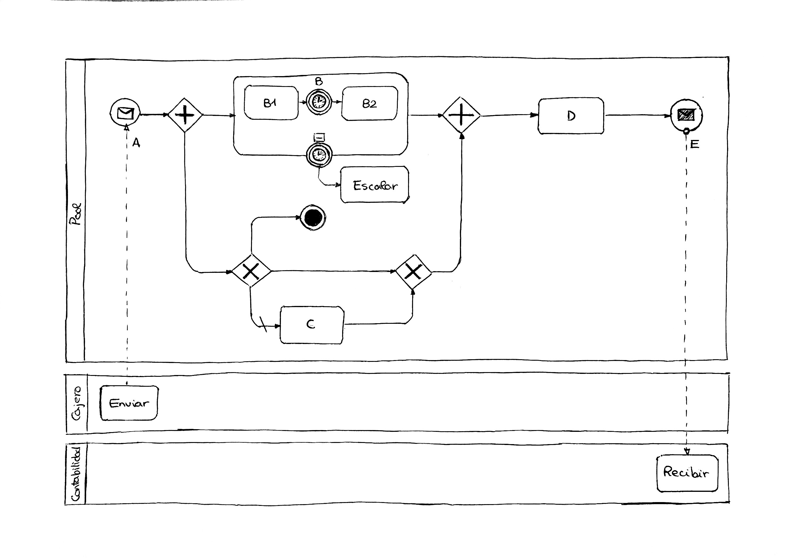
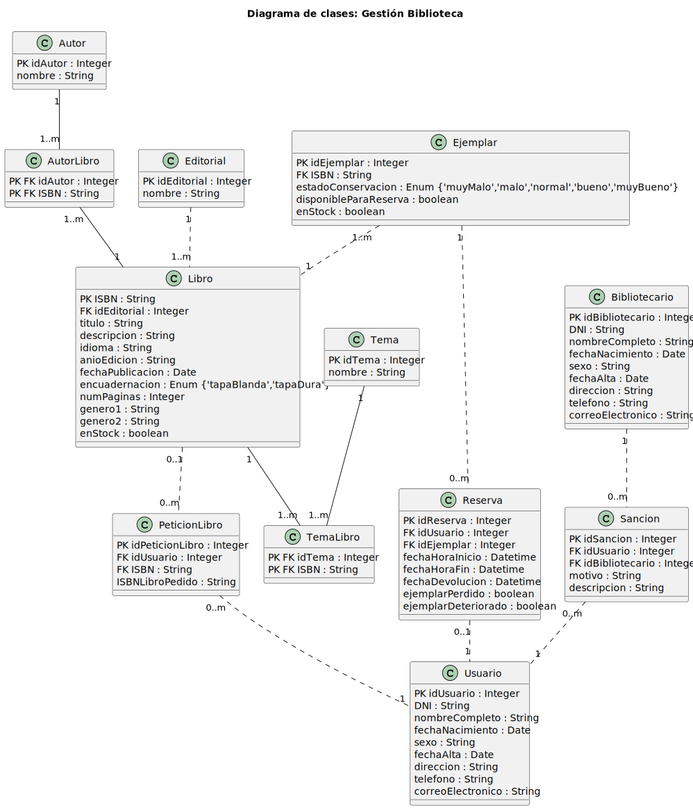

 

[Volver a la página anterior](https://github.com/emg842/INRE-UAL-ROJO-2022)

 

# Actividades extras

 

## Individuales

 

### Actividad 1. Diccionario de datos - Contrato

 

### Solución Daniel López García

 

<table align = "center">
    <tr>
        <td>
            Contrato: No Contrato + DatosCli + CaracInm + CaractCont + (Observaciones) + DatosSuc 
            DatoSuc: Codigo + Situacion + DatosEmp 
            DatosEmp: Nombre + Apellidos 
            Situacion: Calle + Ciudad + CP + TLF + FAX + Otros 
            DatosCli: Nombre + Apellidos + Direccion + (TLF) 
            CaractCont: [Compra|Venta] + Comision + PagaComision
        </td>
    </tr>
</table>

 

### Solución Eduardo Martín Gómez

 

<table align = "center">
    <tr>
        <td>
            Contrato: No Contrato + DatosCli + CaracInm + CaractCont + (Observaciones) + DatosSuc 
            DatoSuc: Codigo + Situacion + DatosEmp 
            DatosEmp: Nombre + Apellidos 
            Situacion: Calle + Ciudad + CP + TLF + FAX + Otros 
            DatosCli: Nombre + Apellidos + Direccion + (TLF) 
            CaractCont: [Compra|Venta] + Comision + PagaComision
        </td>
    </tr>
</table>

 

### Solución Miguel Ángel Moncada Álvarez

 

<table align = "center">
    <tr>
        <td>
            Contrato: No Contrato + DatosCli + CaracInm + CaractCont + (Observaciones) + DatosSuc 
            DatoSuc: Codigo + Situacion + DatosEmp 
            DatosEmp: Nombre + Apellidos 
            Situacion: Calle + Ciudad + CP + TLF + FAX + Otros 
            DatosCli: Nombre + Apellidos + Direccion + (TLF) 
            CaractCont: [Compra|Venta] + Comision + PagaComision 
        </td>
    </tr>
</table>

 

### Solución Joaquín Murcia Escánez

 

<table align = "center">
    <tr>
        <td>
            Contrato = NumContrato + DatosSuc + DatosCli + {CaracInm} + CaracCon + (Observaciones) 
                &nbsp;&nbsp;&nbsp;&nbsp;&nbsp;&nbsp;&nbsp;&nbsp;
                NumContrato = {Digito} 
                &nbsp;&nbsp;&nbsp;&nbsp;&nbsp;&nbsp;&nbsp;&nbsp;
                DatosSuc = CodigoSuc + Situacion + DatosEmp 
                    &nbsp;&nbsp;&nbsp;&nbsp;&nbsp;&nbsp;&nbsp;&nbsp;&nbsp;&nbsp;&nbsp;&nbsp;&nbsp;&nbsp;&nbsp;&nbsp;
                    CodigoSuc = {Digito} 
                    &nbsp;&nbsp;&nbsp;&nbsp;&nbsp;&nbsp;&nbsp;&nbsp;&nbsp;&nbsp;&nbsp;&nbsp;&nbsp;&nbsp;&nbsp;&nbsp;
                    Situacion = Calle + Ciudad + CP + {Telefono} + Fax 
                        &nbsp;&nbsp;&nbsp;&nbsp;&nbsp;&nbsp;&nbsp;&nbsp;&nbsp;&nbsp;&nbsp;&nbsp;&nbsp;&nbsp;&nbsp;&nbsp;&nbsp;&nbsp;&nbsp;&nbsp;&nbsp;&nbsp;&nbsp;&nbsp;
                        Calle = Ciudad = {Caracter} 
                        &nbsp;&nbsp;&nbsp;&nbsp;&nbsp;&nbsp;&nbsp;&nbsp;&nbsp;&nbsp;&nbsp;&nbsp;&nbsp;&nbsp;&nbsp;&nbsp;&nbsp;&nbsp;&nbsp;&nbsp;&nbsp;&nbsp;&nbsp;&nbsp;
                        CP = Telefono = Fax = {Digito} 
                    &nbsp;&nbsp;&nbsp;&nbsp;&nbsp;&nbsp;&nbsp;&nbsp;&nbsp;&nbsp;&nbsp;&nbsp;&nbsp;&nbsp;&nbsp;&nbsp;
                    DatosEmp = Nombre + {Apellido} 
                        &nbsp;&nbsp;&nbsp;&nbsp;&nbsp;&nbsp;&nbsp;&nbsp;&nbsp;&nbsp;&nbsp;&nbsp;&nbsp;&nbsp;&nbsp;&nbsp;&nbsp;&nbsp;&nbsp;&nbsp;&nbsp;&nbsp;&nbsp;&nbsp;
                        Nombre = Apellido = {Caracter} 
                &nbsp;&nbsp;&nbsp;&nbsp;&nbsp;&nbsp;&nbsp;&nbsp;
                DatosCli = Nombre + {Apellido} + Direccion + (Telefono) 
                    &nbsp;&nbsp;&nbsp;&nbsp;&nbsp;&nbsp;&nbsp;&nbsp;&nbsp;&nbsp;&nbsp;&nbsp;&nbsp;&nbsp;&nbsp;&nbsp;
                    Direccion = Calle + Ciudad + CP 
                &nbsp;&nbsp;&nbsp;&nbsp;&nbsp;&nbsp;&nbsp;&nbsp;
                CaracInm = TipoInm + NumHabitaciones + DotacionesDep + M2 + Precio 
                    &nbsp;&nbsp;&nbsp;&nbsp;&nbsp;&nbsp;&nbsp;&nbsp;&nbsp;&nbsp;&nbsp;&nbsp;&nbsp;&nbsp;&nbsp;&nbsp;
                    TipoInm = ["Piso" | "Bungalow" | "Chalet" | "Parcela" | "TerrenoRustico"] 
                    &nbsp;&nbsp;&nbsp;&nbsp;&nbsp;&nbsp;&nbsp;&nbsp;&nbsp;&nbsp;&nbsp;&nbsp;&nbsp;&nbsp;&nbsp;&nbsp;
                    NumHabitaciones = {Digito} 
                    &nbsp;&nbsp;&nbsp;&nbsp;&nbsp;&nbsp;&nbsp;&nbsp;&nbsp;&nbsp;&nbsp;&nbsp;&nbsp;&nbsp;&nbsp;&nbsp;
                    DotacionesDep = {["PistaTenis" | "Squash" | "Polideportiva" | "Paddle" | "Piscina"]} 
                    &nbsp;&nbsp;&nbsp;&nbsp;&nbsp;&nbsp;&nbsp;&nbsp;&nbsp;&nbsp;&nbsp;&nbsp;&nbsp;&nbsp;&nbsp;&nbsp;
                    M2 = Precio = {Digito} 
                &nbsp;&nbsp;&nbsp;&nbsp;&nbsp;&nbsp;&nbsp;&nbsp;
                CaracCon = TipoCon + ComisionSuc + PagadorComision + FormaPago 
                    &nbsp;&nbsp;&nbsp;&nbsp;&nbsp;&nbsp;&nbsp;&nbsp;&nbsp;&nbsp;&nbsp;&nbsp;&nbsp;&nbsp;&nbsp;&nbsp;
                    TipoCon = ["Compra" | "Venta"] 
                    &nbsp;&nbsp;&nbsp;&nbsp;&nbsp;&nbsp;&nbsp;&nbsp;&nbsp;&nbsp;&nbsp;&nbsp;&nbsp;&nbsp;&nbsp;&nbsp;
                    ComisionSuc = {Digito} + "%" 
                    &nbsp;&nbsp;&nbsp;&nbsp;&nbsp;&nbsp;&nbsp;&nbsp;&nbsp;&nbsp;&nbsp;&nbsp;&nbsp;&nbsp;&nbsp;&nbsp;
                    PagadorComision = ["Comprador" | "Vendedor"] 
                    &nbsp;&nbsp;&nbsp;&nbsp;&nbsp;&nbsp;&nbsp;&nbsp;&nbsp;&nbsp;&nbsp;&nbsp;&nbsp;&nbsp;&nbsp;&nbsp;
                    FormaPago = ["Contado" | "Tarjeta" | "Talon"] 
                &nbsp;&nbsp;&nbsp;&nbsp;&nbsp;&nbsp;&nbsp;&nbsp;
                Observaciones = {[Caracter | Digito]} 
                &nbsp;&nbsp;&nbsp;&nbsp;&nbsp;&nbsp;&nbsp;&nbsp;
                Caracter = ["A" - "Z" | "a" - "z"] 
                &nbsp;&nbsp;&nbsp;&nbsp;&nbsp;&nbsp;&nbsp;&nbsp;
                Digito = "0" - "9" 
        </td>
    </tr>
</table>

 

### Solución Manuel Vallecillos Escobosa

 

<table align = "center">
    <tr>
        <td>
            Contrato = NumContrato + DatosSuc + DatosCli + {CaracInm} + CaracCon + (Observaciones) 
            NumContrato = {Digito} 
            DatosSuc = CodigoSuc + Situacion + DatosEmp 
            CodigoSuc = {Digito} 
            Situacion = Calle + Ciudad + CP + {Telefono} + Fax 
            Calle = Ciudad = {Caracter} 
            CP = Telefono = Fax = {Digito} 
            DatosEmp = Nombre + {Apellido} 
            Nombre = Apellido = {Caracter} 
            DatosCli = Nombre + {Apellido} + Direccion + (Telefono) 
            Direccion = Calle + Ciudad + CP 
            CaracInm = TipoInm + NumHabitaciones + DotacionesDep + M2 + Precio 
            TipoInm = ["Piso" | "Bungalow" | "Chalet" | "Parcela" | "TerrenoRustico"] 
            NumHabitaciones = {Digito} 
            DotacionesDep = {["PistaTenis" | "Squash" | "Polideportiva" | "Paddle" | "Piscina"]} 
            M2 = Precio = {Digito} 
            CaracCon = TipoCon + ComisionSuc + PagadorComision + FormaPago 
            TipoCon = ["Compra" | "Venta"] 
            ComisionSuc = {Digito} + "%" 
            PagadorComision = ["Comprador" | "Vendedor"] 
            FormaPago = ["Contado" | "Tarjeta" | "Talon"] 
            Observaciones = {[Caracter | Digito]} 
            Caracter = ["A" - "Z" | "a" - "z"] 
            Digito = "0" - "9" 
        </td>
    </tr>
</table>

 

### Actividad 2. Diccionario de datos - Fecha

 

### Solución Daniel López García

 

<table align = "center">
    <tr>
        <td>
            Fecha = Dia + Mes + Año 
            Dia = Num 
            Num = "1" - "31" 
            Mes = {Caracter} 
            Caracter = ["A"-"Z"|"a"-"z"] 
            Año = [-|+] + {ConNum} 
            ConNum = {CaracterNum} 
            CaracterNum = "0"-"9"
        </td>
    </tr>
</table>

 

### Solución Eduardo Martín Gómez

 

<table align = "center">
    <tr>
        <td>
            FECHA = DIA + MES + AÑO 
            DIA = { NUM } 
            NUM = "1" - "31" 
            MES = {CARACTER} 
            CARACTER = ["A"-"Z" | "a"-"z"] 
            AÑO = [- | +] + {ConNum} 
            ConNum = {CARACTnum} 
            CARACTnum = "0" - "9"
        </td>
    </tr>
</table>

 

### Solución Miguel Ángel Moncada Álvarez

 

<table align = "center">
    <tr>
        <td>
            FECHA = DIA + MES + AÑO 
            DIA = { NUM } 
            NUM = "1" - "31" 
            MES = {CARACTER} 
            CARACTER = ["A"-"Z" | "a"-"z"] 
            AÑO = [- | +] + {ConNum} 
            ConNum = {CARACTnum} 
            CARACTnum = "0" - "9"
        </td>
    </tr>
</table>

 

### Solución Joaquín Murcia Escánez

 

<table align = "center">
    <tr>
        <td>
            Fecha = Dia + Mes + Anio 
                &nbsp;&nbsp;&nbsp;&nbsp;&nbsp;&nbsp;&nbsp;&nbsp;
                Dia = "1" - "31" 
                &nbsp;&nbsp;&nbsp;&nbsp;&nbsp;&nbsp;&nbsp;&nbsp;
                Mes = {Caracter} 
                &nbsp;&nbsp;&nbsp;&nbsp;&nbsp;&nbsp;&nbsp;&nbsp;&nbsp;&nbsp;&nbsp;&nbsp;&nbsp;&nbsp;&nbsp;&nbsp;
                    Caracter = ["A" - "Z" | "a" - "z"] 
                &nbsp;&nbsp;&nbsp;&nbsp;&nbsp;&nbsp;&nbsp;&nbsp;
                Anio = {Digito} + ["a.C." | "d.C."] 
                &nbsp;&nbsp;&nbsp;&nbsp;&nbsp;&nbsp;&nbsp;&nbsp;&nbsp;&nbsp;&nbsp;&nbsp;&nbsp;&nbsp;&nbsp;&nbsp;
                    Digito = "0" - "9"
        </td>
    </tr>
</table>

 

### Solución Manuel Vallecillos Escobosa

 

<table align = "center">
    <tr>
        <td>
            Fecha = Dia + Mes + Anio 
            Dia = "1" - "31" 
            Mes = {Caracter} 
            Caracter = ["A" - "Z" | "a" - "z"] 
            Anio = {Digito} + ["a.C." | "d.C."] 
            Digito = "0" - "9"
        </td>
    </tr>
</table>

  

## Grupales

 

### Actividad 3. Diagrama BPMN

 

  

### Actividad 4. Diagrama E/R y de clases - Gestión Biblioteca

 

 

 