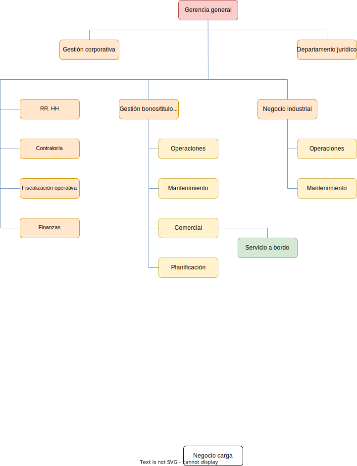
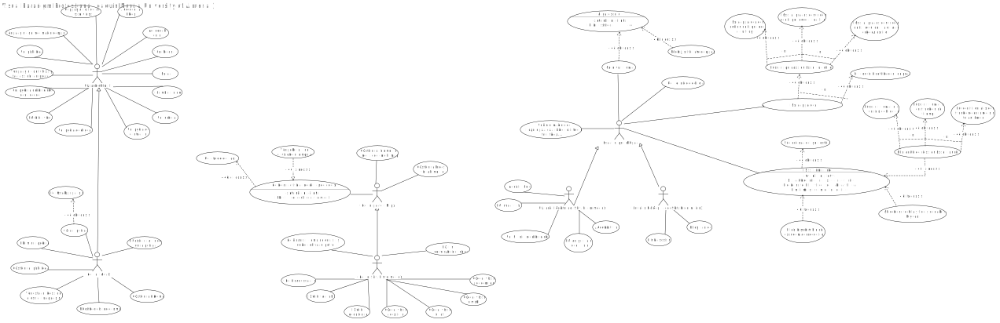
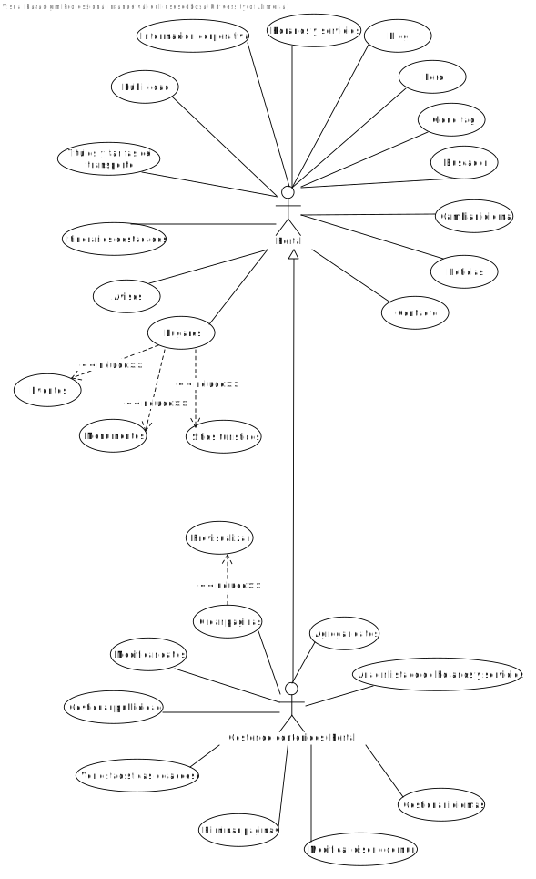
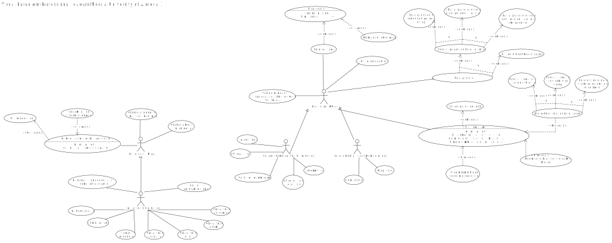
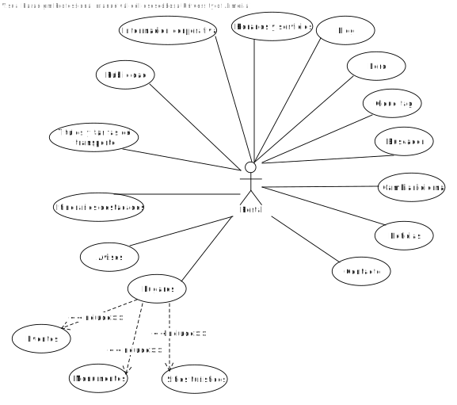
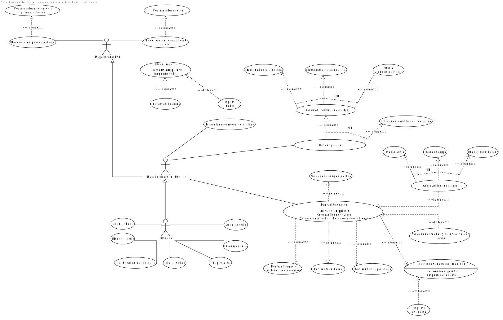
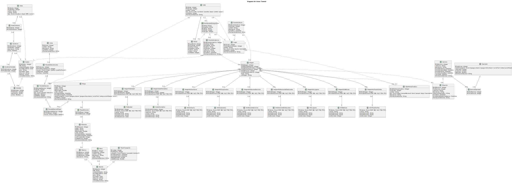
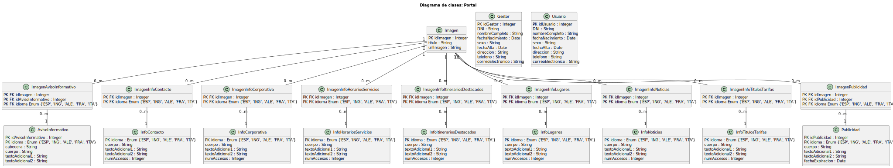
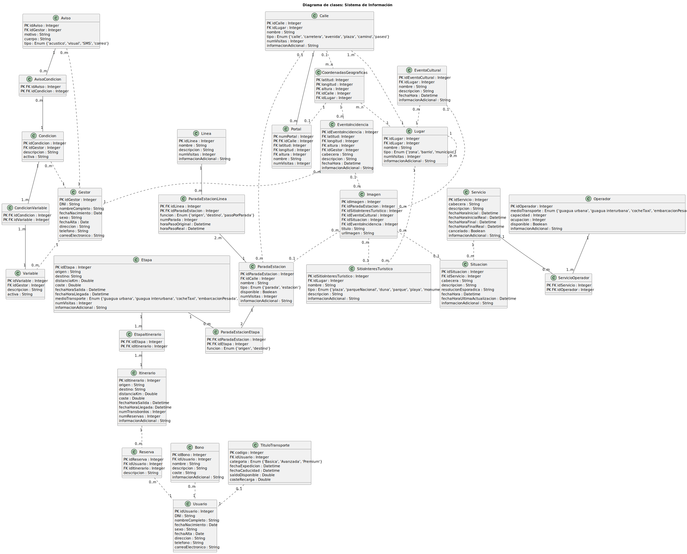

 

[Volver a la página anterior](https://github.com/emg842/INRE-UAL-ROJO-2022)

 

#  Especificación de los requisitos del software

 

##  Hoja de revisión

 

<table align = "center">
    <tr>
        <td><b>Fecha</b></td>
        <td><b>Versión</b></td>
        <td><b>Descripción</b></td>
        <td><b>Autor</b></td>
    </tr>
    <tr>
        <td>06/12/2022</td>
        <td>1.0</td>
        <td>Realización del DCU general</td>
        <td>Manuel Vallecillos Escobosa</td>
    </tr>
    <tr>
        <td>10/12/2022</td>
        <td>1.0</td>
        <td>Realización tablas requisitos funcionales</td>
        <td>Miguel Ángel Moncada Álvarez</td>
    </tr>
    <tr>
        <td>10/12/2022</td>
        <td>1.0</td>
        <td>Corrección tablas requisitos funcionales</td>
        <td>Miguel Ángel Moncada Álvarez</td>
    </tr>
    <tr>
        <td>10/12/2022</td>
        <td>1.0</td>
        <td>Corrección tablas requisitos funcionales</td>
        <td>Miguel Ángel Moncada Álvarez</td>
    </tr>
    <tr>
        <td>10/12/2022</td>
        <td>1.0</td>
        <td>Actualizar progreso en la Hoja de revisión</td>
        <td>Miguel Ángel Moncada Álvarez</td>
    </tr>
    <tr>
        <td>11/12/2022</td>
        <td>1.0</td>
        <td>Actualización del DCU general</td>
        <td>Manuel Vallecillos Escobosa</td>
    </tr>
    <tr>
        <td>11/12/2022</td>
        <td>1.0</td>
        <td>Adición de requisitos funcionales1</td>
        <td>Miguel Ángel Moncada Álvarez</td>
    </tr>
        <tr>
        <td>11/12/2022</td>
        <td>1.0</td>
        <td>Adición de requisitos No funcionales</td>
        <td>Miguel Ángel Moncada Álvarez</td>
    </tr>
    </tr>
        <tr>
        <td>13/12/2022</td>
        <td>1.0</td>
        <td>Introducción y objetivos de negocio</td>
        <td>Daniel López García</td>
    </tr>
    <tr>
        <td>13/12/2022</td>
        <td>1.0</td>
        <td>Diagrama E/R general</td>
        <td>Joaquín Murcia Escánez</td>
    </tr>
    <tr>
        <td>13/12/2022</td>
        <td>1.0</td>
        <td>Diagrama de casos de uso general actualizado en adición de fragmentos del mismo (DCU del usuario del portal, DCU del usuario del sistema de información y DCU del gestor)</td>
        <td>Manuel Vallecillos Escobosa</td>
    </tr>
    <tr>
        <td>14/12/2022</td>
        <td>1.0</td>
        <td>Diagrama de clases general</td>
        <td>Joaquín Murcia Escánez</td>
    </tr>
    <tr>
        <td>14/12/2022</td>
        <td>1.0</td>
        <td>Subida diagrama E/R fragmentado en dos (portal y sistema de información)</td>
        <td>Joaquín Murcia Escánez</td>
    </tr>
    <tr>
        <td>14/12/2022</td>
        <td>1.0</td>
        <td>Subida diagrama CU fragmentado en dos (portal y sistema de información)</td>
        <td>Manuel Vallecillos Escobosa</td>
    </tr>
        <tr>
        <td>14/12/2022</td>
        <td>1.0</td>
        <td>Subida diagrama de clases fragmentado en dos (portal y sistema de información)</td>
        <td>Joaquín Murcia Escánez</td>
    </tr>
    </tr>
        <tr>
        <td>14/12/2022</td>
        <td>1.0</td>
        <td>Separación de requisitos funcionales y no funcionales en función de si pertenecen al portal o al sistema de información</td>
        <td>Joaquín Murcia Escánez</td>
    </tr>
    </tr>
    <tr>
        <td>14/12/2022</td>
        <td>1.0</td>
        <td>Subida del organigrama</td>
        <td>Manuel Vallecillos Escobosa</td>
    </tr>
    <tr>
        <td>14/12/2022</td>
        <td>1.0</td>
        <td>Subida de los modelos de procesos de negocio</td>
        <td>Daniel López García</td>
    </tr>
</table>

  

##  Contenidos

 

[Hoja de revisión](#hojaderevision) 
[Contenidos](#contenidos) 
[1. &nbsp;&nbsp;&nbsp;&nbsp; Introducción](#introduccion) 
[2. &nbsp;&nbsp;&nbsp;&nbsp; Información del dominio del problema [opcional]](#informaciondeldominiodelproblema) 
&nbsp;&nbsp;&nbsp;&nbsp;&nbsp;&nbsp;&nbsp;&nbsp; [2.1. &nbsp;&nbsp;&nbsp;&nbsp; Organigrama](#organigrama) 
&nbsp;&nbsp;&nbsp;&nbsp;&nbsp;&nbsp;&nbsp;&nbsp; [2.2. &nbsp;&nbsp;&nbsp;&nbsp; Glosario de términos](#glosariodeterminos) 
[3. &nbsp;&nbsp;&nbsp;&nbsp; Necesidades del negocio](#necesidadesdelnegocio) 
&nbsp;&nbsp;&nbsp;&nbsp;&nbsp;&nbsp;&nbsp;&nbsp; [3.1. &nbsp;&nbsp;&nbsp;&nbsp; Objetivos del negocio](#objetivosdelnegocio) 
&nbsp;&nbsp;&nbsp;&nbsp;&nbsp;&nbsp;&nbsp;&nbsp; [3.2. &nbsp;&nbsp;&nbsp;&nbsp; Modelos de Procesos de Negocio [opcional]](#modelosdeprocesosdenegocio) 
&nbsp;&nbsp;&nbsp;&nbsp;&nbsp;&nbsp;&nbsp;&nbsp;&nbsp;&nbsp;&nbsp;&nbsp;&nbsp;&nbsp;&nbsp;&nbsp;&nbsp;&nbsp;&nbsp;&nbsp; [Procesos](#procesos) 
&nbsp;&nbsp;&nbsp;&nbsp;&nbsp;&nbsp;&nbsp;&nbsp;&nbsp;&nbsp;&nbsp;&nbsp;&nbsp;&nbsp;&nbsp;&nbsp;&nbsp;&nbsp;&nbsp;&nbsp; [Tareas](#tareas) 
[4. &nbsp;&nbsp;&nbsp;&nbsp; Requisitos del sistema a desarrollar](#requisitosdelsistemaadesarrollar) 
&nbsp;&nbsp;&nbsp;&nbsp;&nbsp;&nbsp;&nbsp;&nbsp; [4.1. &nbsp;&nbsp;&nbsp;&nbsp; Requisitos](#requisitos) 
&nbsp;&nbsp;&nbsp;&nbsp;&nbsp;&nbsp;&nbsp;&nbsp;&nbsp;&nbsp;&nbsp;&nbsp;&nbsp;&nbsp;&nbsp;&nbsp;&nbsp;&nbsp;&nbsp;&nbsp; [Requisitos funcionales del Portal](#requisitosfuncionalesdelportal) 
&nbsp;&nbsp;&nbsp;&nbsp;&nbsp;&nbsp;&nbsp;&nbsp;&nbsp;&nbsp;&nbsp;&nbsp;&nbsp;&nbsp;&nbsp;&nbsp;&nbsp;&nbsp;&nbsp;&nbsp; [Requisitos funcionales del Sistema de información](#requisitosfuncionalesdelsistemadeinformacion) 
&nbsp;&nbsp;&nbsp;&nbsp;&nbsp;&nbsp;&nbsp;&nbsp;&nbsp;&nbsp;&nbsp;&nbsp;&nbsp;&nbsp;&nbsp;&nbsp;&nbsp;&nbsp;&nbsp;&nbsp; [Requisitos no funcionales del Portal](#requisitosnofuncionalesdelportal) 
&nbsp;&nbsp;&nbsp;&nbsp;&nbsp;&nbsp;&nbsp;&nbsp;&nbsp;&nbsp;&nbsp;&nbsp;&nbsp;&nbsp;&nbsp;&nbsp;&nbsp;&nbsp;&nbsp;&nbsp; [Requisitos no funcionales del Sistema de Información](#requisitosnofuncionalesdelsistemadeinformacion) 
&nbsp;&nbsp;&nbsp;&nbsp;&nbsp;&nbsp;&nbsp;&nbsp;&nbsp;&nbsp;&nbsp;&nbsp;&nbsp;&nbsp;&nbsp;&nbsp;&nbsp;&nbsp;&nbsp;&nbsp; [Requisitos de información del Portal](#requisitosdeinformaciondelportal) 
&nbsp;&nbsp;&nbsp;&nbsp;&nbsp;&nbsp;&nbsp;&nbsp;&nbsp;&nbsp;&nbsp;&nbsp;&nbsp;&nbsp;&nbsp;&nbsp;&nbsp;&nbsp;&nbsp;&nbsp; [Requisitos de información del Sistema de Información](#requisitosdeinformaciondelsistemadeinformacion) 
&nbsp;&nbsp;&nbsp;&nbsp;&nbsp;&nbsp;&nbsp;&nbsp; [4.2. &nbsp;&nbsp;&nbsp;&nbsp; Casos de uso](#casosdeuso) 
&nbsp;&nbsp;&nbsp;&nbsp;&nbsp;&nbsp;&nbsp;&nbsp;&nbsp;&nbsp;&nbsp;&nbsp;&nbsp;&nbsp;&nbsp;&nbsp;&nbsp;&nbsp;&nbsp;&nbsp; [Lista de diagramas de casos de uso del modelo](#listadediagramasdecasosdeusodelmodelo) 
&nbsp;&nbsp;&nbsp;&nbsp;&nbsp;&nbsp;&nbsp;&nbsp;&nbsp;&nbsp;&nbsp;&nbsp;&nbsp;&nbsp;&nbsp;&nbsp;&nbsp;&nbsp;&nbsp;&nbsp; [Diagramas de casos de uso](#diagramasdecasosdeuso) 
&nbsp;&nbsp;&nbsp;&nbsp;&nbsp;&nbsp;&nbsp;&nbsp;&nbsp;&nbsp;&nbsp;&nbsp;&nbsp;&nbsp;&nbsp;&nbsp;&nbsp;&nbsp;&nbsp;&nbsp; [Lista de casos de uso del Portal](#listadecasosdeusodelportal) 
&nbsp;&nbsp;&nbsp;&nbsp;&nbsp;&nbsp;&nbsp;&nbsp;&nbsp;&nbsp;&nbsp;&nbsp;&nbsp;&nbsp;&nbsp;&nbsp;&nbsp;&nbsp;&nbsp;&nbsp; [Lista de casos de uso del Sistema de Información](#listadecasosdeusodelsistemadeinformacion) 
&nbsp;&nbsp;&nbsp;&nbsp;&nbsp;&nbsp;&nbsp;&nbsp;&nbsp;&nbsp;&nbsp;&nbsp;&nbsp;&nbsp;&nbsp;&nbsp;&nbsp;&nbsp;&nbsp;&nbsp; [Lista de actores del Portal](#listadeactoresdelportal) 
&nbsp;&nbsp;&nbsp;&nbsp;&nbsp;&nbsp;&nbsp;&nbsp;&nbsp;&nbsp;&nbsp;&nbsp;&nbsp;&nbsp;&nbsp;&nbsp;&nbsp;&nbsp;&nbsp;&nbsp; [Lista de actores del Sistema de información](#listadeactoresdelsistemadeinformacion) 
&nbsp;&nbsp;&nbsp;&nbsp;&nbsp;&nbsp;&nbsp;&nbsp;&nbsp;&nbsp;&nbsp;&nbsp;&nbsp;&nbsp;&nbsp;&nbsp;&nbsp;&nbsp;&nbsp;&nbsp; [Detalle de los casos de uso del Portal](#detalledeloscasosdeusodelportal) 
&nbsp;&nbsp;&nbsp;&nbsp;&nbsp;&nbsp;&nbsp;&nbsp;&nbsp;&nbsp;&nbsp;&nbsp;&nbsp;&nbsp;&nbsp;&nbsp;&nbsp;&nbsp;&nbsp;&nbsp; [Detalle de los casos de uso del Sistema de información](#detalledeloscasosdeusodelsistemadeinformacion) 
&nbsp;&nbsp;&nbsp;&nbsp;&nbsp;&nbsp;&nbsp;&nbsp; [4.3. &nbsp;&nbsp;&nbsp;&nbsp; Diagramas E/R y de clases asociados a los requisitos de información](#diagramaserydeclasesasociadosalosrequisitosdeinformacion) 
&nbsp;&nbsp;&nbsp;&nbsp;&nbsp;&nbsp;&nbsp;&nbsp;&nbsp;&nbsp;&nbsp;&nbsp;&nbsp;&nbsp;&nbsp;&nbsp;&nbsp;&nbsp;&nbsp;&nbsp; [Lista de diagramas E/R del modelo](#listadediagramaserdelmodelo) 
&nbsp;&nbsp;&nbsp;&nbsp;&nbsp;&nbsp;&nbsp;&nbsp;&nbsp;&nbsp;&nbsp;&nbsp;&nbsp;&nbsp;&nbsp;&nbsp;&nbsp;&nbsp;&nbsp;&nbsp; [Diagramas E/R del modelo](#diagramaserdelmodelo) 
&nbsp;&nbsp;&nbsp;&nbsp;&nbsp;&nbsp;&nbsp;&nbsp;&nbsp;&nbsp;&nbsp;&nbsp;&nbsp;&nbsp;&nbsp;&nbsp;&nbsp;&nbsp;&nbsp;&nbsp; [Lista de diagramas de clases del modelo](#listadediagramasdeclasesdelmodelo) 
&nbsp;&nbsp;&nbsp;&nbsp;&nbsp;&nbsp;&nbsp;&nbsp;&nbsp;&nbsp;&nbsp;&nbsp;&nbsp;&nbsp;&nbsp;&nbsp;&nbsp;&nbsp;&nbsp;&nbsp; [Diagramas de clases del modelo](#diagramasdeclasesdelmodelo) 
[Apéndices](#apendices)

  

##  1. Introducción

 

Una vez leído el pliego de las condiciones hemos decicido abarcar este proyecto para crear dos aplicaciones con objeto de favorecer y facilitar el uso de transporte público en la isla de Gran Canaria. Para ello hemos desarrollado una entrevista (ver anexo) con un usuario habitual para, de este modo, aclarar algunas dudas que nos han surgido durante el planteamiento inicial del proyecto. Una vez terminada, nos disponemos a crear el presente archivo con nuestra propuesta documentada de las aplicaciones del pliego inicial.

 

##  2. Información del Dominio del problema [opcional]

 

###  2.1. Organigrama

 

 

###  2.2. Glosario de términos

 

<table align = "center">
    <tr>
        <td><b>Término</b></td>
        <td><b>Descripción</b></td>
    </tr>
    <tr>
        <td>término</td>
        <td>descripción</td>
    </tr>
    <tr>
        <td>término</td>
        <td>descripción</td>
    </tr>
    <tr>
        <td>término</td>
        <td>descripción</td>
    </tr>
</table>

  

##  3. Necesidades del negocio

 

###  3.1. Objetivos del negocio

 

Como ya hemos visto la intención de este proyecto es la de crear dos aplicaciones, una aplicación que nos muestre información sobre eventos, rutas de autobuses, noticias e itinerarios de la isla, ... (entre otras muchas opciones) y otra aplicación que implementará una pasarela de pago para poder comprar billetes y reservar itinerarios, un mapa iteractivo sobre el que poder realizar diversas operaciones, etc. Nuestro propósito es el de crear ambas aplicaciones con una grata experiencia de usuario y de manera eficiente. Siempre, claro está, cuidando que sea accesible para la gran mayoría de usuarios.

 

###  3.2. Modelos de Procesos de Negocio [opcional]

 

###  Procesos

 

<table align = "center">
    <tr>
        <td><b>Nombre</b></td>
        <td><b>Descripción</b></td>
    </tr>
    <tr>
        <td>Validación del DNI al registrarse</td>
        <td>Un usuario no registrado envía una foto la cual será recibida por el gestor de contenidos, este a su vez lo enviará por un proceso de verificación llevado a cabo por el software externo a la empresa. En caso de que el software verifique la validez del DNI este enviará un informe comentando dicho resultado al gestor de contenidos y en caso de ser rechazada la imagen se enviará un informe con los fallos al gestor de contenidos. Cuando el gestor reciba el informe de los fallos se lo mandará al usuario para que vuelva a mandar la imagen del DNI y haga de nuevo el proceso de verificación. Si la foto ha sido validada le mandará al usuario un mensaje de verificación y terminará el proceso</td>
    </tr>
    <tr>
        <td>Adquisición de un bono o de un título único de transporte</td>
        <td>El usuario tendrá la opción tanto de comprar un bono, como de adquirir el título de transporte. Una vez seleccionada la opción, se deberá enviar el formulario del servicio escogido al sistema. En caso de que cumpla los requisitos, se proporcionará el bono o título solicitado al usuario en cuestión, haciéndole llegar un mensaje con las credenciales correspondientes a dicho bono o título a su correo. En caso contrario, se le mandará un mensaje comunicándole que el formulario debe volver a ser rellenado pues ha habido algún tipo de error</td>
    </tr>
    <tr>
        <td>Reserva de itinerario</td>
        <td>1. El proceso comienza cuando un cliente busca un itinerario y solicita su reserva. 
        2. La solicitud es recibida por el sistema de reservas, que verifica la disponibilidad de los servicios solicitados. 
        3. Si hay disponibilidad, se procede a generar una factura del precio total del itinerario y se envía al cliente. 
        4. Si no hay disponibilidad se mandará un aviso al cliente. 
        5. Cuando el cliente recibe la factura podrá realizar el pago o cancelar la reserva terminando el proceso. 
        6. Cuando el cliente reciba el aviso de que no hay disponibilidad, podrá buscar otro itinerario iniciando de nuevo el proceso o terminar el proceso. 
        7. Cuando realice el pago le llegará un aviso al sistema de reservas, este se encargará de generar el recibo y de enviárselo al cliente. 
        8. Cuando al cliente le llega el recibo se termina el proceso.</td>
    </tr>
</table>

 

###  Tareas

 

- Tareas del proceso 1: Validación del DNI al registrarse

 

Un usuario no registrado envía una foto la cual será recibida por el gestor de contenidos, este a su vez lo enviará por un proceso de verificación llevado a cabo por el software externo a la empresa. En caso de que el software verifique la validez del DNI este enviará un informe comentando dicho resultado al gestor de contenidos y en caso de ser rechazada la imagen se enviará un informe con los fallos al gestor de contenidos. Cuando el gestor reciba el informe de los fallos se lo mandará al usuario para que vuelva a mandar la imagen del DNI y haga de nuevo el proceso de verificación. Si la foto ha sido validada le mandará al usuario un mensaje de verificación y terminará el proceso

 

 

- Tareas del proceso 2: Adquisición de un bono o de un título único de transporte

 

El usuario tendrá la opción tanto de comprar un bono, como de adquirir el título de transporte. Una vez seleccionada la opción, se deberá enviar el formulario del servicio escogido al sistema. En caso de que cumpla los requisitos, se proporcionará el bono o título solicitado al usuario en cuestión, haciéndole llegar un mensaje con las credenciales correspondientes a dicho bono o título a su correo. En caso contrario, se le mandará un mensaje comunicándole que el formulario debe volver a ser rellenado pues ha habido algún tipo de error

 

 

- Tareas del proceso 3: Reserva de itinerario

 

1. El proceso comienza cuando un cliente busca un itinerario y solicita su reserva. 
2. La solicitud es recibida por el sistema de reservas, que verifica la disponibilidad de los servicios solicitados. 
3. Si hay disponibilidad, se procede a generar una factura del precio total del itinerario y se envía al cliente. 
4. Si no hay disponibilidad se mandará un aviso al cliente. 
5. Cuando el cliente recibe la factura podrá realizar el pago o cancelar la reserva terminando el proceso. 
6. Cuando el cliente reciba el aviso de que no hay disponibilidad, podrá buscar otro itinerario iniciando de nuevo el proceso o terminar el proceso. 
7. Cuando realice el pago le llegará un aviso al sistema de reservas, este se encargará de generar el recibo y de enviárselo al cliente. 
8. Cuando al cliente le llega el recibo se termina el proceso.</td>

 

  

##  4. Requisitos del sistema a desarrollar

 

###  4.1. Requisitos

 

###  Requisitos funcionales del Portal

 

<table align = "center">
    <tr>
        <td><b>FR-01:</b></td>
        <td>Acceder al blog</td>
    </tr>
    <tr>
        <td><b>Versión:</b></td>
        <td>1.0 (Diciembre-2022)</td>
    </tr>
    <tr>
        <td><b>Autor:</b></td>
        <td>Manuel Vallecillos Escobosa</td>
    </tr>
    <tr>
        <td><b>Fuentes:</b></td>
        <td>Pliego de condiciones y entrevista</td>
    </tr>
    <tr>
        <td><b>Referencias:</b></td>
        <td>Identificadores de casos de uso, de requisitos funcionales, no funcionales y de requisitos información del sistema</td>
    </tr>
    <tr>
        <td><b>Descripción:</b></td>
        <td>El sistema ofrece acceso al blog con información acerca del transporte en las Islas Canarias</td>
    </tr>
    <tr>
        <td><b>Importancia:</b></td>
        <td>Muy elevada</td>
    </tr>
    <tr>
        <td><b>Estado:</b></td>
        <td>Aceptado</td>
    </tr>
    <tr>
        <td><b>Comentarios:</b></td>
        <td></td>
    </tr>
</table>

 

<table align = "center">
    <tr>
        <td><b>FR-02:</b></td>
        <td>Acceder al foro</td>
    </tr>
    <tr>
        <td><b>Versión:</b></td>
        <td>1.0 (Diciembre-2022)</td>
    </tr>
    <tr>
        <td><b>Autor:</b></td>
        <td>Manuel Vallecillos Escobosa</td>
    </tr>
    <tr>
        <td><b>Fuentes:</b></td>
        <td>Pliego de condiciones y entrevista</td>
    </tr>
    <tr>
        <td><b>Referencias:</b></td>
        <td>Identificadores de casos de uso, de requisitos funcionales, no funcionales y de requisitos información del sistema</td>
    </tr>
    <tr>
        <td><b>Descripción:</b></td>
        <td>El sistema ofrece acceso al foro de la página donde se podrá comentar acerca de la situación del transporte, rutas, servicios ofrecidos... etc </td>
    </tr>
    <tr>
        <td><b>Importancia:</b></td>
        <td>Muy elevada</td>
    </tr>
    <tr>
        <td><b>Estado:</b></td>
        <td>Aceptado</td>
    </tr>
    <tr>
        <td><b>Comentarios:</b></td>
        <td></td>
    </tr>
</table>

 

<table align = "center">
    <tr>
        <td><b>FR-03:</b></td>
        <td>Acceder a cloud tag</td>
    </tr>
    <tr>
        <td><b>Versión:</b></td>
        <td>1.0 (Diciembre-2022)</td>
    </tr>
    <tr>
        <td><b>Autor:</b></td>
        <td>Manuel Vallecillos Escobosa</td>
    </tr>
    <tr>
        <td><b>Fuentes:</b></td>
        <td>Pliego de condiciones y entrevista</td>
    </tr>
    <tr>
        <td><b>Referencias:</b></td>
        <td>Identificadores de casos de uso, de requisitos funcionales, no funcionales y de requisitos información del sistema</td>
    </tr>
    <tr>
        <td><b>Descripción:</b></td>
        <td>Ofrece de forma gráfica acceso a las funcionalidades de la página a través de etiquetas visuales en la nube</td>
    </tr>
    <tr>
        <td><b>Importancia:</b></td>
        <td>Muy elevada</td>
    </tr>
    <tr>
        <td><b>Estado:</b></td>
        <td>Aceptado</td>
    </tr>
    <tr>
        <td><b>Comentarios:</b></td>
        <td></td>
    </tr>
</table>

 

<table align = "center">
    <tr>
        <td><b>FR-04:</b></td>
        <td>Buscador (Portal)</td>
    </tr>
    <tr>
        <td><b>Versión:</b></td>
        <td>1.0 (Diciembre-2022)</td>
    </tr>
    <tr>
        <td><b>Autor:</b></td>
        <td>Manuel Vallecillos Escobosa</td>
    </tr>
    <tr>
        <td><b>Fuentes:</b></td>
        <td>Pliego de condiciones y entrevista</td>
    </tr>
    <tr>
        <td><b>Referencias:</b></td>
        <td>Identificadores de casos de uso, de requisitos funcionales, no funcionales y de requisitos información del sistema</td>
    </tr>
    <tr>
        <td><b>Descripción:</b></td>
        <td>Permitirá la localización de cualquier contenido de manera inmediata mediante la introducción de términos clave</td>
    </tr>
    <tr>
        <td><b>Importancia:</b></td>
        <td>Muy elevada</td>
    </tr>
    <tr>
        <td><b>Estado:</b></td>
        <td>Aceptado</td>
    </tr>
    <tr>
        <td><b>Comentarios:</b></td>
        <td>- En las búsquedas no se diferenciarán las palabras con o sin acento, mayúsculas o minúsculas. 
        - Dispondrá de opciones que permitan la parametrización de las búsquedas considerando características como el idioma, secciones del sitio, etc </td>
    </tr>
</table>

 

<table align = "center">
    <tr>
        <td><b>FR-05:</b></td>
        <td>Ver noticias</td>
    </tr>
    <tr>
        <td><b>Versión:</b></td>
        <td>1.0 (Diciembre-2022)</td>
    </tr>
    <tr>
        <td><b>Autor:</b></td>
        <td>Manuel Vallecillos Escobosa</td>
    </tr>
    <tr>
        <td><b>Fuentes:</b></td>
        <td>Pliego de condiciones y entrevista</td>
    </tr>
    <tr>
        <td><b>Referencias:</b></td>
        <td>Identificadores de casos de uso, de requisitos funcionales, no funcionales y de requisitos información del sistema</td>
    </tr>
    <tr>
        <td><b>Descripción:</b></td>
        <td>Ofrece la posibilidad de ver las noticias acerca de eventos en las Islas Canarias y la disponibilidad del transporte </td>
    </tr>
    <tr>
        <td><b>Importancia:</b></td>
        <td>Muy elevada</td>
    </tr>
    <tr>
        <td><b>Estado:</b></td>
        <td>Aceptado</td>
    </tr>
    <tr>
        <td><b>Comentarios:</b></td>
        <td></td>
    </tr>
</table>

 

<table align = "center">
    <tr>
        <td><b>FR-06:</b></td>
        <td>Contactar con el equipo de la aplicación</td>
    </tr>
    <tr>
        <td><b>Versión:</b></td>
        <td>1.0 (Diciembre-2022)</td>
    </tr>
    <tr>
        <td><b>Autor:</b></td>
        <td>Manuel Vallecillos Escobosa</td>
    </tr>
    <tr>
        <td><b>Fuentes:</b></td>
        <td>Pliego de condiciones y entrevista</td>
    </tr>
    <tr>
        <td><b>Referencias:</b></td>
        <td>Identificadores de casos de uso, de requisitos funcionales, no funcionales y de requisitos información del sistema</td>
    </tr>
    <tr>
        <td><b>Descripción:</b></td>
        <td>Da la posibilidad de contactar con el equipo de la aplicación ya sea a través del correo electrónico o de un número de teléfono</td>
    </tr>
    <tr>
        <td><b>Importancia:</b></td>
        <td>Muy elevada</td>
    </tr>
    <tr>
        <td><b>Estado:</b></td>
        <td>Aceptado</td>
    </tr>
    <tr>
        <td><b>Comentarios:</b></td>
        <td></td>
    </tr>
</table>

 

<table align = "center">
    <tr>
        <td><b>FR-07:</b></td>
        <td>Ver horarios de las líneas</td>
    </tr>
    <tr>
        <td><b>Versión:</b></td>
        <td>1.0 (Diciembre-2022)</td>
    </tr>
    <tr>
        <td><b>Autor:</b></td>
        <td>Manuel Vallecillos Escobosa</td>
    </tr>
    <tr>
        <td><b>Fuentes:</b></td>
        <td>Pliego de condiciones y entrevista</td>
    </tr>
    <tr>
        <td><b>Referencias:</b></td>
        <td>Identificadores de casos de uso, de requisitos funcionales, no funcionales y de requisitos información del sistema</td>
    </tr>
    <tr>
        <td><b>Descripción:</b></td>
        <td>Muestra la hora a la que pasa un determinado transporte por una determinada parada de la línea que se esté consultando</td>
    </tr>
    <tr>
        <td><b>Importancia:</b></td>
        <td>Muy elevada</td>
    </tr>
    <tr>
        <td><b>Estado:</b></td>
        <td>Aceptado</td>
    </tr>
    <tr>
        <td><b>Comentarios:</b></td>
        <td></td>
    </tr>
</table>

 

<table align = "center">
    <tr>
        <td><b>FR-08:</b></td>
        <td>Ver itinerarios destacados</td>
    </tr>
    <tr>
        <td><b>Versión:</b></td>
        <td>1.0 (Diciembre-2022)</td>
    </tr>
    <tr>
        <td><b>Autor:</b></td>
        <td>Manuel Vallecillos Escobosa</td>
    </tr>
    <tr>
        <td><b>Fuentes:</b></td>
        <td>Pliego de condiciones y entrevista</td>
    </tr>
    <tr>
        <td><b>Referencias:</b></td>
        <td>Identificadores de casos de uso, de requisitos funcionales, no funcionales y de requisitos información del sistema</td>
    </tr>
    <tr>
        <td><b>Descripción:</b></td>
        <td>Ofrece una lista con los itinerarios más destacados entre los usuarios</td>
    </tr>
    <tr>
        <td><b>Importancia:</b></td>
        <td>Muy elevada</td>
    </tr>
    <tr>
        <td><b>Estado:</b></td>
        <td>Aceptado</td>
    </tr>
    <tr>
        <td><b>Comentarios:</b></td>
        <td></td>
    </tr>
</table>

 

<table align = "center">
    <tr>
        <td><b>FR-09:</b></td>
        <td>Ver tarifas y títulos de transporte</td>
    </tr>
    <tr>
        <td><b>Versión:</b></td>
        <td>1.0 (Diciembre-2022)</td>
    </tr>
    <tr>
        <td><b>Autor:</b></td>
        <td>Manuel Vallecillos Escobosa</td>
    </tr>
    <tr>
        <td><b>Fuentes:</b></td>
        <td>Pliego de condiciones y entrevista</td>
    </tr>
    <tr>
        <td><b>Referencias:</b></td>
        <td>Identificadores de casos de uso, de requisitos funcionales, no funcionales y de requisitos información del sistema</td>
    </tr>
    <tr>
        <td><b>Descripción:</b></td>
        <td>Ofrece una vista de las distintas tarifas y titulos disponibles para adquirir</td>
    </tr>
    <tr>
        <td><b>Importancia:</b></td>
        <td>Muy elevada</td>
    </tr>
    <tr>
        <td><b>Estado:</b></td>
        <td>Aceptado</td>
    </tr>
    <tr>
        <td><b>Comentarios:</b></td>
        <td></td>
    </tr>
</table>

 

<table align = "center">
    <tr>
        <td><b>FR-10:</b></td>
        <td>Mostrar publicidad</td>
    </tr>
    <tr>
        <td><b>Versión:</b></td>
        <td>1.0 (Diciembre-2022)</td>
    </tr>
    <tr>
        <td><b>Autor:</b></td>
        <td>Manuel Vallecillos Escobosa</td>
    </tr>
    <tr>
        <td><b>Fuentes:</b></td>
        <td>Pliego de condiciones y entrevista</td>
    </tr>
    <tr>
        <td><b>Referencias:</b></td>
        <td>Identificadores de casos de uso, de requisitos funcionales, no funcionales y de requisitos información del sistema</td>
    </tr>
    <tr>
        <td><b>Descripción:</b></td>
        <td>Aparecen anuncios acerca del transporte en la isla o anuncios de otras empresas externas</td>
    </tr>
    <tr>
        <td><b>Importancia:</b></td>
        <td>Muy elevada</td>
    </tr>
    <tr>
        <td><b>Estado:</b></td>
        <td>Aceptado</td>
    </tr>
    <tr>
        <td><b>Comentarios:</b></td>
        <td></td>
    </tr>
</table>

 

<table align = "center">
    <tr>
        <td><b>FR-11:</b></td>
        <td>Ver información corporativa</td>
    </tr>
    <tr>
        <td><b>Versión:</b></td>
        <td>1.0 (Diciembre-2022)</td>
    </tr>
    <tr>
        <td><b>Autor:</b></td>
        <td>Manuel Vallecillos Escobosa</td>
    </tr>
    <tr>
        <td><b>Fuentes:</b></td>
        <td>Pliego de condiciones y entrevista</td>
    </tr>
    <tr>
        <td><b>Referencias:</b></td>
        <td>Identificadores de casos de uso, de requisitos funcionales, no funcionales y de requisitos información del sistema</td>
    </tr>
    <tr>
        <td><b>Descripción:</b></td>
        <td>Ofrece la información corporativa del ayuntamiento de las Islas Canarias</td>
    </tr>
    <tr>
        <td><b>Importancia:</b></td>
        <td>Muy elevada</td>
    </tr>
    <tr>
        <td><b>Estado:</b></td>
        <td>Aceptado</td>
    </tr>
    <tr>
        <td><b>Comentarios:</b></td>
        <td></td>
    </tr>
</table>

 

<table align = "center">
    <tr>
        <td><b>FR-12:</b></td>
        <td>Cambio de idioma</td>
    </tr>
    <tr>
        <td><b>Versión:</b></td>
        <td>1.0 (Diciembre-2022)</td>
    </tr>
    <tr>
        <td><b>Autor:</b></td>
        <td>Manuel Vallecillos Escobosa</td>
    </tr>
    <tr>
        <td><b>Fuentes:</b></td>
        <td>Pliego de condiciones y entrevista</td>
    </tr>
    <tr>
        <td><b>Referencias:</b></td>
        <td>Identificadores de casos de uso, de requisitos funcionales, no funcionales y de requisitos información del sistema</td>
    </tr>
    <tr>
        <td><b>Descripción:</b></td>
        <td>Ofrece la posibilidad de cambiar el idioma en el que aparece el contenido de la página</td>
    </tr>
    <tr>
        <td><b>Importancia:</b></td>
        <td>Muy elevada</td>
    </tr>
    <tr>
        <td><b>Estado:</b></td>
        <td>Aceptado</td>
    </tr>
    <tr>
        <td><b>Comentarios:</b></td>
        <td></td>
    </tr>
</table>

 

###  Requisitos funcionales del Sistema de información

 

<table align = "center">
    <tr>
        <td><b>FR-01:</b></td>
        <td>Buscador de itinerarios (Mapa interactivo)</td>
    </tr>
    <tr>
        <td><b>Versión:</b></td>
        <td>1.0 (Diciembre-2022)</td>
    </tr>
    <tr>
        <td><b>Autor:</b></td>
        <td>Manuel Vallecillos Escobosa</td>
    </tr>
    <tr>
        <td><b>Fuentes:</b></td>
        <td>Pliego de condiciones y entrevista</td>
    </tr>
    <tr>
        <td><b>Referencias:</b></td>
        <td>Identificadores de casos de uso, de requisitos funcionales, no funcionales y de requisitos información del sistema</td>
    </tr>
    <tr>
        <td><b>Actores:</b></td>
        <td>ACT-01, ACT-02 </td>
    </tr>
    <tr>
        <td><b>Descripción:</b></td>
        <td>Realiza la búsqueda y nos indica en el mapa interactivo el itinerario seleccionado</td>
    </tr>
    <tr>
        <td><b>Importancia:</b></td>
        <td>Muy elevada</td>
    </tr>
    <tr>
        <td><b>Estado:</b></td>
        <td>Aceptado</td>
    </tr>
    <tr>
        <td><b>Comentarios:</b></td>
        <td>La búsqueda debe de realizarse en menos de 100ms</td>
    </tr>
</table>

 

<table align = "center">
    <tr>
        <td><b>FR-02:</b></td>
        <td>Seleccionar orden de itinerarios buscados</td>
    </tr>
    <tr>
        <td><b>Versión:</b></td>
        <td>1.0 (Diciembre-2022)</td>
    </tr>
    <tr>
        <td><b>Autor:</b></td>
        <td>Manuel Vallecillos Escobosa</td>
    </tr>
    <tr>
        <td><b>Fuentes:</b></td>
        <td>Pliego de condiciones y entrevista</td>
    </tr>
    <tr>
        <td><b>Referencias:</b></td>
        <td>Identificadores de casos de uso, de requisitos funcionales, no funcionales y de requisitos información del sistema</td>
    </tr>
    <tr>
        <td><b>Actores:</b></td>
        <td>ACT-01, ACT-02 </td>
    </tr>
    <tr>
        <td><b>Descripción:</b></td>
        <td>Ordena los itinerarios coincidentes en base al criterio escogido</td>
    </tr>
    <tr>
        <td><b>Importancia:</b></td>
        <td>Muy elevada</td>
    </tr>
    <tr>
        <td><b>Estado:</b></td>
        <td>Aceptado</td>
    </tr>
    <tr>
        <td><b>Comentarios:</b></td>
        <td>Podremos ordenar los itinerarios en base a: 
        - Fecha 
        - Horas de salida y llegada 
        - Tiempo de transporte 
        - Coste del transporte 
        - Nº de transbordos</td>
    </tr>
</table>

 

<table align = "center">
    <tr>
        <td><b>FR-03:</b></td>
        <td>Seleccionar origen-destino</td>
    </tr>
    <tr>
        <td><b>Actores:</b></td>
        <td>ACT-01, ACT-02 </td>
    </tr>
    <tr>
        <td><b>Versión:</b></td>
        <td>1.0 (Diciembre-2022)</td>
    </tr>
    <tr>
        <td><b>Autor:</b></td>
        <td>Manuel Vallecillos Escobosa</td>
    </tr>
    <tr>
        <td><b>Fuentes:</b></td>
        <td>Pliego de condiciones y entrevista</td>
    </tr>
    <tr>
        <td><b>Referencias:</b></td>
        <td>Identificadores de casos de uso, de requisitos funcionales, no funcionales y de requisitos información del sistema</td>
    </tr>
    <tr>
        <td><b>Actores:</b></td>
        <td>ACT-01, ACT-02 </td>
    </tr>
    <tr>
        <td><b>Descripción:</b></td>
        <td>Selección del origen y el destino del itinerario</td>
    </tr>
    <tr>
        <td><b>Importancia:</b></td>
        <td>Muy elevada</td>
    </tr>
    <tr>
        <td><b>Estado:</b></td>
        <td>Aceptado</td>
    </tr>
    <tr>
        <td><b>Comentarios:</b></td>
        <td></td>
    </tr>
</table>

 

<table align = "center">
    <tr>
        <td><b>FR-04:</b></td>
        <td>Mostrar tarifa del itinerario</td>
    </tr>
    <tr>
        <td><b>Versión:</b></td>
        <td>1.0 (Diciembre-2022)</td>
    </tr>
    <tr>
        <td><b>Autor:</b></td>
        <td>Manuel Vallecillos Escobosa</td>
    </tr>
    <tr>
        <td><b>Fuentes:</b></td>
        <td>Pliego de condiciones y entrevista</td>
    </tr>
    <tr>
        <td><b>Referencias:</b></td>
        <td>Identificadores de casos de uso, de requisitos funcionales, no funcionales y de requisitos información del sistema</td>
    </tr>
    <tr>
        <td><b>Actores:</b></td>
        <td>ACT-01, ACT-02 </td>
    </tr>
    <tr>
        <td><b>Descripción:</b></td>
        <td>Muestra la tarifa del itinerario en cuestión</td>
    </tr>
    <tr>
        <td><b>Importancia:</b></td>
        <td>Muy elevada</td>
    </tr>
    <tr>
        <td><b>Estado:</b></td>
        <td>Aceptado</td>
    </tr>
    <tr>
        <td><b>Comentarios:</b></td>
        <td></td>
    </tr>
</table>

 

<table align = "center">
    <tr>
        <td><b>FR-05:</b></td>
        <td>Mostrar esquema del recorrido</td>
    </tr>
    <tr>
        <td><b>Versión:</b></td>
        <td>1.0 (Diciembre-2022)</td>
    </tr>
    <tr>
        <td><b>Autor:</b></td>
        <td>Manuel Vallecillos Escobosa</td>
    </tr>
    <tr>
        <td><b>Fuentes:</b></td>
        <td>Pliego de condiciones y entrevista</td>
    </tr>
    <tr>
        <td><b>Referencias:</b></td>
        <td>Identificadores de casos de uso, de requisitos funcionales, no funcionales y de requisitos información del sistema</td>
    </tr>
    <tr>
        <td><b>Actores:</b></td>
        <td>ACT-01, ACT-02 </td>
    </tr>
    <tr>
        <td><b>Descripción:</b></td>
        <td>Muestra un esquema del recorrido correspondiente al itinerario en cuestión</td>
    </tr>
    <tr>
        <td><b>Importancia:</b></td>
        <td>Muy elevada</td>
    </tr>
    <tr>
        <td><b>Estado:</b></td>
        <td>Aceptado</td>
    </tr>
    <tr>
        <td><b>Comentarios:</b></td>
        <td></td>
    </tr>
</table>

 

<table align = "center">
    <tr>
        <td><b>FR-06:</b></td>
        <td>Imprimir esquema del recorrido</td>
    </tr>
    <tr>
        <td><b>Versión:</b></td>
        <td>1.0 (Diciembre-2022)</td>
    </tr>
    <tr>
        <td><b>Autor:</b></td>
        <td>Manuel Vallecillos Escobosa</td>
    </tr>
    <tr>
        <td><b>Fuentes:</b></td>
        <td>Pliego de condiciones y entrevista</td>
    </tr>
    <tr>
        <td><b>Referencias:</b></td>
        <td>Identificadores de casos de uso, de requisitos funcionales, no funcionales y de requisitos información del sistema</td>
    </tr>
    <tr>
        <td><b>Actores:</b></td>
        <td>ACT-01, ACT-02 </td>
    </tr>
    <tr>
        <td><b>Descripción:</b></td>
        <td>Imprime el esquema del recorrido</td>
    </tr>
    <tr>
        <td><b>Importancia:</b></td>
        <td>Muy elevada</td>
    </tr>
    <tr>
        <td><b>Estado:</b></td>
        <td>Aceptado</td>
    </tr>
    <tr>
        <td><b>Comentarios:</b></td>
        <td></td>
    </tr>
</table>

 

<table align = "center">
    <tr>
        <td><b>FR-07:</b></td>
        <td>Buscador de paradas/estaciones (Mapa interactivo)</td>
    </tr>
    <tr>
        <td><b>Versión:</b></td>
        <td>1.0 (Diciembre-2022)</td>
    </tr>
    <tr>
        <td><b>Autor:</b></td>
        <td>Manuel Vallecillos Escobosa</td>
    </tr>
    <tr>
        <td><b>Fuentes:</b></td>
        <td>Pliego de condiciones y entrevista</td>
    </tr>
    <tr>
        <td><b>Referencias:</b></td>
        <td>Identificadores de casos de uso, de requisitos funcionales, no funcionales y de requisitos información del sistema</td>
    </tr>
    <tr>
        <td><b>Actores:</b></td>
        <td>ACT-01, ACT-02 </td>
    </tr>
    <tr>
        <td><b>Descripción:</b></td>
        <td>Realiza una búsqueda de la parada o la estación y se indica en el mapa interactivo</td>
    </tr>
    <tr>
        <td><b>Importancia:</b></td>
        <td>Muy elevada</td>
    </tr>
    <tr>
        <td><b>Estado:</b></td>
        <td>Aceptado</td>
    </tr>
    <tr>
        <td><b>Comentarios:</b></td>
        <td></td>
    </tr>
</table>

 

<table align = "center">
    <tr>
        <td><b>FR-08:</b></td>
        <td>Seleccionar orden de paradas/estaciones coincidentes</td>
    </tr>
    <tr>
        <td><b>Versión:</b></td>
        <td>1.0 (Diciembre-2022)</td>
    </tr>
    <tr>
        <td><b>Autor:</b></td>
        <td>Manuel Vallecillos Escobosa</td>
    </tr>
    <tr>
        <td><b>Fuentes:</b></td>
        <td>Pliego de condiciones y entrevista</td>
    </tr>
    <tr>
        <td><b>Referencias:</b></td>
        <td>Identificadores de casos de uso, de requisitos funcionales, no funcionales y de requisitos información del sistema</td>
    </tr>
    <tr>
        <td><b>Actores:</b></td>
        <td>ACT-01, ACT-02 </td>
    </tr>
    <tr>
        <td><b>Descripción:</b></td>
        <td>Ordena las paradas/estaciones que se muestran en base a la opción escogida</td>
    </tr>
    <tr>
        <td><b>Importancia:</b></td>
        <td>Muy elevada</td>
    </tr>
    <tr>
        <td><b>Estado:</b></td>
        <td>Aceptado</td>
    </tr>
    <tr>
        <td><b>Comentarios:</b></td>
        <td>- Cercanas a un sitio indicado 
        - Cerca de una línea  
        - Dentro de un municipio 
        - Dentro de una zona/barrio</td>
    </tr>
</table>

 

<table align = "center">
    <tr>
        <td><b>FR-09:</b></td>
        <td>Interactuar con el mapa</td>
    </tr>
    <tr>
        <td><b>Versión:</b></td>
        <td>1.0 (Diciembre-2022)</td>
    </tr>
    <tr>
        <td><b>Autor:</b></td>
        <td>Manuel Vallecillos Escobosa</td>
    </tr>
    <tr>
        <td><b>Fuentes:</b></td>
        <td>Pliego de condiciones y entrevista</td>
    </tr>
    <tr>
        <td><b>Referencias:</b></td>
        <td>Identificadores de casos de uso, de requisitos funcionales, no funcionales y de requisitos información del sistema</td>
    </tr>
    <tr>
        <td><b>Actores:</b></td>
        <td>ACT-01, ACT-02 </td>
    </tr>
    <tr>
        <td><b>Descripción:</b></td>
        <td>Permite modificar la vista que se tiene del mapa realizando acciones indicadas en comentarios</td>
    </tr>
    <tr>
        <td><b>Importancia:</b></td>
        <td>Muy elevada</td>
    </tr>
    <tr>
        <td><b>Estado:</b></td>
        <td>Aceptado</td>
    </tr>
    <tr>
        <td><b>Comentarios:</b></td>
        <td>Interacciones posibles: 
        - Acercar 
        - Alejar 
        - Desplazar 
        - Centrar 
        - Ver mapa base</td>
    </tr>
</table>

 

<table align = "center">
    <tr>
        <td><b>FR-10:</b></td>
        <td>Representar recorrido de una línea</td>
    </tr>
    <tr>
        <td><b>Versión:</b></td>
        <td>1.0 (Diciembre-2022)</td>
    </tr>
    <tr>
        <td><b>Autor:</b></td>
        <td>Manuel Vallecillos Escobosa</td>
    </tr>
    <tr>
        <td><b>Fuentes:</b></td>
        <td>Pliego de condiciones y entrevista</td>
    </tr>
    <tr>
        <td><b>Referencias:</b></td>
        <td>Identificadores de casos de uso, de requisitos funcionales, no funcionales y de requisitos información del sistema</td>
    </tr>
    <tr>
        <td><b>Actores:</b></td>
        <td>ACT-01, ACT-02 </td>
    </tr>
    <tr>
        <td><b>Descripción:</b></td>
        <td>Representa el recorrido de la línea en el mapa</td>
    </tr>
    <tr>
        <td><b>Importancia:</b></td>
        <td>Muy elevada</td>
    </tr>
    <tr>
        <td><b>Estado:</b></td>
        <td>Aceptado</td>
    </tr>
    <tr>
        <td><b>Comentarios:</b></td>
        <td></td>
    </tr>
</table>

 

<table align = "center">
    <tr>
        <td><b>FR-11:</b></td>
        <td>Iniciar sesión</td>
    </tr>
    <tr>
        <td><b>Versión:</b></td>
        <td>1.0 (Diciembre-2022)</td>
    </tr>
    <tr>
        <td><b>Autor:</b></td>
        <td>Manuel Vallecillos Escobosa</td>
    </tr>
    <tr>
        <td><b>Fuentes:</b></td>
        <td>Pliego de condiciones y entrevista</td>
    </tr>
    <tr>
        <td><b>Referencias:</b></td>
        <td>Identificadores de casos de uso, de requisitos funcionales, no funcionales y de requisitos información del sistema</td>
    </tr>
    <tr>
        <td><b>Actores:</b></td>
        <td>ACT-01, ACT-02 </td>
    </tr>
    <tr>
        <td><b>Descripción:</b></td>
        <td>Inicia sesión introduciendo tanto el nombre de usuario como su contraseña</td>
    </tr>
    <tr>
        <td><b>Importancia:</b></td>
        <td>Muy elevada</td>
    </tr>
    <tr>
        <td><b>Estado:</b></td>
        <td>Aceptado</td>
    </tr>
    <tr>
        <td><b>Comentarios:</b></td>
        <td></td>
    </tr>
</table>

 

<table align = "center">
    <tr>
        <td><b>FR-12:</b></td>
        <td>Renovar tarjeta</td>
    </tr>
    <tr>
        <td><b>Versión:</b></td>
        <td>1.0 (Diciembre-2022)</td>
    </tr>
    <tr>
        <td><b>Autor:</b></td>
        <td>Manuel Vallecillos Escobosa</td>
    </tr>
    <tr>
        <td><b>Fuentes:</b></td>
        <td>Pliego de condiciones y entrevista</td>
    </tr>
    <tr>
        <td><b>Referencias:</b></td>
        <td>Identificadores de casos de uso, de requisitos funcionales, no funcionales y de requisitos información del sistema</td>
    </tr>
    <tr>
        <td><b>Actores:</b></td>
        <td>ACT-01, ACT-02 </td>
    </tr>
    <tr>
        <td><b>Descripción:</b></td>
        <td>Renueva la tarjeta de transporte actual</td>
    </tr>
    <tr>
        <td><b>Importancia:</b></td>
        <td>Muy elevada</td>
    </tr>
    <tr>
        <td><b>Estado:</b></td>
        <td>Aceptado</td>
    </tr>
    <tr>
        <td><b>Comentarios:</b></td>
        <td></td>
    </tr>
</table>

 

<table align = "center">
    <tr>
        <td><b>FR-13:</b></td>
        <td>Comprar tarjeta de transporte</td>
    </tr>
    <tr>
        <td><b>Versión:</b></td>
        <td>1.0 (Diciembre-2022)</td>
    </tr>
    <tr>
        <td><b>Autor:</b></td>
        <td>Manuel Vallecillos Escobosa</td>
    </tr>
    <tr>
        <td><b>Fuentes:</b></td>
        <td>Pliego de condiciones y entrevista</td>
    </tr>
    <tr>
        <td><b>Referencias:</b></td>
        <td>Identificadores de casos de uso, de requisitos funcionales, no funcionales y de requisitos información del sistema</td>
    </tr>
    <tr>
        <td><b>Descripción:</b></td>
        <td>Ofrece la posibilidad de comprar una tarjeta de transporte</td>
    </tr>
    <tr>
        <td><b>Actores:</b></td>
        <td>ACT-01, ACT-02 </td>
    </tr>
    <tr>
        <td><b>Importancia:</b></td>
        <td>Muy elevada</td>
    </tr>
    <tr>
        <td><b>Estado:</b></td>
        <td>Aceptado</td>
    </tr>
    <tr>
        <td><b>Comentarios:</b></td>
        <td></td>
    </tr>
</table>

 

<table align = "center">
    <tr>
        <td><b>FR-14:</b></td>
        <td>Representar recorrido de una línea</td>
    </tr>
    <tr>
        <td><b>Versión:</b></td>
        <td>1.0 (Diciembre-2022)</td>
    </tr>
    <tr>
        <td><b>Autor:</b></td>
        <td>Manuel Vallecillos Escobosa</td>
    </tr>
    <tr>
        <td><b>Fuentes:</b></td>
        <td>Pliego de condiciones y entrevista</td>
    </tr>
    <tr>
        <td><b>Referencias:</b></td>
        <td>Identificadores de casos de uso, de requisitos funcionales, no funcionales y de requisitos información del sistema</td>
    </tr>
    <tr>
        <td><b>Actores:</b></td>
        <td>ACT-01, ACT-02 </td>
    </tr>
    <tr>
        <td><b>Descripción:</b></td>
        <td>Recarga el saldo de la tarjeta de transporte adjuntada a la cuenta iniciada</td>
    </tr>
    <tr>
        <td><b>Importancia:</b></td>
        <td>Muy elevada</td>
    </tr>
    <tr>
        <td><b>Estado:</b></td>
        <td>Aceptado</td>
    </tr>
    <tr>
        <td><b>Comentarios:</b></td>
        <td></td>
    </tr>
</table>

 

<table align = "center">
    <tr>
        <td><b>FR-15:</b></td>
        <td>Representar recorrido de una línea</td>
    </tr>
    <tr>
        <td><b>Versión:</b></td>
        <td>1.0 (Diciembre-2022)</td>
    </tr>
    <tr>
        <td><b>Autor:</b></td>
        <td>Manuel Vallecillos Escobosa</td>
    </tr>
    <tr>
        <td><b>Fuentes:</b></td>
        <td>Pliego de condiciones y entrevista</td>
    </tr>
    <tr>
        <td><b>Referencias:</b></td>
        <td>Identificadores de casos de uso, de requisitos funcionales, no funcionales y de requisitos información del sistema</td>
    </tr>
    <tr>
        <td><b>Actores:</b></td>
        <td>ACT-01, ACT-02 </td>
    </tr>
    <tr>
        <td><b>Descripción:</b></td>
        <td>Representa el recorrido de la línea en el mapa</td>
    </tr>
    <tr>
        <td><b>Importancia:</b></td>
        <td>Muy elevada</td>
    </tr>
    <tr>
        <td><b>Estado:</b></td>
        <td>Aceptado</td>
    </tr>
    <tr>
        <td><b>Comentarios:</b></td>
        <td></td>
    </tr>
</table>

 

<table align = "center">
    <tr>
        <td><b>FR-16:</b></td>
        <td>Modificar datos</td>
    </tr>
    <tr>
        <td><b>Versión:</b></td>
        <td>1.0 (Diciembre-2022)</td>
    </tr>
    <tr>
        <td><b>Autor:</b></td>
        <td>Manuel Vallecillos Escobosa</td>
    </tr>
    <tr>
        <td><b>Fuentes:</b></td>
        <td>Pliego de condiciones y entrevista</td>
    </tr>
    <tr>
        <td><b>Referencias:</b></td>
        <td>Identificadores de casos de uso, de requisitos funcionales, no funcionales y de requisitos información del sistema</td>
    </tr>
    <tr>
        <td><b>Actores:</b></td>
        <td>ACT-03 </td>
    </tr>
    <tr>
        <td><b>Descripción:</b></td>
        <td>Modifica los datos que aparecen en cualquier apartado de la página</td>
    </tr>
    <tr>
        <td><b>Importancia:</b></td>
        <td>Muy elevada</td>
    </tr>
    <tr>
        <td><b>Estado:</b></td>
        <td>Aceptado</td>
    </tr>
    <tr>
        <td><b>Comentarios:</b></td>
        <td></td>
    </tr>
</table>

 

<table align = "center">
    <tr>
        <td><b>FR-17:</b></td>
        <td>Introducir datos</td>
    </tr>
    <tr>
        <td><b>Versión:</b></td>
        <td>1.0 (Diciembre-2022)</td>
    </tr>
    <tr>
        <td><b>Autor:</b></td>
        <td>Manuel Vallecillos Escobosa</td>
    </tr>
    <tr>
        <td><b>Fuentes:</b></td>
        <td>Pliego de condiciones y entrevista</td>
    </tr>
    <tr>
        <td><b>Referencias:</b></td>
        <td>Identificadores de casos de uso, de requisitos funcionales, no funcionales y de requisitos información del sistema</td>
    </tr>
    <tr>
        <td><b>Actores:</b></td>
        <td>ACT-03 </td>
    </tr>
    <tr>
        <td><b>Descripción:</b></td>
        <td>Introduce datos en cualquier apartado de la página</td>
    </tr>
    <tr>
        <td><b>Importancia:</b></td>
        <td>Muy elevada</td>
    </tr>
    <tr>
        <td><b>Estado:</b></td>
        <td>Aceptado</td>
    </tr>
    <tr>
        <td><b>Comentarios:</b></td>
        <td></td>
    </tr>
</table>

 

<table align = "center">
    <tr>
        <td><b>FR-18:</b></td>
        <td>Añadir listado de horarios y servicios</td>
    </tr>
    <tr>
        <td><b>Versión:</b></td>
        <td>1.0 (Diciembre-2022)</td>
    </tr>
    <tr>
        <td><b>Autor:</b></td>
        <td>Manuel Vallecillos Escobosa</td>
    </tr>
    <tr>
        <td><b>Fuentes:</b></td>
        <td>Pliego de condiciones y entrevista</td>
    </tr>
    <tr>
        <td><b>Referencias:</b></td>
        <td>Identificadores de casos de uso, de requisitos funcionales, no funcionales y de requisitos información del sistema</td>
    </tr>
    <tr>
        <td><b>Actores:</b></td>
        <td>ACT-03 </td>
    </tr>
    <tr>
        <td><b>Descripción:</b></td>
        <td>Añade un listado de los horarios del transporte y los servicios a ofrecer</td>
    </tr>
    <tr>
        <td><b>Importancia:</b></td>
        <td>Muy elevada</td>
    </tr>
    <tr>
        <td><b>Estado:</b></td>
        <td>Aceptado</td>
    </tr>
    <tr>
        <td><b>Comentarios:</b></td>
        <td></td>
    </tr>
</table>

 

<table align = "center">
    <tr>
        <td><b>FR-19:</b></td>
        <td>Gestionar idiomas</td>
    </tr>
    <tr>
        <td><b>Versión:</b></td>
        <td>1.0 (Diciembre-2022)</td>
    </tr>
    <tr>
        <td><b>Autor:</b></td>
        <td>Manuel Vallecillos Escobosa</td>
    </tr>
    <tr>
        <td><b>Fuentes:</b></td>
        <td>Pliego de condiciones y entrevista</td>
    </tr>
    <tr>
        <td><b>Referencias:</b></td>
        <td>Identificadores de casos de uso, de requisitos funcionales, no funcionales y de requisitos información del sistema</td>
    </tr>
    <tr>
        <td><b>Actores:</b></td>
        <td>ACT-03 </td>
    </tr>
    <tr>
        <td><b>Descripción:</b></td>
        <td>Gestiona los idiomas en los que se puede visualizar la página</td>
    </tr>
    <tr>
        <td><b>Importancia:</b></td>
        <td>Muy elevada</td>
    </tr>
    <tr>
        <td><b>Estado:</b></td>
        <td>Aceptado</td>
    </tr>
    <tr>
        <td><b>Comentarios:</b></td>
        <td></td>
    </tr>
</table>

 

<table align = "center">
    <tr>
        <td><b>FR-20:</b></td>
        <td>Modificar diseño de las páginas</td>
    </tr>
    <tr>
        <td><b>Versión:</b></td>
        <td>1.0 (Diciembre-2022)</td>
    </tr>
    <tr>
        <td><b>Autor:</b></td>
        <td>Manuel Vallecillos Escobosa</td>
    </tr>
    <tr>
        <td><b>Fuentes:</b></td>
        <td>Pliego de condiciones y entrevista</td>
    </tr>
    <tr>
        <td><b>Referencias:</b></td>
        <td>Identificadores de casos de uso, de requisitos funcionales, no funcionales y de requisitos información del sistema</td>
    </tr>
    <tr>
        <td><b>Actores:</b></td>
        <td>ACT-03 </td>
    </tr>
    <tr>
        <td><b>Descripción:</b></td>
        <td>Modifica el estilo y la apariencia de cualquiera de las páginas</td>
    </tr>
    <tr>
        <td><b>Importancia:</b></td>
        <td>Muy elevada</td>
    </tr>
    <tr>
        <td><b>Estado:</b></td>
        <td>Aceptado</td>
    </tr>
    <tr>
        <td><b>Comentarios:</b></td>
        <td></td>
    </tr>
</table>

 

<table align = "center">
    <tr>
        <td><b>FR-21:</b></td>
        <td>Publicar contenido</td>
    </tr>
    <tr>
        <td><b>Versión:</b></td>
        <td>1.0 (Diciembre-2022)</td>
    </tr>
    <tr>
        <td><b>Autor:</b></td>
        <td>Manuel Vallecillos Escobosa</td>
    </tr>
    <tr>
        <td><b>Fuentes:</b></td>
        <td>Pliego de condiciones y entrevista</td>
    </tr>
    <tr>
        <td><b>Referencias:</b></td>
        <td>Identificadores de casos de uso, de requisitos funcionales, no funcionales y de requisitos información del sistema</td>
    </tr>
    <tr>
        <td><b>Actores:</b></td>
        <td>ACT-03 </td>
    </tr>
    <tr>
        <td><b>Descripción:</b></td>
        <td>Pulica contenido ya sea a cerca de eventos, publicidad, noticias, etc</td>
    </tr>
    <tr>
        <td><b>Importancia:</b></td>
        <td>Muy elevada</td>
    </tr>
    <tr>
        <td><b>Estado:</b></td>
        <td>Aceptado</td>
    </tr>
    <tr>
        <td><b>Comentarios:</b></td>
        <td></td>
    </tr>
</table>

 

<table align = "center">
    <tr>
        <td><b>FR-22:</b></td>
        <td>Retirar contenido</td>
    </tr>
    <tr>
        <td><b>Versión:</b></td>
        <td>1.0 (Diciembre-2022)</td>
    </tr>
    <tr>
        <td><b>Autor:</b></td>
        <td>Manuel Vallecillos Escobosa</td>
    </tr>
    <tr>
        <td><b>Fuentes:</b></td>
        <td>Pliego de condiciones y entrevista</td>
    </tr>
    <tr>
        <td><b>Referencias:</b></td>
        <td>Identificadores de casos de uso, de requisitos funcionales, no funcionales y de requisitos información del sistema</td>
    </tr>
    <tr>
        <td><b>Actores:</b></td>
        <td>ACT-03 </td>
    </tr>
    <tr>
        <td><b>Descripción:</b></td>
        <td>Retira contenido previamente publicado en la página que ya no debe estar</td>
    </tr>
    <tr>
        <td><b>Importancia:</b></td>
        <td>Muy elevada</td>
    </tr>
    <tr>
        <td><b>Estado:</b></td>
        <td>Aceptado</td>
    </tr>
    <tr>
        <td><b>Comentarios:</b></td>
        <td></td>
    </tr>
</table>

 

<table align = "center">
    <tr>
        <td><b>FR-23:</b></td>
        <td>Modificar contenido</td>
    </tr>
    <tr>
        <td><b>Versión:</b></td>
        <td>1.0 (Diciembre-2022)</td>
    </tr>
    <tr>
        <td><b>Autor:</b></td>
        <td>Manuel Vallecillos Escobosa</td>
    </tr>
    <tr>
        <td><b>Fuentes:</b></td>
        <td>Pliego de condiciones y entrevista</td>
    </tr>
    <tr>
        <td><b>Referencias:</b></td>
        <td>Identificadores de casos de uso, de requisitos funcionales, no funcionales y de requisitos información del sistema</td>
    </tr>
    <tr>
        <td><b>Actores:</b></td>
        <td>ACT-03 </td>
    </tr>
    <tr>
        <td><b>Descripción:</b></td>
        <td>Modifica el contenido de cualquiera de las páginas</td>
    </tr>
    <tr>
        <td><b>Importancia:</b></td>
        <td>Muy elevada</td>
    </tr>
    <tr>
        <td><b>Estado:</b></td>
        <td>Aceptado</td>
    </tr>
    <tr>
        <td><b>Comentarios:</b></td>
        <td></td>
    </tr>
</table>

 

<table align = "center">
    <tr>
        <td><b>FR-24:</b></td>
        <td>Visualizar estadísticas de acceso a secciones y servicios</td>
    </tr>
    <tr>
        <td><b>Versión:</b></td>
        <td>1.0 (Diciembre-2022)</td>
    </tr>
    <tr>
        <td><b>Autor:</b></td>
        <td>Manuel Vallecillos Escobosa</td>
    </tr>
    <tr>
        <td><b>Fuentes:</b></td>
        <td>Pliego de condiciones y entrevista</td>
    </tr>
    <tr>
        <td><b>Referencias:</b></td>
        <td>Identificadores de casos de uso, de requisitos funcionales, no funcionales y de requisitos información del sistema</td>
    </tr>
    <tr>
        <td><b>Actores:</b></td>
        <td>ACT-03 </td>
    </tr>
    <tr>
        <td><b>Descripción:</b></td>
        <td>Visualiza estadísticas de acceso por parte de los usuarios a las distintas secciones y servicios</td>
    </tr>
    <tr>
        <td><b>Importancia:</b></td>
        <td>Muy elevada</td>
    </tr>
    <tr>
        <td><b>Estado:</b></td>
        <td>Aceptado</td>
    </tr>
    <tr>
        <td><b>Comentarios:</b></td>
        <td></td>
    </tr>
</table>

 

<table align = "center">
    <tr>
        <td><b>FR-25:</b></td>
        <td>Gestionar publicidad</td>
    </tr>
    <tr>
        <td><b>Versión:</b></td>
        <td>1.0 (Diciembre-2022)</td>
    </tr>
    <tr>
        <td><b>Autor:</b></td>
        <td>Manuel Vallecillos Escobosa</td>
    </tr>
    <tr>
        <td><b>Fuentes:</b></td>
        <td>Pliego de condiciones y entrevista</td>
    </tr>
    <tr>
        <td><b>Referencias:</b></td>
        <td>Identificadores de casos de uso, de requisitos funcionales, no funcionales y de requisitos información del sistema</td>
    </tr>
    <tr>
        <td><b>Actores:</b></td>
        <td>ACT-03 </td>
    </tr>
    <tr>
        <td><b>Descripción:</b></td>
        <td>Gestiona la aparición de publicidad mientras se navega por la página</td>
    </tr>
    <tr>
        <td><b>Importancia:</b></td>
        <td>Muy elevada</td>
    </tr>
    <tr>
        <td><b>Estado:</b></td>
        <td>Aceptado</td>
    </tr>
    <tr>
        <td><b>Comentarios:</b></td>
        <td></td>
    </tr>
</table>

 

<table align = "center">
    <tr>
        <td><b>FR-26:</b></td>
        <td>Registrar situación de los operadores</td>
    </tr>
    <tr>
        <td><b>Versión:</b></td>
        <td>1.0 (Diciembre-2022)</td>
    </tr>
    <tr>
        <td><b>Autor:</b></td>
        <td>Manuel Vallecillos Escobosa</td>
    </tr>
    <tr>
        <td><b>Fuentes:</b></td>
        <td>Pliego de condiciones y entrevista</td>
    </tr>
    <tr>
        <td><b>Referencias:</b></td>
        <td>Identificadores de casos de uso, de requisitos funcionales, no funcionales y de requisitos información del sistema</td>
    </tr>
    <tr>
        <td><b>Actores:</b></td>
        <td>ACT-03 </td>
    </tr>
    <tr>
        <td><b>Descripción:</b></td>
        <td>Registra la situación de los operadores en tiempo real ya sea a través de vídeo o fotos</td>
    </tr>
    <tr>
        <td><b>Importancia:</b></td>
        <td>Muy elevada</td>
    </tr>
    <tr>
        <td><b>Estado:</b></td>
        <td>Aceptado</td>
    </tr>
    <tr>
        <td><b>Comentarios:</b></td>
        <td></td>
    </tr>
</table>

 

<table align = "center">
    <tr>
        <td><b>FR-27:</b></td>
        <td>Registrar adelanto o retraso de cada línea</td>
    </tr>
    <tr>
        <td><b>Versión:</b></td>
        <td>1.0 (Diciembre-2022)</td>
    </tr>
    <tr>
        <td><b>Autor:</b></td>
        <td>Manuel Vallecillos Escobosa</td>
    </tr>
    <tr>
        <td><b>Fuentes:</b></td>
        <td>Pliego de condiciones y entrevista</td>
    </tr>
    <tr>
        <td><b>Referencias:</b></td>
        <td>Identificadores de casos de uso, de requisitos funcionales, no funcionales y de requisitos información del sistema</td>
    </tr>
    <tr>
        <td><b>Actores:</b></td>
        <td>ACT-03 </td>
    </tr>
    <tr>
        <td><b>Descripción:</b></td>
        <td>Indica la llegada anticipada o retrasada de un operador a las paradas</td>
    </tr>
    <tr>
        <td><b>Importancia:</b></td>
        <td>Muy elevada</td>
    </tr>
    <tr>
        <td><b>Estado:</b></td>
        <td>Aceptado</td>
    </tr>
    <tr>
        <td><b>Comentarios:</b></td>
        <td></td>
    </tr>
</table>

 

<table align = "center">
    <tr>
        <td><b>FR-28:</b></td>
        <td>Gestionar sistema de ventas y título de transporte</td>
    </tr>
    <tr>
        <td><b>Versión:</b></td>
        <td>1.0 (Diciembre-2022)</td>
    </tr>
    <tr>
        <td><b>Autor:</b></td>
        <td>Manuel Vallecillos Escobosa</td>
    </tr>
    <tr>
        <td><b>Fuentes:</b></td>
        <td>Pliego de condiciones y entrevista</td>
    </tr>
    <tr>
        <td><b>Referencias:</b></td>
        <td>Identificadores de casos de uso, de requisitos funcionales, no funcionales y de requisitos información del sistema</td>
    </tr>
    <tr>
        <td><b>Actores:</b></td>
        <td>ACT-03 </td>
    </tr>
    <tr>
        <td><b>Descripción:</b></td>
        <td>Gestiona las acciones de venta de servicios de transporte y el título de transporte único para cada usuario siempre que esté registrado</td>
    </tr>
    <tr>
        <td><b>Importancia:</b></td>
        <td>Muy elevada</td>
    </tr>
    <tr>
        <td><b>Estado:</b></td>
        <td>Aceptado</td>
    </tr>
    <tr>
        <td><b>Comentarios:</b></td>
        <td></td>
    </tr>
</table>

 

<table align = "center">
    <tr>
        <td><b>FR-29:</b></td>
        <td>Gestionar sistema de señalización</td>
    </tr>
    <tr>
        <td><b>Versión:</b></td>
        <td>1.0 (Diciembre-2022)</td>
    </tr>
    <tr>
        <td><b>Autor:</b></td>
        <td>Manuel Vallecillos Escobosa</td>
    </tr>
    <tr>
        <td><b>Fuentes:</b></td>
        <td>Pliego de condiciones y entrevista</td>
    </tr>
    <tr>
        <td><b>Referencias:</b></td>
        <td>Identificadores de casos de uso, de requisitos funcionales, no funcionales y de requisitos información del sistema</td>
    </tr>
    <tr>
        <td><b>Actores:</b></td>
        <td>ACT-03 </td>
    </tr>
    <tr>
        <td><b>Descripción:</b></td>
        <td>Definir paradas y estaciones además de sus correspondientes avisos</td>
    </tr>
    <tr>
        <td><b>Importancia:</b></td>
        <td>Muy elevada</td>
    </tr>
    <tr>
        <td><b>Estado:</b></td>
        <td>Aceptado</td>
    </tr>
    <tr>
        <td><b>Comentarios:</b></td>
        <td>Los avisos respecto a paradas y estaciones podrán ser: 
        - Acústicos 
        - Visuales 
        - Por correo</td>
    </tr>
</table>

 

<table align = "center">
    <tr>
        <td><b>FR-30:</b></td>
        <td>Gestionar sistema de ventas y título de transporte</td>
    </tr>
    <tr>
        <td><b>Versión:</b></td>
        <td>1.0 (Diciembre-2022)</td>
    </tr>
    <tr>
        <td><b>Autor:</b></td>
        <td>Manuel Vallecillos Escobosa</td>
    </tr>
    <tr>
        <td><b>Fuentes:</b></td>
        <td>Pliego de condiciones y entrevista</td>
    </tr>
    <tr>
        <td><b>Referencias:</b></td>
        <td>Identificadores de casos de uso, de requisitos funcionales, no funcionales y de requisitos información del sistema</td>
    </tr>
    <tr>
        <td><b>Actores:</b></td>
        <td>ACT-03 </td>
    </tr>
    <tr>
        <td><b>Descripción:</b></td>
        <td>Gestiona las acciones de venta de servicios de transporte y el título de transporte único para cada usuario siempre que esté registrado</td>
    </tr>
    <tr>
        <td><b>Importancia:</b></td>
        <td>Muy elevada</td>
    </tr>
    <tr>
        <td><b>Estado:</b></td>
        <td>Aceptado</td>
    </tr>
    <tr>
        <td><b>Comentarios:</b></td>
        <td></td>
    </tr>
</table>

 

<table align = "center">
    <tr>
        <td><b>FR-31:</b></td>
        <td>Definir evento</td>
    </tr>
    <tr>
        <td><b>Versión:</b></td>
        <td>1.0 (Diciembre-2022)</td>
    </tr>
    <tr>
        <td><b>Autor:</b></td>
        <td>Manuel Vallecillos Escobosa</td>
    </tr>
    <tr>
        <td><b>Fuentes:</b></td>
        <td>Pliego de condiciones y entrevista</td>
    </tr>
    <tr>
        <td><b>Referencias:</b></td>
        <td>Identificadores de casos de uso, de requisitos funcionales, no funcionales y de requisitos información del sistema</td>
    </tr>
    <tr>
        <td><b>Actores:</b></td>
        <td>ACT-03 </td>
    </tr>
    <tr>
        <td><b>Descripción:</b></td>
        <td>Añade un evento en su correspondiente apartado</td>
    </tr>
    <tr>
        <td><b>Importancia:</b></td>
        <td>Muy elevada</td>
    </tr>
    <tr>
        <td><b>Estado:</b></td>
        <td>Aceptado</td>
    </tr>
    <tr>
        <td><b>Comentarios:</b></td>
        <td></td>
    </tr>
</table>

 

<table align = "center">
    <tr>
        <td><b>FR-32:</b></td>
        <td>Examinar estado de la explotación de operadores</td>
    </tr>
    <tr>
        <td><b>Versión:</b></td>
        <td>1.0 (Diciembre-2022)</td>
    </tr>
    <tr>
        <td><b>Autor:</b></td>
        <td>Manuel Vallecillos Escobosa</td>
    </tr>
    <tr>
        <td><b>Fuentes:</b></td>
        <td>Pliego de condiciones y entrevista</td>
    </tr>
    <tr>
        <td><b>Referencias:</b></td>
        <td>Identificadores de casos de uso, de requisitos funcionales, no funcionales y de requisitos información del sistema</td>
    </tr>
    <tr>
        <td><b>Actores:</b></td>
        <td>ACT-03 </td>
    </tr>
    <tr>
        <td><b>Descripción:</b></td>
        <td>Examina la explotación de los operadores en base a los datos delas jornadas laborales de estos</td>
    </tr>
    <tr>
        <td><b>Importancia:</b></td>
        <td>Muy elevada</td>
    </tr>
    <tr>
        <td><b>Estado:</b></td>
        <td>Aceptado</td>
    </tr>
    <tr>
        <td><b>Comentarios:</b></td>
        <td>Se estudian tanto grupal como individualmente</td>
    </tr>
</table>

 

<table align = "center">
    <tr>
        <td><b>FR-33:</b></td>
        <td>Gestionar idiomas</td>
    </tr>
    <tr>
        <td><b>Versión:</b></td>
        <td>1.0 (Diciembre-2022)</td>
    </tr>
    <tr>
        <td><b>Autor:</b></td>
        <td>Manuel Vallecillos Escobosa</td>
    </tr>
    <tr>
        <td><b>Fuentes:</b></td>
        <td>Pliego de condiciones y entrevista</td>
    </tr>
    <tr>
        <td><b>Referencias:</b></td>
        <td>Identificadores de casos de uso, de requisitos funcionales, no funcionales y de requisitos información del sistema</td>
    </tr>
    <tr>
        <td><b>Actores:</b></td>
        <td>ACT-03 </td>
    </tr>
    <tr>
        <td><b>Descripción:</b></td>
        <td>Gestiona los idiomas disponibles y la forma de cambiar de uno a otro</td>
    </tr>
    <tr>
        <td><b>Importancia:</b></td>
        <td>Muy elevada</td>
    </tr>
    <tr>
        <td><b>Estado:</b></td>
        <td>Aceptado</td>
    </tr>
    <tr>
        <td><b>Comentarios:</b></td>
        <td></td>
    </tr>
</table>

 

###  Requisitos no funcionales del Portal

 

<table align = "center">
    <tr>
        <td><b>NFR-01:</b></td>
        <td>Dar un servicio multidispositivo soportado</td>
    </tr>
    <tr>
        <td><b>Versión:</b></td>
        <td>1.0 (Diciembre-2022)</td>
    </tr>
    <tr>
        <td><b>Autor:</b></td>
        <td>Manuel Vallecillos Escobosa</td>
    </tr>
    <tr>
        <td><b>Fuentes:</b></td>
        <td>Pliego de condiciones y entrevista</td>
    </tr>
    <tr>
        <td><b>Referencias:</b></td>
        <td>Identificadores de casos de uso, de requisitos funcionales, no funcionales y de requisitos información del sistema</td>
    </tr>
    <tr>
        <td><b>Descripción:</b></td>
        <td>Permite el funcionamiento de la página en cualquier dispositivo</td>
    </tr>
    <tr>
        <td><b>Importancia:</b></td>
        <td>Muy elevada</td>
    </tr>
    <tr>
        <td><b>Estado:</b></td>
        <td>Aceptado</td>
    </tr>
    <tr>
        <td><b>Comentarios:</b></td>
        <td></td>
    </tr>
</table>

 

<table align = "center">
    <tr>
        <td><b>NFR-02:</b></td>
        <td>Ofrecer un buscador insensible a acentos o mayúsculas</td>
    </tr>
    <tr>
        <td><b>Versión:</b></td>
        <td>1.0 (Diciembre-2022)</td>
    </tr>
    <tr>
        <td><b>Autor:</b></td>
        <td>Manuel Vallecillos Escobosa</td>
    </tr>
    <tr>
        <td><b>Fuentes:</b></td>
        <td>Pliego de condiciones y entrevista</td>
    </tr>
    <tr>
        <td><b>Referencias:</b></td>
        <td>Identificadores de casos de uso, de requisitos funcionales, no funcionales y de requisitos información del sistema</td>
    </tr>
    <tr>
        <td><b>Descripción:</b></td>
        <td>Ofrecer los mismos resultados independientemente de escribir en mayúscula o con acentos</td>
    </tr>
    <tr>
        <td><b>Importancia:</b></td>
        <td>Muy elevada</td>
    </tr>
    <tr>
        <td><b>Estado:</b></td>
        <td>Aceptado</td>
    </tr>
    <tr>
        <td><b>Comentarios:</b></td>
        <td></td>
    </tr>
</table>

 

<table align = "center">
    <tr>
        <td><b>NFR-03:</b></td>
        <td>Editor WYSIMYG</td>
    </tr>
    <tr>
        <td><b>Versión:</b></td>
        <td>1.0 (Diciembre-2022)</td>
    </tr>
    <tr>
        <td><b>Autor:</b></td>
        <td>Manuel Vallecillos Escobosa</td>
    </tr>
    <tr>
        <td><b>Fuentes:</b></td>
        <td>Pliego de condiciones y entrevista</td>
    </tr>
    <tr>
        <td><b>Referencias:</b></td>
        <td>Identificadores de casos de uso, de requisitos funcionales, no funcionales y de requisitos información del sistema</td>
    </tr>
    <tr>
        <td><b>Descripción:</b></td>
        <td>Proporcionar un editor WYSIWYG de manera que el gestor no tenga necesidad de tener conocimientos de codificación para editar la página</td>
    </tr>
    <tr>
        <td><b>Importancia:</b></td>
        <td>Muy elevada</td>
    </tr>
    <tr>
        <td><b>Estado:</b></td>
        <td>Aceptado</td>
    </tr>
    <tr>
        <td><b>Comentarios:</b></td>
        <td></td>
    </tr>
</table>

 

<table align = "center">
    <tr>
        <td><b>NFR-04:</b></td>
        <td>Establecer sistema de seguridad</td>
    </tr>
    <tr>
        <td><b>Versión:</b></td>
        <td>1.0 (Diciembre-2022)</td>
    </tr>
    <tr>
        <td><b>Autor:</b></td>
        <td>Manuel Vallecillos Escobosa</td>
    </tr>
    <tr>
        <td><b>Fuentes:</b></td>
        <td>Pliego de condiciones y entrevista</td>
    </tr>
    <tr>
        <td><b>Referencias:</b></td>
        <td>Identificadores de casos de uso, de requisitos funcionales, no funcionales y de requisitos información del sistema</td>
    </tr>
    <tr>
        <td><b>Descripción:</b></td>
        <td>Proteger los datos y proporcionar una navegación segura al hacer uso de la página</td>
    </tr>
    <tr>
        <td><b>Importancia:</b></td>
        <td>Muy elevada</td>
    </tr>
    <tr>
        <td><b>Estado:</b></td>
        <td>Aceptado</td>
    </tr>
    <tr>
        <td><b>Comentarios:</b></td>
        <td></td>
    </tr>
</table>

 

<table align = "center">
    <tr>
        <td><b>NFR-05:</b></td>
        <td>Emplear lenguaje PL/SQL</td>
    </tr>
    <tr>
        <td><b>Versión:</b></td>
        <td>1.0 (Diciembre-2022)</td>
    </tr>
    <tr>
        <td><b>Autor:</b></td>
        <td>Manuel Vallecillos Escobosa</td>
    </tr>
    <tr>
        <td><b>Fuentes:</b></td>
        <td>Pliego de condiciones y entrevista</td>
    </tr>
    <tr>
        <td><b>Referencias:</b></td>
        <td>Identificadores de casos de uso, de requisitos funcionales, no funcionales y de requisitos información del sistema</td>
    </tr>
    <tr>
        <td><b>Descripción:</b></td>
        <td>Realizar las tareas de codificación empleando lenguaje PL/SQL</td>
    </tr>
    <tr>
        <td><b>Importancia:</b></td>
        <td>Muy elevada</td>
    </tr>
    <tr>
        <td><b>Estado:</b></td>
        <td>Aceptado</td>
    </tr>
    <tr>
        <td><b>Comentarios:</b></td>
        <td></td>
    </tr>
</table>

 

###  Requisitos no funcionales del Sistema de información

 

<table align = "center">
    <tr>
        <td><b>NFR-01:</b></td>
        <td>Dar un servicio multidispositivo soportado</td>
    </tr>
    <tr>
        <td><b>Versión:</b></td>
        <td>1.0 (Diciembre-2022)</td>
    </tr>
    <tr>
        <td><b>Autor:</b></td>
        <td>Manuel Vallecillos Escobosa</td>
    </tr>
    <tr>
        <td><b>Fuentes:</b></td>
        <td>Pliego de condiciones y entrevista</td>
    </tr>
    <tr>
        <td><b>Referencias:</b></td>
        <td>Identificadores de casos de uso, de requisitos funcionales, no funcionales y de requisitos información del sistema</td>
    </tr>
    <tr>
        <td><b>Descripción:</b></td>
        <td>Permite el funcionamiento de la página en cualquier dispositivo</td>
    </tr>
    <tr>
        <td><b>Importancia:</b></td>
        <td>Muy elevada</td>
    </tr>
    <tr>
        <td><b>Estado:</b></td>
        <td>Aceptado</td>
    </tr>
    <tr>
        <td><b>Comentarios:</b></td>
        <td></td>
    </tr>
</table>

 

<table align = "center">
    <tr>
        <td><b>NFR-02:</b></td>
        <td>Ofrecer un buscador insensible a acentos o mayúsculas</td>
    </tr>
    <tr>
        <td><b>Versión:</b></td>
        <td>1.0 (Diciembre-2022)</td>
    </tr>
    <tr>
        <td><b>Autor:</b></td>
        <td>Manuel Vallecillos Escobosa</td>
    </tr>
    <tr>
        <td><b>Fuentes:</b></td>
        <td>Pliego de condiciones y entrevista</td>
    </tr>
    <tr>
        <td><b>Referencias:</b></td>
        <td>Identificadores de casos de uso, de requisitos funcionales, no funcionales y de requisitos información del sistema</td>
    </tr>
    <tr>
        <td><b>Descripción:</b></td>
        <td>Ofrecer los mismos resultados independientemente de escribir en mayúscula o con acentos</td>
    </tr>
    <tr>
        <td><b>Importancia:</b></td>
        <td>Muy elevada</td>
    </tr>
    <tr>
        <td><b>Estado:</b></td>
        <td>Aceptado</td>
    </tr>
    <tr>
        <td><b>Comentarios:</b></td>
        <td></td>
    </tr>
</table>

 

<table align = "center">
    <tr>
        <td><b>NFR-03:</b></td>
        <td>Establecer sistema de seguridad</td>
    </tr>
    <tr>
        <td><b>Versión:</b></td>
        <td>1.0 (Diciembre-2022)</td>
    </tr>
    <tr>
        <td><b>Autor:</b></td>
        <td>Manuel Vallecillos Escobosa</td>
    </tr>
    <tr>
        <td><b>Fuentes:</b></td>
        <td>Pliego de condiciones y entrevista</td>
    </tr>
    <tr>
        <td><b>Referencias:</b></td>
        <td>Identificadores de casos de uso, de requisitos funcionales, no funcionales y de requisitos información del sistema</td>
    </tr>
    <tr>
        <td><b>Descripción:</b></td>
        <td>Proteger los datos y proporcionar una navegación segura al hacer uso de la página</td>
    </tr>
    <tr>
        <td><b>Importancia:</b></td>
        <td>Muy elevada</td>
    </tr>
    <tr>
        <td><b>Estado:</b></td>
        <td>Aceptado</td>
    </tr>
    <tr>
        <td><b>Comentarios:</b></td>
        <td></td>
    </tr>
</table>

 

<table align = "center">
    <tr>
        <td><b>NFR-04:</b></td>
        <td>Tiempo de búsqueda de itinerarios menor a 100ms</td>
    </tr>
    <tr>
        <td><b>Versión:</b></td>
        <td>1.0 (Diciembre-2022)</td>
    </tr>
    <tr>
        <td><b>Autor:</b></td>
        <td>Manuel Vallecillos Escobosa</td>
    </tr>
    <tr>
        <td><b>Fuentes:</b></td>
        <td>Pliego de condiciones y entrevista</td>
    </tr>
    <tr>
        <td><b>Referencias:</b></td>
        <td>Identificadores de casos de uso, de requisitos funcionales, no funcionales y de requisitos información del sistema</td>
    </tr>
    <tr>
        <td><b>Descripción:</b></td>
        <td>Ofrecer los resultados de búsqueda de un itinerario en un tiempo menor a 100ms</td>
    </tr>
    <tr>
        <td><b>Importancia:</b></td>
        <td>Muy elevada</td>
    </tr>
    <tr>
        <td><b>Estado:</b></td>
        <td>Aceptado</td>
    </tr>
    <tr>
        <td><b>Comentarios:</b></td>
        <td></td>
    </tr>
</table>

 

###  Requisitos de información del Portal

 

<table align = "center">
    <tr>
        <td><b>IR-01:</b></td>
        <td>Usuario</td>
    </tr>
    <tr>
        <td><b>Versión:</b></td>
        <td>1.0 (Diciembre-2022)</td>
    </tr>
    <tr>
        <td><b>Autor:</b></td>
        <td>Nombre y apellidos</td>
    </tr>
    <tr>
        <td><b>Fuentes:</b></td>
        <td>Pliego de condiciones y entrevista</td>
    </tr>
    <tr>
        <td><b>Referencias:</b></td>
        <td>Identificadores de casos de uso, de requisitos funcionales, no funcionales y de requisitos información del sistema</td>
    </tr>
    <tr>
        <td><b>Descripción:</b></td>
        <td>El sistema deberá almacenar la información correspondiente a ... . En concreto:</td>
    </tr>
    <tr>
        <td><b>Datos específicos:</b></td>
        <td>- Atributo de la clase nº 1 
        - Atributo de la clase nº 2 
        - Atributo de la clase nº 3 
        - Atributo de la clase nº 4</td>
    </tr>
    <tr>
        <td><b>Importancia:</b></td>
        <td>Muy elevada</td>
    </tr>
    <tr>
        <td><b>Estado:</b></td>
        <td>Aceptado</td>
    </tr>
    <tr>
        <td><b>Comentarios:</b></td>
        <td></td>
    </tr>
</table>

 

<table align = "center">
    <tr>
        <td><b>IR-02:</b></td>
        <td>Gestor</td>
    </tr>
    <tr>
        <td><b>Versión:</b></td>
        <td>1.0 (Diciembre-2022)</td>
    </tr>
    <tr>
        <td><b>Autor:</b></td>
        <td>Nombre y apellidos</td>
    </tr>
    <tr>
        <td><b>Fuentes:</b></td>
        <td>Pliego de condiciones y entrevista</td>
    </tr>
    <tr>
        <td><b>Referencias:</b></td>
        <td>Identificadores de casos de uso, de requisitos funcionales, no funcionales y de requisitos información del sistema</td>
    </tr>
    <tr>
        <td><b>Descripción:</b></td>
        <td>El sistema deberá almacenar la información correspondiente a ... . En concreto:</td>
    </tr>
    <tr>
        <td><b>Datos específicos:</b></td>
        <td>- Atributo de la clase nº 1 
        - Atributo de la clase nº 2 
        - Atributo de la clase nº 3 
        - Atributo de la clase nº 4</td>
    </tr>
    <tr>
        <td><b>Importancia:</b></td>
        <td>Muy elevada</td>
    </tr>
    <tr>
        <td><b>Estado:</b></td>
        <td>Aceptado</td>
    </tr>
    <tr>
        <td><b>Comentarios:</b></td>
        <td></td>
    </tr>
</table>

 

<table align = "center">
    <tr>
        <td><b>IR-03:</b></td>
        <td>Imagen</td>
    </tr>
    <tr>
        <td><b>Versión:</b></td>
        <td>1.0 (Diciembre-2022)</td>
    </tr>
    <tr>
        <td><b>Autor:</b></td>
        <td>Nombre y apellidos</td>
    </tr>
    <tr>
        <td><b>Fuentes:</b></td>
        <td>Pliego de condiciones y entrevista</td>
    </tr>
    <tr>
        <td><b>Referencias:</b></td>
        <td>Identificadores de casos de uso, de requisitos funcionales, no funcionales y de requisitos información del sistema</td>
    </tr>
    <tr>
        <td><b>Descripción:</b></td>
        <td>El sistema deberá almacenar la información correspondiente a ... . En concreto:</td>
    </tr>
    <tr>
        <td><b>Datos específicos:</b></td>
        <td>- Atributo de la clase nº 1 
        - Atributo de la clase nº 2 
        - Atributo de la clase nº 3 
        - Atributo de la clase nº 4</td>
    </tr>
    <tr>
        <td><b>Importancia:</b></td>
        <td>Muy elevada</td>
    </tr>
    <tr>
        <td><b>Estado:</b></td>
        <td>Aceptado</td>
    </tr>
    <tr>
        <td><b>Comentarios:</b></td>
        <td></td>
    </tr>
</table>

 

<table align = "center">
    <tr>
        <td><b>IR-04:</b></td>
        <td>ImagenAvisoInformativo</td>
    </tr>
    <tr>
        <td><b>Versión:</b></td>
        <td>1.0 (Diciembre-2022)</td>
    </tr>
    <tr>
        <td><b>Autor:</b></td>
        <td>Nombre y apellidos</td>
    </tr>
    <tr>
        <td><b>Fuentes:</b></td>
        <td>Pliego de condiciones y entrevista</td>
    </tr>
    <tr>
        <td><b>Referencias:</b></td>
        <td>Identificadores de casos de uso, de requisitos funcionales, no funcionales y de requisitos información del sistema</td>
    </tr>
    <tr>
        <td><b>Descripción:</b></td>
        <td>El sistema deberá almacenar la información correspondiente a ... . En concreto:</td>
    </tr>
    <tr>
        <td><b>Datos específicos:</b></td>
        <td>- Atributo de la clase nº 1 
        - Atributo de la clase nº 2 
        - Atributo de la clase nº 3 
        - Atributo de la clase nº 4</td>
    </tr>
    <tr>
        <td><b>Importancia:</b></td>
        <td>Muy elevada</td>
    </tr>
    <tr>
        <td><b>Estado:</b></td>
        <td>Aceptado</td>
    </tr>
    <tr>
        <td><b>Comentarios:</b></td>
        <td></td>
    </tr>
</table>

 

<table align = "center">
    <tr>
        <td><b>IR-05:</b></td>
        <td>AvisoInformativo</td>
    </tr>
    <tr>
        <td><b>Versión:</b></td>
        <td>1.0 (Diciembre-2022)</td>
    </tr>
    <tr>
        <td><b>Autor:</b></td>
        <td>Nombre y apellidos</td>
    </tr>
    <tr>
        <td><b>Fuentes:</b></td>
        <td>Pliego de condiciones y entrevista</td>
    </tr>
    <tr>
        <td><b>Referencias:</b></td>
        <td>Identificadores de casos de uso, de requisitos funcionales, no funcionales y de requisitos información del sistema</td>
    </tr>
    <tr>
        <td><b>Descripción:</b></td>
        <td>El sistema deberá almacenar la información correspondiente a ... . En concreto:</td>
    </tr>
    <tr>
        <td><b>Datos específicos:</b></td>
        <td>- Atributo de la clase nº 1 
        - Atributo de la clase nº 2 
        - Atributo de la clase nº 3 
        - Atributo de la clase nº 4</td>
    </tr>
    <tr>
        <td><b>Importancia:</b></td>
        <td>Muy elevada</td>
    </tr>
    <tr>
        <td><b>Estado:</b></td>
        <td>Aceptado</td>
    </tr>
    <tr>
        <td><b>Comentarios:</b></td>
        <td></td>
    </tr>
</table>

 

<table align = "center">
    <tr>
        <td><b>IR-06:</b></td>
        <td>ImagenInfoContacto</td>
    </tr>
    <tr>
        <td><b>Versión:</b></td>
        <td>1.0 (Diciembre-2022)</td>
    </tr>
    <tr>
        <td><b>Autor:</b></td>
        <td>Nombre y apellidos</td>
    </tr>
    <tr>
        <td><b>Fuentes:</b></td>
        <td>Pliego de condiciones y entrevista</td>
    </tr>
    <tr>
        <td><b>Referencias:</b></td>
        <td>Identificadores de casos de uso, de requisitos funcionales, no funcionales y de requisitos información del sistema</td>
    </tr>
    <tr>
        <td><b>Descripción:</b></td>
        <td>El sistema deberá almacenar la información correspondiente a ... . En concreto:</td>
    </tr>
    <tr>
        <td><b>Datos específicos:</b></td>
        <td>- Atributo de la clase nº 1 
        - Atributo de la clase nº 2 
        - Atributo de la clase nº 3 
        - Atributo de la clase nº 4</td>
    </tr>
    <tr>
        <td><b>Importancia:</b></td>
        <td>Muy elevada</td>
    </tr>
    <tr>
        <td><b>Estado:</b></td>
        <td>Aceptado</td>
    </tr>
    <tr>
        <td><b>Comentarios:</b></td>
        <td></td>
    </tr>
</table>

 

<table align = "center">
    <tr>
        <td><b>IR-07:</b></td>
        <td>InfoContacto</td>
    </tr>
    <tr>
        <td><b>Versión:</b></td>
        <td>1.0 (Diciembre-2022)</td>
    </tr>
    <tr>
        <td><b>Autor:</b></td>
        <td>Nombre y apellidos</td>
    </tr>
    <tr>
        <td><b>Fuentes:</b></td>
        <td>Pliego de condiciones y entrevista</td>
    </tr>
    <tr>
        <td><b>Referencias:</b></td>
        <td>Identificadores de casos de uso, de requisitos funcionales, no funcionales y de requisitos información del sistema</td>
    </tr>
    <tr>
        <td><b>Descripción:</b></td>
        <td>El sistema deberá almacenar la información correspondiente a ... . En concreto:</td>
    </tr>
    <tr>
        <td><b>Datos específicos:</b></td>
        <td>- Atributo de la clase nº 1 
        - Atributo de la clase nº 2 
        - Atributo de la clase nº 3 
        - Atributo de la clase nº 4</td>
    </tr>
    <tr>
        <td><b>Importancia:</b></td>
        <td>Muy elevada</td>
    </tr>
    <tr>
        <td><b>Estado:</b></td>
        <td>Aceptado</td>
    </tr>
    <tr>
        <td><b>Comentarios:</b></td>
        <td></td>
    </tr>
</table>

 

<table align = "center">
    <tr>
        <td><b>IR-08:</b></td>
        <td>ImagenInfoCorporativa</td>
    </tr>
    <tr>
        <td><b>Versión:</b></td>
        <td>1.0 (Diciembre-2022)</td>
    </tr>
    <tr>
        <td><b>Autor:</b></td>
        <td>Nombre y apellidos</td>
    </tr>
    <tr>
        <td><b>Fuentes:</b></td>
        <td>Pliego de condiciones y entrevista</td>
    </tr>
    <tr>
        <td><b>Referencias:</b></td>
        <td>Identificadores de casos de uso, de requisitos funcionales, no funcionales y de requisitos información del sistema</td>
    </tr>
    <tr>
        <td><b>Descripción:</b></td>
        <td>El sistema deberá almacenar la información correspondiente a ... . En concreto:</td>
    </tr>
    <tr>
        <td><b>Datos específicos:</b></td>
        <td>- Atributo de la clase nº 1 
        - Atributo de la clase nº 2 
        - Atributo de la clase nº 3 
        - Atributo de la clase nº 4</td>
    </tr>
    <tr>
        <td><b>Importancia:</b></td>
        <td>Muy elevada</td>
    </tr>
    <tr>
        <td><b>Estado:</b></td>
        <td>Aceptado</td>
    </tr>
    <tr>
        <td><b>Comentarios:</b></td>
        <td></td>
    </tr>
</table>

 

<table align = "center">
    <tr>
        <td><b>IR-09:</b></td>
        <td>InfoCorporativa</td>
    </tr>
    <tr>
        <td><b>Versión:</b></td>
        <td>1.0 (Diciembre-2022)</td>
    </tr>
    <tr>
        <td><b>Autor:</b></td>
        <td>Nombre y apellidos</td>
    </tr>
    <tr>
        <td><b>Fuentes:</b></td>
        <td>Pliego de condiciones y entrevista</td>
    </tr>
    <tr>
        <td><b>Referencias:</b></td>
        <td>Identificadores de casos de uso, de requisitos funcionales, no funcionales y de requisitos información del sistema</td>
    </tr>
    <tr>
        <td><b>Descripción:</b></td>
        <td>El sistema deberá almacenar la información correspondiente a ... . En concreto:</td>
    </tr>
    <tr>
        <td><b>Datos específicos:</b></td>
        <td>- Atributo de la clase nº 1 
        - Atributo de la clase nº 2 
        - Atributo de la clase nº 3 
        - Atributo de la clase nº 4</td>
    </tr>
    <tr>
        <td><b>Importancia:</b></td>
        <td>Muy elevada</td>
    </tr>
    <tr>
        <td><b>Estado:</b></td>
        <td>Aceptado</td>
    </tr>
    <tr>
        <td><b>Comentarios:</b></td>
        <td></td>
    </tr>
</table>

 

<table align = "center">
    <tr>
        <td><b>IR-10:</b></td>
        <td>ImagenInfoHorariosServicios</td>
    </tr>
    <tr>
        <td><b>Versión:</b></td>
        <td>1.0 (Diciembre-2022)</td>
    </tr>
    <tr>
        <td><b>Autor:</b></td>
        <td>Nombre y apellidos</td>
    </tr>
    <tr>
        <td><b>Fuentes:</b></td>
        <td>Pliego de condiciones y entrevista</td>
    </tr>
    <tr>
        <td><b>Referencias:</b></td>
        <td>Identificadores de casos de uso, de requisitos funcionales, no funcionales y de requisitos información del sistema</td>
    </tr>
    <tr>
        <td><b>Descripción:</b></td>
        <td>El sistema deberá almacenar la información correspondiente a ... . En concreto:</td>
    </tr>
    <tr>
        <td><b>Datos específicos:</b></td>
        <td>- Atributo de la clase nº 1 
        - Atributo de la clase nº 2 
        - Atributo de la clase nº 3 
        - Atributo de la clase nº 4</td>
    </tr>
    <tr>
        <td><b>Importancia:</b></td>
        <td>Muy elevada</td>
    </tr>
    <tr>
        <td><b>Estado:</b></td>
        <td>Aceptado</td>
    </tr>
    <tr>
        <td><b>Comentarios:</b></td>
        <td></td>
    </tr>
</table>

 

<table align = "center">
    <tr>
        <td><b>IR-11:</b></td>
        <td>InfoHorariosServicios</td>
    </tr>
    <tr>
        <td><b>Versión:</b></td>
        <td>1.0 (Diciembre-2022)</td>
    </tr>
    <tr>
        <td><b>Autor:</b></td>
        <td>Nombre y apellidos</td>
    </tr>
    <tr>
        <td><b>Fuentes:</b></td>
        <td>Pliego de condiciones y entrevista</td>
    </tr>
    <tr>
        <td><b>Referencias:</b></td>
        <td>Identificadores de casos de uso, de requisitos funcionales, no funcionales y de requisitos información del sistema</td>
    </tr>
    <tr>
        <td><b>Descripción:</b></td>
        <td>El sistema deberá almacenar la información correspondiente a ... . En concreto:</td>
    </tr>
    <tr>
        <td><b>Datos específicos:</b></td>
        <td>- Atributo de la clase nº 1 
        - Atributo de la clase nº 2 
        - Atributo de la clase nº 3 
        - Atributo de la clase nº 4</td>
    </tr>
    <tr>
        <td><b>Importancia:</b></td>
        <td>Muy elevada</td>
    </tr>
    <tr>
        <td><b>Estado:</b></td>
        <td>Aceptado</td>
    </tr>
    <tr>
        <td><b>Comentarios:</b></td>
        <td></td>
    </tr>
</table>

 

<table align = "center">
    <tr>
        <td><b>IR-12:</b></td>
        <td>ImagenInfoItinerariosDestacados</td>
    </tr>
    <tr>
        <td><b>Versión:</b></td>
        <td>1.0 (Diciembre-2022)</td>
    </tr>
    <tr>
        <td><b>Autor:</b></td>
        <td>Nombre y apellidos</td>
    </tr>
    <tr>
        <td><b>Fuentes:</b></td>
        <td>Pliego de condiciones y entrevista</td>
    </tr>
    <tr>
        <td><b>Referencias:</b></td>
        <td>Identificadores de casos de uso, de requisitos funcionales, no funcionales y de requisitos información del sistema</td>
    </tr>
    <tr>
        <td><b>Descripción:</b></td>
        <td>El sistema deberá almacenar la información correspondiente a ... . En concreto:</td>
    </tr>
    <tr>
        <td><b>Datos específicos:</b></td>
        <td>- Atributo de la clase nº 1 
        - Atributo de la clase nº 2 
        - Atributo de la clase nº 3 
        - Atributo de la clase nº 4</td>
    </tr>
    <tr>
        <td><b>Importancia:</b></td>
        <td>Muy elevada</td>
    </tr>
    <tr>
        <td><b>Estado:</b></td>
        <td>Aceptado</td>
    </tr>
    <tr>
        <td><b>Comentarios:</b></td>
        <td></td>
    </tr>
</table>

 

<table align = "center">
    <tr>
        <td><b>IR-13:</b></td>
        <td>InfoItinerariosDestacados</td>
    </tr>
    <tr>
        <td><b>Versión:</b></td>
        <td>1.0 (Diciembre-2022)</td>
    </tr>
    <tr>
        <td><b>Autor:</b></td>
        <td>Nombre y apellidos</td>
    </tr>
    <tr>
        <td><b>Fuentes:</b></td>
        <td>Pliego de condiciones y entrevista</td>
    </tr>
    <tr>
        <td><b>Referencias:</b></td>
        <td>Identificadores de casos de uso, de requisitos funcionales, no funcionales y de requisitos información del sistema</td>
    </tr>
    <tr>
        <td><b>Descripción:</b></td>
        <td>El sistema deberá almacenar la información correspondiente a ... . En concreto:</td>
    </tr>
    <tr>
        <td><b>Datos específicos:</b></td>
        <td>- Atributo de la clase nº 1 
        - Atributo de la clase nº 2 
        - Atributo de la clase nº 3 
        - Atributo de la clase nº 4</td>
    </tr>
    <tr>
        <td><b>Importancia:</b></td>
        <td>Muy elevada</td>
    </tr>
    <tr>
        <td><b>Estado:</b></td>
        <td>Aceptado</td>
    </tr>
    <tr>
        <td><b>Comentarios:</b></td>
        <td></td>
    </tr>
</table>

 

<table align = "center">
    <tr>
        <td><b>IR-14:</b></td>
        <td>ImagenInfoLugares</td>
    </tr>
    <tr>
        <td><b>Versión:</b></td>
        <td>1.0 (Diciembre-2022)</td>
    </tr>
    <tr>
        <td><b>Autor:</b></td>
        <td>Nombre y apellidos</td>
    </tr>
    <tr>
        <td><b>Fuentes:</b></td>
        <td>Pliego de condiciones y entrevista</td>
    </tr>
    <tr>
        <td><b>Referencias:</b></td>
        <td>Identificadores de casos de uso, de requisitos funcionales, no funcionales y de requisitos información del sistema</td>
    </tr>
    <tr>
        <td><b>Descripción:</b></td>
        <td>El sistema deberá almacenar la información correspondiente a ... . En concreto:</td>
    </tr>
    <tr>
        <td><b>Datos específicos:</b></td>
        <td>- Atributo de la clase nº 1 
        - Atributo de la clase nº 2 
        - Atributo de la clase nº 3 
        - Atributo de la clase nº 4</td>
    </tr>
    <tr>
        <td><b>Importancia:</b></td>
        <td>Muy elevada</td>
    </tr>
    <tr>
        <td><b>Estado:</b></td>
        <td>Aceptado</td>
    </tr>
    <tr>
        <td><b>Comentarios:</b></td>
        <td></td>
    </tr>
</table>

 

<table align = "center">
    <tr>
        <td><b>IR-15:</b></td>
        <td>InfoLugares</td>
    </tr>
    <tr>
        <td><b>Versión:</b></td>
        <td>1.0 (Diciembre-2022)</td>
    </tr>
    <tr>
        <td><b>Autor:</b></td>
        <td>Nombre y apellidos</td>
    </tr>
    <tr>
        <td><b>Fuentes:</b></td>
        <td>Pliego de condiciones y entrevista</td>
    </tr>
    <tr>
        <td><b>Referencias:</b></td>
        <td>Identificadores de casos de uso, de requisitos funcionales, no funcionales y de requisitos información del sistema</td>
    </tr>
    <tr>
        <td><b>Descripción:</b></td>
        <td>El sistema deberá almacenar la información correspondiente a ... . En concreto:</td>
    </tr>
    <tr>
        <td><b>Datos específicos:</b></td>
        <td>- Atributo de la clase nº 1 
        - Atributo de la clase nº 2 
        - Atributo de la clase nº 3 
        - Atributo de la clase nº 4</td>
    </tr>
    <tr>
        <td><b>Importancia:</b></td>
        <td>Muy elevada</td>
    </tr>
    <tr>
        <td><b>Estado:</b></td>
        <td>Aceptado</td>
    </tr>
    <tr>
        <td><b>Comentarios:</b></td>
        <td></td>
    </tr>
</table>

 

<table align = "center">
    <tr>
        <td><b>IR-16:</b></td>
        <td>ImagenInfoNoticias</td>
    </tr>
    <tr>
        <td><b>Versión:</b></td>
        <td>1.0 (Diciembre-2022)</td>
    </tr>
    <tr>
        <td><b>Autor:</b></td>
        <td>Nombre y apellidos</td>
    </tr>
    <tr>
        <td><b>Fuentes:</b></td>
        <td>Pliego de condiciones y entrevista</td>
    </tr>
    <tr>
        <td><b>Referencias:</b></td>
        <td>Identificadores de casos de uso, de requisitos funcionales, no funcionales y de requisitos información del sistema</td>
    </tr>
    <tr>
        <td><b>Descripción:</b></td>
        <td>El sistema deberá almacenar la información correspondiente a ... . En concreto:</td>
    </tr>
    <tr>
        <td><b>Datos específicos:</b></td>
        <td>- Atributo de la clase nº 1 
        - Atributo de la clase nº 2 
        - Atributo de la clase nº 3 
        - Atributo de la clase nº 4</td>
    </tr>
    <tr>
        <td><b>Importancia:</b></td>
        <td>Muy elevada</td>
    </tr>
    <tr>
        <td><b>Estado:</b></td>
        <td>Aceptado</td>
    </tr>
    <tr>
        <td><b>Comentarios:</b></td>
        <td></td>
    </tr>
</table>

 

<table align = "center">
    <tr>
        <td><b>IR-17:</b></td>
        <td>InfoNoticias</td>
    </tr>
    <tr>
        <td><b>Versión:</b></td>
        <td>1.0 (Diciembre-2022)</td>
    </tr>
    <tr>
        <td><b>Autor:</b></td>
        <td>Nombre y apellidos</td>
    </tr>
    <tr>
        <td><b>Fuentes:</b></td>
        <td>Pliego de condiciones y entrevista</td>
    </tr>
    <tr>
        <td><b>Referencias:</b></td>
        <td>Identificadores de casos de uso, de requisitos funcionales, no funcionales y de requisitos información del sistema</td>
    </tr>
    <tr>
        <td><b>Descripción:</b></td>
        <td>El sistema deberá almacenar la información correspondiente a ... . En concreto:</td>
    </tr>
    <tr>
        <td><b>Datos específicos:</b></td>
        <td>- Atributo de la clase nº 1 
        - Atributo de la clase nº 2 
        - Atributo de la clase nº 3 
        - Atributo de la clase nº 4</td>
    </tr>
    <tr>
        <td><b>Importancia:</b></td>
        <td>Muy elevada</td>
    </tr>
    <tr>
        <td><b>Estado:</b></td>
        <td>Aceptado</td>
    </tr>
    <tr>
        <td><b>Comentarios:</b></td>
        <td></td>
    </tr>
</table>

 

<table align = "center">
    <tr>
        <td><b>IR-18:</b></td>
        <td>ImagenInfoTitulosTarifas</td>
    </tr>
    <tr>
        <td><b>Versión:</b></td>
        <td>1.0 (Diciembre-2022)</td>
    </tr>
    <tr>
        <td><b>Autor:</b></td>
        <td>Nombre y apellidos</td>
    </tr>
    <tr>
        <td><b>Fuentes:</b></td>
        <td>Pliego de condiciones y entrevista</td>
    </tr>
    <tr>
        <td><b>Referencias:</b></td>
        <td>Identificadores de casos de uso, de requisitos funcionales, no funcionales y de requisitos información del sistema</td>
    </tr>
    <tr>
        <td><b>Descripción:</b></td>
        <td>El sistema deberá almacenar la información correspondiente a ... . En concreto:</td>
    </tr>
    <tr>
        <td><b>Datos específicos:</b></td>
        <td>- Atributo de la clase nº 1 
        - Atributo de la clase nº 2 
        - Atributo de la clase nº 3 
        - Atributo de la clase nº 4</td>
    </tr>
    <tr>
        <td><b>Importancia:</b></td>
        <td>Muy elevada</td>
    </tr>
    <tr>
        <td><b>Estado:</b></td>
        <td>Aceptado</td>
    </tr>
    <tr>
        <td><b>Comentarios:</b></td>
        <td></td>
    </tr>
</table>

 

<table align = "center">
    <tr>
        <td><b>IR-19:</b></td>
        <td>InfoTitulosTarifas</td>
    </tr>
    <tr>
        <td><b>Versión:</b></td>
        <td>1.0 (Diciembre-2022)</td>
    </tr>
    <tr>
        <td><b>Autor:</b></td>
        <td>Nombre y apellidos</td>
    </tr>
    <tr>
        <td><b>Fuentes:</b></td>
        <td>Pliego de condiciones y entrevista</td>
    </tr>
    <tr>
        <td><b>Referencias:</b></td>
        <td>Identificadores de casos de uso, de requisitos funcionales, no funcionales y de requisitos información del sistema</td>
    </tr>
    <tr>
        <td><b>Descripción:</b></td>
        <td>El sistema deberá almacenar la información correspondiente a ... . En concreto:</td>
    </tr>
    <tr>
        <td><b>Datos específicos:</b></td>
        <td>- Atributo de la clase nº 1 
        - Atributo de la clase nº 2 
        - Atributo de la clase nº 3 
        - Atributo de la clase nº 4</td>
    </tr>
    <tr>
        <td><b>Importancia:</b></td>
        <td>Muy elevada</td>
    </tr>
    <tr>
        <td><b>Estado:</b></td>
        <td>Aceptado</td>
    </tr>
    <tr>
        <td><b>Comentarios:</b></td>
        <td></td>
    </tr>
</table>

 

<table align = "center">
    <tr>
        <td><b>IR-20:</b></td>
        <td>ImagenPublicidad</td>
    </tr>
    <tr>
        <td><b>Versión:</b></td>
        <td>1.0 (Diciembre-2022)</td>
    </tr>
    <tr>
        <td><b>Autor:</b></td>
        <td>Nombre y apellidos</td>
    </tr>
    <tr>
        <td><b>Fuentes:</b></td>
        <td>Pliego de condiciones y entrevista</td>
    </tr>
    <tr>
        <td><b>Referencias:</b></td>
        <td>Identificadores de casos de uso, de requisitos funcionales, no funcionales y de requisitos información del sistema</td>
    </tr>
    <tr>
        <td><b>Descripción:</b></td>
        <td>El sistema deberá almacenar la información correspondiente a ... . En concreto:</td>
    </tr>
    <tr>
        <td><b>Datos específicos:</b></td>
        <td>- Atributo de la clase nº 1 
        - Atributo de la clase nº 2 
        - Atributo de la clase nº 3 
        - Atributo de la clase nº 4</td>
    </tr>
    <tr>
        <td><b>Importancia:</b></td>
        <td>Muy elevada</td>
    </tr>
    <tr>
        <td><b>Estado:</b></td>
        <td>Aceptado</td>
    </tr>
    <tr>
        <td><b>Comentarios:</b></td>
        <td></td>
    </tr>
</table>

 

<table align = "center">
    <tr>
        <td><b>IR-21:</b></td>
        <td>Publicidad</td>
    </tr>
    <tr>
        <td><b>Versión:</b></td>
        <td>1.0 (Diciembre-2022)</td>
    </tr>
    <tr>
        <td><b>Autor:</b></td>
        <td>Nombre y apellidos</td>
    </tr>
    <tr>
        <td><b>Fuentes:</b></td>
        <td>Pliego de condiciones y entrevista</td>
    </tr>
    <tr>
        <td><b>Referencias:</b></td>
        <td>Identificadores de casos de uso, de requisitos funcionales, no funcionales y de requisitos información del sistema</td>
    </tr>
    <tr>
        <td><b>Descripción:</b></td>
        <td>El sistema deberá almacenar la información correspondiente a ... . En concreto:</td>
    </tr>
    <tr>
        <td><b>Datos específicos:</b></td>
        <td>- Atributo de la clase nº 1 
        - Atributo de la clase nº 2 
        - Atributo de la clase nº 3 
        - Atributo de la clase nº 4</td>
    </tr>
    <tr>
        <td><b>Importancia:</b></td>
        <td>Muy elevada</td>
    </tr>
    <tr>
        <td><b>Estado:</b></td>
        <td>Aceptado</td>
    </tr>
    <tr>
        <td><b>Comentarios:</b></td>
        <td></td>
    </tr>
</table>

 

###  Requisitos de información del Sistema de información

 

<table align = "center">
    <tr>
        <td><b>IR-01:</b></td>
        <td>Usuario</td>
    </tr>
    <tr>
        <td><b>Versión:</b></td>
        <td>1.0 (Diciembre-2022)</td>
    </tr>
    <tr>
        <td><b>Autor:</b></td>
        <td>Nombre y apellidos</td>
    </tr>
    <tr>
        <td><b>Fuentes:</b></td>
        <td>Pliego de condiciones y entrevista</td>
    </tr>
    <tr>
        <td><b>Referencias:</b></td>
        <td>Identificadores de casos de uso, de requisitos funcionales, no funcionales y de requisitos información del sistema</td>
    </tr>
    <tr>
        <td><b>Descripción:</b></td>
        <td>El sistema deberá almacenar la información correspondiente a ... . En concreto:</td>
    </tr>
    <tr>
        <td><b>Datos específicos:</b></td>
        <td>- Atributo de la clase nº 1 
        - Atributo de la clase nº 2 
        - Atributo de la clase nº 3 
        - Atributo de la clase nº 4</td>
    </tr>
    <tr>
        <td><b>Importancia:</b></td>
        <td>Muy elevada</td>
    </tr>
    <tr>
        <td><b>Estado:</b></td>
        <td>Aceptado</td>
    </tr>
    <tr>
        <td><b>Comentarios:</b></td>
        <td></td>
    </tr>
</table>

 

<table align = "center">
    <tr>
        <td><b>IR-01:</b></td>
        <td>Usuario</td>
    </tr>
    <tr>
        <td><b>Versión:</b></td>
        <td>1.0 (Diciembre-2022)</td>
    </tr>
    <tr>
        <td><b>Autor:</b></td>
        <td>Nombre y apellidos</td>
    </tr>
    <tr>
        <td><b>Fuentes:</b></td>
        <td>Pliego de condiciones y entrevista</td>
    </tr>
    <tr>
        <td><b>Referencias:</b></td>
        <td>Identificadores de casos de uso, de requisitos funcionales, no funcionales y de requisitos información del sistema</td>
    </tr>
    <tr>
        <td><b>Descripción:</b></td>
        <td>El sistema deberá almacenar la información correspondiente a ... . En concreto:</td>
    </tr>
    <tr>
        <td><b>Datos específicos:</b></td>
        <td>- Atributo de la clase nº 1 
        - Atributo de la clase nº 2 
        - Atributo de la clase nº 3 
        - Atributo de la clase nº 4</td>
    </tr>
    <tr>
        <td><b>Importancia:</b></td>
        <td>Muy elevada</td>
    </tr>
    <tr>
        <td><b>Estado:</b></td>
        <td>Aceptado</td>
    </tr>
    <tr>
        <td><b>Comentarios:</b></td>
        <td></td>
    </tr>
</table>

 

<table align = "center">
    <tr>
        <td><b>IR-01:</b></td>
        <td>Usuario</td>
    </tr>
    <tr>
        <td><b>Versión:</b></td>
        <td>1.0 (Diciembre-2022)</td>
    </tr>
    <tr>
        <td><b>Autor:</b></td>
        <td>Nombre y apellidos</td>
    </tr>
    <tr>
        <td><b>Fuentes:</b></td>
        <td>Pliego de condiciones y entrevista</td>
    </tr>
    <tr>
        <td><b>Referencias:</b></td>
        <td>Identificadores de casos de uso, de requisitos funcionales, no funcionales y de requisitos información del sistema</td>
    </tr>
    <tr>
        <td><b>Descripción:</b></td>
        <td>El sistema deberá almacenar la información correspondiente a ... . En concreto:</td>
    </tr>
    <tr>
        <td><b>Datos específicos:</b></td>
        <td>- Atributo de la clase nº 1 
        - Atributo de la clase nº 2 
        - Atributo de la clase nº 3 
        - Atributo de la clase nº 4</td>
    </tr>
    <tr>
        <td><b>Importancia:</b></td>
        <td>Muy elevada</td>
    </tr>
    <tr>
        <td><b>Estado:</b></td>
        <td>Aceptado</td>
    </tr>
    <tr>
        <td><b>Comentarios:</b></td>
        <td></td>
    </tr>
</table>

 

<table align = "center">
    <tr>
        <td><b>IR-01:</b></td>
        <td>Usuario</td>
    </tr>
    <tr>
        <td><b>Versión:</b></td>
        <td>1.0 (Diciembre-2022)</td>
    </tr>
    <tr>
        <td><b>Autor:</b></td>
        <td>Nombre y apellidos</td>
    </tr>
    <tr>
        <td><b>Fuentes:</b></td>
        <td>Pliego de condiciones y entrevista</td>
    </tr>
    <tr>
        <td><b>Referencias:</b></td>
        <td>Identificadores de casos de uso, de requisitos funcionales, no funcionales y de requisitos información del sistema</td>
    </tr>
    <tr>
        <td><b>Descripción:</b></td>
        <td>El sistema deberá almacenar la información correspondiente a ... . En concreto:</td>
    </tr>
    <tr>
        <td><b>Datos específicos:</b></td>
        <td>- Atributo de la clase nº 1 
        - Atributo de la clase nº 2 
        - Atributo de la clase nº 3 
        - Atributo de la clase nº 4</td>
    </tr>
    <tr>
        <td><b>Importancia:</b></td>
        <td>Muy elevada</td>
    </tr>
    <tr>
        <td><b>Estado:</b></td>
        <td>Aceptado</td>
    </tr>
    <tr>
        <td><b>Comentarios:</b></td>
        <td></td>
    </tr>
</table>

 

<table align = "center">
    <tr>
        <td><b>IR-01:</b></td>
        <td>Usuario</td>
    </tr>
    <tr>
        <td><b>Versión:</b></td>
        <td>1.0 (Diciembre-2022)</td>
    </tr>
    <tr>
        <td><b>Autor:</b></td>
        <td>Nombre y apellidos</td>
    </tr>
    <tr>
        <td><b>Fuentes:</b></td>
        <td>Pliego de condiciones y entrevista</td>
    </tr>
    <tr>
        <td><b>Referencias:</b></td>
        <td>Identificadores de casos de uso, de requisitos funcionales, no funcionales y de requisitos información del sistema</td>
    </tr>
    <tr>
        <td><b>Descripción:</b></td>
        <td>El sistema deberá almacenar la información correspondiente a ... . En concreto:</td>
    </tr>
    <tr>
        <td><b>Datos específicos:</b></td>
        <td>- Atributo de la clase nº 1 
        - Atributo de la clase nº 2 
        - Atributo de la clase nº 3 
        - Atributo de la clase nº 4</td>
    </tr>
    <tr>
        <td><b>Importancia:</b></td>
        <td>Muy elevada</td>
    </tr>
    <tr>
        <td><b>Estado:</b></td>
        <td>Aceptado</td>
    </tr>
    <tr>
        <td><b>Comentarios:</b></td>
        <td></td>
    </tr>
</table>

 

<table align = "center">
    <tr>
        <td><b>IR-01:</b></td>
        <td>Usuario</td>
    </tr>
    <tr>
        <td><b>Versión:</b></td>
        <td>1.0 (Diciembre-2022)</td>
    </tr>
    <tr>
        <td><b>Autor:</b></td>
        <td>Nombre y apellidos</td>
    </tr>
    <tr>
        <td><b>Fuentes:</b></td>
        <td>Pliego de condiciones y entrevista</td>
    </tr>
    <tr>
        <td><b>Referencias:</b></td>
        <td>Identificadores de casos de uso, de requisitos funcionales, no funcionales y de requisitos información del sistema</td>
    </tr>
    <tr>
        <td><b>Descripción:</b></td>
        <td>El sistema deberá almacenar la información correspondiente a ... . En concreto:</td>
    </tr>
    <tr>
        <td><b>Datos específicos:</b></td>
        <td>- Atributo de la clase nº 1 
        - Atributo de la clase nº 2 
        - Atributo de la clase nº 3 
        - Atributo de la clase nº 4</td>
    </tr>
    <tr>
        <td><b>Importancia:</b></td>
        <td>Muy elevada</td>
    </tr>
    <tr>
        <td><b>Estado:</b></td>
        <td>Aceptado</td>
    </tr>
    <tr>
        <td><b>Comentarios:</b></td>
        <td></td>
    </tr>
</table>

 

<table align = "center">
    <tr>
        <td><b>IR-01:</b></td>
        <td>Usuario</td>
    </tr>
    <tr>
        <td><b>Versión:</b></td>
        <td>1.0 (Diciembre-2022)</td>
    </tr>
    <tr>
        <td><b>Autor:</b></td>
        <td>Nombre y apellidos</td>
    </tr>
    <tr>
        <td><b>Fuentes:</b></td>
        <td>Pliego de condiciones y entrevista</td>
    </tr>
    <tr>
        <td><b>Referencias:</b></td>
        <td>Identificadores de casos de uso, de requisitos funcionales, no funcionales y de requisitos información del sistema</td>
    </tr>
    <tr>
        <td><b>Descripción:</b></td>
        <td>El sistema deberá almacenar la información correspondiente a ... . En concreto:</td>
    </tr>
    <tr>
        <td><b>Datos específicos:</b></td>
        <td>- Atributo de la clase nº 1 
        - Atributo de la clase nº 2 
        - Atributo de la clase nº 3 
        - Atributo de la clase nº 4</td>
    </tr>
    <tr>
        <td><b>Importancia:</b></td>
        <td>Muy elevada</td>
    </tr>
    <tr>
        <td><b>Estado:</b></td>
        <td>Aceptado</td>
    </tr>
    <tr>
        <td><b>Comentarios:</b></td>
        <td></td>
    </tr>
</table>

 

<table align = "center">
    <tr>
        <td><b>IR-01:</b></td>
        <td>Usuario</td>
    </tr>
    <tr>
        <td><b>Versión:</b></td>
        <td>1.0 (Diciembre-2022)</td>
    </tr>
    <tr>
        <td><b>Autor:</b></td>
        <td>Nombre y apellidos</td>
    </tr>
    <tr>
        <td><b>Fuentes:</b></td>
        <td>Pliego de condiciones y entrevista</td>
    </tr>
    <tr>
        <td><b>Referencias:</b></td>
        <td>Identificadores de casos de uso, de requisitos funcionales, no funcionales y de requisitos información del sistema</td>
    </tr>
    <tr>
        <td><b>Descripción:</b></td>
        <td>El sistema deberá almacenar la información correspondiente a ... . En concreto:</td>
    </tr>
    <tr>
        <td><b>Datos específicos:</b></td>
        <td>- Atributo de la clase nº 1 
        - Atributo de la clase nº 2 
        - Atributo de la clase nº 3 
        - Atributo de la clase nº 4</td>
    </tr>
    <tr>
        <td><b>Importancia:</b></td>
        <td>Muy elevada</td>
    </tr>
    <tr>
        <td><b>Estado:</b></td>
        <td>Aceptado</td>
    </tr>
    <tr>
        <td><b>Comentarios:</b></td>
        <td></td>
    </tr>
</table>

 

<table align = "center">
    <tr>
        <td><b>IR-01:</b></td>
        <td>Usuario</td>
    </tr>
    <tr>
        <td><b>Versión:</b></td>
        <td>1.0 (Diciembre-2022)</td>
    </tr>
    <tr>
        <td><b>Autor:</b></td>
        <td>Nombre y apellidos</td>
    </tr>
    <tr>
        <td><b>Fuentes:</b></td>
        <td>Pliego de condiciones y entrevista</td>
    </tr>
    <tr>
        <td><b>Referencias:</b></td>
        <td>Identificadores de casos de uso, de requisitos funcionales, no funcionales y de requisitos información del sistema</td>
    </tr>
    <tr>
        <td><b>Descripción:</b></td>
        <td>El sistema deberá almacenar la información correspondiente a ... . En concreto:</td>
    </tr>
    <tr>
        <td><b>Datos específicos:</b></td>
        <td>- Atributo de la clase nº 1 
        - Atributo de la clase nº 2 
        - Atributo de la clase nº 3 
        - Atributo de la clase nº 4</td>
    </tr>
    <tr>
        <td><b>Importancia:</b></td>
        <td>Muy elevada</td>
    </tr>
    <tr>
        <td><b>Estado:</b></td>
        <td>Aceptado</td>
    </tr>
    <tr>
        <td><b>Comentarios:</b></td>
        <td></td>
    </tr>
</table>

 

<table align = "center">
    <tr>
        <td><b>IR-01:</b></td>
        <td>Usuario</td>
    </tr>
    <tr>
        <td><b>Versión:</b></td>
        <td>1.0 (Diciembre-2022)</td>
    </tr>
    <tr>
        <td><b>Autor:</b></td>
        <td>Nombre y apellidos</td>
    </tr>
    <tr>
        <td><b>Fuentes:</b></td>
        <td>Pliego de condiciones y entrevista</td>
    </tr>
    <tr>
        <td><b>Referencias:</b></td>
        <td>Identificadores de casos de uso, de requisitos funcionales, no funcionales y de requisitos información del sistema</td>
    </tr>
    <tr>
        <td><b>Descripción:</b></td>
        <td>El sistema deberá almacenar la información correspondiente a ... . En concreto:</td>
    </tr>
    <tr>
        <td><b>Datos específicos:</b></td>
        <td>- Atributo de la clase nº 1 
        - Atributo de la clase nº 2 
        - Atributo de la clase nº 3 
        - Atributo de la clase nº 4</td>
    </tr>
    <tr>
        <td><b>Importancia:</b></td>
        <td>Muy elevada</td>
    </tr>
    <tr>
        <td><b>Estado:</b></td>
        <td>Aceptado</td>
    </tr>
    <tr>
        <td><b>Comentarios:</b></td>
        <td></td>
    </tr>
</table>

 

<table align = "center">
    <tr>
        <td><b>IR-01:</b></td>
        <td>Usuario</td>
    </tr>
    <tr>
        <td><b>Versión:</b></td>
        <td>1.0 (Diciembre-2022)</td>
    </tr>
    <tr>
        <td><b>Autor:</b></td>
        <td>Nombre y apellidos</td>
    </tr>
    <tr>
        <td><b>Fuentes:</b></td>
        <td>Pliego de condiciones y entrevista</td>
    </tr>
    <tr>
        <td><b>Referencias:</b></td>
        <td>Identificadores de casos de uso, de requisitos funcionales, no funcionales y de requisitos información del sistema</td>
    </tr>
    <tr>
        <td><b>Descripción:</b></td>
        <td>El sistema deberá almacenar la información correspondiente a ... . En concreto:</td>
    </tr>
    <tr>
        <td><b>Datos específicos:</b></td>
        <td>- Atributo de la clase nº 1 
        - Atributo de la clase nº 2 
        - Atributo de la clase nº 3 
        - Atributo de la clase nº 4</td>
    </tr>
    <tr>
        <td><b>Importancia:</b></td>
        <td>Muy elevada</td>
    </tr>
    <tr>
        <td><b>Estado:</b></td>
        <td>Aceptado</td>
    </tr>
    <tr>
        <td><b>Comentarios:</b></td>
        <td></td>
    </tr>
</table>

 

<table align = "center">
    <tr>
        <td><b>IR-01:</b></td>
        <td>Usuario</td>
    </tr>
    <tr>
        <td><b>Versión:</b></td>
        <td>1.0 (Diciembre-2022)</td>
    </tr>
    <tr>
        <td><b>Autor:</b></td>
        <td>Nombre y apellidos</td>
    </tr>
    <tr>
        <td><b>Fuentes:</b></td>
        <td>Pliego de condiciones y entrevista</td>
    </tr>
    <tr>
        <td><b>Referencias:</b></td>
        <td>Identificadores de casos de uso, de requisitos funcionales, no funcionales y de requisitos información del sistema</td>
    </tr>
    <tr>
        <td><b>Descripción:</b></td>
        <td>El sistema deberá almacenar la información correspondiente a ... . En concreto:</td>
    </tr>
    <tr>
        <td><b>Datos específicos:</b></td>
        <td>- Atributo de la clase nº 1 
        - Atributo de la clase nº 2 
        - Atributo de la clase nº 3 
        - Atributo de la clase nº 4</td>
    </tr>
    <tr>
        <td><b>Importancia:</b></td>
        <td>Muy elevada</td>
    </tr>
    <tr>
        <td><b>Estado:</b></td>
        <td>Aceptado</td>
    </tr>
    <tr>
        <td><b>Comentarios:</b></td>
        <td></td>
    </tr>
</table>

 

<table align = "center">
    <tr>
        <td><b>IR-01:</b></td>
        <td>Usuario</td>
    </tr>
    <tr>
        <td><b>Versión:</b></td>
        <td>1.0 (Diciembre-2022)</td>
    </tr>
    <tr>
        <td><b>Autor:</b></td>
        <td>Nombre y apellidos</td>
    </tr>
    <tr>
        <td><b>Fuentes:</b></td>
        <td>Pliego de condiciones y entrevista</td>
    </tr>
    <tr>
        <td><b>Referencias:</b></td>
        <td>Identificadores de casos de uso, de requisitos funcionales, no funcionales y de requisitos información del sistema</td>
    </tr>
    <tr>
        <td><b>Descripción:</b></td>
        <td>El sistema deberá almacenar la información correspondiente a ... . En concreto:</td>
    </tr>
    <tr>
        <td><b>Datos específicos:</b></td>
        <td>- Atributo de la clase nº 1 
        - Atributo de la clase nº 2 
        - Atributo de la clase nº 3 
        - Atributo de la clase nº 4</td>
    </tr>
    <tr>
        <td><b>Importancia:</b></td>
        <td>Muy elevada</td>
    </tr>
    <tr>
        <td><b>Estado:</b></td>
        <td>Aceptado</td>
    </tr>
    <tr>
        <td><b>Comentarios:</b></td>
        <td></td>
    </tr>
</table>

 

<table align = "center">
    <tr>
        <td><b>IR-01:</b></td>
        <td>Usuario</td>
    </tr>
    <tr>
        <td><b>Versión:</b></td>
        <td>1.0 (Diciembre-2022)</td>
    </tr>
    <tr>
        <td><b>Autor:</b></td>
        <td>Nombre y apellidos</td>
    </tr>
    <tr>
        <td><b>Fuentes:</b></td>
        <td>Pliego de condiciones y entrevista</td>
    </tr>
    <tr>
        <td><b>Referencias:</b></td>
        <td>Identificadores de casos de uso, de requisitos funcionales, no funcionales y de requisitos información del sistema</td>
    </tr>
    <tr>
        <td><b>Descripción:</b></td>
        <td>El sistema deberá almacenar la información correspondiente a ... . En concreto:</td>
    </tr>
    <tr>
        <td><b>Datos específicos:</b></td>
        <td>- Atributo de la clase nº 1 
        - Atributo de la clase nº 2 
        - Atributo de la clase nº 3 
        - Atributo de la clase nº 4</td>
    </tr>
    <tr>
        <td><b>Importancia:</b></td>
        <td>Muy elevada</td>
    </tr>
    <tr>
        <td><b>Estado:</b></td>
        <td>Aceptado</td>
    </tr>
    <tr>
        <td><b>Comentarios:</b></td>
        <td></td>
    </tr>
</table>

 

<table align = "center">
    <tr>
        <td><b>IR-01:</b></td>
        <td>Usuario</td>
    </tr>
    <tr>
        <td><b>Versión:</b></td>
        <td>1.0 (Diciembre-2022)</td>
    </tr>
    <tr>
        <td><b>Autor:</b></td>
        <td>Nombre y apellidos</td>
    </tr>
    <tr>
        <td><b>Fuentes:</b></td>
        <td>Pliego de condiciones y entrevista</td>
    </tr>
    <tr>
        <td><b>Referencias:</b></td>
        <td>Identificadores de casos de uso, de requisitos funcionales, no funcionales y de requisitos información del sistema</td>
    </tr>
    <tr>
        <td><b>Descripción:</b></td>
        <td>El sistema deberá almacenar la información correspondiente a ... . En concreto:</td>
    </tr>
    <tr>
        <td><b>Datos específicos:</b></td>
        <td>- Atributo de la clase nº 1 
        - Atributo de la clase nº 2 
        - Atributo de la clase nº 3 
        - Atributo de la clase nº 4</td>
    </tr>
    <tr>
        <td><b>Importancia:</b></td>
        <td>Muy elevada</td>
    </tr>
    <tr>
        <td><b>Estado:</b></td>
        <td>Aceptado</td>
    </tr>
    <tr>
        <td><b>Comentarios:</b></td>
        <td></td>
    </tr>
</table>

 

<table align = "center">
    <tr>
        <td><b>IR-01:</b></td>
        <td>Usuario</td>
    </tr>
    <tr>
        <td><b>Versión:</b></td>
        <td>1.0 (Diciembre-2022)</td>
    </tr>
    <tr>
        <td><b>Autor:</b></td>
        <td>Nombre y apellidos</td>
    </tr>
    <tr>
        <td><b>Fuentes:</b></td>
        <td>Pliego de condiciones y entrevista</td>
    </tr>
    <tr>
        <td><b>Referencias:</b></td>
        <td>Identificadores de casos de uso, de requisitos funcionales, no funcionales y de requisitos información del sistema</td>
    </tr>
    <tr>
        <td><b>Descripción:</b></td>
        <td>El sistema deberá almacenar la información correspondiente a ... . En concreto:</td>
    </tr>
    <tr>
        <td><b>Datos específicos:</b></td>
        <td>- Atributo de la clase nº 1 
        - Atributo de la clase nº 2 
        - Atributo de la clase nº 3 
        - Atributo de la clase nº 4</td>
    </tr>
    <tr>
        <td><b>Importancia:</b></td>
        <td>Muy elevada</td>
    </tr>
    <tr>
        <td><b>Estado:</b></td>
        <td>Aceptado</td>
    </tr>
    <tr>
        <td><b>Comentarios:</b></td>
        <td></td>
    </tr>
</table>

 

<table align = "center">
    <tr>
        <td><b>IR-01:</b></td>
        <td>Usuario</td>
    </tr>
    <tr>
        <td><b>Versión:</b></td>
        <td>1.0 (Diciembre-2022)</td>
    </tr>
    <tr>
        <td><b>Autor:</b></td>
        <td>Nombre y apellidos</td>
    </tr>
    <tr>
        <td><b>Fuentes:</b></td>
        <td>Pliego de condiciones y entrevista</td>
    </tr>
    <tr>
        <td><b>Referencias:</b></td>
        <td>Identificadores de casos de uso, de requisitos funcionales, no funcionales y de requisitos información del sistema</td>
    </tr>
    <tr>
        <td><b>Descripción:</b></td>
        <td>El sistema deberá almacenar la información correspondiente a ... . En concreto:</td>
    </tr>
    <tr>
        <td><b>Datos específicos:</b></td>
        <td>- Atributo de la clase nº 1 
        - Atributo de la clase nº 2 
        - Atributo de la clase nº 3 
        - Atributo de la clase nº 4</td>
    </tr>
    <tr>
        <td><b>Importancia:</b></td>
        <td>Muy elevada</td>
    </tr>
    <tr>
        <td><b>Estado:</b></td>
        <td>Aceptado</td>
    </tr>
    <tr>
        <td><b>Comentarios:</b></td>
        <td></td>
    </tr>
</table>

 

<table align = "center">
    <tr>
        <td><b>IR-01:</b></td>
        <td>Usuario</td>
    </tr>
    <tr>
        <td><b>Versión:</b></td>
        <td>1.0 (Diciembre-2022)</td>
    </tr>
    <tr>
        <td><b>Autor:</b></td>
        <td>Nombre y apellidos</td>
    </tr>
    <tr>
        <td><b>Fuentes:</b></td>
        <td>Pliego de condiciones y entrevista</td>
    </tr>
    <tr>
        <td><b>Referencias:</b></td>
        <td>Identificadores de casos de uso, de requisitos funcionales, no funcionales y de requisitos información del sistema</td>
    </tr>
    <tr>
        <td><b>Descripción:</b></td>
        <td>El sistema deberá almacenar la información correspondiente a ... . En concreto:</td>
    </tr>
    <tr>
        <td><b>Datos específicos:</b></td>
        <td>- Atributo de la clase nº 1 
        - Atributo de la clase nº 2 
        - Atributo de la clase nº 3 
        - Atributo de la clase nº 4</td>
    </tr>
    <tr>
        <td><b>Importancia:</b></td>
        <td>Muy elevada</td>
    </tr>
    <tr>
        <td><b>Estado:</b></td>
        <td>Aceptado</td>
    </tr>
    <tr>
        <td><b>Comentarios:</b></td>
        <td></td>
    </tr>
</table>

 

<table align = "center">
    <tr>
        <td><b>IR-01:</b></td>
        <td>Usuario</td>
    </tr>
    <tr>
        <td><b>Versión:</b></td>
        <td>1.0 (Diciembre-2022)</td>
    </tr>
    <tr>
        <td><b>Autor:</b></td>
        <td>Nombre y apellidos</td>
    </tr>
    <tr>
        <td><b>Fuentes:</b></td>
        <td>Pliego de condiciones y entrevista</td>
    </tr>
    <tr>
        <td><b>Referencias:</b></td>
        <td>Identificadores de casos de uso, de requisitos funcionales, no funcionales y de requisitos información del sistema</td>
    </tr>
    <tr>
        <td><b>Descripción:</b></td>
        <td>El sistema deberá almacenar la información correspondiente a ... . En concreto:</td>
    </tr>
    <tr>
        <td><b>Datos específicos:</b></td>
        <td>- Atributo de la clase nº 1 
        - Atributo de la clase nº 2 
        - Atributo de la clase nº 3 
        - Atributo de la clase nº 4</td>
    </tr>
    <tr>
        <td><b>Importancia:</b></td>
        <td>Muy elevada</td>
    </tr>
    <tr>
        <td><b>Estado:</b></td>
        <td>Aceptado</td>
    </tr>
    <tr>
        <td><b>Comentarios:</b></td>
        <td></td>
    </tr>
</table>

 

<table align = "center">
    <tr>
        <td><b>IR-01:</b></td>
        <td>Usuario</td>
    </tr>
    <tr>
        <td><b>Versión:</b></td>
        <td>1.0 (Diciembre-2022)</td>
    </tr>
    <tr>
        <td><b>Autor:</b></td>
        <td>Nombre y apellidos</td>
    </tr>
    <tr>
        <td><b>Fuentes:</b></td>
        <td>Pliego de condiciones y entrevista</td>
    </tr>
    <tr>
        <td><b>Referencias:</b></td>
        <td>Identificadores de casos de uso, de requisitos funcionales, no funcionales y de requisitos información del sistema</td>
    </tr>
    <tr>
        <td><b>Descripción:</b></td>
        <td>El sistema deberá almacenar la información correspondiente a ... . En concreto:</td>
    </tr>
    <tr>
        <td><b>Datos específicos:</b></td>
        <td>- Atributo de la clase nº 1 
        - Atributo de la clase nº 2 
        - Atributo de la clase nº 3 
        - Atributo de la clase nº 4</td>
    </tr>
    <tr>
        <td><b>Importancia:</b></td>
        <td>Muy elevada</td>
    </tr>
    <tr>
        <td><b>Estado:</b></td>
        <td>Aceptado</td>
    </tr>
    <tr>
        <td><b>Comentarios:</b></td>
        <td></td>
    </tr>
</table>

 

<table align = "center">
    <tr>
        <td><b>IR-01:</b></td>
        <td>Usuario</td>
    </tr>
    <tr>
        <td><b>Versión:</b></td>
        <td>1.0 (Diciembre-2022)</td>
    </tr>
    <tr>
        <td><b>Autor:</b></td>
        <td>Nombre y apellidos</td>
    </tr>
    <tr>
        <td><b>Fuentes:</b></td>
        <td>Pliego de condiciones y entrevista</td>
    </tr>
    <tr>
        <td><b>Referencias:</b></td>
        <td>Identificadores de casos de uso, de requisitos funcionales, no funcionales y de requisitos información del sistema</td>
    </tr>
    <tr>
        <td><b>Descripción:</b></td>
        <td>El sistema deberá almacenar la información correspondiente a ... . En concreto:</td>
    </tr>
    <tr>
        <td><b>Datos específicos:</b></td>
        <td>- Atributo de la clase nº 1 
        - Atributo de la clase nº 2 
        - Atributo de la clase nº 3 
        - Atributo de la clase nº 4</td>
    </tr>
    <tr>
        <td><b>Importancia:</b></td>
        <td>Muy elevada</td>
    </tr>
    <tr>
        <td><b>Estado:</b></td>
        <td>Aceptado</td>
    </tr>
    <tr>
        <td><b>Comentarios:</b></td>
        <td></td>
    </tr>
</table>

 

<table align = "center">
    <tr>
        <td><b>IR-01:</b></td>
        <td>Usuario</td>
    </tr>
    <tr>
        <td><b>Versión:</b></td>
        <td>1.0 (Diciembre-2022)</td>
    </tr>
    <tr>
        <td><b>Autor:</b></td>
        <td>Nombre y apellidos</td>
    </tr>
    <tr>
        <td><b>Fuentes:</b></td>
        <td>Pliego de condiciones y entrevista</td>
    </tr>
    <tr>
        <td><b>Referencias:</b></td>
        <td>Identificadores de casos de uso, de requisitos funcionales, no funcionales y de requisitos información del sistema</td>
    </tr>
    <tr>
        <td><b>Descripción:</b></td>
        <td>El sistema deberá almacenar la información correspondiente a ... . En concreto:</td>
    </tr>
    <tr>
        <td><b>Datos específicos:</b></td>
        <td>- Atributo de la clase nº 1 
        - Atributo de la clase nº 2 
        - Atributo de la clase nº 3 
        - Atributo de la clase nº 4</td>
    </tr>
    <tr>
        <td><b>Importancia:</b></td>
        <td>Muy elevada</td>
    </tr>
    <tr>
        <td><b>Estado:</b></td>
        <td>Aceptado</td>
    </tr>
    <tr>
        <td><b>Comentarios:</b></td>
        <td></td>
    </tr>
</table>

 

###  4.2. Casos de uso

 

###  Lista de diagramas de casos de uso del modelo

 

[- Diagrama de casos de uso general](#diagramacugeneral) 
[- Diagrama de casos de uso del Portal](#diagramacudelportal) 
[- Diagrama de casos de uso del Sistema de información](#diagramacudelsistemadeinformacion) 
[- Diagrama de casos de uso del usuario del Portal](#diagramacudelusuariodelportal) 
[- Diagrama de casos de uso del usuario del Sistema de información](#diagramacudelusuariodelsistemadeinformacion)

 

###  Diagramas de casos de uso

 

 Diagrama de casos de uso general

 

 

 Diagrama de casos de uso del Portal

 

 

 Diagrama de casos de uso del Sistema de información

 

 

 Diagrama de casos de uso del usuario del Portal

 

 

 Diagrama de casos de uso del usuario del Sistema de información

 

 

###  Lista de casos de uso del Portal

 

<table align = "center">
    <tr>
        <td><b>Identificador</b></td>
        <td><b>Nombre</b></td>
    </tr>
    <tr>
        <td>UC-01</td>
        <td>Información Corporativa</td>
    </tr>
    <tr>
        <td>UC-02</td>
        <td>Horarios y servicios</td>
    </tr>
    <tr>
        <td>UC-03</td>
        <td>Blog</td>
    </tr>
    <tr>
        <td>UC-04</td>
        <td>Foro</td>
    </tr>
    <tr>
        <td>UC-05</td>
        <td>Cloud tag</td>
    </tr>
    <tr>
        <td>UC-06</td>
        <td>Buscador</td>
    </tr>
    <tr>
        <td>UC-07</td>
        <td>Cambiar idioma</td>
    </tr>
    <tr>
        <td>UC-08</td>
        <td>Noticias</td>
    </tr>
    <tr>
        <td>UC-09</td>
        <td>Contacto</td>
    </tr>
    <tr>
        <td>UC-10</td>
        <td>Lugares</td>
    </tr>
    <tr>
        <td>UC-11</td>
        <td>Eventos</td>
    </tr>
    <tr>
        <td>UC-12</td>
        <td>Monumentos</td>
    </tr>
    <tr>
        <td>UC-13</td>
        <td>Sitios Turísticos</td>
    </tr>
    <tr>
        <td>UC-14</td>
        <td>Avisos</td>
    </tr>
    <tr>
        <td>UC-15</td>
        <td>Itinerarios destacados</td>
    </tr>
    <tr>
        <td>UC-16</td>
        <td>Títulos y tarifas del transporte</td>
    </tr>
    <tr>
        <td>UC-17</td>
        <td>Publicidad</td>
    </tr>
    <tr>
        <td>UC-18</td>
        <td>Agregar datos</td>
    </tr>
    <tr>
        <td>UC-19</td>
        <td>Añadir listado de horarios y servicios</td>
    </tr>
    <tr>
        <td>UC-20</td>
        <td>Gestionar idiomas</td>
    </tr>
    <tr>
        <td>UC-21</td>
        <td>Modificar diseño común</td>
    </tr>
    <tr>
        <td>UC-22</td>
        <td>Eliminar páginas</td>
    </tr>
    <tr>
        <td>UC-23</td>
        <td>Ver estadísticas de acceso</td>
    </tr>
    <tr>
        <td>UC-24</td>
        <td>Gestionar publicidad</td>
    </tr>
    <tr>
        <td>UC-25</td>
        <td>Modificar datos</td>
    </tr>
    <tr>
        <td>UC-26</td>
        <td>Crear páginas</td>
    </tr>
    <tr>
        <td>UC-27</td>
        <td>Previsualizar</td>
    </tr>
</table>

 

###  Lista de casos de uso del Sistema de Información

 

<table align = "center">
     <tr>
        <td><b>Identificador</b></td>
        <td><b>Nombre</b></td>
    </tr>
    <tr>
        <td>UC-01</td>
        <td>Mostrar información de la parada/estación</td>
    </tr>
    <tr>
        <td>UC-02</td>
        <td>Hacer clic en parada/estación</td>
    </tr>
    <tr>
        <td>UC-03</td>
        <td>Mostrar información</td>
    </tr>
    <tr>
        <td>UC-04</td>
        <td>Hacer clic en lugar/sitio de interés turístico</td>
    </tr>
    <tr>
        <td>UC-05</td>
        <td>Guardar foto de estado</td>
    </tr>
    <tr>
        <td>UC-06</td>
        <td>Guardar película de evolución temporal</td>
    </tr>
    <tr>
        <td>UC-07</td>
        <td>Gestionar elementos del mapa</td>
    </tr>
    <tr>
        <td>UC-08</td>
        <td>Gestionar línea</td>
    </tr>
    <tr>
        <td>UC-09</td>
        <td>Mostrar actividad de los operadores</td>
    </tr>
    <tr>
        <td>UC-10</td>
        <td>Hacer clic en parada/estación (Gestor)</td>
    </tr>
    <tr>
        <td>UC-11</td>
        <td>Ver retraso/adelantos de línea</td>
    </tr>
    <tr>
        <td>UC-12</td>
        <td>Gestionar sistema de ventas y titulo único del transporte</td>
    </tr>
    <tr>
        <td>UC-13</td>
        <td>Definir eventos/incidencias</td>
    </tr>
    <tr>
        <td>UC-14</td>
        <td>Gestionar usuarios</td>
    </tr>
    <tr>
        <td>UC-15</td>
        <td>Definir variable</td>
    </tr>
    <tr>
        <td>UC-16</td>
        <td>Definir condiciones</td>
    </tr>
    <tr>
        <td>UC-17</td>
        <td>Crear aviso acústico</td>
    </tr>
    <tr>
        <td>UC-18</td>
        <td>Crear aviso visual</td>
    </tr>
    <tr>
        <td>UC-19</td>
        <td>Crear aviso móvil</td>
    </tr>
    <tr>
        <td>UC-20</td>
        <td>Crear aviso por correo</td>
    </tr>
    <tr>
        <td>UC-21</td>
        <td>Adquirir bono</td>
    </tr>
    <tr>
        <td>UC-22</td>
        <td>Renovar título</td>
    </tr>
    <tr>
        <td>UC-23</td>
        <td>Ver histórico de itinerarios</td>
    </tr>
    <tr>
        <td>UC-24</td>
        <td>Iniciar sesión</td>
    </tr>
    <tr>
        <td>UC-25</td>
        <td>Registrarse</td>
    </tr>
    <tr>
        <td>UC-26</td>
        <td>Recargar saldo</td>
    </tr>
    <tr>
        <td>UC-27</td>
        <td>Adquirir título</td>
    </tr>
    <tr>
        <td>UC-28</td>
        <td>Reservar itinerario</td>
    </tr>
    <tr>
        <td>UC-29</td>
        <td>Pagar reserva</td>
    </tr>
    <tr>
        <td>UC-30</td>
        <td>Imprimir ticket</td>
    </tr>
    <tr>
        <td>UC-31</td>
        <td>Presentar recorridos de una línea</td>
    </tr>
    <tr>
        <td>UC-32</td>
        <td>Buscar paradas</td>
    </tr>
    <tr>
        <td>UC-33</td>
        <td>Introducir identificador de parada</td>
    </tr>
    <tr>
        <td>UC-34</td>
        <td>Parametrizar búsqueda (P/E)</td>
    </tr>
    <tr>
        <td>UC-35</td>
        <td>Perteneciente a un lugar</td>
    </tr>
    <tr>
        <td>UC-36</td>
        <td>Pertenecientes a una línea</td>
    </tr>
    <tr>
        <td>UC-37</td>
        <td>Cerca origen/destino</td>
    </tr>
    <tr>
        <td>UC-38</td>
        <td>Buscar itinerarios</td>
    </tr>
    <tr>
        <td>UC-39</td>
        <td>Seleccionar origen/destino</td>
    </tr>
    <tr>
        <td>UC-40</td>
        <td>Mostrar tiempo y distancia del recorrido</td>
    </tr>
    <tr>
        <td>UC-41</td>
        <td>Mostrar transbordos</td>
    </tr>
    <tr>
        <td>UC-42</td>
        <td>Mostrar tarifa por etapas</td>
    </tr>
    <tr>
        <td>UC-43</td>
        <td>Ordenar búsqueda por</td>
    </tr>
    <tr>
        <td>UC-44</td>
        <td>Menor coste</td>
    </tr>
    <tr>
        <td>UC-45</td>
        <td>Menor tiempo</td>
    </tr>
    <tr>
        <td>UC-46</td>
        <td>Menos transbordos</td>
    </tr>
    <tr>
        <td>UC-47</td>
        <td>Seleccionar fechas y horas de salida y llegada</td>
    </tr>
    <tr>
        <td>UC-48</td>
        <td>Mostrar esquema del recorrido</td>
    </tr>
    <tr>
        <td>UC-49</td>
        <td>Imprimir esquema</td>
    </tr>
</table>

 

###  Listas de actores del Portal

 

<table align = "center">
    <tr>
        <td><b>Identificador</b></td>
        <td><b>Nombre</b></td>
    </tr>
    <tr>
        <td>ACT-01</td>
        <td>Gestor de contenidos (Portal)</td>
    </tr>
    <tr>
        <td>ACT-02</td>
        <td>Portal</td>
    </tr>
</table>

 

###  Listas de actores del Sistema de información

 

<table align = "center">
    <tr>
        <td><b>Identificador</b></td>
        <td><b>Nombre</b></td>
    </tr>
    <tr>
        <td>ACT-01</td>
        <td>Gestor</td>
    </tr>
    <tr>
        <td>ACT-02</td>
        <td>Usuario</td>
    </tr>
    <tr>
        <td>ACT-03</td>
        <td>Mapa interactivo</td>
    </tr>
        <tr>
        <td>ACT-04</td>
        <td>Mapa interactivo (Gestor)</td>
    </tr>
        <tr>
        <td>ACT-05</td>
        <td>Sistema de correo</td>
    </tr>
</table>

 

###  Detalle de los casos de uso del Portal

 

<table align = "center">
    <tr>
        <td><b>Identificador:</b> 
        UC-01</td>
    </tr>
    <tr>
        <td><b>Nombre:</b> 
        Información corporativa</td>
    </tr>
    <tr>
        <td><b>Autor:</b> 
        Manuel Vallecillos Escobosa</td>
    </tr>
    <tr>
        <td><b>Fecha:</b> 
        20/12/2022</td>
    </tr>
    <tr>
        <td><b>Descripción:</b> 
        Breve descripción del caso de uso</td>
    </tr>
    <tr>
        <td><b>Actores:</b> 
        Identificadores de los actores</td>
    </tr>
    <tr>
        <td><b>Precondiciones:</b> 
        Listar precondiciones en caso de que las hubiera</td>
    </tr>
    <tr>
        <td><b>Flujo Normal:</b> 
        1.- ... 
        2.- ... 
        3.- ... 
        4.- ... 
        5.- ...</td>
    </tr>
    <tr>
        <td><b>Flujo Alternativo:</b> 
        1.A.- ...</td>
    </tr>
    <tr>
        <td><b>Poscondiciones:</b> 
        Sólo comentar aquellas cosas que afecten a la base de datos (dadas de alta, modificaciones, ...)</td>
    </tr>
    <tr>
        <td><b>Referencias:</b> 
        Identificadores de casos de uso, de requisitos funcionales, no funcionales y de requisitos información del sistema</td>
    </tr>
</table>

 

<table align = "center">
    <tr>
        <td><b>Identificador:</b> 
        UC-02</td>
    </tr>
    <tr>
        <td><b>Nombre:</b> 
        Horarios y servicios</td>
    </tr>
    <tr>
        <td><b>Autor:</b> 
        Manuel Vallecillos Escobosa</td>
    </tr>
    <tr>
        <td><b>Fecha:</b> 
        20/12/2022</td>
    </tr>
    <tr>
        <td><b>Descripción:</b> 
        Breve descripción del caso de uso</td>
    </tr>
    <tr>
        <td><b>Actores:</b> 
        Identificadores de los actores</td>
    </tr>
    <tr>
        <td><b>Precondiciones:</b> 
        Listar precondiciones en caso de que las hubiera</td>
    </tr>
    <tr>
        <td><b>Flujo Normal:</b> 
        1.- ... 
        2.- ... 
        3.- ... 
        4.- ... 
        5.- ...</td>
    </tr>
    <tr>
        <td><b>Flujo Alternativo:</b> 
        1.A.- ...</td>
    </tr>
    <tr>
        <td><b>Poscondiciones:</b> 
        Sólo comentar aquellas cosas que afecten a la base de datos (dadas de alta, modificaciones, ...)</td>
    </tr>
    <tr>
        <td><b>Referencias:</b> 
        Identificadores de casos de uso, de requisitos funcionales, no funcionales y de requisitos información del sistema</td>
    </tr>
</table>

 

<table align = "center">
    <tr>
        <td><b>Identificador:</b> 
        UC-03</td>
    </tr>
    <tr>
        <td><b>Nombre:</b> 
        Blog</td>
    </tr>
    <tr>
        <td><b>Autor:</b> 
        Manuel Vallecillos Escobosa</td>
    </tr>
    <tr>
        <td><b>Fecha:</b> 
        20/12/2022</td>
    </tr>
    <tr>
        <td><b>Descripción:</b> 
        Breve descripción del caso de uso</td>
    </tr>
    <tr>
        <td><b>Actores:</b> 
        Identificadores de los actores</td>
    </tr>
    <tr>
        <td><b>Precondiciones:</b> 
        Listar precondiciones en caso de que las hubiera</td>
    </tr>
    <tr>
        <td><b>Flujo Normal:</b> 
        1.- ... 
        2.- ... 
        3.- ... 
        4.- ... 
        5.- ...</td>
    </tr>
    <tr>
        <td><b>Flujo Alternativo:</b> 
        1.A.- ...</td>
    </tr>
    <tr>
        <td><b>Poscondiciones:</b> 
        Sólo comentar aquellas cosas que afecten a la base de datos (dadas de alta, modificaciones, ...)</td>
    </tr>
    <tr>
        <td><b>Referencias:</b> 
        Identificadores de casos de uso, de requisitos funcionales, no funcionales y de requisitos información del sistema</td>
    </tr>
</table>

 

<table align = "center">
    <tr>
        <td><b>Identificador:</b> 
        UC-04</td>
    </tr>
    <tr>
        <td><b>Nombre:</b> 
        Foro</td>
    </tr>
    <tr>
        <td><b>Autor:</b> 
        Manuel Vallecillos Escobosa</td>
    </tr>
    <tr>
        <td><b>Fecha:</b> 
        20/12/2022</td>
    </tr>
    <tr>
        <td><b>Descripción:</b> 
        Breve descripción del caso de uso</td>
    </tr>
    <tr>
        <td><b>Actores:</b> 
        Identificadores de los actores</td>
    </tr>
    <tr>
        <td><b>Precondiciones:</b> 
        Listar precondiciones en caso de que las hubiera</td>
    </tr>
    <tr>
        <td><b>Flujo Normal:</b> 
        1.- ... 
        2.- ... 
        3.- ... 
        4.- ... 
        5.- ...</td>
    </tr>
    <tr>
        <td><b>Flujo Alternativo:</b> 
        1.A.- ...</td>
    </tr>
    <tr>
        <td><b>Poscondiciones:</b> 
        Sólo comentar aquellas cosas que afecten a la base de datos (dadas de alta, modificaciones, ...)</td>
    </tr>
    <tr>
        <td><b>Referencias:</b> 
        Identificadores de casos de uso, de requisitos funcionales, no funcionales y de requisitos información del sistema</td>
    </tr>
</table>

 

<table align = "center">
    <tr>
        <td><b>Identificador:</b> 
        UC-05</td>
    </tr>
    <tr>
        <td><b>Nombre:</b> 
        Cloud tag</td>
    </tr>
    <tr>
        <td><b>Autor:</b> 
        Manuel Vallecillos Escobosa</td>
    </tr>
    <tr>
        <td><b>Fecha:</b> 
        20/12/2022</td>
    </tr>
    <tr>
        <td><b>Descripción:</b> 
        Breve descripción del caso de uso</td>
    </tr>
    <tr>
        <td><b>Actores:</b> 
        Identificadores de los actores</td>
    </tr>
    <tr>
        <td><b>Precondiciones:</b> 
        Listar precondiciones en caso de que las hubiera</td>
    </tr>
    <tr>
        <td><b>Flujo Normal:</b> 
        1.- ... 
        2.- ... 
        3.- ... 
        4.- ... 
        5.- ...</td>
    </tr>
    <tr>
        <td><b>Flujo Alternativo:</b> 
        1.A.- ...</td>
    </tr>
    <tr>
        <td><b>Poscondiciones:</b> 
        Sólo comentar aquellas cosas que afecten a la base de datos (dadas de alta, modificaciones, ...)</td>
    </tr>
    <tr>
        <td><b>Referencias:</b> 
        Identificadores de casos de uso, de requisitos funcionales, no funcionales y de requisitos información del sistema</td>
    </tr>
</table>

 

<table align = "center">
    <tr>
        <td><b>Identificador:</b> 
        UC-06</td>
    </tr>
    <tr>
        <td><b>Nombre:</b> 
        Buscador</td>
    </tr>
    <tr>
        <td><b>Autor:</b> 
        Manuel Vallecillos Escobosa</td>
    </tr>
    <tr>
        <td><b>Fecha:</b> 
        20/12/2022</td>
    </tr>
    <tr>
        <td><b>Descripción:</b> 
        Breve descripción del caso de uso</td>
    </tr>
    <tr>
        <td><b>Actores:</b> 
        Identificadores de los actores</td>
    </tr>
    <tr>
        <td><b>Precondiciones:</b> 
        Listar precondiciones en caso de que las hubiera</td>
    </tr>
    <tr>
        <td><b>Flujo Normal:</b> 
        1.- ... 
        2.- ... 
        3.- ... 
        4.- ... 
        5.- ...</td>
    </tr>
    <tr>
        <td><b>Flujo Alternativo:</b> 
        1.A.- ...</td>
    </tr>
    <tr>
        <td><b>Poscondiciones:</b> 
        Sólo comentar aquellas cosas que afecten a la base de datos (dadas de alta, modificaciones, ...)</td>
    </tr>
    <tr>
        <td><b>Referencias:</b> 
        Identificadores de casos de uso, de requisitos funcionales, no funcionales y de requisitos información del sistema</td>
    </tr>
</table>

 

<table align = "center">
    <tr>
        <td><b>Identificador:</b> 
        UC-07</td>
    </tr>
    <tr>
        <td><b>Nombre:</b> 
        Cambiar idioma</td>
    </tr>
    <tr>
        <td><b>Autor:</b> 
        Manuel Vallecillos Escobosa</td>
    </tr>
    <tr>
        <td><b>Fecha:</b> 
        20/12/2022</td>
    </tr>
    <tr>
        <td><b>Descripción:</b> 
        Breve descripción del caso de uso</td>
    </tr>
    <tr>
        <td><b>Actores:</b> 
        Identificadores de los actores</td>
    </tr>
    <tr>
        <td><b>Precondiciones:</b> 
        Listar precondiciones en caso de que las hubiera</td>
    </tr>
    <tr>
        <td><b>Flujo Normal:</b> 
        1.- ... 
        2.- ... 
        3.- ... 
        4.- ... 
        5.- ...</td>
    </tr>
    <tr>
        <td><b>Flujo Alternativo:</b> 
        1.A.- ...</td>
    </tr>
    <tr>
        <td><b>Poscondiciones:</b> 
        Sólo comentar aquellas cosas que afecten a la base de datos (dadas de alta, modificaciones, ...)</td>
    </tr>
    <tr>
        <td><b>Referencias:</b> 
        Identificadores de casos de uso, de requisitos funcionales, no funcionales y de requisitos información del sistema</td>
    </tr>
</table>

 

<table align = "center">
    <tr>
        <td><b>Identificador:</b> 
        UC-08</td>
    </tr>
    <tr>
        <td><b>Nombre:</b> 
        Noticias</td>
    </tr>
    <tr>
        <td><b>Autor:</b> 
        Manuel Vallecillos Escobosa</td>
    </tr>
    <tr>
        <td><b>Fecha:</b> 
        20/12/2022</td>
    </tr>
    <tr>
        <td><b>Descripción:</b> 
        Breve descripción del caso de uso</td>
    </tr>
    <tr>
        <td><b>Actores:</b> 
        Identificadores de los actores</td>
    </tr>
    <tr>
        <td><b>Precondiciones:</b> 
        Listar precondiciones en caso de que las hubiera</td>
    </tr>
    <tr>
        <td><b>Flujo Normal:</b> 
        1.- ... 
        2.- ... 
        3.- ... 
        4.- ... 
        5.- ...</td>
    </tr>
    <tr>
        <td><b>Flujo Alternativo:</b> 
        1.A.- ...</td>
    </tr>
    <tr>
        <td><b>Poscondiciones:</b> 
        Sólo comentar aquellas cosas que afecten a la base de datos (dadas de alta, modificaciones, ...)</td>
    </tr>
    <tr>
        <td><b>Referencias:</b> 
        Identificadores de casos de uso, de requisitos funcionales, no funcionales y de requisitos información del sistema</td>
    </tr>
</table>

 

<table align = "center">
    <tr>
        <td><b>Identificador:</b> 
        UC-09</td>
    </tr>
    <tr>
        <td><b>Nombre:</b> 
        Contacto</td>
    </tr>
    <tr>
        <td><b>Autor:</b> 
        Manuel Vallecillos Escobosa</td>
    </tr>
    <tr>
        <td><b>Fecha:</b> 
        20/12/2022</td>
    </tr>
    <tr>
        <td><b>Descripción:</b> 
        Breve descripción del caso de uso</td>
    </tr>
    <tr>
        <td><b>Actores:</b> 
        Identificadores de los actores</td>
    </tr>
    <tr>
        <td><b>Precondiciones:</b> 
        Listar precondiciones en caso de que las hubiera</td>
    </tr>
    <tr>
        <td><b>Flujo Normal:</b> 
        1.- ... 
        2.- ... 
        3.- ... 
        4.- ... 
        5.- ...</td>
    </tr>
    <tr>
        <td><b>Flujo Alternativo:</b> 
        1.A.- ...</td>
    </tr>
    <tr>
        <td><b>Poscondiciones:</b> 
        Sólo comentar aquellas cosas que afecten a la base de datos (dadas de alta, modificaciones, ...)</td>
    </tr>
    <tr>
        <td><b>Referencias:</b> 
        Identificadores de casos de uso, de requisitos funcionales, no funcionales y de requisitos información del sistema</td>
    </tr>
</table>

 

<table align = "center">
    <tr>
        <td><b>Identificador:</b> 
        UC-10</td>
    </tr>
    <tr>
        <td><b>Nombre:</b> 
        Lugares</td>
    </tr>
    <tr>
        <td><b>Autor:</b> 
        Manuel Vallecillos Escobosa</td>
    </tr>
    <tr>
        <td><b>Fecha:</b> 
        20/12/2022</td>
    </tr>
    <tr>
        <td><b>Descripción:</b> 
        Breve descripción del caso de uso</td>
    </tr>
    <tr>
        <td><b>Actores:</b> 
        Identificadores de los actores</td>
    </tr>
    <tr>
        <td><b>Precondiciones:</b> 
        Listar precondiciones en caso de que las hubiera</td>
    </tr>
    <tr>
        <td><b>Flujo Normal:</b> 
        1.- ... 
        2.- ... 
        3.- ... 
        4.- ... 
        5.- ...</td>
    </tr>
    <tr>
        <td><b>Flujo Alternativo:</b> 
        1.A.- ...</td>
    </tr>
    <tr>
        <td><b>Poscondiciones:</b> 
        Sólo comentar aquellas cosas que afecten a la base de datos (dadas de alta, modificaciones, ...)</td>
    </tr>
    <tr>
        <td><b>Referencias:</b> 
        Identificadores de casos de uso, de requisitos funcionales, no funcionales y de requisitos información del sistema</td>
    </tr>
</table>

 

<table align = "center">
    <tr>
        <td><b>Identificador:</b> 
        UC-11</td>
    </tr>
    <tr>
        <td><b>Nombre:</b> 
        Eventos</td>
    </tr>
    <tr>
        <td><b>Autor:</b> 
        Manuel Vallecillos Escobosa</td>
    </tr>
    <tr>
        <td><b>Fecha:</b> 
        20/12/2022</td>
    </tr>
    <tr>
        <td><b>Descripción:</b> 
        Breve descripción del caso de uso</td>
    </tr>
    <tr>
        <td><b>Actores:</b> 
        Identificadores de los actores</td>
    </tr>
    <tr>
        <td><b>Precondiciones:</b> 
        Listar precondiciones en caso de que las hubiera</td>
    </tr>
    <tr>
        <td><b>Flujo Normal:</b> 
        1.- ... 
        2.- ... 
        3.- ... 
        4.- ... 
        5.- ...</td>
    </tr>
    <tr>
        <td><b>Flujo Alternativo:</b> 
        1.A.- ...</td>
    </tr>
    <tr>
        <td><b>Poscondiciones:</b> 
        Sólo comentar aquellas cosas que afecten a la base de datos (dadas de alta, modificaciones, ...)</td>
    </tr>
    <tr>
        <td><b>Referencias:</b> 
        Identificadores de casos de uso, de requisitos funcionales, no funcionales y de requisitos información del sistema</td>
    </tr>
</table>

 

<table align = "center">
    <tr>
        <td><b>Identificador:</b> 
        UC-12</td>
    </tr>
    <tr>
        <td><b>Nombre:</b> 
        Monumentos</td>
    </tr>
    <tr>
        <td><b>Autor:</b> 
        Manuel Vallecillos Escobosa</td>
    </tr>
    <tr>
        <td><b>Fecha:</b> 
        20/12/2022</td>
    </tr>
    <tr>
        <td><b>Descripción:</b> 
        Breve descripción del caso de uso</td>
    </tr>
    <tr>
        <td><b>Actores:</b> 
        Identificadores de los actores</td>
    </tr>
    <tr>
        <td><b>Precondiciones:</b> 
        Listar precondiciones en caso de que las hubiera</td>
    </tr>
    <tr>
        <td><b>Flujo Normal:</b> 
        1.- ... 
        2.- ... 
        3.- ... 
        4.- ... 
        5.- ...</td>
    </tr>
    <tr>
        <td><b>Flujo Alternativo:</b> 
        1.A.- ...</td>
    </tr>
    <tr>
        <td><b>Poscondiciones:</b> 
        Sólo comentar aquellas cosas que afecten a la base de datos (dadas de alta, modificaciones, ...)</td>
    </tr>
    <tr>
        <td><b>Referencias:</b> 
        Identificadores de casos de uso, de requisitos funcionales, no funcionales y de requisitos información del sistema</td>
    </tr>
</table>

 

<table align = "center">
    <tr>
        <td><b>Identificador:</b> 
        UC-13</td>
    </tr>
    <tr>
        <td><b>Nombre:</b> 
        Sitios turísticos</td>
    </tr>
    <tr>
        <td><b>Autor:</b> 
        Manuel Vallecillos Escobosa</td>
    </tr>
    <tr>
        <td><b>Fecha:</b> 
        20/12/2022</td>
    </tr>
    <tr>
        <td><b>Descripción:</b> 
        Breve descripción del caso de uso</td>
    </tr>
    <tr>
        <td><b>Actores:</b> 
        Identificadores de los actores</td>
    </tr>
    <tr>
        <td><b>Precondiciones:</b> 
        Listar precondiciones en caso de que las hubiera</td>
    </tr>
    <tr>
        <td><b>Flujo Normal:</b> 
        1.- ... 
        2.- ... 
        3.- ... 
        4.- ... 
        5.- ...</td>
    </tr>
    <tr>
        <td><b>Flujo Alternativo:</b> 
        1.A.- ...</td>
    </tr>
    <tr>
        <td><b>Poscondiciones:</b> 
        Sólo comentar aquellas cosas que afecten a la base de datos (dadas de alta, modificaciones, ...)</td>
    </tr>
    <tr>
        <td><b>Referencias:</b> 
        Identificadores de casos de uso, de requisitos funcionales, no funcionales y de requisitos información del sistema</td>
    </tr>
</table>

 

<table align = "center">
    <tr>
        <td><b>Identificador:</b> 
        UC-14</td>
    </tr>
    <tr>
        <td><b>Nombre:</b> 
        Avisos</td>
    </tr>
    <tr>
        <td><b>Autor:</b> 
        Manuel Vallecillos Escobosa</td>
    </tr>
    <tr>
        <td><b>Fecha:</b> 
        20/12/2022</td>
    </tr>
    <tr>
        <td><b>Descripción:</b> 
        Breve descripción del caso de uso</td>
    </tr>
    <tr>
        <td><b>Actores:</b> 
        Identificadores de los actores</td>
    </tr>
    <tr>
        <td><b>Precondiciones:</b> 
        Listar precondiciones en caso de que las hubiera</td>
    </tr>
    <tr>
        <td><b>Flujo Normal:</b> 
        1.- ... 
        2.- ... 
        3.- ... 
        4.- ... 
        5.- ...</td>
    </tr>
    <tr>
        <td><b>Flujo Alternativo:</b> 
        1.A.- ...</td>
    </tr>
    <tr>
        <td><b>Poscondiciones:</b> 
        Sólo comentar aquellas cosas que afecten a la base de datos (dadas de alta, modificaciones, ...)</td>
    </tr>
    <tr>
        <td><b>Referencias:</b> 
        Identificadores de casos de uso, de requisitos funcionales, no funcionales y de requisitos información del sistema</td>
    </tr>
</table>

 

<table align = "center">
    <tr>
        <td><b>Identificador:</b> 
        UC-15</td>
    </tr>
    <tr>
        <td><b>Nombre:</b> 
        Itinerarios destacados</td>
    </tr>
    <tr>
        <td><b>Autor:</b> 
        Manuel Vallecillos Escobosa</td>
    </tr>
    <tr>
        <td><b>Fecha:</b> 
        20/12/2022</td>
    </tr>
    <tr>
        <td><b>Descripción:</b> 
        Breve descripción del caso de uso</td>
    </tr>
    <tr>
        <td><b>Actores:</b> 
        Identificadores de los actores</td>
    </tr>
    <tr>
        <td><b>Precondiciones:</b> 
        Listar precondiciones en caso de que las hubiera</td>
    </tr>
    <tr>
        <td><b>Flujo Normal:</b> 
        1.- ... 
        2.- ... 
        3.- ... 
        4.- ... 
        5.- ...</td>
    </tr>
    <tr>
        <td><b>Flujo Alternativo:</b> 
        1.A.- ...</td>
    </tr>
    <tr>
        <td><b>Poscondiciones:</b> 
        Sólo comentar aquellas cosas que afecten a la base de datos (dadas de alta, modificaciones, ...)</td>
    </tr>
    <tr>
        <td><b>Referencias:</b> 
        Identificadores de casos de uso, de requisitos funcionales, no funcionales y de requisitos información del sistema</td>
    </tr>
</table>

 

<table align = "center">
    <tr>
        <td><b>Identificador:</b> 
        UC-16</td>
    </tr>
    <tr>
        <td><b>Nombre:</b> 
        Títulos y tarifas del transporte</td>
    </tr>
    <tr>
        <td><b>Autor:</b> 
        Manuel Vallecillos Escobosa</td>
    </tr>
    <tr>
        <td><b>Fecha:</b> 
        20/12/2022</td>
    </tr>
    <tr>
        <td><b>Descripción:</b> 
        Breve descripción del caso de uso</td>
    </tr>
    <tr>
        <td><b>Actores:</b> 
        Identificadores de los actores</td>
    </tr>
    <tr>
        <td><b>Precondiciones:</b> 
        Listar precondiciones en caso de que las hubiera</td>
    </tr>
    <tr>
        <td><b>Flujo Normal:</b> 
        1.- ... 
        2.- ... 
        3.- ... 
        4.- ... 
        5.- ...</td>
    </tr>
    <tr>
        <td><b>Flujo Alternativo:</b> 
        1.A.- ...</td>
    </tr>
    <tr>
        <td><b>Poscondiciones:</b> 
        Sólo comentar aquellas cosas que afecten a la base de datos (dadas de alta, modificaciones, ...)</td>
    </tr>
    <tr>
        <td><b>Referencias:</b> 
        Identificadores de casos de uso, de requisitos funcionales, no funcionales y de requisitos información del sistema</td>
    </tr>
</table>

 

<table align = "center">
    <tr>
        <td><b>Identificador:</b> 
        UC-17</td>
    </tr>
    <tr>
        <td><b>Nombre:</b> 
        Publicidad</td>
    </tr>
    <tr>
        <td><b>Autor:</b> 
        Manuel Vallecillos Escobosa</td>
    </tr>
    <tr>
        <td><b>Fecha:</b> 
        20/12/2022</td>
    </tr>
    <tr>
        <td><b>Descripción:</b> 
        Breve descripción del caso de uso</td>
    </tr>
    <tr>
        <td><b>Actores:</b> 
        Identificadores de los actores</td>
    </tr>
    <tr>
        <td><b>Precondiciones:</b> 
        Listar precondiciones en caso de que las hubiera</td>
    </tr>
    <tr>
        <td><b>Flujo Normal:</b> 
        1.- ... 
        2.- ... 
        3.- ... 
        4.- ... 
        5.- ...</td>
    </tr>
    <tr>
        <td><b>Flujo Alternativo:</b> 
        1.A.- ...</td>
    </tr>
    <tr>
        <td><b>Poscondiciones:</b> 
        Sólo comentar aquellas cosas que afecten a la base de datos (dadas de alta, modificaciones, ...)</td>
    </tr>
    <tr>
        <td><b>Referencias:</b> 
        Identificadores de casos de uso, de requisitos funcionales, no funcionales y de requisitos información del sistema</td>
    </tr>
</table>

 

<table align = "center">
    <tr>
        <td><b>Identificador:</b> 
        UC-18</td>
    </tr>
    <tr>
        <td><b>Nombre:</b> 
        Agregar datos</td>
    </tr>
    <tr>
        <td><b>Autor:</b> 
        Manuel Vallecillos Escobosa</td>
    </tr>
    <tr>
        <td><b>Fecha:</b> 
        20/12/2022</td>
    </tr>
    <tr>
        <td><b>Descripción:</b> 
        Breve descripción del caso de uso</td>
    </tr>
    <tr>
        <td><b>Actores:</b> 
        Identificadores de los actores</td>
    </tr>
    <tr>
        <td><b>Precondiciones:</b> 
        Listar precondiciones en caso de que las hubiera</td>
    </tr>
    <tr>
        <td><b>Flujo Normal:</b> 
        1.- ... 
        2.- ... 
        3.- ... 
        4.- ... 
        5.- ...</td>
    </tr>
    <tr>
        <td><b>Flujo Alternativo:</b> 
        1.A.- ...</td>
    </tr>
    <tr>
        <td><b>Poscondiciones:</b> 
        Sólo comentar aquellas cosas que afecten a la base de datos (dadas de alta, modificaciones, ...)</td>
    </tr>
    <tr>
        <td><b>Referencias:</b> 
        Identificadores de casos de uso, de requisitos funcionales, no funcionales y de requisitos información del sistema</td>
    </tr>
</table>

 

<table align = "center">
    <tr>
        <td><b>Identificador:</b> 
        UC-19</td>
    </tr>
    <tr>
        <td><b>Nombre:</b> 
        Añadir listado de horarios y servicios</td>
    </tr>
    <tr>
        <td><b>Autor:</b> 
        Manuel Vallecillos Escobosa</td>
    </tr>
    <tr>
        <td><b>Fecha:</b> 
        20/12/2022</td>
    </tr>
    <tr>
        <td><b>Descripción:</b> 
        Breve descripción del caso de uso</td>
    </tr>
    <tr>
        <td><b>Actores:</b> 
        Identificadores de los actores</td>
    </tr>
    <tr>
        <td><b>Precondiciones:</b> 
        Listar precondiciones en caso de que las hubiera</td>
    </tr>
    <tr>
        <td><b>Flujo Normal:</b> 
        1.- ... 
        2.- ... 
        3.- ... 
        4.- ... 
        5.- ...</td>
    </tr>
    <tr>
        <td><b>Flujo Alternativo:</b> 
        1.A.- ...</td>
    </tr>
    <tr>
        <td><b>Poscondiciones:</b> 
        Sólo comentar aquellas cosas que afecten a la base de datos (dadas de alta, modificaciones, ...)</td>
    </tr>
    <tr>
        <td><b>Referencias:</b> 
        Identificadores de casos de uso, de requisitos funcionales, no funcionales y de requisitos información del sistema</td>
    </tr>
</table>

 

<table align = "center">
    <tr>
        <td><b>Identificador:</b> 
        UC-20</td>
    </tr>
    <tr>
        <td><b>Nombre:</b> 
        Gestionar idiomas</td>
    </tr>
    <tr>
        <td><b>Autor:</b> 
        Manuel Vallecillos Escobosa</td>
    </tr>
    <tr>
        <td><b>Fecha:</b> 
        20/12/2022</td>
    </tr>
    <tr>
        <td><b>Descripción:</b> 
        Breve descripción del caso de uso</td>
    </tr>
    <tr>
        <td><b>Actores:</b> 
        Identificadores de los actores</td>
    </tr>
    <tr>
        <td><b>Precondiciones:</b> 
        Listar precondiciones en caso de que las hubiera</td>
    </tr>
    <tr>
        <td><b>Flujo Normal:</b> 
        1.- ... 
        2.- ... 
        3.- ... 
        4.- ... 
        5.- ...</td>
    </tr>
    <tr>
        <td><b>Flujo Alternativo:</b> 
        1.A.- ...</td>
    </tr>
    <tr>
        <td><b>Poscondiciones:</b> 
        Sólo comentar aquellas cosas que afecten a la base de datos (dadas de alta, modificaciones, ...)</td>
    </tr>
    <tr>
        <td><b>Referencias:</b> 
        Identificadores de casos de uso, de requisitos funcionales, no funcionales y de requisitos información del sistema</td>
    </tr>
</table>

 

<table align = "center">
    <tr>
        <td><b>Identificador:</b> 
        UC-21</td>
    </tr>
    <tr>
        <td><b>Nombre:</b> 
        Modificar diseño común</td>
    </tr>
    <tr>
        <td><b>Autor:</b> 
        Manuel Vallecillos Escobosa</td>
    </tr>
    <tr>
        <td><b>Fecha:</b> 
        20/12/2022</td>
    </tr>
    <tr>
        <td><b>Descripción:</b> 
        Breve descripción del caso de uso</td>
    </tr>
    <tr>
        <td><b>Actores:</b> 
        Identificadores de los actores</td>
    </tr>
    <tr>
        <td><b>Precondiciones:</b> 
        Listar precondiciones en caso de que las hubiera</td>
    </tr>
    <tr>
        <td><b>Flujo Normal:</b> 
        1.- ... 
        2.- ... 
        3.- ... 
        4.- ... 
        5.- ...</td>
    </tr>
    <tr>
        <td><b>Flujo Alternativo:</b> 
        1.A.- ...</td>
    </tr>
    <tr>
        <td><b>Poscondiciones:</b> 
        Sólo comentar aquellas cosas que afecten a la base de datos (dadas de alta, modificaciones, ...)</td>
    </tr>
    <tr>
        <td><b>Referencias:</b> 
        Identificadores de casos de uso, de requisitos funcionales, no funcionales y de requisitos información del sistema</td>
    </tr>
</table>

 

<table align = "center">
    <tr>
        <td><b>Identificador:</b> 
        UC-22</td>
    </tr>
    <tr>
        <td><b>Nombre:</b> 
        Eliminar páginas</td>
    </tr>
    <tr>
        <td><b>Autor:</b> 
        Manuel Vallecillos Escobosa</td>
    </tr>
    <tr>
        <td><b>Fecha:</b> 
        20/12/2022</td>
    </tr>
    <tr>
        <td><b>Descripción:</b> 
        Breve descripción del caso de uso</td>
    </tr>
    <tr>
        <td><b>Actores:</b> 
        Identificadores de los actores</td>
    </tr>
    <tr>
        <td><b>Precondiciones:</b> 
        Listar precondiciones en caso de que las hubiera</td>
    </tr>
    <tr>
        <td><b>Flujo Normal:</b> 
        1.- ... 
        2.- ... 
        3.- ... 
        4.- ... 
        5.- ...</td>
    </tr>
    <tr>
        <td><b>Flujo Alternativo:</b> 
        1.A.- ...</td>
    </tr>
    <tr>
        <td><b>Poscondiciones:</b> 
        Sólo comentar aquellas cosas que afecten a la base de datos (dadas de alta, modificaciones, ...)</td>
    </tr>
    <tr>
        <td><b>Referencias:</b> 
        Identificadores de casos de uso, de requisitos funcionales, no funcionales y de requisitos información del sistema</td>
    </tr>
</table>

 

<table align = "center">
    <tr>
        <td><b>Identificador:</b> 
        UC-23</td>
    </tr>
    <tr>
        <td><b>Nombre:</b> 
        Ver estadísticas de acceso</td>
    </tr>
    <tr>
        <td><b>Autor:</b> 
        Manuel Vallecillos Escobosa</td>
    </tr>
    <tr>
        <td><b>Fecha:</b> 
        20/12/2022</td>
    </tr>
    <tr>
        <td><b>Descripción:</b> 
        Breve descripción del caso de uso</td>
    </tr>
    <tr>
        <td><b>Actores:</b> 
        Identificadores de los actores</td>
    </tr>
    <tr>
        <td><b>Precondiciones:</b> 
        Listar precondiciones en caso de que las hubiera</td>
    </tr>
    <tr>
        <td><b>Flujo Normal:</b> 
        1.- ... 
        2.- ... 
        3.- ... 
        4.- ... 
        5.- ...</td>
    </tr>
    <tr>
        <td><b>Flujo Alternativo:</b> 
        1.A.- ...</td>
    </tr>
    <tr>
        <td><b>Poscondiciones:</b> 
        Sólo comentar aquellas cosas que afecten a la base de datos (dadas de alta, modificaciones, ...)</td>
    </tr>
    <tr>
        <td><b>Referencias:</b> 
        Identificadores de casos de uso, de requisitos funcionales, no funcionales y de requisitos información del sistema</td>
    </tr>
</table>

 

<table align = "center">
    <tr>
        <td><b>Identificador:</b> 
        UC-24</td>
    </tr>
    <tr>
        <td><b>Nombre:</b> 
        Gestionar publicidad</td>
    </tr>
    <tr>
        <td><b>Autor:</b> 
        Manuel Vallecillos Escobosa</td>
    </tr>
    <tr>
        <td><b>Fecha:</b> 
        20/12/2022</td>
    </tr>
    <tr>
        <td><b>Descripción:</b> 
        Breve descripción del caso de uso</td>
    </tr>
    <tr>
        <td><b>Actores:</b> 
        Identificadores de los actores</td>
    </tr>
    <tr>
        <td><b>Precondiciones:</b> 
        Listar precondiciones en caso de que las hubiera</td>
    </tr>
    <tr>
        <td><b>Flujo Normal:</b> 
        1.- ... 
        2.- ... 
        3.- ... 
        4.- ... 
        5.- ...</td>
    </tr>
    <tr>
        <td><b>Flujo Alternativo:</b> 
        1.A.- ...</td>
    </tr>
    <tr>
        <td><b>Poscondiciones:</b> 
        Sólo comentar aquellas cosas que afecten a la base de datos (dadas de alta, modificaciones, ...)</td>
    </tr>
    <tr>
        <td><b>Referencias:</b> 
        Identificadores de casos de uso, de requisitos funcionales, no funcionales y de requisitos información del sistema</td>
    </tr>
</table>

 

<table align = "center">
    <tr>
        <td><b>Identificador:</b> 
        UC-25</td>
    </tr>
    <tr>
        <td><b>Nombre:</b> 
        Modificar datos</td>
    </tr>
    <tr>
        <td><b>Autor:</b> 
        Manuel Vallecillos Escobosa</td>
    </tr>
    <tr>
        <td><b>Fecha:</b> 
        20/12/2022</td>
    </tr>
    <tr>
        <td><b>Descripción:</b> 
        Breve descripción del caso de uso</td>
    </tr>
    <tr>
        <td><b>Actores:</b> 
        Identificadores de los actores</td>
    </tr>
    <tr>
        <td><b>Precondiciones:</b> 
        Listar precondiciones en caso de que las hubiera</td>
    </tr>
    <tr>
        <td><b>Flujo Normal:</b> 
        1.- ... 
        2.- ... 
        3.- ... 
        4.- ... 
        5.- ...</td>
    </tr>
    <tr>
        <td><b>Flujo Alternativo:</b> 
        1.A.- ...</td>
    </tr>
    <tr>
        <td><b>Poscondiciones:</b> 
        Sólo comentar aquellas cosas que afecten a la base de datos (dadas de alta, modificaciones, ...)</td>
    </tr>
    <tr>
        <td><b>Referencias:</b> 
        Identificadores de casos de uso, de requisitos funcionales, no funcionales y de requisitos información del sistema</td>
    </tr>
</table>

 

<table align = "center">
    <tr>
        <td><b>Identificador:</b> 
        UC-26</td>
    </tr>
    <tr>
        <td><b>Nombre:</b> 
        Crear páginas</td>
    </tr>
    <tr>
        <td><b>Autor:</b> 
        Manuel Vallecillos Escobosa</td>
    </tr>
    <tr>
        <td><b>Fecha:</b> 
        20/12/2022</td>
    </tr>
    <tr>
        <td><b>Descripción:</b> 
        Breve descripción del caso de uso</td>
    </tr>
    <tr>
        <td><b>Actores:</b> 
        Identificadores de los actores</td>
    </tr>
    <tr>
        <td><b>Precondiciones:</b> 
        Listar precondiciones en caso de que las hubiera</td>
    </tr>
    <tr>
        <td><b>Flujo Normal:</b> 
        1.- ... 
        2.- ... 
        3.- ... 
        4.- ... 
        5.- ...</td>
    </tr>
    <tr>
        <td><b>Flujo Alternativo:</b> 
        1.A.- ...</td>
    </tr>
    <tr>
        <td><b>Poscondiciones:</b> 
        Sólo comentar aquellas cosas que afecten a la base de datos (dadas de alta, modificaciones, ...)</td>
    </tr>
    <tr>
        <td><b>Referencias:</b> 
        Identificadores de casos de uso, de requisitos funcionales, no funcionales y de requisitos información del sistema</td>
    </tr>
</table>

 

<table align = "center">
    <tr>
        <td><b>Identificador:</b> 
        UC-27</td>
    </tr>
    <tr>
        <td><b>Nombre:</b> 
        Previsualizar</td>
    </tr>
    <tr>
        <td><b>Autor:</b> 
        Manuel Vallecillos Escobosa</td>
    </tr>
    <tr>
        <td><b>Fecha:</b> 
        20/12/2022</td>
    </tr>
    <tr>
        <td><b>Descripción:</b> 
        Breve descripción del caso de uso</td>
    </tr>
    <tr>
        <td><b>Actores:</b> 
        Identificadores de los actores</td>
    </tr>
    <tr>
        <td><b>Precondiciones:</b> 
        Listar precondiciones en caso de que las hubiera</td>
    </tr>
    <tr>
        <td><b>Flujo Normal:</b> 
        1.- ... 
        2.- ... 
        3.- ... 
        4.- ... 
        5.- ...</td>
    </tr>
    <tr>
        <td><b>Flujo Alternativo:</b> 
        1.A.- ...</td>
    </tr>
    <tr>
        <td><b>Poscondiciones:</b> 
        Sólo comentar aquellas cosas que afecten a la base de datos (dadas de alta, modificaciones, ...)</td>
    </tr>
    <tr>
        <td><b>Referencias:</b> 
        Identificadores de casos de uso, de requisitos funcionales, no funcionales y de requisitos información del sistema</td>
    </tr>
</table>

 

###  Detalle de los casos de uso del Sistema de información

 

<table align = "center">
    <tr>
        <td><b>Identificador:</b> 
        UC-01</td>
    </tr>
    <tr>
        <td><b>Nombre:</b> 
        Mostrar información de la parada/estación</td>
    </tr>
    <tr>
        <td><b>Autor:</b> 
        Manuel Vallecillos Escobosa</td>
    </tr>
    <tr>
        <td><b>Fecha:</b> 
        20/12/2022</td>
    </tr>
    <tr>
        <td><b>Descripción:</b> 
        Breve descripción del caso de uso</td>
    </tr>
    <tr>
        <td><b>Actores:</b> 
        Identificadores de los actores</td>
    </tr>
    <tr>
        <td><b>Precondiciones:</b> 
        Listar precondiciones en caso de que las hubiera</td>
    </tr>
    <tr>
        <td><b>Flujo Normal:</b> 
        1.- ... 
        2.- ... 
        3.- ... 
        4.- ... 
        5.- ...</td>
    </tr>
    <tr>
        <td><b>Flujo Alternativo:</b> 
        1.A.- ...</td>
    </tr>
    <tr>
        <td><b>Poscondiciones:</b> 
        Sólo comentar aquellas cosas que afecten a la base de datos (dadas de alta, modificaciones, ...)</td>
    </tr>
    <tr>
        <td><b>Referencias:</b> 
        Identificadores de casos de uso, de requisitos funcionales, no funcionales y de requisitos información del sistema</td>
    </tr>
</table>

 

<table align = "center">
    <tr>
        <td><b>Identificador:</b> 
        UC-02</td>
    </tr>
    <tr>
        <td><b>Nombre:</b> 
        Hacer clic en parada/estación</td>
    </tr>
    <tr>
        <td><b>Autor:</b> 
        Manuel Vallecillos Escobosa</td>
    </tr>
    <tr>
        <td><b>Fecha:</b> 
        20/12/2022</td>
    </tr>
    <tr>
        <td><b>Descripción:</b> 
        Breve descripción del caso de uso</td>
    </tr>
    <tr>
        <td><b>Actores:</b> 
        Identificadores de los actores</td>
    </tr>
    <tr>
        <td><b>Precondiciones:</b> 
        Listar precondiciones en caso de que las hubiera</td>
    </tr>
    <tr>
        <td><b>Flujo Normal:</b> 
        1.- ... 
        2.- ... 
        3.- ... 
        4.- ... 
        5.- ...</td>
    </tr>
    <tr>
        <td><b>Flujo Alternativo:</b> 
        1.A.- ...</td>
    </tr>
    <tr>
        <td><b>Poscondiciones:</b> 
        Sólo comentar aquellas cosas que afecten a la base de datos (dadas de alta, modificaciones, ...)</td>
    </tr>
    <tr>
        <td><b>Referencias:</b> 
        Identificadores de casos de uso, de requisitos funcionales, no funcionales y de requisitos información del sistema</td>
    </tr>
</table>

 

<table align = "center">
    <tr>
        <td><b>Identificador:</b> 
        UC-03</td>
    </tr>
    <tr>
        <td><b>Nombre:</b> 
        Mostrar información</td>
    </tr>
    <tr>
        <td><b>Autor:</b> 
        Manuel Vallecillos Escobosa</td>
    </tr>
    <tr>
        <td><b>Fecha:</b> 
        20/12/2022</td>
    </tr>
    <tr>
        <td><b>Descripción:</b> 
        Breve descripción del caso de uso</td>
    </tr>
    <tr>
        <td><b>Actores:</b> 
        Identificadores de los actores</td>
    </tr>
    <tr>
        <td><b>Precondiciones:</b> 
        Listar precondiciones en caso de que las hubiera</td>
    </tr>
    <tr>
        <td><b>Flujo Normal:</b> 
        1.- ... 
        2.- ... 
        3.- ... 
        4.- ... 
        5.- ...</td>
    </tr>
    <tr>
        <td><b>Flujo Alternativo:</b> 
        1.A.- ...</td>
    </tr>
    <tr>
        <td><b>Poscondiciones:</b> 
        Sólo comentar aquellas cosas que afecten a la base de datos (dadas de alta, modificaciones, ...)</td>
    </tr>
    <tr>
        <td><b>Referencias:</b> 
        Identificadores de casos de uso, de requisitos funcionales, no funcionales y de requisitos información del sistema</td>
    </tr>
</table>

 

<table align = "center">
    <tr>
        <td><b>Identificador:</b> 
        UC-04</td>
    </tr>
    <tr>
        <td><b>Nombre:</b> 
        Hacer clic en lugar/sitio de interés turístico</td>
    </tr>
    <tr>
        <td><b>Autor:</b> 
        Manuel Vallecillos Escobosa</td>
    </tr>
    <tr>
        <td><b>Fecha:</b> 
        20/12/2022</td>
    </tr>
    <tr>
        <td><b>Descripción:</b> 
        Breve descripción del caso de uso</td>
    </tr>
    <tr>
        <td><b>Actores:</b> 
        Identificadores de los actores</td>
    </tr>
    <tr>
        <td><b>Precondiciones:</b> 
        Listar precondiciones en caso de que las hubiera</td>
    </tr>
    <tr>
        <td><b>Flujo Normal:</b> 
        1.- ... 
        2.- ... 
        3.- ... 
        4.- ... 
        5.- ...</td>
    </tr>
    <tr>
        <td><b>Flujo Alternativo:</b> 
        1.A.- ...</td>
    </tr>
    <tr>
        <td><b>Poscondiciones:</b> 
        Sólo comentar aquellas cosas que afecten a la base de datos (dadas de alta, modificaciones, ...)</td>
    </tr>
    <tr>
        <td><b>Referencias:</b> 
        Identificadores de casos de uso, de requisitos funcionales, no funcionales y de requisitos información del sistema</td>
    </tr>
</table>

 

<table align = "center">
    <tr>
        <td><b>Identificador:</b> 
        UC-05</td>
    </tr>
    <tr>
        <td><b>Nombre:</b> 
        Guardar foto de estado</td>
    </tr>
    <tr>
        <td><b>Autor:</b> 
        Manuel Vallecillos Escobosa</td>
    </tr>
    <tr>
        <td><b>Fecha:</b> 
        20/12/2022</td>
    </tr>
    <tr>
        <td><b>Descripción:</b> 
        Breve descripción del caso de uso</td>
    </tr>
    <tr>
        <td><b>Actores:</b> 
        Identificadores de los actores</td>
    </tr>
    <tr>
        <td><b>Precondiciones:</b> 
        Listar precondiciones en caso de que las hubiera</td>
    </tr>
    <tr>
        <td><b>Flujo Normal:</b> 
        1.- ... 
        2.- ... 
        3.- ... 
        4.- ... 
        5.- ...</td>
    </tr>
    <tr>
        <td><b>Flujo Alternativo:</b> 
        1.A.- ...</td>
    </tr>
    <tr>
        <td><b>Poscondiciones:</b> 
        Sólo comentar aquellas cosas que afecten a la base de datos (dadas de alta, modificaciones, ...)</td>
    </tr>
    <tr>
        <td><b>Referencias:</b> 
        Identificadores de casos de uso, de requisitos funcionales, no funcionales y de requisitos información del sistema</td>
    </tr>
</table>

 

<table align = "center">
    <tr>
        <td><b>Identificador:</b> 
        UC-06</td>
    </tr>
    <tr>
        <td><b>Nombre:</b> 
        Guardar película de evolución temporal</td>
    </tr>
    <tr>
        <td><b>Autor:</b> 
        Manuel Vallecillos Escobosa</td>
    </tr>
    <tr>
        <td><b>Fecha:</b> 
        20/12/2022</td>
    </tr>
    <tr>
        <td><b>Descripción:</b> 
        Breve descripción del caso de uso</td>
    </tr>
    <tr>
        <td><b>Actores:</b> 
        Identificadores de los actores</td>
    </tr>
    <tr>
        <td><b>Precondiciones:</b> 
        Listar precondiciones en caso de que las hubiera</td>
    </tr>
    <tr>
        <td><b>Flujo Normal:</b> 
        1.- ... 
        2.- ... 
        3.- ... 
        4.- ... 
        5.- ...</td>
    </tr>
    <tr>
        <td><b>Flujo Alternativo:</b> 
        1.A.- ...</td>
    </tr>
    <tr>
        <td><b>Poscondiciones:</b> 
        Sólo comentar aquellas cosas que afecten a la base de datos (dadas de alta, modificaciones, ...)</td>
    </tr>
    <tr>
        <td><b>Referencias:</b> 
        Identificadores de casos de uso, de requisitos funcionales, no funcionales y de requisitos información del sistema</td>
    </tr>
</table>

 

<table align = "center">
    <tr>
        <td><b>Identificador:</b> 
        UC-07</td>
    </tr>
    <tr>
        <td><b>Nombre:</b> 
        Gestionar elementos del mapa</td>
    </tr>
    <tr>
        <td><b>Autor:</b> 
        Manuel Vallecillos Escobosa</td>
    </tr>
    <tr>
        <td><b>Fecha:</b> 
        20/12/2022</td>
    </tr>
    <tr>
        <td><b>Descripción:</b> 
        Breve descripción del caso de uso</td>
    </tr>
    <tr>
        <td><b>Actores:</b> 
        Identificadores de los actores</td>
    </tr>
    <tr>
        <td><b>Precondiciones:</b> 
        Listar precondiciones en caso de que las hubiera</td>
    </tr>
    <tr>
        <td><b>Flujo Normal:</b> 
        1.- ... 
        2.- ... 
        3.- ... 
        4.- ... 
        5.- ...</td>
    </tr>
    <tr>
        <td><b>Flujo Alternativo:</b> 
        1.A.- ...</td>
    </tr>
    <tr>
        <td><b>Poscondiciones:</b> 
        Sólo comentar aquellas cosas que afecten a la base de datos (dadas de alta, modificaciones, ...)</td>
    </tr>
    <tr>
        <td><b>Referencias:</b> 
        Identificadores de casos de uso, de requisitos funcionales, no funcionales y de requisitos información del sistema</td>
    </tr>
</table>

 

<table align = "center">
    <tr>
        <td><b>Identificador:</b> 
        UC-08</td>
    </tr>
    <tr>
        <td><b>Nombre:</b> 
        Gestionar línea</td>
    </tr>
    <tr>
        <td><b>Autor:</b> 
        Manuel Vallecillos Escobosa</td>
    </tr>
    <tr>
        <td><b>Fecha:</b> 
        20/12/2022</td>
    </tr>
    <tr>
        <td><b>Descripción:</b> 
        Breve descripción del caso de uso</td>
    </tr>
    <tr>
        <td><b>Actores:</b> 
        Identificadores de los actores</td>
    </tr>
    <tr>
        <td><b>Precondiciones:</b> 
        Listar precondiciones en caso de que las hubiera</td>
    </tr>
    <tr>
        <td><b>Flujo Normal:</b> 
        1.- ... 
        2.- ... 
        3.- ... 
        4.- ... 
        5.- ...</td>
    </tr>
    <tr>
        <td><b>Flujo Alternativo:</b> 
        1.A.- ...</td>
    </tr>
    <tr>
        <td><b>Poscondiciones:</b> 
        Sólo comentar aquellas cosas que afecten a la base de datos (dadas de alta, modificaciones, ...)</td>
    </tr>
    <tr>
        <td><b>Referencias:</b> 
        Identificadores de casos de uso, de requisitos funcionales, no funcionales y de requisitos información del sistema</td>
    </tr>
</table>

 

<table align = "center">
    <tr>
        <td><b>Identificador:</b> 
        UC-09</td>
    </tr>
    <tr>
        <td><b>Nombre:</b> 
        Mostrar actividad de los operadores</td>
    </tr>
    <tr>
        <td><b>Autor:</b> 
        Manuel Vallecillos Escobosa</td>
    </tr>
    <tr>
        <td><b>Fecha:</b> 
        20/12/2022</td>
    </tr>
    <tr>
        <td><b>Descripción:</b> 
        Breve descripción del caso de uso</td>
    </tr>
    <tr>
        <td><b>Actores:</b> 
        Identificadores de los actores</td>
    </tr>
    <tr>
        <td><b>Precondiciones:</b> 
        Listar precondiciones en caso de que las hubiera</td>
    </tr>
    <tr>
        <td><b>Flujo Normal:</b> 
        1.- ... 
        2.- ... 
        3.- ... 
        4.- ... 
        5.- ...</td>
    </tr>
    <tr>
        <td><b>Flujo Alternativo:</b> 
        1.A.- ...</td>
    </tr>
    <tr>
        <td><b>Poscondiciones:</b> 
        Sólo comentar aquellas cosas que afecten a la base de datos (dadas de alta, modificaciones, ...)</td>
    </tr>
    <tr>
        <td><b>Referencias:</b> 
        Identificadores de casos de uso, de requisitos funcionales, no funcionales y de requisitos información del sistema</td>
    </tr>
</table>

 

<table align = "center">
    <tr>
        <td><b>Identificador:</b> 
        UC-10</td>
    </tr>
    <tr>
        <td><b>Nombre:</b> 
        Hacer clic en parada/estación (Gestor)</td>
    </tr>
    <tr>
        <td><b>Autor:</b> 
        Manuel Vallecillos Escobosa</td>
    </tr>
    <tr>
        <td><b>Fecha:</b> 
        20/12/2022</td>
    </tr>
    <tr>
        <td><b>Descripción:</b> 
        Breve descripción del caso de uso</td>
    </tr>
    <tr>
        <td><b>Actores:</b> 
        Identificadores de los actores</td>
    </tr>
    <tr>
        <td><b>Precondiciones:</b> 
        Listar precondiciones en caso de que las hubiera</td>
    </tr>
    <tr>
        <td><b>Flujo Normal:</b> 
        1.- ... 
        2.- ... 
        3.- ... 
        4.- ... 
        5.- ...</td>
    </tr>
    <tr>
        <td><b>Flujo Alternativo:</b> 
        1.A.- ...</td>
    </tr>
    <tr>
        <td><b>Poscondiciones:</b> 
        Sólo comentar aquellas cosas que afecten a la base de datos (dadas de alta, modificaciones, ...)</td>
    </tr>
    <tr>
        <td><b>Referencias:</b> 
        Identificadores de casos de uso, de requisitos funcionales, no funcionales y de requisitos información del sistema</td>
    </tr>
</table>

 

<table align = "center">
    <tr>
        <td><b>Identificador:</b> 
        UC-11</td>
    </tr>
    <tr>
        <td><b>Nombre:</b> 
        Ver retraso/adelantos de línea</td>
    </tr>
    <tr>
        <td><b>Autor:</b> 
        Manuel Vallecillos Escobosa</td>
    </tr>
    <tr>
        <td><b>Fecha:</b> 
        20/12/2022</td>
    </tr>
    <tr>
        <td><b>Descripción:</b> 
        Breve descripción del caso de uso</td>
    </tr>
    <tr>
        <td><b>Actores:</b> 
        Identificadores de los actores</td>
    </tr>
    <tr>
        <td><b>Precondiciones:</b> 
        Listar precondiciones en caso de que las hubiera</td>
    </tr>
    <tr>
        <td><b>Flujo Normal:</b> 
        1.- ... 
        2.- ... 
        3.- ... 
        4.- ... 
        5.- ...</td>
    </tr>
    <tr>
        <td><b>Flujo Alternativo:</b> 
        1.A.- ...</td>
    </tr>
    <tr>
        <td><b>Poscondiciones:</b> 
        Sólo comentar aquellas cosas que afecten a la base de datos (dadas de alta, modificaciones, ...)</td>
    </tr>
    <tr>
        <td><b>Referencias:</b> 
        Identificadores de casos de uso, de requisitos funcionales, no funcionales y de requisitos información del sistema</td>
    </tr>
</table>

 

<table align = "center">
    <tr>
        <td><b>Identificador:</b> 
        UC-12</td>
    </tr>
    <tr>
        <td><b>Nombre:</b> 
        Gestionar sistema de ventas y titulo único del transporte</td>
    </tr>
    <tr>
        <td><b>Autor:</b> 
        Manuel Vallecillos Escobosa</td>
    </tr>
    <tr>
        <td><b>Fecha:</b> 
        20/12/2022</td>
    </tr>
    <tr>
        <td><b>Descripción:</b> 
        Breve descripción del caso de uso</td>
    </tr>
    <tr>
        <td><b>Actores:</b> 
        Identificadores de los actores</td>
    </tr>
    <tr>
        <td><b>Precondiciones:</b> 
        Listar precondiciones en caso de que las hubiera</td>
    </tr>
    <tr>
        <td><b>Flujo Normal:</b> 
        1.- ... 
        2.- ... 
        3.- ... 
        4.- ... 
        5.- ...</td>
    </tr>
    <tr>
        <td><b>Flujo Alternativo:</b> 
        1.A.- ...</td>
    </tr>
    <tr>
        <td><b>Poscondiciones:</b> 
        Sólo comentar aquellas cosas que afecten a la base de datos (dadas de alta, modificaciones, ...)</td>
    </tr>
    <tr>
        <td><b>Referencias:</b> 
        Identificadores de casos de uso, de requisitos funcionales, no funcionales y de requisitos información del sistema</td>
    </tr>
</table>

 

<table align = "center">
    <tr>
        <td><b>Identificador:</b> 
        UC-13</td>
    </tr>
    <tr>
        <td><b>Nombre:</b> 
        Definir eventos/incidencias</td>
    </tr>
    <tr>
        <td><b>Autor:</b> 
        Manuel Vallecillos Escobosa</td>
    </tr>
    <tr>
        <td><b>Fecha:</b> 
        20/12/2022</td>
    </tr>
    <tr>
        <td><b>Descripción:</b> 
        Breve descripción del caso de uso</td>
    </tr>
    <tr>
        <td><b>Actores:</b> 
        Identificadores de los actores</td>
    </tr>
    <tr>
        <td><b>Precondiciones:</b> 
        Listar precondiciones en caso de que las hubiera</td>
    </tr>
    <tr>
        <td><b>Flujo Normal:</b> 
        1.- ... 
        2.- ... 
        3.- ... 
        4.- ... 
        5.- ...</td>
    </tr>
    <tr>
        <td><b>Flujo Alternativo:</b> 
        1.A.- ...</td>
    </tr>
    <tr>
        <td><b>Poscondiciones:</b> 
        Sólo comentar aquellas cosas que afecten a la base de datos (dadas de alta, modificaciones, ...)</td>
    </tr>
    <tr>
        <td><b>Referencias:</b> 
        Identificadores de casos de uso, de requisitos funcionales, no funcionales y de requisitos información del sistema</td>
    </tr>
</table>

 

<table align = "center">
    <tr>
        <td><b>Identificador:</b> 
        UC-14</td>
    </tr>
    <tr>
        <td><b>Nombre:</b> 
        Gestionar usuarios</td>
    </tr>
    <tr>
        <td><b>Autor:</b> 
        Manuel Vallecillos Escobosa</td>
    </tr>
    <tr>
        <td><b>Fecha:</b> 
        20/12/2022</td>
    </tr>
    <tr>
        <td><b>Descripción:</b> 
        Breve descripción del caso de uso</td>
    </tr>
    <tr>
        <td><b>Actores:</b> 
        Identificadores de los actores</td>
    </tr>
    <tr>
        <td><b>Precondiciones:</b> 
        Listar precondiciones en caso de que las hubiera</td>
    </tr>
    <tr>
        <td><b>Flujo Normal:</b> 
        1.- ... 
        2.- ... 
        3.- ... 
        4.- ... 
        5.- ...</td>
    </tr>
    <tr>
        <td><b>Flujo Alternativo:</b> 
        1.A.- ...</td>
    </tr>
    <tr>
        <td><b>Poscondiciones:</b> 
        Sólo comentar aquellas cosas que afecten a la base de datos (dadas de alta, modificaciones, ...)</td>
    </tr>
    <tr>
        <td><b>Referencias:</b> 
        Identificadores de casos de uso, de requisitos funcionales, no funcionales y de requisitos información del sistema</td>
    </tr>
</table>

 

<table align = "center">
    <tr>
        <td><b>Identificador:</b> 
        UC-15</td>
    </tr>
    <tr>
        <td><b>Nombre:</b> 
        Definir variable</td>
    </tr>
    <tr>
        <td><b>Autor:</b> 
        Manuel Vallecillos Escobosa</td>
    </tr>
    <tr>
        <td><b>Fecha:</b> 
        20/12/2022</td>
    </tr>
    <tr>
        <td><b>Descripción:</b> 
        Breve descripción del caso de uso</td>
    </tr>
    <tr>
        <td><b>Actores:</b> 
        Identificadores de los actores</td>
    </tr>
    <tr>
        <td><b>Precondiciones:</b> 
        Listar precondiciones en caso de que las hubiera</td>
    </tr>
    <tr>
        <td><b>Flujo Normal:</b> 
        1.- ... 
        2.- ... 
        3.- ... 
        4.- ... 
        5.- ...</td>
    </tr>
    <tr>
        <td><b>Flujo Alternativo:</b> 
        1.A.- ...</td>
    </tr>
    <tr>
        <td><b>Poscondiciones:</b> 
        Sólo comentar aquellas cosas que afecten a la base de datos (dadas de alta, modificaciones, ...)</td>
    </tr>
    <tr>
        <td><b>Referencias:</b> 
        Identificadores de casos de uso, de requisitos funcionales, no funcionales y de requisitos información del sistema</td>
    </tr>
</table>

 

<table align = "center">
    <tr>
        <td><b>Identificador:</b> 
        UC-16</td>
    </tr>
    <tr>
        <td><b>Nombre:</b> 
        Definir condiciones</td>
    </tr>
    <tr>
        <td><b>Autor:</b> 
        Manuel Vallecillos Escobosa</td>
    </tr>
    <tr>
        <td><b>Fecha:</b> 
        20/12/2022</td>
    </tr>
    <tr>
        <td><b>Descripción:</b> 
        Breve descripción del caso de uso</td>
    </tr>
    <tr>
        <td><b>Actores:</b> 
        Identificadores de los actores</td>
    </tr>
    <tr>
        <td><b>Precondiciones:</b> 
        Listar precondiciones en caso de que las hubiera</td>
    </tr>
    <tr>
        <td><b>Flujo Normal:</b> 
        1.- ... 
        2.- ... 
        3.- ... 
        4.- ... 
        5.- ...</td>
    </tr>
    <tr>
        <td><b>Flujo Alternativo:</b> 
        1.A.- ...</td>
    </tr>
    <tr>
        <td><b>Poscondiciones:</b> 
        Sólo comentar aquellas cosas que afecten a la base de datos (dadas de alta, modificaciones, ...)</td>
    </tr>
    <tr>
        <td><b>Referencias:</b> 
        Identificadores de casos de uso, de requisitos funcionales, no funcionales y de requisitos información del sistema</td>
    </tr>
</table>

 

<table align = "center">
    <tr>
        <td><b>Identificador:</b> 
        UC-17</td>
    </tr>
    <tr>
        <td><b>Nombre:</b> 
        Crear aviso acústico</td>
    </tr>
    <tr>
        <td><b>Autor:</b> 
        Manuel Vallecillos Escobosa</td>
    </tr>
    <tr>
        <td><b>Fecha:</b> 
        20/12/2022</td>
    </tr>
    <tr>
        <td><b>Descripción:</b> 
        Breve descripción del caso de uso</td>
    </tr>
    <tr>
        <td><b>Actores:</b> 
        Identificadores de los actores</td>
    </tr>
    <tr>
        <td><b>Precondiciones:</b> 
        Listar precondiciones en caso de que las hubiera</td>
    </tr>
    <tr>
        <td><b>Flujo Normal:</b> 
        1.- ... 
        2.- ... 
        3.- ... 
        4.- ... 
        5.- ...</td>
    </tr>
    <tr>
        <td><b>Flujo Alternativo:</b> 
        1.A.- ...</td>
    </tr>
    <tr>
        <td><b>Poscondiciones:</b> 
        Sólo comentar aquellas cosas que afecten a la base de datos (dadas de alta, modificaciones, ...)</td>
    </tr>
    <tr>
        <td><b>Referencias:</b> 
        Identificadores de casos de uso, de requisitos funcionales, no funcionales y de requisitos información del sistema</td>
    </tr>
</table>

 

<table align = "center">
    <tr>
        <td><b>Identificador:</b> 
        UC-18</td>
    </tr>
    <tr>
        <td><b>Nombre:</b> 
        Crear aviso visual</td>
    </tr>
    <tr>
        <td><b>Autor:</b> 
        Manuel Vallecillos Escobosa</td>
    </tr>
    <tr>
        <td><b>Fecha:</b> 
        20/12/2022</td>
    </tr>
    <tr>
        <td><b>Descripción:</b> 
        Breve descripción del caso de uso</td>
    </tr>
    <tr>
        <td><b>Actores:</b> 
        Identificadores de los actores</td>
    </tr>
    <tr>
        <td><b>Precondiciones:</b> 
        Listar precondiciones en caso de que las hubiera</td>
    </tr>
    <tr>
        <td><b>Flujo Normal:</b> 
        1.- ... 
        2.- ... 
        3.- ... 
        4.- ... 
        5.- ...</td>
    </tr>
    <tr>
        <td><b>Flujo Alternativo:</b> 
        1.A.- ...</td>
    </tr>
    <tr>
        <td><b>Poscondiciones:</b> 
        Sólo comentar aquellas cosas que afecten a la base de datos (dadas de alta, modificaciones, ...)</td>
    </tr>
    <tr>
        <td><b>Referencias:</b> 
        Identificadores de casos de uso, de requisitos funcionales, no funcionales y de requisitos información del sistema</td>
    </tr>
</table>

 

<table align = "center">
    <tr>
        <td><b>Identificador:</b> 
        UC-19</td>
    </tr>
    <tr>
        <td><b>Nombre:</b> 
        Crear aviso móvil</td>
    </tr>
    <tr>
        <td><b>Autor:</b> 
        Manuel Vallecillos Escobosa</td>
    </tr>
    <tr>
        <td><b>Fecha:</b> 
        20/12/2022</td>
    </tr>
    <tr>
        <td><b>Descripción:</b> 
        Breve descripción del caso de uso</td>
    </tr>
    <tr>
        <td><b>Actores:</b> 
        Identificadores de los actores</td>
    </tr>
    <tr>
        <td><b>Precondiciones:</b> 
        Listar precondiciones en caso de que las hubiera</td>
    </tr>
    <tr>
        <td><b>Flujo Normal:</b> 
        1.- ... 
        2.- ... 
        3.- ... 
        4.- ... 
        5.- ...</td>
    </tr>
    <tr>
        <td><b>Flujo Alternativo:</b> 
        1.A.- ...</td>
    </tr>
    <tr>
        <td><b>Poscondiciones:</b> 
        Sólo comentar aquellas cosas que afecten a la base de datos (dadas de alta, modificaciones, ...)</td>
    </tr>
    <tr>
        <td><b>Referencias:</b> 
        Identificadores de casos de uso, de requisitos funcionales, no funcionales y de requisitos información del sistema</td>
    </tr>
</table>

 

<table align = "center">
    <tr>
        <td><b>Identificador:</b> 
        UC-20</td>
    </tr>
    <tr>
        <td><b>Nombre:</b> 
        Crear aviso por correo</td>
    </tr>
    <tr>
        <td><b>Autor:</b> 
        Manuel Vallecillos Escobosa</td>
    </tr>
    <tr>
        <td><b>Fecha:</b> 
        20/12/2022</td>
    </tr>
    <tr>
        <td><b>Descripción:</b> 
        Breve descripción del caso de uso</td>
    </tr>
    <tr>
        <td><b>Actores:</b> 
        Identificadores de los actores</td>
    </tr>
    <tr>
        <td><b>Precondiciones:</b> 
        Listar precondiciones en caso de que las hubiera</td>
    </tr>
    <tr>
        <td><b>Flujo Normal:</b> 
        1.- ... 
        2.- ... 
        3.- ... 
        4.- ... 
        5.- ...</td>
    </tr>
    <tr>
        <td><b>Flujo Alternativo:</b> 
        1.A.- ...</td>
    </tr>
    <tr>
        <td><b>Poscondiciones:</b> 
        Sólo comentar aquellas cosas que afecten a la base de datos (dadas de alta, modificaciones, ...)</td>
    </tr>
    <tr>
        <td><b>Referencias:</b> 
        Identificadores de casos de uso, de requisitos funcionales, no funcionales y de requisitos información del sistema</td>
    </tr>
</table>

 

<table align = "center">
    <tr>
        <td><b>Identificador:</b> 
        UC-21</td>
    </tr>
    <tr>
        <td><b>Nombre:</b> 
        Adquirir bono</td>
    </tr>
    <tr>
        <td><b>Autor:</b> 
        Manuel Vallecillos Escobosa</td>
    </tr>
    <tr>
        <td><b>Fecha:</b> 
        20/12/2022</td>
    </tr>
    <tr>
        <td><b>Descripción:</b> 
        Breve descripción del caso de uso</td>
    </tr>
    <tr>
        <td><b>Actores:</b> 
        Identificadores de los actores</td>
    </tr>
    <tr>
        <td><b>Precondiciones:</b> 
        Listar precondiciones en caso de que las hubiera</td>
    </tr>
    <tr>
        <td><b>Flujo Normal:</b> 
        1.- ... 
        2.- ... 
        3.- ... 
        4.- ... 
        5.- ...</td>
    </tr>
    <tr>
        <td><b>Flujo Alternativo:</b> 
        1.A.- ...</td>
    </tr>
    <tr>
        <td><b>Poscondiciones:</b> 
        Sólo comentar aquellas cosas que afecten a la base de datos (dadas de alta, modificaciones, ...)</td>
    </tr>
    <tr>
        <td><b>Referencias:</b> 
        Identificadores de casos de uso, de requisitos funcionales, no funcionales y de requisitos información del sistema</td>
    </tr>
</table>

 

<table align = "center">
    <tr>
        <td><b>Identificador:</b> 
        UC-22</td>
    </tr>
    <tr>
        <td><b>Nombre:</b> 
        Renovar título</td>
    </tr>
    <tr>
        <td><b>Autor:</b> 
        Manuel Vallecillos Escobosa</td>
    </tr>
    <tr>
        <td><b>Fecha:</b> 
        20/12/2022</td>
    </tr>
    <tr>
        <td><b>Descripción:</b> 
        Breve descripción del caso de uso</td>
    </tr>
    <tr>
        <td><b>Actores:</b> 
        Identificadores de los actores</td>
    </tr>
    <tr>
        <td><b>Precondiciones:</b> 
        Listar precondiciones en caso de que las hubiera</td>
    </tr>
    <tr>
        <td><b>Flujo Normal:</b> 
        1.- ... 
        2.- ... 
        3.- ... 
        4.- ... 
        5.- ...</td>
    </tr>
    <tr>
        <td><b>Flujo Alternativo:</b> 
        1.A.- ...</td>
    </tr>
    <tr>
        <td><b>Poscondiciones:</b> 
        Sólo comentar aquellas cosas que afecten a la base de datos (dadas de alta, modificaciones, ...)</td>
    </tr>
    <tr>
        <td><b>Referencias:</b> 
        Identificadores de casos de uso, de requisitos funcionales, no funcionales y de requisitos información del sistema</td>
    </tr>
</table>

 

<table align = "center">
    <tr>
        <td><b>Identificador:</b> 
        UC-23</td>
    </tr>
    <tr>
        <td><b>Nombre:</b> 
        Ver histórico de itinerarios</td>
    </tr>
    <tr>
        <td><b>Autor:</b> 
        Manuel Vallecillos Escobosa</td>
    </tr>
    <tr>
        <td><b>Fecha:</b> 
        20/12/2022</td>
    </tr>
    <tr>
        <td><b>Descripción:</b> 
        Breve descripción del caso de uso</td>
    </tr>
    <tr>
        <td><b>Actores:</b> 
        Identificadores de los actores</td>
    </tr>
    <tr>
        <td><b>Precondiciones:</b> 
        Listar precondiciones en caso de que las hubiera</td>
    </tr>
    <tr>
        <td><b>Flujo Normal:</b> 
        1.- ... 
        2.- ... 
        3.- ... 
        4.- ... 
        5.- ...</td>
    </tr>
    <tr>
        <td><b>Flujo Alternativo:</b> 
        1.A.- ...</td>
    </tr>
    <tr>
        <td><b>Poscondiciones:</b> 
        Sólo comentar aquellas cosas que afecten a la base de datos (dadas de alta, modificaciones, ...)</td>
    </tr>
    <tr>
        <td><b>Referencias:</b> 
        Identificadores de casos de uso, de requisitos funcionales, no funcionales y de requisitos información del sistema</td>
    </tr>
</table>

 

<table align = "center">
    <tr>
        <td><b>Identificador:</b> 
        UC-24</td>
    </tr>
    <tr>
        <td><b>Nombre:</b> 
        Iniciar sesión</td>
    </tr>
    <tr>
        <td><b>Autor:</b> 
        Manuel Vallecillos Escobosa</td>
    </tr>
    <tr>
        <td><b>Fecha:</b> 
        20/12/2022</td>
    </tr>
    <tr>
        <td><b>Descripción:</b> 
        Breve descripción del caso de uso</td>
    </tr>
    <tr>
        <td><b>Actores:</b> 
        Identificadores de los actores</td>
    </tr>
    <tr>
        <td><b>Precondiciones:</b> 
        Listar precondiciones en caso de que las hubiera</td>
    </tr>
    <tr>
        <td><b>Flujo Normal:</b> 
        1.- ... 
        2.- ... 
        3.- ... 
        4.- ... 
        5.- ...</td>
    </tr>
    <tr>
        <td><b>Flujo Alternativo:</b> 
        1.A.- ...</td>
    </tr>
    <tr>
        <td><b>Poscondiciones:</b> 
        Sólo comentar aquellas cosas que afecten a la base de datos (dadas de alta, modificaciones, ...)</td>
    </tr>
    <tr>
        <td><b>Referencias:</b> 
        Identificadores de casos de uso, de requisitos funcionales, no funcionales y de requisitos información del sistema</td>
    </tr>
</table>

 

<table align = "center">
    <tr>
        <td><b>Identificador:</b> 
        UC-25</td>
    </tr>
    <tr>
        <td><b>Nombre:</b> 
        Registrarse</td>
    </tr>
    <tr>
        <td><b>Autor:</b> 
        Manuel Vallecillos Escobosa</td>
    </tr>
    <tr>
        <td><b>Fecha:</b> 
        20/12/2022</td>
    </tr>
    <tr>
        <td><b>Descripción:</b> 
        Breve descripción del caso de uso</td>
    </tr>
    <tr>
        <td><b>Actores:</b> 
        Identificadores de los actores</td>
    </tr>
    <tr>
        <td><b>Precondiciones:</b> 
        Listar precondiciones en caso de que las hubiera</td>
    </tr>
    <tr>
        <td><b>Flujo Normal:</b> 
        1.- ... 
        2.- ... 
        3.- ... 
        4.- ... 
        5.- ...</td>
    </tr>
    <tr>
        <td><b>Flujo Alternativo:</b> 
        1.A.- ...</td>
    </tr>
    <tr>
        <td><b>Poscondiciones:</b> 
        Sólo comentar aquellas cosas que afecten a la base de datos (dadas de alta, modificaciones, ...)</td>
    </tr>
    <tr>
        <td><b>Referencias:</b> 
        Identificadores de casos de uso, de requisitos funcionales, no funcionales y de requisitos información del sistema</td>
    </tr>
</table>

 

<table align = "center">
    <tr>
        <td><b>Identificador:</b> 
        UC-26</td>
    </tr>
    <tr>
        <td><b>Nombre:</b> 
        Recargar saldo</td>
    </tr>
    <tr>
        <td><b>Autor:</b> 
        Manuel Vallecillos Escobosa</td>
    </tr>
    <tr>
        <td><b>Fecha:</b> 
        20/12/2022</td>
    </tr>
    <tr>
        <td><b>Descripción:</b> 
        Breve descripción del caso de uso</td>
    </tr>
    <tr>
        <td><b>Actores:</b> 
        Identificadores de los actores</td>
    </tr>
    <tr>
        <td><b>Precondiciones:</b> 
        Listar precondiciones en caso de que las hubiera</td>
    </tr>
    <tr>
        <td><b>Flujo Normal:</b> 
        1.- ... 
        2.- ... 
        3.- ... 
        4.- ... 
        5.- ...</td>
    </tr>
    <tr>
        <td><b>Flujo Alternativo:</b> 
        1.A.- ...</td>
    </tr>
    <tr>
        <td><b>Poscondiciones:</b> 
        Sólo comentar aquellas cosas que afecten a la base de datos (dadas de alta, modificaciones, ...)</td>
    </tr>
    <tr>
        <td><b>Referencias:</b> 
        Identificadores de casos de uso, de requisitos funcionales, no funcionales y de requisitos información del sistema</td>
    </tr>
</table>

 

<table align = "center">
    <tr>
        <td><b>Identificador:</b> 
        UC-27</td>
    </tr>
    <tr>
        <td><b>Nombre:</b> 
        Adquirir título</td>
    </tr>
    <tr>
        <td><b>Autor:</b> 
        Manuel Vallecillos Escobosa</td>
    </tr>
    <tr>
        <td><b>Fecha:</b> 
        20/12/2022</td>
    </tr>
    <tr>
        <td><b>Descripción:</b> 
        Breve descripción del caso de uso</td>
    </tr>
    <tr>
        <td><b>Actores:</b> 
        Identificadores de los actores</td>
    </tr>
    <tr>
        <td><b>Precondiciones:</b> 
        Listar precondiciones en caso de que las hubiera</td>
    </tr>
    <tr>
        <td><b>Flujo Normal:</b> 
        1.- ... 
        2.- ... 
        3.- ... 
        4.- ... 
        5.- ...</td>
    </tr>
    <tr>
        <td><b>Flujo Alternativo:</b> 
        1.A.- ...</td>
    </tr>
    <tr>
        <td><b>Poscondiciones:</b> 
        Sólo comentar aquellas cosas que afecten a la base de datos (dadas de alta, modificaciones, ...)</td>
    </tr>
    <tr>
        <td><b>Referencias:</b> 
        Identificadores de casos de uso, de requisitos funcionales, no funcionales y de requisitos información del sistema</td>
    </tr>
</table>

 

<table align = "center">
    <tr>
        <td><b>Identificador:</b> 
        UC-28</td>
    </tr>
    <tr>
        <td><b>Nombre:</b> 
        Reservar itinerario</td>
    </tr>
    <tr>
        <td><b>Autor:</b> 
        Manuel Vallecillos Escobosa</td>
    </tr>
    <tr>
        <td><b>Fecha:</b> 
        20/12/2022</td>
    </tr>
    <tr>
        <td><b>Descripción:</b> 
        Breve descripción del caso de uso</td>
    </tr>
    <tr>
        <td><b>Actores:</b> 
        Identificadores de los actores</td>
    </tr>
    <tr>
        <td><b>Precondiciones:</b> 
        Listar precondiciones en caso de que las hubiera</td>
    </tr>
    <tr>
        <td><b>Flujo Normal:</b> 
        1.- ... 
        2.- ... 
        3.- ... 
        4.- ... 
        5.- ...</td>
    </tr>
    <tr>
        <td><b>Flujo Alternativo:</b> 
        1.A.- ...</td>
    </tr>
    <tr>
        <td><b>Poscondiciones:</b> 
        Sólo comentar aquellas cosas que afecten a la base de datos (dadas de alta, modificaciones, ...)</td>
    </tr>
    <tr>
        <td><b>Referencias:</b> 
        Identificadores de casos de uso, de requisitos funcionales, no funcionales y de requisitos información del sistema</td>
    </tr>
</table>

 

<table align = "center">
    <tr>
        <td><b>Identificador:</b> 
        UC-29</td>
    </tr>
    <tr>
        <td><b>Nombre:</b> 
        Pagar reserva</td>
    </tr>
    <tr>
        <td><b>Autor:</b> 
        Manuel Vallecillos Escobosa</td>
    </tr>
    <tr>
        <td><b>Fecha:</b> 
        20/12/2022</td>
    </tr>
    <tr>
        <td><b>Descripción:</b> 
        Breve descripción del caso de uso</td>
    </tr>
    <tr>
        <td><b>Actores:</b> 
        Identificadores de los actores</td>
    </tr>
    <tr>
        <td><b>Precondiciones:</b> 
        Listar precondiciones en caso de que las hubiera</td>
    </tr>
    <tr>
        <td><b>Flujo Normal:</b> 
        1.- ... 
        2.- ... 
        3.- ... 
        4.- ... 
        5.- ...</td>
    </tr>
    <tr>
        <td><b>Flujo Alternativo:</b> 
        1.A.- ...</td>
    </tr>
    <tr>
        <td><b>Poscondiciones:</b> 
        Sólo comentar aquellas cosas que afecten a la base de datos (dadas de alta, modificaciones, ...)</td>
    </tr>
    <tr>
        <td><b>Referencias:</b> 
        Identificadores de casos de uso, de requisitos funcionales, no funcionales y de requisitos información del sistema</td>
    </tr>
</table>

 

<table align = "center">
    <tr>
        <td><b>Identificador:</b> 
        UC-30</td>
    </tr>
    <tr>
        <td><b>Nombre:</b> 
        Imprimir ticket</td>
    </tr>
    <tr>
        <td><b>Autor:</b> 
        Manuel Vallecillos Escobosa</td>
    </tr>
    <tr>
        <td><b>Fecha:</b> 
        20/12/2022</td>
    </tr>
    <tr>
        <td><b>Descripción:</b> 
        Breve descripción del caso de uso</td>
    </tr>
    <tr>
        <td><b>Actores:</b> 
        Identificadores de los actores</td>
    </tr>
    <tr>
        <td><b>Precondiciones:</b> 
        Listar precondiciones en caso de que las hubiera</td>
    </tr>
    <tr>
        <td><b>Flujo Normal:</b> 
        1.- ... 
        2.- ... 
        3.- ... 
        4.- ... 
        5.- ...</td>
    </tr>
    <tr>
        <td><b>Flujo Alternativo:</b> 
        1.A.- ...</td>
    </tr>
    <tr>
        <td><b>Poscondiciones:</b> 
        Sólo comentar aquellas cosas que afecten a la base de datos (dadas de alta, modificaciones, ...)</td>
    </tr>
    <tr>
        <td><b>Referencias:</b> 
        Identificadores de casos de uso, de requisitos funcionales, no funcionales y de requisitos información del sistema</td>
    </tr>
</table>

 

<table align = "center">
    <tr>
        <td><b>Identificador:</b> 
        UC-31</td>
    </tr>
    <tr>
        <td><b>Nombre:</b> 
        Presentar recorridos de una línea</td>
    </tr>
    <tr>
        <td><b>Autor:</b> 
        Manuel Vallecillos Escobosa</td>
    </tr>
    <tr>
        <td><b>Fecha:</b> 
        20/12/2022</td>
    </tr>
    <tr>
        <td><b>Descripción:</b> 
        Breve descripción del caso de uso</td>
    </tr>
    <tr>
        <td><b>Actores:</b> 
        Identificadores de los actores</td>
    </tr>
    <tr>
        <td><b>Precondiciones:</b> 
        Listar precondiciones en caso de que las hubiera</td>
    </tr>
    <tr>
        <td><b>Flujo Normal:</b> 
        1.- ... 
        2.- ... 
        3.- ... 
        4.- ... 
        5.- ...</td>
    </tr>
    <tr>
        <td><b>Flujo Alternativo:</b> 
        1.A.- ...</td>
    </tr>
    <tr>
        <td><b>Poscondiciones:</b> 
        Sólo comentar aquellas cosas que afecten a la base de datos (dadas de alta, modificaciones, ...)</td>
    </tr>
    <tr>
        <td><b>Referencias:</b> 
        Identificadores de casos de uso, de requisitos funcionales, no funcionales y de requisitos información del sistema</td>
    </tr>
</table>

 

<table align = "center">
    <tr>
        <td><b>Identificador:</b> 
        UC-32</td>
    </tr>
    <tr>
        <td><b>Nombre:</b> 
        Buscar paradas</td>
    </tr>
    <tr>
        <td><b>Autor:</b> 
        Manuel Vallecillos Escobosa</td>
    </tr>
    <tr>
        <td><b>Fecha:</b> 
        20/12/2022</td>
    </tr>
    <tr>
        <td><b>Descripción:</b> 
        Breve descripción del caso de uso</td>
    </tr>
    <tr>
        <td><b>Actores:</b> 
        Identificadores de los actores</td>
    </tr>
    <tr>
        <td><b>Precondiciones:</b> 
        Listar precondiciones en caso de que las hubiera</td>
    </tr>
    <tr>
        <td><b>Flujo Normal:</b> 
        1.- ... 
        2.- ... 
        3.- ... 
        4.- ... 
        5.- ...</td>
    </tr>
    <tr>
        <td><b>Flujo Alternativo:</b> 
        1.A.- ...</td>
    </tr>
    <tr>
        <td><b>Poscondiciones:</b> 
        Sólo comentar aquellas cosas que afecten a la base de datos (dadas de alta, modificaciones, ...)</td>
    </tr>
    <tr>
        <td><b>Referencias:</b> 
        Identificadores de casos de uso, de requisitos funcionales, no funcionales y de requisitos información del sistema</td>
    </tr>
</table>

 

<table align = "center">
    <tr>
        <td><b>Identificador:</b> 
        UC-33</td>
    </tr>
    <tr>
        <td><b>Nombre:</b> 
        Introducir identificador de parada</td>
    </tr>
    <tr>
        <td><b>Autor:</b> 
        Manuel Vallecillos Escobosa</td>
    </tr>
    <tr>
        <td><b>Fecha:</b> 
        20/12/2022</td>
    </tr>
    <tr>
        <td><b>Descripción:</b> 
        Breve descripción del caso de uso</td>
    </tr>
    <tr>
        <td><b>Actores:</b> 
        Identificadores de los actores</td>
    </tr>
    <tr>
        <td><b>Precondiciones:</b> 
        Listar precondiciones en caso de que las hubiera</td>
    </tr>
    <tr>
        <td><b>Flujo Normal:</b> 
        1.- ... 
        2.- ... 
        3.- ... 
        4.- ... 
        5.- ...</td>
    </tr>
    <tr>
        <td><b>Flujo Alternativo:</b> 
        1.A.- ...</td>
    </tr>
    <tr>
        <td><b>Poscondiciones:</b> 
        Sólo comentar aquellas cosas que afecten a la base de datos (dadas de alta, modificaciones, ...)</td>
    </tr>
    <tr>
        <td><b>Referencias:</b> 
        Identificadores de casos de uso, de requisitos funcionales, no funcionales y de requisitos información del sistema</td>
    </tr>
</table>

 

<table align = "center">
    <tr>
        <td><b>Identificador:</b> 
        UC-34</td>
    </tr>
    <tr>
        <td><b>Nombre:</b> 
        Parametrizar búsqueda (P/E)</td>
    </tr>
    <tr>
        <td><b>Autor:</b> 
        Manuel Vallecillos Escobosa</td>
    </tr>
    <tr>
        <td><b>Fecha:</b> 
        20/12/2022</td>
    </tr>
    <tr>
        <td><b>Descripción:</b> 
        Breve descripción del caso de uso</td>
    </tr>
    <tr>
        <td><b>Actores:</b> 
        Identificadores de los actores</td>
    </tr>
    <tr>
        <td><b>Precondiciones:</b> 
        Listar precondiciones en caso de que las hubiera</td>
    </tr>
    <tr>
        <td><b>Flujo Normal:</b> 
        1.- ... 
        2.- ... 
        3.- ... 
        4.- ... 
        5.- ...</td>
    </tr>
    <tr>
        <td><b>Flujo Alternativo:</b> 
        1.A.- ...</td>
    </tr>
    <tr>
        <td><b>Poscondiciones:</b> 
        Sólo comentar aquellas cosas que afecten a la base de datos (dadas de alta, modificaciones, ...)</td>
    </tr>
    <tr>
        <td><b>Referencias:</b> 
        Identificadores de casos de uso, de requisitos funcionales, no funcionales y de requisitos información del sistema</td>
    </tr>
</table>

 

<table align = "center">
    <tr>
        <td><b>Identificador:</b> 
        UC-35</td>
    </tr>
    <tr>
        <td><b>Nombre:</b> 
        Perteneciente a un lugar</td>
    </tr>
    <tr>
        <td><b>Autor:</b> 
        Manuel Vallecillos Escobosa</td>
    </tr>
    <tr>
        <td><b>Fecha:</b> 
        20/12/2022</td>
    </tr>
    <tr>
        <td><b>Descripción:</b> 
        Breve descripción del caso de uso</td>
    </tr>
    <tr>
        <td><b>Actores:</b> 
        Identificadores de los actores</td>
    </tr>
    <tr>
        <td><b>Precondiciones:</b> 
        Listar precondiciones en caso de que las hubiera</td>
    </tr>
    <tr>
        <td><b>Flujo Normal:</b> 
        1.- ... 
        2.- ... 
        3.- ... 
        4.- ... 
        5.- ...</td>
    </tr>
    <tr>
        <td><b>Flujo Alternativo:</b> 
        1.A.- ...</td>
    </tr>
    <tr>
        <td><b>Poscondiciones:</b> 
        Sólo comentar aquellas cosas que afecten a la base de datos (dadas de alta, modificaciones, ...)</td>
    </tr>
    <tr>
        <td><b>Referencias:</b> 
        Identificadores de casos de uso, de requisitos funcionales, no funcionales y de requisitos información del sistema</td>
    </tr>
</table>

 

<table align = "center">
    <tr>
        <td><b>Identificador:</b> 
        UC-36</td>
    </tr>
    <tr>
        <td><b>Nombre:</b> 
        Pertenecientes a una línea</td>
    </tr>
    <tr>
        <td><b>Autor:</b> 
        Manuel Vallecillos Escobosa</td>
    </tr>
    <tr>
        <td><b>Fecha:</b> 
        20/12/2022</td>
    </tr>
    <tr>
        <td><b>Descripción:</b> 
        Breve descripción del caso de uso</td>
    </tr>
    <tr>
        <td><b>Actores:</b> 
        Identificadores de los actores</td>
    </tr>
    <tr>
        <td><b>Precondiciones:</b> 
        Listar precondiciones en caso de que las hubiera</td>
    </tr>
    <tr>
        <td><b>Flujo Normal:</b> 
        1.- ... 
        2.- ... 
        3.- ... 
        4.- ... 
        5.- ...</td>
    </tr>
    <tr>
        <td><b>Flujo Alternativo:</b> 
        1.A.- ...</td>
    </tr>
    <tr>
        <td><b>Poscondiciones:</b> 
        Sólo comentar aquellas cosas que afecten a la base de datos (dadas de alta, modificaciones, ...)</td>
    </tr>
    <tr>
        <td><b>Referencias:</b> 
        Identificadores de casos de uso, de requisitos funcionales, no funcionales y de requisitos información del sistema</td>
    </tr>
</table>

 

<table align = "center">
    <tr>
        <td><b>Identificador:</b> 
        UC-37</td>
    </tr>
    <tr>
        <td><b>Nombre:</b> 
        Cerca origen/destino</td>
    </tr>
    <tr>
        <td><b>Autor:</b> 
        Manuel Vallecillos Escobosa</td>
    </tr>
    <tr>
        <td><b>Fecha:</b> 
        20/12/2022</td>
    </tr>
    <tr>
        <td><b>Descripción:</b> 
        Breve descripción del caso de uso</td>
    </tr>
    <tr>
        <td><b>Actores:</b> 
        Identificadores de los actores</td>
    </tr>
    <tr>
        <td><b>Precondiciones:</b> 
        Listar precondiciones en caso de que las hubiera</td>
    </tr>
    <tr>
        <td><b>Flujo Normal:</b> 
        1.- ... 
        2.- ... 
        3.- ... 
        4.- ... 
        5.- ...</td>
    </tr>
    <tr>
        <td><b>Flujo Alternativo:</b> 
        1.A.- ...</td>
    </tr>
    <tr>
        <td><b>Poscondiciones:</b> 
        Sólo comentar aquellas cosas que afecten a la base de datos (dadas de alta, modificaciones, ...)</td>
    </tr>
    <tr>
        <td><b>Referencias:</b> 
        Identificadores de casos de uso, de requisitos funcionales, no funcionales y de requisitos información del sistema</td>
    </tr>
</table>

 

<table align = "center">
    <tr>
        <td><b>Identificador:</b> 
        UC-38</td>
    </tr>
    <tr>
        <td><b>Nombre:</b> 
        Buscar itinerarios</td>
    </tr>
    <tr>
        <td><b>Autor:</b> 
        Manuel Vallecillos Escobosa</td>
    </tr>
    <tr>
        <td><b>Fecha:</b> 
        20/12/2022</td>
    </tr>
    <tr>
        <td><b>Descripción:</b> 
        Breve descripción del caso de uso</td>
    </tr>
    <tr>
        <td><b>Actores:</b> 
        Identificadores de los actores</td>
    </tr>
    <tr>
        <td><b>Precondiciones:</b> 
        Listar precondiciones en caso de que las hubiera</td>
    </tr>
    <tr>
        <td><b>Flujo Normal:</b> 
        1.- ... 
        2.- ... 
        3.- ... 
        4.- ... 
        5.- ...</td>
    </tr>
    <tr>
        <td><b>Flujo Alternativo:</b> 
        1.A.- ...</td>
    </tr>
    <tr>
        <td><b>Poscondiciones:</b> 
        Sólo comentar aquellas cosas que afecten a la base de datos (dadas de alta, modificaciones, ...)</td>
    </tr>
    <tr>
        <td><b>Referencias:</b> 
        Identificadores de casos de uso, de requisitos funcionales, no funcionales y de requisitos información del sistema</td>
    </tr>
</table>

 

<table align = "center">
    <tr>
        <td><b>Identificador:</b> 
        UC-39</td>
    </tr>
    <tr>
        <td><b>Nombre:</b> 
        Seleccionar origen/destino</td>
    </tr>
    <tr>
        <td><b>Autor:</b> 
        Manuel Vallecillos Escobosa</td>
    </tr>
    <tr>
        <td><b>Fecha:</b> 
        20/12/2022</td>
    </tr>
    <tr>
        <td><b>Descripción:</b> 
        Breve descripción del caso de uso</td>
    </tr>
    <tr>
        <td><b>Actores:</b> 
        Identificadores de los actores</td>
    </tr>
    <tr>
        <td><b>Precondiciones:</b> 
        Listar precondiciones en caso de que las hubiera</td>
    </tr>
    <tr>
        <td><b>Flujo Normal:</b> 
        1.- ... 
        2.- ... 
        3.- ... 
        4.- ... 
        5.- ...</td>
    </tr>
    <tr>
        <td><b>Flujo Alternativo:</b> 
        1.A.- ...</td>
    </tr>
    <tr>
        <td><b>Poscondiciones:</b> 
        Sólo comentar aquellas cosas que afecten a la base de datos (dadas de alta, modificaciones, ...)</td>
    </tr>
    <tr>
        <td><b>Referencias:</b> 
        Identificadores de casos de uso, de requisitos funcionales, no funcionales y de requisitos información del sistema</td>
    </tr>
</table>

 

<table align = "center">
    <tr>
        <td><b>Identificador:</b> 
        UC-40</td>
    </tr>
    <tr>
        <td><b>Nombre:</b> 
        Mostrar tiempo y distancia del recorrido</td>
    </tr>
    <tr>
        <td><b>Autor:</b> 
        Manuel Vallecillos Escobosa</td>
    </tr>
    <tr>
        <td><b>Fecha:</b> 
        20/12/2022</td>
    </tr>
    <tr>
        <td><b>Descripción:</b> 
        Breve descripción del caso de uso</td>
    </tr>
    <tr>
        <td><b>Actores:</b> 
        Identificadores de los actores</td>
    </tr>
    <tr>
        <td><b>Precondiciones:</b> 
        Listar precondiciones en caso de que las hubiera</td>
    </tr>
    <tr>
        <td><b>Flujo Normal:</b> 
        1.- ... 
        2.- ... 
        3.- ... 
        4.- ... 
        5.- ...</td>
    </tr>
    <tr>
        <td><b>Flujo Alternativo:</b> 
        1.A.- ...</td>
    </tr>
    <tr>
        <td><b>Poscondiciones:</b> 
        Sólo comentar aquellas cosas que afecten a la base de datos (dadas de alta, modificaciones, ...)</td>
    </tr>
    <tr>
        <td><b>Referencias:</b> 
        Identificadores de casos de uso, de requisitos funcionales, no funcionales y de requisitos información del sistema</td>
    </tr>
</table>

 

<table align = "center">
    <tr>
        <td><b>Identificador:</b> 
        UC-41</td>
    </tr>
    <tr>
        <td><b>Nombre:</b> 
        Mostrar transbordos</td>
    </tr>
    <tr>
        <td><b>Autor:</b> 
        Manuel Vallecillos Escobosa</td>
    </tr>
    <tr>
        <td><b>Fecha:</b> 
        20/12/2022</td>
    </tr>
    <tr>
        <td><b>Descripción:</b> 
        Breve descripción del caso de uso</td>
    </tr>
    <tr>
        <td><b>Actores:</b> 
        Identificadores de los actores</td>
    </tr>
    <tr>
        <td><b>Precondiciones:</b> 
        Listar precondiciones en caso de que las hubiera</td>
    </tr>
    <tr>
        <td><b>Flujo Normal:</b> 
        1.- ... 
        2.- ... 
        3.- ... 
        4.- ... 
        5.- ...</td>
    </tr>
    <tr>
        <td><b>Flujo Alternativo:</b> 
        1.A.- ...</td>
    </tr>
    <tr>
        <td><b>Poscondiciones:</b> 
        Sólo comentar aquellas cosas que afecten a la base de datos (dadas de alta, modificaciones, ...)</td>
    </tr>
    <tr>
        <td><b>Referencias:</b> 
        Identificadores de casos de uso, de requisitos funcionales, no funcionales y de requisitos información del sistema</td>
    </tr>
</table>

 

<table align = "center">
    <tr>
        <td><b>Identificador:</b> 
        UC-42</td>
    </tr>
    <tr>
        <td><b>Nombre:</b> 
        Mostrar tarifa por etapas</td>
    </tr>
    <tr>
        <td><b>Autor:</b> 
        Manuel Vallecillos Escobosa</td>
    </tr>
    <tr>
        <td><b>Fecha:</b> 
        20/12/2022</td>
    </tr>
    <tr>
        <td><b>Descripción:</b> 
        Breve descripción del caso de uso</td>
    </tr>
    <tr>
        <td><b>Actores:</b> 
        Identificadores de los actores</td>
    </tr>
    <tr>
        <td><b>Precondiciones:</b> 
        Listar precondiciones en caso de que las hubiera</td>
    </tr>
    <tr>
        <td><b>Flujo Normal:</b> 
        1.- ... 
        2.- ... 
        3.- ... 
        4.- ... 
        5.- ...</td>
    </tr>
    <tr>
        <td><b>Flujo Alternativo:</b> 
        1.A.- ...</td>
    </tr>
    <tr>
        <td><b>Poscondiciones:</b> 
        Sólo comentar aquellas cosas que afecten a la base de datos (dadas de alta, modificaciones, ...)</td>
    </tr>
    <tr>
        <td><b>Referencias:</b> 
        Identificadores de casos de uso, de requisitos funcionales, no funcionales y de requisitos información del sistema</td>
    </tr>
</table>

 

<table align = "center">
    <tr>
        <td><b>Identificador:</b> 
        UC-43</td>
    </tr>
    <tr>
        <td><b>Nombre:</b> 
    	Ordenar búsqueda por</td>
    </tr>
    <tr>
        <td><b>Autor:</b> 
        Manuel Vallecillos Escobosa</td>
    </tr>
    <tr>
        <td><b>Fecha:</b> 
        20/12/2022</td>
    </tr>
    <tr>
        <td><b>Descripción:</b> 
        Breve descripción del caso de uso</td>
    </tr>
    <tr>
        <td><b>Actores:</b> 
        Identificadores de los actores</td>
    </tr>
    <tr>
        <td><b>Precondiciones:</b> 
        Listar precondiciones en caso de que las hubiera</td>
    </tr>
    <tr>
        <td><b>Flujo Normal:</b> 
        1.- ... 
        2.- ... 
        3.- ... 
        4.- ... 
        5.- ...</td>
    </tr>
    <tr>
        <td><b>Flujo Alternativo:</b> 
        1.A.- ...</td>
    </tr>
    <tr>
        <td><b>Poscondiciones:</b> 
        Sólo comentar aquellas cosas que afecten a la base de datos (dadas de alta, modificaciones, ...)</td>
    </tr>
    <tr>
        <td><b>Referencias:</b> 
        Identificadores de casos de uso, de requisitos funcionales, no funcionales y de requisitos información del sistema</td>
    </tr>
</table>

 

<table align = "center">
    <tr>
        <td><b>Identificador:</b> 
        UC-44</td>
    </tr>
    <tr>
        <td><b>Nombre:</b> 
        Menor coste</td>
    </tr>
    <tr>
        <td><b>Autor:</b> 
        Manuel Vallecillos Escobosa</td>
    </tr>
    <tr>
        <td><b>Fecha:</b> 
        20/12/2022</td>
    </tr>
    <tr>
        <td><b>Descripción:</b> 
        Breve descripción del caso de uso</td>
    </tr>
    <tr>
        <td><b>Actores:</b> 
        Identificadores de los actores</td>
    </tr>
    <tr>
        <td><b>Precondiciones:</b> 
        Listar precondiciones en caso de que las hubiera</td>
    </tr>
    <tr>
        <td><b>Flujo Normal:</b> 
        1.- ... 
        2.- ... 
        3.- ... 
        4.- ... 
        5.- ...</td>
    </tr>
    <tr>
        <td><b>Flujo Alternativo:</b> 
        1.A.- ...</td>
    </tr>
    <tr>
        <td><b>Poscondiciones:</b> 
        Sólo comentar aquellas cosas que afecten a la base de datos (dadas de alta, modificaciones, ...)</td>
    </tr>
    <tr>
        <td><b>Referencias:</b> 
        Identificadores de casos de uso, de requisitos funcionales, no funcionales y de requisitos información del sistema</td>
    </tr>
</table>

 

<table align = "center">
    <tr>
        <td><b>Identificador:</b> 
        UC-45</td>
    </tr>
    <tr>
        <td><b>Nombre:</b> 
        Menor tiempo</td>
    </tr>
    <tr>
        <td><b>Autor:</b> 
        Manuel Vallecillos Escobosa</td>
    </tr>
    <tr>
        <td><b>Fecha:</b> 
        20/12/2022</td>
    </tr>
    <tr>
        <td><b>Descripción:</b> 
        Breve descripción del caso de uso</td>
    </tr>
    <tr>
        <td><b>Actores:</b> 
        Identificadores de los actores</td>
    </tr>
    <tr>
        <td><b>Precondiciones:</b> 
        Listar precondiciones en caso de que las hubiera</td>
    </tr>
    <tr>
        <td><b>Flujo Normal:</b> 
        1.- ... 
        2.- ... 
        3.- ... 
        4.- ... 
        5.- ...</td>
    </tr>
    <tr>
        <td><b>Flujo Alternativo:</b> 
        1.A.- ...</td>
    </tr>
    <tr>
        <td><b>Poscondiciones:</b> 
        Sólo comentar aquellas cosas que afecten a la base de datos (dadas de alta, modificaciones, ...)</td>
    </tr>
    <tr>
        <td><b>Referencias:</b> 
        Identificadores de casos de uso, de requisitos funcionales, no funcionales y de requisitos información del sistema</td>
    </tr>
</table>

 

<table align = "center">
    <tr>
        <td><b>Identificador:</b> 
        UC-46</td>
    </tr>
    <tr>
        <td><b>Nombre:</b> 
        Menos transbordos</td>
    </tr>
    <tr>
        <td><b>Autor:</b> 
        Manuel Vallecillos Escobosa</td>
    </tr>
    <tr>
        <td><b>Fecha:</b> 
        20/12/2022</td>
    </tr>
    <tr>
        <td><b>Descripción:</b> 
        Breve descripción del caso de uso</td>
    </tr>
    <tr>
        <td><b>Actores:</b> 
        Identificadores de los actores</td>
    </tr>
    <tr>
        <td><b>Precondiciones:</b> 
        Listar precondiciones en caso de que las hubiera</td>
    </tr>
    <tr>
        <td><b>Flujo Normal:</b> 
        1.- ... 
        2.- ... 
        3.- ... 
        4.- ... 
        5.- ...</td>
    </tr>
    <tr>
        <td><b>Flujo Alternativo:</b> 
        1.A.- ...</td>
    </tr>
    <tr>
        <td><b>Poscondiciones:</b> 
        Sólo comentar aquellas cosas que afecten a la base de datos (dadas de alta, modificaciones, ...)</td>
    </tr>
    <tr>
        <td><b>Referencias:</b> 
        Identificadores de casos de uso, de requisitos funcionales, no funcionales y de requisitos información del sistema</td>
    </tr>
</table>

 

<table align = "center">
    <tr>
        <td><b>Identificador:</b> 
        UC-47</td>
    </tr>
    <tr>
        <td><b>Nombre:</b> 
        Seleccionar fechas y horas de salida y llegada</td>
    </tr>
    <tr>
        <td><b>Autor:</b> 
        Manuel Vallecillos Escobosa</td>
    </tr>
    <tr>
        <td><b>Fecha:</b> 
        20/12/2022</td>
    </tr>
    <tr>
        <td><b>Descripción:</b> 
        Breve descripción del caso de uso</td>
    </tr>
    <tr>
        <td><b>Actores:</b> 
        Identificadores de los actores</td>
    </tr>
    <tr>
        <td><b>Precondiciones:</b> 
        Listar precondiciones en caso de que las hubiera</td>
    </tr>
    <tr>
        <td><b>Flujo Normal:</b> 
        1.- ... 
        2.- ... 
        3.- ... 
        4.- ... 
        5.- ...</td>
    </tr>
    <tr>
        <td><b>Flujo Alternativo:</b> 
        1.A.- ...</td>
    </tr>
    <tr>
        <td><b>Poscondiciones:</b> 
        Sólo comentar aquellas cosas que afecten a la base de datos (dadas de alta, modificaciones, ...)</td>
    </tr>
    <tr>
        <td><b>Referencias:</b> 
        Identificadores de casos de uso, de requisitos funcionales, no funcionales y de requisitos información del sistema</td>
    </tr>
</table>

 

<table align = "center">
    <tr>
        <td><b>Identificador:</b> 
        UC-48</td>
    </tr>
    <tr>
        <td><b>Nombre:</b> 
        Mostrar esquema del recorrido</td>
    </tr>
    <tr>
        <td><b>Autor:</b> 
        Manuel Vallecillos Escobosa</td>
    </tr>
    <tr>
        <td><b>Fecha:</b> 
        20/12/2022</td>
    </tr>
    <tr>
        <td><b>Descripción:</b> 
        Breve descripción del caso de uso</td>
    </tr>
    <tr>
        <td><b>Actores:</b> 
        Identificadores de los actores</td>
    </tr>
    <tr>
        <td><b>Precondiciones:</b> 
        Listar precondiciones en caso de que las hubiera</td>
    </tr>
    <tr>
        <td><b>Flujo Normal:</b> 
        1.- ... 
        2.- ... 
        3.- ... 
        4.- ... 
        5.- ...</td>
    </tr>
    <tr>
        <td><b>Flujo Alternativo:</b> 
        1.A.- ...</td>
    </tr>
    <tr>
        <td><b>Poscondiciones:</b> 
        Sólo comentar aquellas cosas que afecten a la base de datos (dadas de alta, modificaciones, ...)</td>
    </tr>
    <tr>
        <td><b>Referencias:</b> 
        Identificadores de casos de uso, de requisitos funcionales, no funcionales y de requisitos información del sistema</td>
    </tr>
</table>

 

<table align = "center">
    <tr>
        <td><b>Identificador:</b> 
        UC-49</td>
    </tr>
    <tr>
        <td><b>Nombre:</b> 
        Imprimir esquema</td>
    </tr>
    <tr>
        <td><b>Autor:</b> 
        Manuel Vallecillos Escobosa</td>
    </tr>
    <tr>
        <td><b>Fecha:</b> 
        20/12/2022</td>
    </tr>
    <tr>
        <td><b>Descripción:</b> 
        Breve descripción del caso de uso</td>
    </tr>
    <tr>
        <td><b>Actores:</b> 
        Identificadores de los actores</td>
    </tr>
    <tr>
        <td><b>Precondiciones:</b> 
        Listar precondiciones en caso de que las hubiera</td>
    </tr>
    <tr>
        <td><b>Flujo Normal:</b> 
        1.- ... 
        2.- ... 
        3.- ... 
        4.- ... 
        5.- ...</td>
    </tr>
    <tr>
        <td><b>Flujo Alternativo:</b> 
        1.A.- ...</td>
    </tr>
    <tr>
        <td><b>Poscondiciones:</b> 
        Sólo comentar aquellas cosas que afecten a la base de datos (dadas de alta, modificaciones, ...)</td>
    </tr>
    <tr>
        <td><b>Referencias:</b> 
        Identificadores de casos de uso, de requisitos funcionales, no funcionales y de requisitos información del sistema</td>
    </tr>
</table>

 

###  4.3. Diagramas E/R y de clases asociados a los requisitos de información

 

###  Lista de diagramas E/R del modelo

 

[- Diagrama E/R general](#diagramaergeneral) 
[- Diagrama E/R del Portal](#diagramaerdelportal) 
[- Diagrama E/R del Sistema de información](#diagramaerdelsistemadeinformacion)

 

###  Diagramas E/R del modelo

 

 Diagrama E/R general

 

 

 Diagrama E/R del Portal

 

 

 Diagrama E/R del Sistema de información

 

 

###  Lista de diagramas de clases del modelo

 

[- Diagrama de clases general](#diagramadeclasesgeneral) 
[- Diagrama E/R del Portal](#diagramadeclasesdelportal) 
[- Diagrama E/R del Sistema de información](#diagramadeclasesdelsistemadeinformacion)

 

###  Diagramas de clases del modelo

 

 Diagrama de clases general

 

 

 Diagrama de clases del Portal

 

 

 Diagrama de clases del Sistema de información

 

  

##  Apéndices

 

[Preguntas entrevista](https://github.com/emg842/INRE-UAL-ROJO-2022/tree/main/proyecto/anexo)

 

[Ir al inicio del documento](#iniciodocumento)

 
