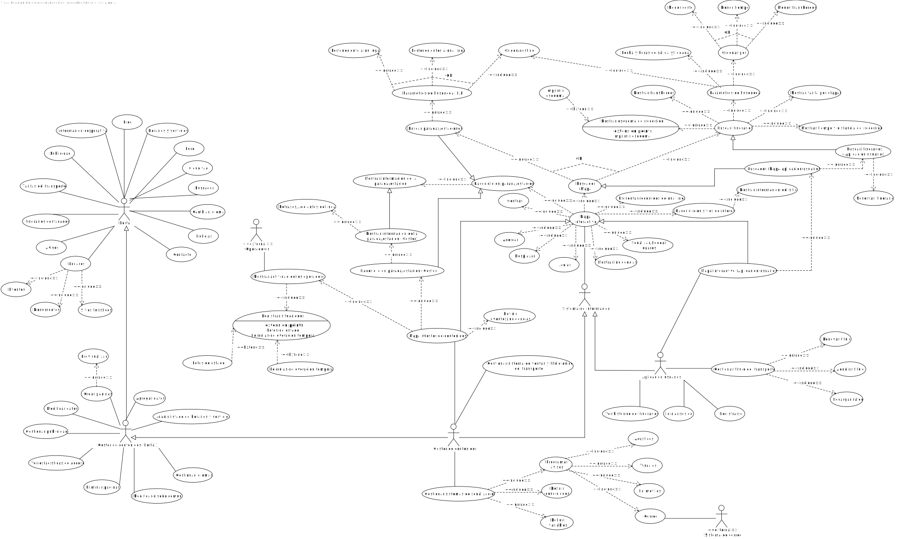

 

[Volver a la página anterior](https://github.com/emg842/INRE-UAL-ROJO-2022)

 

#  Especificación de los requisitos del software

 

##  Hoja de revisión

 

<table align = "center">
    <tr>
        <td><b>Fecha</b></td>
        <td><b>Versión</b></td>
        <td><b>Descripción</b></td>
        <td><b>Autor</b></td>
    </tr>
    <tr>
        <td>06/12/2022</td>
        <td>1.0</td>
        <td>Realización del DCU general</td>
        <td>Manuel Vallecillos Escobosa</td>
    </tr>
    <tr>
        <td>10/12/2022</td>
        <td>1.0</td>
        <td>Realización tablas requisitos funcionales</td>
        <td>Miguel Ángel Moncada Álvarez</td>
    </tr>
    <tr>
        <td>10/12/2022</td>
        <td>1.0</td>
        <td>Corrección tablas requisitos funcionales</td>
        <td>Miguel Ángel Moncada Álvarez</td>
    </tr>
    <tr>
        <td>10/12/2022</td>
        <td>1.0</td>
        <td>Corrección tablas requisitos funcionales</td>
        <td>Miguel Ángel Moncada Álvarez</td>
    </tr>
    <tr>
        <td>10/12/2022</td>
        <td>1.0</td>
        <td>Actualizar progreso en la Hoja de revisión</td>
        <td>Miguel Ángel Moncada Álvarez</td>
    </tr>
    <tr>
        <td>11/12/2022</td>
        <td>1.0</td>
        <td>Actualización del DCU general</td>
        <td>Manuel Vallecillos Escobosa</td>
    </tr>
    <tr>
        <td>11/12/2022</td>
        <td>1.0</td>
        <td>Adición de requisitos funcionales1</td>
        <td>Miguel Ángel Moncada Álvarez</td>
    </tr>
        <tr>
        <td>11/12/2022</td>
        <td>1.0</td>
        <td>Adición de requisitos No funcionales</td>
        <td>Miguel Ángel Moncada Álvarez</td>
    </tr>
    </tr>
        <tr>
        <td>13/12/2022</td>
        <td>1.0</td>
        <td>Introducción y objetivos de negocio</td>
        <td>Daniel López García</td>
    </tr>
    
</table>

  

##  Contenidos

 

[Hoja de revisión](#hojaderevision) 
[Contenidos](#contenidos) 
[1. &nbsp;&nbsp;&nbsp;&nbsp; Introducción](#introduccion) 
[2. &nbsp;&nbsp;&nbsp;&nbsp; Información del dominio del problema [opcional]](#informaciondeldominiodelproblema) 
    &nbsp;&nbsp;&nbsp;&nbsp;&nbsp;&nbsp;&nbsp;&nbsp; [2.1. &nbsp;&nbsp;&nbsp;&nbsp; Organigrama](#organigrama) 
    &nbsp;&nbsp;&nbsp;&nbsp;&nbsp;&nbsp;&nbsp;&nbsp; [2.2. &nbsp;&nbsp;&nbsp;&nbsp; Glosario de términos](#glosariodeterminos) 
[3. &nbsp;&nbsp;&nbsp;&nbsp; Necesidades del negocio](#necesidadesdelnegocio) 
    &nbsp;&nbsp;&nbsp;&nbsp;&nbsp;&nbsp;&nbsp;&nbsp; [3.1. &nbsp;&nbsp;&nbsp;&nbsp; Objetivos del negocio](#objetivosdelnegocio) 
    &nbsp;&nbsp;&nbsp;&nbsp;&nbsp;&nbsp;&nbsp;&nbsp; [3.2. &nbsp;&nbsp;&nbsp;&nbsp; Modelos de Procesos de Negocio [opcional]](#modelosdeprocesosdenegocio) 
        &nbsp;&nbsp;&nbsp;&nbsp;&nbsp;&nbsp;&nbsp;&nbsp;&nbsp;&nbsp;&nbsp;&nbsp;&nbsp;&nbsp;&nbsp;&nbsp;&nbsp;&nbsp;&nbsp;&nbsp; [Subprocesos](#subprocesos) 
        &nbsp;&nbsp;&nbsp;&nbsp;&nbsp;&nbsp;&nbsp;&nbsp;&nbsp;&nbsp;&nbsp;&nbsp;&nbsp;&nbsp;&nbsp;&nbsp;&nbsp;&nbsp;&nbsp;&nbsp; [Tareas](#tareas) 
[4. &nbsp;&nbsp;&nbsp;&nbsp; Requisitos del sistema a desarrollar](#requisitosdelsistemaadesarrollar) 
    &nbsp;&nbsp;&nbsp;&nbsp;&nbsp;&nbsp;&nbsp;&nbsp; [4.1. &nbsp;&nbsp;&nbsp;&nbsp; Requisitos](#requisitos) 
        &nbsp;&nbsp;&nbsp;&nbsp;&nbsp;&nbsp;&nbsp;&nbsp;&nbsp;&nbsp;&nbsp;&nbsp;&nbsp;&nbsp;&nbsp;&nbsp;&nbsp;&nbsp;&nbsp;&nbsp; [Requisitos funcionales](#requisitosfuncionales) 
        &nbsp;&nbsp;&nbsp;&nbsp;&nbsp;&nbsp;&nbsp;&nbsp;&nbsp;&nbsp;&nbsp;&nbsp;&nbsp;&nbsp;&nbsp;&nbsp;&nbsp;&nbsp;&nbsp;&nbsp; [Requisitos no funcionales](#requisitosnofuncionales) 
        &nbsp;&nbsp;&nbsp;&nbsp;&nbsp;&nbsp;&nbsp;&nbsp;&nbsp;&nbsp;&nbsp;&nbsp;&nbsp;&nbsp;&nbsp;&nbsp;&nbsp;&nbsp;&nbsp;&nbsp; [Requisitos de información](#requisitosdeinformacion) 
    &nbsp;&nbsp;&nbsp;&nbsp;&nbsp;&nbsp;&nbsp;&nbsp; [4.2. &nbsp;&nbsp;&nbsp;&nbsp; Casos de uso](#casosdeuso) 
        &nbsp;&nbsp;&nbsp;&nbsp;&nbsp;&nbsp;&nbsp;&nbsp;&nbsp;&nbsp;&nbsp;&nbsp;&nbsp;&nbsp;&nbsp;&nbsp;&nbsp;&nbsp;&nbsp;&nbsp; [Lista de diagramas de casos de uso del modelo](#listadediagramasdecasosdeusodelmodelo) 
        &nbsp;&nbsp;&nbsp;&nbsp;&nbsp;&nbsp;&nbsp;&nbsp;&nbsp;&nbsp;&nbsp;&nbsp;&nbsp;&nbsp;&nbsp;&nbsp;&nbsp;&nbsp;&nbsp;&nbsp; [Diagramas de casos de uso](#diagramasdecasosdeuso) 
        &nbsp;&nbsp;&nbsp;&nbsp;&nbsp;&nbsp;&nbsp;&nbsp;&nbsp;&nbsp;&nbsp;&nbsp;&nbsp;&nbsp;&nbsp;&nbsp;&nbsp;&nbsp;&nbsp;&nbsp; [Lista general de casos de uso del proyecto](#listageneraldecasosdeusodelproyecto) 
        &nbsp;&nbsp;&nbsp;&nbsp;&nbsp;&nbsp;&nbsp;&nbsp;&nbsp;&nbsp;&nbsp;&nbsp;&nbsp;&nbsp;&nbsp;&nbsp;&nbsp;&nbsp;&nbsp;&nbsp; [Lista general de actores del proyecto](#listageneraldeactoresdelproyecto) 
        &nbsp;&nbsp;&nbsp;&nbsp;&nbsp;&nbsp;&nbsp;&nbsp;&nbsp;&nbsp;&nbsp;&nbsp;&nbsp;&nbsp;&nbsp;&nbsp;&nbsp;&nbsp;&nbsp;&nbsp; [Detalle de los casos de uso](#detalledeloscasosdeuso) 
    &nbsp;&nbsp;&nbsp;&nbsp;&nbsp;&nbsp;&nbsp;&nbsp; [4.3. &nbsp;&nbsp;&nbsp;&nbsp; Diagramas de clases asociados a los requisitos de información](#diagramasdeclasesasociadosalosrequisitosdeinformacion) 
[Apéndices](#apendices)

  

##  1. Introducción

 

Una vez leido el pliego de las condiciones hemos decicido abarcar este proyecto para crear dos aplicaciones para favorecer y facilitar el uso de transporte público de las Islas Canarias. Para ello nos hemos preparado una entrevista (ver anexo) con un usuario habitual para aclarar algunas dudas que nos han surgido al grupo durante el planteamiento inicial del proyecto. Una vez terminada nos disponemos a crear un archivo con nuestra propuesta documentada de las aplicaciones del pliego inicial  

 
 

##  2. Información del Dominio del problema [opcional]

 

###  2.1. Organigrama

 

Organigrama

 

###  2.2. Glosario de términos

 

<table align = "center">
    <tr>
        <td><b>Término</b></td>
        <td><b>Descripción</b></td>
    </tr>
    <tr>
        <td>término</td>
        <td>descripción</td>
    </tr>
    <tr>
        <td>término</td>
        <td>descripción</td>
    </tr>
    <tr>
        <td>término</td>
        <td>descripción</td>
    </tr>
</table>

  

##  3. Necesidades del negocio

 

###  3.1. Objetivos del negocio

 

Como ya hemos visto la intención de este proyecto es la de crear dos aplicaciones, una aplicación que nos muestre información sobre eventos, rutas de autobúses, noticias e itinerarios de las islas y otra aplicación que llevara una pasarela de pago implementada para poder comprar billetes y reservar itinerarios. Nuestro propósito es el de crear ambas aplicaciones con una experiencia de usuario sencilla pero eficientes para que sea accesible a la mayoría de usuarios.

 

###  3.2. Modelos de Procesos de Negocio [opcional]

 

###  Subprocesos

 

<table align = "center">
    <tr>
        <td><b>Nombre</b></td>
        <td><b>Descripción</b></td>
    </tr>
    <tr>
        <td>nombre</td>
        <td>descripción</td>
    </tr>
    <tr>
        <td>nombre</td>
        <td>descripción</td>
    </tr>
    <tr>
        <td>nombre</td>
        <td>descripción</td>
    </tr>
</table>

 

###  Tareas

 

<table align = "center">
    <tr>
        <td><b>Nombre</b></td>
        <td><b>Descripción</b></td>
    </tr>
    <tr>
        <td>nombre</td>
        <td>descripción</td>
    </tr>
    <tr>
        <td>nombre</td>
        <td>descripción</td>
    </tr>
    <tr>
        <td>nombre</td>
        <td>descripción</td>
    </tr>
</table>

  

##  4. Requisitos del sistema a desarrollar

 

###  4.1. Requisitos

 

###  Requisitos funcionales

 

<table align = "center">
<tr>
    <td><b>FR-01:</b></td>
    <td>Acceder al blog</td>
</tr>
<tr>
    <td><b>Versión:</b></td>
    <td>1.0 (Diciembre-2022)</td>
</tr>
<tr>
    <td><b>Autor:</b></td>
    <td>Manuel Vallecillos Escobosa</td>
</tr>
<tr>
    <td><b>Fuentes:</b></td>
    <td>Pliego de condiciones y entrevista</td>
</tr>
<tr>
    <td><b>Referencias:</b></td>
    <td>Identificadores de casos de uso, de requisitos funcionales, no funcionales y de requisitos información del sistema</td>
</tr>
<tr>
    <td><b>Actores:</b></td>
    <td>ACT-01, ACT-02 </td>
</tr>
<tr>
    <td><b>Descripción:</b></td>
    <td>El sistema ofrece acceso al blog con información a cerca del transporte en Gran Canaria</td>
</tr>
<tr>
    <td><b>Importancia:</b></td>
    <td>Muy elevada</td>
</tr>
<tr>
    <td><b>Estado:</b></td>
    <td>Aceptado</td>
</tr>
<tr>
    <td><b>Comentarios:</b></td>
    <td></td>
</tr>
</table>

 

<table align = "center">
<tr>
    <td><b>FR-02:</b></td>
    <td>Acceder al foro</td>
</tr>
<tr>
    <td><b>Versión:</b></td>
    <td>1.0 (Diciembre-2022)</td>
</tr>
<tr>
    <td><b>Autor:</b></td>
    <td>Manuel Vallecillos Escobosa</td>
</tr>
<tr>
    <td><b>Fuentes:</b></td>
    <td>Pliego de condiciones y entrevista</td>
</tr>
<tr>
    <td><b>Referencias:</b></td>
    <td>Identificadores de casos de uso, de requisitos funcionales, no funcionales y de requisitos información del sistema</td>
</tr>
<tr>
    <td><b>Actores:</b></td>
    <td>ACT-01, ACT-02 </td>
</tr>
<tr>
    <td><b>Descripción:</b></td>
    <td>El sistema ofrece acceso al foro de la página donde se podrá comentar a cerca de la situación del transporte, rutas, servicios ofrecidos, etc </td>
</tr>
<tr>
    <td><b>Importancia:</b></td>
    <td>Muy elevada</td>
</tr>
<tr>
    <td><b>Estado:</b></td>
    <td>Aceptado</td>
</tr>
<tr>
    <td><b>Comentarios:</b></td>
    <td></td>
</tr>
</table>

 

<table align = "center">
<tr>
    <td><b>FR-03:</b></td>
    <td>Acceder a cloud tag</td>
</tr>
<tr>
    <td><b>Versión:</b></td>
    <td>1.0 (Diciembre-2022)</td>
</tr>
<tr>
    <td><b>Autor:</b></td>
    <td>Manuel Vallecillos Escobosa</td>
</tr>
<tr>
    <td><b>Fuentes:</b></td>
    <td>Pliego de condiciones y entrevista</td>
</tr>
<tr>
    <td><b>Referencias:</b></td>
    <td>Identificadores de casos de uso, de requisitos funcionales, no funcionales y de requisitos información del sistema</td>
</tr>
<tr>
    <td><b>Actores:</b></td>
    <td>ACT-01, ACT-02 </td>
</tr>
<tr>
    <td><b>Descripción:</b></td>
    <td>Ofrece de forma gráfica acceso a las funcionalidades de la página a través de etiquetas visuales en la nube</td>
</tr>
<tr>
    <td><b>Importancia:</b></td>
    <td>Muy elevada</td>
</tr>
<tr>
    <td><b>Estado:</b></td>
    <td>Aceptado</td>
</tr>
<tr>
    <td><b>Comentarios:</b></td>
    <td></td>
</tr>
</table>

 

<table align = "center">
<tr>
    <td><b>FR-04:</b></td>
    <td>Buscador (Portal)</td>
</tr>
<tr>
    <td><b>Versión:</b></td>
    <td>1.0 (Diciembre-2022)</td>
</tr>
<tr>
    <td><b>Autor:</b></td>
    <td>Manuel Vallecillos Escobosa</td>
</tr>
<tr>
    <td><b>Fuentes:</b></td>
    <td>Pliego de condiciones y entrevista</td>
</tr>
<tr>
    <td><b>Referencias:</b></td>
    <td>Identificadores de casos de uso, de requisitos funcionales, no funcionales y de requisitos información del sistema</td>
</tr>
<tr>
    <td><b>Actores:</b></td>
    <td>ACT-01, ACT-02 </td>
</tr>
<tr>
    <td><b>Descripción:</b></td>
    <td>Permitirá la localización de cualquier contenido mediante la 
introducción de términos clave</td>
</tr>
<tr>
    <td><b>Importancia:</b></td>
    <td>Muy elevada</td>
</tr>
<tr>
    <td><b>Estado:</b></td>
    <td>Aceptado</td>
</tr>
<tr>
    <td><b>Comentarios:</b></td>
    <td>- En las búsquedas no se diferenciarán las palabras con o sin acento, mayúsculas o minúsculas. 
- Dispondrá de opciones que permitan la parametrización de las búsquedas considerando características como el idioma, secciones del sitio, etc </td>
</tr>
</table>

 

<table align = "center">
<tr>
    <td><b>FR-05:</b></td>
    <td>Ver noticias</td>
</tr>
<tr>
    <td><b>Versión:</b></td>
    <td>1.0 (Diciembre-2022)</td>
</tr>
<tr>
    <td><b>Autor:</b></td>
    <td>Manuel Vallecillos Escobosa</td>
</tr>
<tr>
    <td><b>Fuentes:</b></td>
    <td>Pliego de condiciones y entrevista</td>
</tr>
<tr>
    <td><b>Referencias:</b></td>
    <td>Identificadores de casos de uso, de requisitos funcionales, no funcionales y de requisitos información del sistema</td>
</tr>
<tr>
    <td><b>Actores:</b></td>
    <td>ACT-01, ACT-02 </td>
</tr>
<tr>
    <td><b>Descripción:</b></td>
    <td>Ofrece la posibilidad de ver las noticias acerca de eventos en Gran Canaria y la disponibilidad del transporte </td>
</tr>
<tr>
    <td><b>Importancia:</b></td>
    <td>Muy elevada</td>
</tr>
<tr>
    <td><b>Estado:</b></td>
    <td>Aceptado</td>
</tr>
<tr>
    <td><b>Comentarios:</b></td>
    <td></td>
</tr>
</table>

 

<table align = "center">
<tr>
    <td><b>FR-06:</b></td>
    <td>Contactar con el equipo de la aplicación</td>
</tr>
<tr>
    <td><b>Versión:</b></td>
    <td>1.0 (Diciembre-2022)</td>
</tr>
<tr>
    <td><b>Autor:</b></td>
    <td>Manuel Vallecillos Escobosa</td>
</tr>
<tr>
    <td><b>Fuentes:</b></td>
    <td>Pliego de condiciones y entrevista</td>
</tr>
<tr>
    <td><b>Referencias:</b></td>
    <td>Identificadores de casos de uso, de requisitos funcionales, no funcionales y de requisitos información del sistema</td>
</tr>
<tr>
    <td><b>Actores:</b></td>
    <td>ACT-01, ACT-02 </td>
</tr>
<tr>
    <td><b>Descripción:</b></td>
    <td>Da la posibilidad de contactar ya sea a través del correo o de un número de teléfono</td>
</tr>
<tr>
    <td><b>Importancia:</b></td>
    <td>Muy elevada</td>
</tr>
<tr>
    <td><b>Estado:</b></td>
    <td>Aceptado</td>
</tr>
<tr>
    <td><b>Comentarios:</b></td>
    <td></td>
</tr>
</table>

 

<table align = "center">
<tr>
    <td><b>FR-07:</b></td>
    <td>Buscar eventos</td>
</tr>
<tr>
    <td><b>Versión:</b></td>
    <td>1.0 (Diciembre-2022)</td>
</tr>
<tr>
    <td><b>Autor:</b></td>
    <td>Manuel Vallecillos Escobosa</td>
</tr>
<tr>
    <td><b>Fuentes:</b></td>
    <td>Pliego de condiciones y entrevista</td>
</tr>
<tr>
    <td><b>Referencias:</b></td>
    <td>Identificadores de casos de uso, de requisitos funcionales, no funcionales y de requisitos información del sistema</td>
</tr>
<tr>
    <td><b>Actores:</b></td>
    <td>ACT-01, ACT-02 </td>
</tr>
<tr>
    <td><b>Descripción:</b></td>
    <td>Permite buscar a cerca de eventos y lugares de ocio en la isla</td>
</tr>
<tr>
    <td><b>Importancia:</b></td>
    <td>Muy elevada</td>
</tr>
<tr>
    <td><b>Estado:</b></td>
    <td>Aceptado</td>
</tr>
<tr>
    <td><b>Comentarios:</b></td>
    <td></td>
</tr>
</table>

 

<table align = "center">
<tr>
    <td><b>FR-08:</b></td>
    <td>Buscar monumentos</td>
</tr>
<tr>
    <td><b>Versión:</b></td>
    <td>1.0 (Diciembre-2022)</td>
</tr>
<tr>
    <td><b>Autor:</b></td>
    <td>Manuel Vallecillos Escobosa</td>
</tr>
<tr>
    <td><b>Fuentes:</b></td>
    <td>Pliego de condiciones y entrevista</td>
</tr>
<tr>
    <td><b>Referencias:</b></td>
    <td>Identificadores de casos de uso, de requisitos funcionales, no funcionales y de requisitos información del sistema</td>
</tr>
<tr>
    <td><b>Actores:</b></td>
    <td>ACT-01, ACT-02 </td>
</tr>
<tr>
    <td><b>Descripción:</b></td>
    <td>Permite buscar monumentos en la isla</td>
</tr>
<tr>
    <td><b>Importancia:</b></td>
    <td>Muy elevada</td>
</tr>
<tr>
    <td><b>Estado:</b></td>
    <td>Aceptado</td>
</tr>
<tr>
    <td><b>Comentarios:</b></td>
    <td></td>
</tr>
</table>

 

<table align = "center">
<tr>
    <td><b>FR-09:</b></td>
    <td>Ver horarios de las líneas</td>
</tr>
<tr>
    <td><b>Versión:</b></td>
    <td>1.0 (Diciembre-2022)</td>
</tr>
<tr>
    <td><b>Autor:</b></td>
    <td>Manuel Vallecillos Escobosa</td>
</tr>
<tr>
    <td><b>Fuentes:</b></td>
    <td>Pliego de condiciones y entrevista</td>
</tr>
<tr>
    <td><b>Referencias:</b></td>
    <td>Identificadores de casos de uso, de requisitos funcionales, no funcionales y de requisitos información del sistema</td>
</tr>
<tr>
    <td><b>Actores:</b></td>
    <td>ACT-01, ACT-02 </td>
</tr>
<tr>
    <td><b>Descripción:</b></td>
    <td>Muestra la hora a la que pasa un determinado transporte por una determinada parada de la línea que se esté consultando</td>
</tr>
<tr>
    <td><b>Importancia:</b></td>
    <td>Muy elevada</td>
</tr>
<tr>
    <td><b>Estado:</b></td>
    <td>Aceptado</td>
</tr>
<tr>
    <td><b>Comentarios:</b></td>
    <td></td>
</tr>
</table>

 

<table align = "center">
<tr>
    <td><b>FR-10:</b></td>
    <td>Ver incidencias</td>
</tr>
<tr>
    <td><b>Versión:</b></td>
    <td>1.0 (Diciembre-2022)</td>
</tr>
<tr>
    <td><b>Autor:</b></td>
    <td>Manuel Vallecillos Escobosa</td>
</tr>
<tr>
    <td><b>Fuentes:</b></td>
    <td>Pliego de condiciones y entrevista</td>
</tr>
<tr>
    <td><b>Referencias:</b></td>
    <td>Identificadores de casos de uso, de requisitos funcionales, no funcionales y de requisitos información del sistema</td>
</tr>
<tr>
    <td><b>Actores:</b></td>
    <td>ACT-01, ACT-02 </td>
</tr>
<tr>
    <td><b>Descripción:</b></td>
    <td>Ofrece una lista de las incidencias del transporte actuales</td>
</tr>
<tr>
    <td><b>Importancia:</b></td>
    <td>Muy elevada</td>
</tr>
<tr>
    <td><b>Estado:</b></td>
    <td>Aceptado</td>
</tr>
<tr>
    <td><b>Comentarios:</b></td>
    <td></td>
</tr>
</table>

 

<table align = "center">
<tr>
    <td><b>FR-11:</b></td>
    <td>Ver itinerarios más concurridos</td>
</tr>
<tr>
    <td><b>Versión:</b></td>
    <td>1.0 (Diciembre-2022)</td>
</tr>
<tr>
    <td><b>Autor:</b></td>
    <td>Manuel Vallecillos Escobosa</td>
</tr>
<tr>
    <td><b>Fuentes:</b></td>
    <td>Pliego de condiciones y entrevista</td>
</tr>
<tr>
    <td><b>Referencias:</b></td>
    <td>Identificadores de casos de uso, de requisitos funcionales, no funcionales y de requisitos información del sistema</td>
</tr>
<tr>
    <td><b>Actores:</b></td>
    <td>ACT-01, ACT-02 </td>
</tr>
<tr>
    <td><b>Descripción:</b></td>
    <td>Ofrece una lista de los itinerarios más concurridos</td>
</tr>
<tr>
    <td><b>Importancia:</b></td>
    <td>Muy elevada</td>
</tr>
<tr>
    <td><b>Estado:</b></td>
    <td>Aceptado</td>
</tr>
<tr>
    <td><b>Comentarios:</b></td>
    <td></td>
</tr>
</table>

 

<table align = "center">
<tr>
    <td><b>FR-12:</b></td>
    <td>Ir al inicio</td>
</tr>
<tr>
    <td><b>Versión:</b></td>
    <td>1.0 (Diciembre-2022)</td>
</tr>
<tr>
    <td><b>Autor:</b></td>
    <td>Manuel Vallecillos Escobosa</td>
</tr>
<tr>
    <td><b>Fuentes:</b></td>
    <td>Pliego de condiciones y entrevista</td>
</tr>
<tr>
    <td><b>Referencias:</b></td>
    <td>Identificadores de casos de uso, de requisitos funcionales, no funcionales y de requisitos información del sistema</td>
</tr>
<tr>
    <td><b>Actores:</b></td>
    <td>ACT-01, ACT-02 </td>
</tr>
<tr>
    <td><b>Descripción:</b></td>
    <td>Redirige a la vista inicial del portal</td>
</tr>
<tr>
    <td><b>Importancia:</b></td>
    <td>Muy elevada</td>
</tr>
<tr>
    <td><b>Estado:</b></td>
    <td>Aceptado</td>
</tr>
<tr>
    <td><b>Comentarios:</b></td>
    <td></td>
</tr>
</table>

 

<table align = "center">
<tr>
    <td><b>FR-13:</b></td>
    <td>Ver tarifas/bonos</td>
</tr>
<tr>
    <td><b>Versión:</b></td>
    <td>1.0 (Diciembre-2022)</td>
</tr>
<tr>
    <td><b>Autor:</b></td>
    <td>Manuel Vallecillos Escobosa</td>
</tr>
<tr>
    <td><b>Fuentes:</b></td>
    <td>Pliego de condiciones y entrevista</td>
</tr>
<tr>
    <td><b>Referencias:</b></td>
    <td>Identificadores de casos de uso, de requisitos funcionales, no funcionales y de requisitos información del sistema</td>
</tr>
<tr>
    <td><b>Actores:</b></td>
    <td>ACT-01, ACT-02 </td>
</tr>
<tr>
    <td><b>Descripción:</b></td>
    <td>Ofrece una vista de las distintas tarifas y bonos disponibles para transportarnos por la isla</td>
</tr>
<tr>
    <td><b>Importancia:</b></td>
    <td>Muy elevada</td>
</tr>
<tr>
    <td><b>Estado:</b></td>
    <td>Aceptado</td>
</tr>
<tr>
    <td><b>Comentarios:</b></td>
    <td></td>
</tr>
</table>

 

<table align = "center">
<tr>
    <td><b>FR-14:</b></td>
    <td>Mostrar publicidad</td>
</tr>
<tr>
    <td><b>Versión:</b></td>
    <td>1.0 (Diciembre-2022)</td>
</tr>
<tr>
    <td><b>Autor:</b></td>
    <td>Manuel Vallecillos Escobosa</td>
</tr>
<tr>
    <td><b>Fuentes:</b></td>
    <td>Pliego de condiciones y entrevista</td>
</tr>
<tr>
    <td><b>Referencias:</b></td>
    <td>Identificadores de casos de uso, de requisitos funcionales, no funcionales y de requisitos información del sistema</td>
</tr>
<tr>
    <td><b>Actores:</b></td>
    <td>ACT-01, ACT-02 </td>
</tr>
<tr>
    <td><b>Descripción:</b></td>
    <td>Aparecen anuncios a cerca del transporte o de distintos eventos o noticias en la isla</td>
</tr>
<tr>
    <td><b>Importancia:</b></td>
    <td>Muy elevada</td>
</tr>
<tr>
    <td><b>Estado:</b></td>
    <td>Aceptado</td>
</tr>
<tr>
    <td><b>Comentarios:</b></td>
    <td></td>
</tr>
</table>

 

<table align = "center">
<tr>
    <td><b>FR-15:</b></td>
    <td>Ver información corporativa</td>
</tr>
<tr>
    <td><b>Versión:</b></td>
    <td>1.0 (Diciembre-2022)</td>
</tr>
<tr>
    <td><b>Autor:</b></td>
    <td>Manuel Vallecillos Escobosa</td>
</tr>
<tr>
    <td><b>Fuentes:</b></td>
    <td>Pliego de condiciones y entrevista</td>
</tr>
<tr>
    <td><b>Referencias:</b></td>
    <td>Identificadores de casos de uso, de requisitos funcionales, no funcionales y de requisitos información del sistema</td>
</tr>
<tr>
    <td><b>Actores:</b></td>
    <td>ACT-01, ACT-02 </td>
</tr>
<tr>
    <td><b>Descripción:</b></td>
    <td>Ofrece la información corporativa del ayuntamiento de Gran Canaria</td>
</tr>
<tr>
    <td><b>Importancia:</b></td>
    <td>Muy elevada</td>
</tr>
<tr>
    <td><b>Estado:</b></td>
    <td>Aceptado</td>
</tr>
<tr>
    <td><b>Comentarios:</b></td>
    <td></td>
</tr>
</table>

 

<table align = "center">
<tr>
    <td><b>FR-16:</b></td>
    <td>Buscador de itinerarios (Mapa interactivo)</td>
</tr>
<tr>
    <td><b>Versión:</b></td>
    <td>1.0 (Diciembre-2022)</td>
</tr>
<tr>
    <td><b>Autor:</b></td>
    <td>Manuel Vallecillos Escobosa</td>
</tr>
<tr>
    <td><b>Fuentes:</b></td>
    <td>Pliego de condiciones y entrevista</td>
</tr>
<tr>
    <td><b>Referencias:</b></td>
    <td>Identificadores de casos de uso, de requisitos funcionales, no funcionales y de requisitos información del sistema</td>
</tr>
<tr>
    <td><b>Actores:</b></td>
    <td>ACT-01, ACT-02 </td>
</tr>
<tr>
    <td><b>Descripción:</b></td>
    <td>Realiza la búsqueda y nos indica en el mapa interactivo el itinerario seleccionado</td>
</tr>
<tr>
    <td><b>Importancia:</b></td>
    <td>Muy elevada</td>
</tr>
<tr>
    <td><b>Estado:</b></td>
    <td>Aceptado</td>
</tr>
<tr>
    <td><b>Comentarios:</b></td>
    <td>La búsqueda debe de realizarse en menos de 100ms</td>
</tr>
</table>

 

<table align = "center">
<tr>
    <td><b>FR-17:</b></td>
    <td>Seleccionar orden de itinerarios buscados</td>
</tr>
<tr>
    <td><b>Versión:</b></td>
    <td>1.0 (Diciembre-2022)</td>
</tr>
<tr>
    <td><b>Autor:</b></td>
    <td>Manuel Vallecillos Escobosa</td>
</tr>
<tr>
    <td><b>Fuentes:</b></td>
    <td>Pliego de condiciones y entrevista</td>
</tr>
<tr>
    <td><b>Referencias:</b></td>
    <td>Identificadores de casos de uso, de requisitos funcionales, no funcionales y de requisitos información del sistema</td>
</tr>
<tr>
    <td><b>Actores:</b></td>
    <td>ACT-01, ACT-02 </td>
</tr>
<tr>
    <td><b>Descripción:</b></td>
    <td>Ordena los itinerarios coincidentes en base al criterio escogido</td>
</tr>
<tr>
    <td><b>Importancia:</b></td>
    <td>Muy elevada</td>
</tr>
<tr>
    <td><b>Estado:</b></td>
    <td>Aceptado</td>
</tr>
<tr>
    <td><b>Comentarios:</b></td>
    <td>Podremos ordenar los itinerarios en base a: 
    - Fecha 
    - Horas de salida y llegada 
    - Tiempo de transporte 
    - Coste del transporte 
    - Nº de transbordos</td>
</tr>
</table>

 

<table align = "center">
<tr>
    <td><b>FR-18:</b></td>
    <td>Seleccionar origen-destino</td>
</tr>
<tr>
    <td><b>Actores:</b></td>
    <td>ACT-01, ACT-02 </td>
</tr>
<tr>
    <td><b>Versión:</b></td>
    <td>1.0 (Diciembre-2022)</td>
</tr>
<tr>
    <td><b>Autor:</b></td>
    <td>Manuel Vallecillos Escobosa</td>
</tr>
<tr>
    <td><b>Fuentes:</b></td>
    <td>Pliego de condiciones y entrevista</td>
</tr>
<tr>
    <td><b>Referencias:</b></td>
    <td>Identificadores de casos de uso, de requisitos funcionales, no funcionales y de requisitos información del sistema</td>
</tr>
<tr>
    <td><b>Actores:</b></td>
    <td>ACT-01, ACT-02 </td>
</tr>
<tr>
    <td><b>Descripción:</b></td>
    <td>Selección del origen y el destino del itinerario</td>
</tr>
<tr>
    <td><b>Importancia:</b></td>
    <td>Muy elevada</td>
</tr>
<tr>
    <td><b>Estado:</b></td>
    <td>Aceptado</td>
</tr>
<tr>
    <td><b>Comentarios:</b></td>
    <td></td>
</tr>
</table>

 

<table align = "center">
<tr>
    <td><b>FR-19:</b></td>
    <td>Mostrar tarifa del itinerario</td>
</tr>
<tr>
    <td><b>Versión:</b></td>
    <td>1.0 (Diciembre-2022)</td>
</tr>
<tr>
    <td><b>Autor:</b></td>
    <td>Manuel Vallecillos Escobosa</td>
</tr>
<tr>
    <td><b>Fuentes:</b></td>
    <td>Pliego de condiciones y entrevista</td>
</tr>
<tr>
    <td><b>Referencias:</b></td>
    <td>Identificadores de casos de uso, de requisitos funcionales, no funcionales y de requisitos información del sistema</td>
</tr>
<tr>
    <td><b>Actores:</b></td>
    <td>ACT-01, ACT-02 </td>
</tr>
<tr>
    <td><b>Descripción:</b></td>
    <td>Muestra la tarifa del itinerario en cuestión</td>
</tr>
<tr>
    <td><b>Importancia:</b></td>
    <td>Muy elevada</td>
</tr>
<tr>
    <td><b>Estado:</b></td>
    <td>Aceptado</td>
</tr>
<tr>
    <td><b>Comentarios:</b></td>
    <td></td>
</tr>
</table>

 

<table align = "center">
<tr>
    <td><b>FR-20:</b></td>
    <td>Mostrar esquema del recorrido</td>
</tr>
<tr>
    <td><b>Versión:</b></td>
    <td>1.0 (Diciembre-2022)</td>
</tr>
<tr>
    <td><b>Autor:</b></td>
    <td>Manuel Vallecillos Escobosa</td>
</tr>
<tr>
    <td><b>Fuentes:</b></td>
    <td>Pliego de condiciones y entrevista</td>
</tr>
<tr>
    <td><b>Referencias:</b></td>
    <td>Identificadores de casos de uso, de requisitos funcionales, no funcionales y de requisitos información del sistema</td>
</tr>
<tr>
    <td><b>Actores:</b></td>
    <td>ACT-01, ACT-02 </td>
</tr>
<tr>
    <td><b>Descripción:</b></td>
    <td>Muestra un esquema del recorrido correspondiente al itinerario en cuestión</td>
</tr>
<tr>
    <td><b>Importancia:</b></td>
    <td>Muy elevada</td>
</tr>
<tr>
    <td><b>Estado:</b></td>
    <td>Aceptado</td>
</tr>
<tr>
    <td><b>Comentarios:</b></td>
    <td></td>
</tr>
</table>

 

<table align = "center">
<tr>
    <td><b>FR-21:</b></td>
    <td>Imprimir esquema del recorrido</td>
</tr>
<tr>
    <td><b>Versión:</b></td>
    <td>1.0 (Diciembre-2022)</td>
</tr>
<tr>
    <td><b>Autor:</b></td>
    <td>Manuel Vallecillos Escobosa</td>
</tr>
<tr>
    <td><b>Fuentes:</b></td>
    <td>Pliego de condiciones y entrevista</td>
</tr>
<tr>
    <td><b>Referencias:</b></td>
    <td>Identificadores de casos de uso, de requisitos funcionales, no funcionales y de requisitos información del sistema</td>
</tr>
<tr>
    <td><b>Actores:</b></td>
    <td>ACT-01, ACT-02 </td>
</tr>
<tr>
    <td><b>Descripción:</b></td>
    <td>Imprime el esquema del recorrido</td>
</tr>
<tr>
    <td><b>Importancia:</b></td>
    <td>Muy elevada</td>
</tr>
<tr>
    <td><b>Estado:</b></td>
    <td>Aceptado</td>
</tr>
<tr>
    <td><b>Comentarios:</b></td>
    <td></td>
</tr>
</table>

 

<table align = "center">
<tr>
    <td><b>FR-22:</b></td>
    <td>Buscador de paradas/estaciones (Mapa interactivo)</td>
</tr>
<tr>
    <td><b>Versión:</b></td>
    <td>1.0 (Diciembre-2022)</td>
</tr>
<tr>
    <td><b>Autor:</b></td>
    <td>Manuel Vallecillos Escobosa</td>
</tr>
<tr>
    <td><b>Fuentes:</b></td>
    <td>Pliego de condiciones y entrevista</td>
</tr>
<tr>
    <td><b>Referencias:</b></td>
    <td>Identificadores de casos de uso, de requisitos funcionales, no funcionales y de requisitos información del sistema</td>
</tr>
<tr>
    <td><b>Actores:</b></td>
    <td>ACT-01, ACT-02 </td>
</tr>
<tr>
    <td><b>Descripción:</b></td>
    <td>Realiza una búsqueda de la parada o la estación y se indica en el mapa interactivo</td>
</tr>
<tr>
    <td><b>Importancia:</b></td>
    <td>Muy elevada</td>
</tr>
<tr>
    <td><b>Estado:</b></td>
    <td>Aceptado</td>
</tr>
<tr>
    <td><b>Comentarios:</b></td>
    <td></td>
</tr>
</table>

 

<table align = "center">
<tr>
    <td><b>FR-23:</b></td>
    <td>Seleccionar orden de paradas/estaciones coincidentes</td>
</tr>
<tr>
    <td><b>Versión:</b></td>
    <td>1.0 (Diciembre-2022)</td>
</tr>
<tr>
    <td><b>Autor:</b></td>
    <td>Manuel Vallecillos Escobosa</td>
</tr>
<tr>
    <td><b>Fuentes:</b></td>
    <td>Pliego de condiciones y entrevista</td>
</tr>
<tr>
    <td><b>Referencias:</b></td>
    <td>Identificadores de casos de uso, de requisitos funcionales, no funcionales y de requisitos información del sistema</td>
</tr>
<tr>
    <td><b>Actores:</b></td>
    <td>ACT-01, ACT-02 </td>
</tr>
<tr>
    <td><b>Descripción:</b></td>
    <td>Ordena las paradas/estaciones que se muestran en base a la opción escogida</td>
</tr>
<tr>
    <td><b>Importancia:</b></td>
    <td>Muy elevada</td>
</tr>
<tr>
    <td><b>Estado:</b></td>
    <td>Aceptado</td>
</tr>
<tr>
    <td><b>Comentarios:</b></td>
    <td>- Cercanas a un sitio indicado 
    - Cerca de una línea  
    - Dentro de un municipio 
    - Dentro de una zona/barrio</td>
</tr>
</table>

 

<table align = "center">
<tr>
    <td><b>FR-24:</b></td>
    <td>Interactuar con el mapa</td>
</tr>
<tr>
    <td><b>Versión:</b></td>
    <td>1.0 (Diciembre-2022)</td>
</tr>
<tr>
    <td><b>Autor:</b></td>
    <td>Manuel Vallecillos Escobosa</td>
</tr>
<tr>
    <td><b>Fuentes:</b></td>
    <td>Pliego de condiciones y entrevista</td>
</tr>
<tr>
    <td><b>Referencias:</b></td>
    <td>Identificadores de casos de uso, de requisitos funcionales, no funcionales y de requisitos información del sistema</td>
</tr>
<tr>
    <td><b>Actores:</b></td>
    <td>ACT-01, ACT-02 </td>
</tr>
<tr>
    <td><b>Descripción:</b></td>
    <td>Permite modificar la vista que se tiene del mapa realizando acciones indicadas en comentarios</td>
</tr>
<tr>
    <td><b>Importancia:</b></td>
    <td>Muy elevada</td>
</tr>
<tr>
    <td><b>Estado:</b></td>
    <td>Aceptado</td>
</tr>
<tr>
    <td><b>Comentarios:</b></td>
    <td>Interacciones posibles: 
    - Acercar 
    - Alejar 
    - Desplazar 
    - Centrar 
    - Ver mapa base</td>
</tr>
</table>

 

<table align = "center">
<tr>
    <td><b>FR-25:</b></td>
    <td>Representar recorrido de una línea</td>
</tr>
<tr>
    <td><b>Versión:</b></td>
    <td>1.0 (Diciembre-2022)</td>
</tr>
<tr>
    <td><b>Autor:</b></td>
    <td>Manuel Vallecillos Escobosa</td>
</tr>
<tr>
    <td><b>Fuentes:</b></td>
    <td>Pliego de condiciones y entrevista</td>
</tr>
<tr>
    <td><b>Referencias:</b></td>
    <td>Identificadores de casos de uso, de requisitos funcionales, no funcionales y de requisitos información del sistema</td>
</tr>
<tr>
    <td><b>Actores:</b></td>
    <td>ACT-01, ACT-02 </td>
</tr>
<tr>
    <td><b>Descripción:</b></td>
    <td>Representa el recorrido de la línea en el mapa</td>
</tr>
<tr>
    <td><b>Importancia:</b></td>
    <td>Muy elevada</td>
</tr>
<tr>
    <td><b>Estado:</b></td>
    <td>Aceptado</td>
</tr>
<tr>
    <td><b>Comentarios:</b></td>
    <td></td>
</tr>
</table>

 

<table align = "center">
<tr>
    <td><b>FR-26:</b></td>
    <td>Iniciar sesión</td>
</tr>
<tr>
    <td><b>Versión:</b></td>
    <td>1.0 (Diciembre-2022)</td>
</tr>
<tr>
    <td><b>Autor:</b></td>
    <td>Manuel Vallecillos Escobosa</td>
</tr>
<tr>
    <td><b>Fuentes:</b></td>
    <td>Pliego de condiciones y entrevista</td>
</tr>
<tr>
    <td><b>Referencias:</b></td>
    <td>Identificadores de casos de uso, de requisitos funcionales, no funcionales y de requisitos información del sistema</td>
</tr>
<tr>
    <td><b>Actores:</b></td>
    <td>ACT-01, ACT-02 </td>
</tr>
<tr>
    <td><b>Descripción:</b></td>
    <td>Inicia sesión introduciendo tanto el nombre de usuario como su contraseña</td>
</tr>
<tr>
    <td><b>Importancia:</b></td>
    <td>Muy elevada</td>
</tr>
<tr>
    <td><b>Estado:</b></td>
    <td>Aceptado</td>
</tr>
<tr>
    <td><b>Comentarios:</b></td>
    <td></td>
</tr>
</table>

 

<table align = "center">
<tr>
    <td><b>FR-27:</b></td>
    <td>Renovar tarjeta</td>
</tr>
<tr>
    <td><b>Versión:</b></td>
    <td>1.0 (Diciembre-2022)</td>
</tr>
<tr>
    <td><b>Autor:</b></td>
    <td>Manuel Vallecillos Escobosa</td>
</tr>
<tr>
    <td><b>Fuentes:</b></td>
    <td>Pliego de condiciones y entrevista</td>
</tr>
<tr>
    <td><b>Referencias:</b></td>
    <td>Identificadores de casos de uso, de requisitos funcionales, no funcionales y de requisitos información del sistema</td>
</tr>
<tr>
    <td><b>Actores:</b></td>
    <td>ACT-01, ACT-02 </td>
</tr>
<tr>
    <td><b>Descripción:</b></td>
    <td>Renueva la tarjeta de transporte actual</td>
</tr>
<tr>
    <td><b>Importancia:</b></td>
    <td>Muy elevada</td>
</tr>
<tr>
    <td><b>Estado:</b></td>
    <td>Aceptado</td>
</tr>
<tr>
    <td><b>Comentarios:</b></td>
    <td></td>
</tr>
</table>

 

<table align = "center">
<tr>
    <td><b>FR-28:</b></td>
    <td>Comprar tarjeta de transporte</td>
</tr>
<tr>
    <td><b>Versión:</b></td>
    <td>1.0 (Diciembre-2022)</td>
</tr>
<tr>
    <td><b>Autor:</b></td>
    <td>Manuel Vallecillos Escobosa</td>
</tr>
<tr>
    <td><b>Fuentes:</b></td>
    <td>Pliego de condiciones y entrevista</td>
</tr>
<tr>
    <td><b>Referencias:</b></td>
    <td>Identificadores de casos de uso, de requisitos funcionales, no funcionales y de requisitos información del sistema</td>
</tr>
<tr>
    <td><b>Descripción:</b></td>
    <td>Ofrece la posibilidad de comprar una tarjeta de transporte</td>
</tr>
<tr>
    <td><b>Actores:</b></td>
    <td>ACT-01, ACT-02 </td>
</tr>
<tr>
    <td><b>Importancia:</b></td>
    <td>Muy elevada</td>
</tr>
<tr>
    <td><b>Estado:</b></td>
    <td>Aceptado</td>
</tr>
<tr>
    <td><b>Comentarios:</b></td>
    <td></td>
</tr>
</table>

 

<table align = "center">
<tr>
    <td><b>FR-29:</b></td>
    <td>Representar recorrido de una línea</td>
</tr>
<tr>
    <td><b>Versión:</b></td>
    <td>1.0 (Diciembre-2022)</td>
</tr>
<tr>
    <td><b>Autor:</b></td>
    <td>Manuel Vallecillos Escobosa</td>
</tr>
<tr>
    <td><b>Fuentes:</b></td>
    <td>Pliego de condiciones y entrevista</td>
</tr>
<tr>
    <td><b>Referencias:</b></td>
    <td>Identificadores de casos de uso, de requisitos funcionales, no funcionales y de requisitos información del sistema</td>
</tr>
<tr>
    <td><b>Actores:</b></td>
    <td>ACT-01, ACT-02 </td>
</tr>
<tr>
    <td><b>Descripción:</b></td>
    <td>Recarga el saldo de la tarjeta de transporte adjuntada a la cuenta iniciada</td>
</tr>
<tr>
    <td><b>Importancia:</b></td>
    <td>Muy elevada</td>
</tr>
<tr>
    <td><b>Estado:</b></td>
    <td>Aceptado</td>
</tr>
<tr>
    <td><b>Comentarios:</b></td>
    <td></td>
</tr>
</table>

 

<table align = "center">
<tr>
    <td><b>FR-30:</b></td>
    <td>Representar recorrido de una línea</td>
</tr>
<tr>
    <td><b>Versión:</b></td>
    <td>1.0 (Diciembre-2022)</td>
</tr>
<tr>
    <td><b>Autor:</b></td>
    <td>Manuel Vallecillos Escobosa</td>
</tr>
<tr>
    <td><b>Fuentes:</b></td>
    <td>Pliego de condiciones y entrevista</td>
</tr>
<tr>
    <td><b>Referencias:</b></td>
    <td>Identificadores de casos de uso, de requisitos funcionales, no funcionales y de requisitos información del sistema</td>
</tr>
<tr>
    <td><b>Actores:</b></td>
    <td>ACT-01, ACT-02 </td>
</tr>
<tr>
    <td><b>Descripción:</b></td>
    <td>Representa el recorrido de la línea en el mapa</td>
</tr>
<tr>
    <td><b>Importancia:</b></td>
    <td>Muy elevada</td>
</tr>
<tr>
    <td><b>Estado:</b></td>
    <td>Aceptado</td>
</tr>
<tr>
    <td><b>Comentarios:</b></td>
    <td></td>
</tr>
</table>

 

<table align = "center">
<tr>
    <td><b>FR-31:</b></td>
    <td>Modificar datos</td>
</tr>
<tr>
    <td><b>Versión:</b></td>
    <td>1.0 (Diciembre-2022)</td>
</tr>
<tr>
    <td><b>Autor:</b></td>
    <td>Manuel Vallecillos Escobosa</td>
</tr>
<tr>
    <td><b>Fuentes:</b></td>
    <td>Pliego de condiciones y entrevista</td>
</tr>
<tr>
    <td><b>Referencias:</b></td>
    <td>Identificadores de casos de uso, de requisitos funcionales, no funcionales y de requisitos información del sistema</td>
</tr>
<tr>
    <td><b>Actores:</b></td>
    <td>ACT-03 </td>
</tr>
<tr>
    <td><b>Descripción:</b></td>
    <td>Modifica los datos que aparecen en cualquier apartado de la página</td>
</tr>
<tr>
    <td><b>Importancia:</b></td>
    <td>Muy elevada</td>
</tr>
<tr>
    <td><b>Estado:</b></td>
    <td>Aceptado</td>
</tr>
<tr>
    <td><b>Comentarios:</b></td>
    <td></td>
</tr>
</table>

 

<table align = "center">
<tr>
    <td><b>FR-32:</b></td>
    <td>Introducir datos</td>
</tr>
<tr>
    <td><b>Versión:</b></td>
    <td>1.0 (Diciembre-2022)</td>
</tr>
<tr>
    <td><b>Autor:</b></td>
    <td>Manuel Vallecillos Escobosa</td>
</tr>
<tr>
    <td><b>Fuentes:</b></td>
    <td>Pliego de condiciones y entrevista</td>
</tr>
<tr>
    <td><b>Referencias:</b></td>
    <td>Identificadores de casos de uso, de requisitos funcionales, no funcionales y de requisitos información del sistema</td>
</tr>
<tr>
    <td><b>Actores:</b></td>
    <td>ACT-03 </td>
</tr>
<tr>
    <td><b>Descripción:</b></td>
    <td>Introduce datos en cualquier apartado de la página</td>
</tr>
<tr>
    <td><b>Importancia:</b></td>
    <td>Muy elevada</td>
</tr>
<tr>
    <td><b>Estado:</b></td>
    <td>Aceptado</td>
</tr>
<tr>
    <td><b>Comentarios:</b></td>
    <td></td>
</tr>
</table>

 

<table align = "center">
<tr>
    <td><b>FR-33:</b></td>
    <td>Añadir listado de horarios y servicios</td>
</tr>
<tr>
    <td><b>Versión:</b></td>
    <td>1.0 (Diciembre-2022)</td>
</tr>
<tr>
    <td><b>Autor:</b></td>
    <td>Manuel Vallecillos Escobosa</td>
</tr>
<tr>
    <td><b>Fuentes:</b></td>
    <td>Pliego de condiciones y entrevista</td>
</tr>
<tr>
    <td><b>Referencias:</b></td>
    <td>Identificadores de casos de uso, de requisitos funcionales, no funcionales y de requisitos información del sistema</td>
</tr>
<tr>
    <td><b>Actores:</b></td>
    <td>ACT-03 </td>
</tr>
<tr>
    <td><b>Descripción:</b></td>
    <td>Añade un listado de los horarios del transporte y los servicios a ofrecer</td>
</tr>
<tr>
    <td><b>Importancia:</b></td>
    <td>Muy elevada</td>
</tr>
<tr>
    <td><b>Estado:</b></td>
    <td>Aceptado</td>
</tr>
<tr>
    <td><b>Comentarios:</b></td>
    <td></td>
</tr>
</table>

 

<table align = "center">
<tr>
    <td><b>FR-34:</b></td>
    <td>Gestionar idiomas</td>
</tr>
<tr>
    <td><b>Versión:</b></td>
    <td>1.0 (Diciembre-2022)</td>
</tr>
<tr>
    <td><b>Autor:</b></td>
    <td>Manuel Vallecillos Escobosa</td>
</tr>
<tr>
    <td><b>Fuentes:</b></td>
    <td>Pliego de condiciones y entrevista</td>
</tr>
<tr>
    <td><b>Referencias:</b></td>
    <td>Identificadores de casos de uso, de requisitos funcionales, no funcionales y de requisitos información del sistema</td>
</tr>
<tr>
    <td><b>Actores:</b></td>
    <td>ACT-03 </td>
</tr>
<tr>
    <td><b>Descripción:</b></td>
    <td>Gestiona los idiomas en los que se puede visualizar la página</td>
</tr>
<tr>
    <td><b>Importancia:</b></td>
    <td>Muy elevada</td>
</tr>
<tr>
    <td><b>Estado:</b></td>
    <td>Aceptado</td>
</tr>
<tr>
    <td><b>Comentarios:</b></td>
    <td></td>
</tr>
</table>

 

<table align = "center">
<tr>
    <td><b>FR-35:</b></td>
    <td>Modificar diseño de las páginas</td>
</tr>
<tr>
    <td><b>Versión:</b></td>
    <td>1.0 (Diciembre-2022)</td>
</tr>
<tr>
    <td><b>Autor:</b></td>
    <td>Manuel Vallecillos Escobosa</td>
</tr>
<tr>
    <td><b>Fuentes:</b></td>
    <td>Pliego de condiciones y entrevista</td>
</tr>
<tr>
    <td><b>Referencias:</b></td>
    <td>Identificadores de casos de uso, de requisitos funcionales, no funcionales y de requisitos información del sistema</td>
</tr>
<tr>
    <td><b>Actores:</b></td>
    <td>ACT-03 </td>
</tr>
<tr>
    <td><b>Descripción:</b></td>
    <td>Modifica el estilo y la apariencia de cualquiera de las páginas</td>
</tr>
<tr>
    <td><b>Importancia:</b></td>
    <td>Muy elevada</td>
</tr>
<tr>
    <td><b>Estado:</b></td>
    <td>Aceptado</td>
</tr>
<tr>
    <td><b>Comentarios:</b></td>
    <td></td>
</tr>
</table>

 

<table align = "center">
<tr>
    <td><b>FR-36:</b></td>
    <td>Publicar contenido</td>
</tr>
<tr>
    <td><b>Versión:</b></td>
    <td>1.0 (Diciembre-2022)</td>
</tr>
<tr>
    <td><b>Autor:</b></td>
    <td>Manuel Vallecillos Escobosa</td>
</tr>
<tr>
    <td><b>Fuentes:</b></td>
    <td>Pliego de condiciones y entrevista</td>
</tr>
<tr>
    <td><b>Referencias:</b></td>
    <td>Identificadores de casos de uso, de requisitos funcionales, no funcionales y de requisitos información del sistema</td>
</tr>
<tr>
    <td><b>Actores:</b></td>
    <td>ACT-03 </td>
</tr>
<tr>
    <td><b>Descripción:</b></td>
    <td>Pulica contenido ya sea a cerca de eventos, publicidad, noticias, etc</td>
</tr>
<tr>
    <td><b>Importancia:</b></td>
    <td>Muy elevada</td>
</tr>
<tr>
    <td><b>Estado:</b></td>
    <td>Aceptado</td>
</tr>
<tr>
    <td><b>Comentarios:</b></td>
    <td></td>
</tr>
</table>

 

<table align = "center">
<tr>
    <td><b>FR-37:</b></td>
    <td>Retirar contenido</td>
</tr>
<tr>
    <td><b>Versión:</b></td>
    <td>1.0 (Diciembre-2022)</td>
</tr>
<tr>
    <td><b>Autor:</b></td>
    <td>Manuel Vallecillos Escobosa</td>
</tr>
<tr>
    <td><b>Fuentes:</b></td>
    <td>Pliego de condiciones y entrevista</td>
</tr>
<tr>
    <td><b>Referencias:</b></td>
    <td>Identificadores de casos de uso, de requisitos funcionales, no funcionales y de requisitos información del sistema</td>
</tr>
<tr>
    <td><b>Actores:</b></td>
    <td>ACT-03 </td>
</tr>
<tr>
    <td><b>Descripción:</b></td>
    <td>Retira contenido previamente publicado en la página que ya no debe estar</td>
</tr>
<tr>
    <td><b>Importancia:</b></td>
    <td>Muy elevada</td>
</tr>
<tr>
    <td><b>Estado:</b></td>
    <td>Aceptado</td>
</tr>
<tr>
    <td><b>Comentarios:</b></td>
    <td></td>
</tr>
</table>

 

<table align = "center">
<tr>
    <td><b>FR-38:</b></td>
    <td>Modificar contenido</td>
</tr>
<tr>
    <td><b>Versión:</b></td>
    <td>1.0 (Diciembre-2022)</td>
</tr>
<tr>
    <td><b>Autor:</b></td>
    <td>Manuel Vallecillos Escobosa</td>
</tr>
<tr>
    <td><b>Fuentes:</b></td>
    <td>Pliego de condiciones y entrevista</td>
</tr>
<tr>
    <td><b>Referencias:</b></td>
    <td>Identificadores de casos de uso, de requisitos funcionales, no funcionales y de requisitos información del sistema</td>
</tr>
<tr>
    <td><b>Actores:</b></td>
    <td>ACT-03 </td>
</tr>
<tr>
    <td><b>Descripción:</b></td>
    <td>Modifica el contenido de cualquiera de las páginas</td>
</tr>
<tr>
    <td><b>Importancia:</b></td>
    <td>Muy elevada</td>
</tr>
<tr>
    <td><b>Estado:</b></td>
    <td>Aceptado</td>
</tr>
<tr>
    <td><b>Comentarios:</b></td>
    <td></td>
</tr>
</table>

 

<table align = "center">
<tr>
    <td><b>FR-39:</b></td>
    <td>Visualizar estadísticas de acceso a secciones y servicios</td>
</tr>
<tr>
    <td><b>Versión:</b></td>
    <td>1.0 (Diciembre-2022)</td>
</tr>
<tr>
    <td><b>Autor:</b></td>
    <td>Manuel Vallecillos Escobosa</td>
</tr>
<tr>
    <td><b>Fuentes:</b></td>
    <td>Pliego de condiciones y entrevista</td>
</tr>
<tr>
    <td><b>Referencias:</b></td>
    <td>Identificadores de casos de uso, de requisitos funcionales, no funcionales y de requisitos información del sistema</td>
</tr>
<tr>
    <td><b>Actores:</b></td>
    <td>ACT-03 </td>
</tr>
<tr>
    <td><b>Descripción:</b></td>
    <td>Visualiza estadísticas de acceso por parte de los usuarios a las distintas secciones y servicios</td>
</tr>
<tr>
    <td><b>Importancia:</b></td>
    <td>Muy elevada</td>
</tr>
<tr>
    <td><b>Estado:</b></td>
    <td>Aceptado</td>
</tr>
<tr>
    <td><b>Comentarios:</b></td>
    <td></td>
</tr>
</table>

 

<table align = "center">
<tr>
    <td><b>FR-40:</b></td>
    <td>Gestionar publicidad</td>
</tr>
<tr>
    <td><b>Versión:</b></td>
    <td>1.0 (Diciembre-2022)</td>
</tr>
<tr>
    <td><b>Autor:</b></td>
    <td>Manuel Vallecillos Escobosa</td>
</tr>
<tr>
    <td><b>Fuentes:</b></td>
    <td>Pliego de condiciones y entrevista</td>
</tr>
<tr>
    <td><b>Referencias:</b></td>
    <td>Identificadores de casos de uso, de requisitos funcionales, no funcionales y de requisitos información del sistema</td>
</tr>
<tr>
    <td><b>Actores:</b></td>
    <td>ACT-03 </td>
</tr>
<tr>
    <td><b>Descripción:</b></td>
    <td>Gestiona la aparición de publicidad mientras se navega por la página</td>
</tr>
<tr>
    <td><b>Importancia:</b></td>
    <td>Muy elevada</td>
</tr>
<tr>
    <td><b>Estado:</b></td>
    <td>Aceptado</td>
</tr>
<tr>
    <td><b>Comentarios:</b></td>
    <td></td>
</tr>
</table>

 

<table align = "center">
<tr>
    <td><b>FR-41:</b></td>
    <td>Registrar situación de los operadores</td>
</tr>
<tr>
    <td><b>Versión:</b></td>
    <td>1.0 (Diciembre-2022)</td>
</tr>
<tr>
    <td><b>Autor:</b></td>
    <td>Manuel Vallecillos Escobosa</td>
</tr>
<tr>
    <td><b>Fuentes:</b></td>
    <td>Pliego de condiciones y entrevista</td>
</tr>
<tr>
    <td><b>Referencias:</b></td>
    <td>Identificadores de casos de uso, de requisitos funcionales, no funcionales y de requisitos información del sistema</td>
</tr>
<tr>
    <td><b>Actores:</b></td>
    <td>ACT-03 </td>
</tr>
<tr>
    <td><b>Descripción:</b></td>
    <td>Registra la situación de los operadores en tiempo real ya sea a través de vídeo o fotos</td>
</tr>
<tr>
    <td><b>Importancia:</b></td>
    <td>Muy elevada</td>
</tr>
<tr>
    <td><b>Estado:</b></td>
    <td>Aceptado</td>
</tr>
<tr>
    <td><b>Comentarios:</b></td>
    <td></td>
</tr>
</table>

 

<table align = "center">
<tr>
    <td><b>FR-42:</b></td>
    <td>Registrar adelanto o retraso de cada línea</td>
</tr>
<tr>
    <td><b>Versión:</b></td>
    <td>1.0 (Diciembre-2022)</td>
</tr>
<tr>
    <td><b>Autor:</b></td>
    <td>Manuel Vallecillos Escobosa</td>
</tr>
<tr>
    <td><b>Fuentes:</b></td>
    <td>Pliego de condiciones y entrevista</td>
</tr>
<tr>
    <td><b>Referencias:</b></td>
    <td>Identificadores de casos de uso, de requisitos funcionales, no funcionales y de requisitos información del sistema</td>
</tr>
<tr>
    <td><b>Actores:</b></td>
    <td>ACT-03 </td>
</tr>
<tr>
    <td><b>Descripción:</b></td>
    <td>Indica la llegada anticipada o retrasada de un operador a las paradas</td>
</tr>
<tr>
    <td><b>Importancia:</b></td>
    <td>Muy elevada</td>
</tr>
<tr>
    <td><b>Estado:</b></td>
    <td>Aceptado</td>
</tr>
<tr>
    <td><b>Comentarios:</b></td>
    <td></td>
</tr>
</table>

 

<table align = "center">
<tr>
    <td><b>FR-43:</b></td>
    <td>Gestionar sistema de ventas y título de transporte</td>
</tr>
<tr>
    <td><b>Versión:</b></td>
    <td>1.0 (Diciembre-2022)</td>
</tr>
<tr>
    <td><b>Autor:</b></td>
    <td>Manuel Vallecillos Escobosa</td>
</tr>
<tr>
    <td><b>Fuentes:</b></td>
    <td>Pliego de condiciones y entrevista</td>
</tr>
<tr>
    <td><b>Referencias:</b></td>
    <td>Identificadores de casos de uso, de requisitos funcionales, no funcionales y de requisitos información del sistema</td>
</tr>
<tr>
    <td><b>Actores:</b></td>
    <td>ACT-03 </td>
</tr>
<tr>
    <td><b>Descripción:</b></td>
    <td>Gestiona las acciones de venta de servicios de transporte y el título de transporte único para cada usuario siempre que esté  registrado</td>
</tr>
<tr>
    <td><b>Importancia:</b></td>
    <td>Muy elevada</td>
</tr>
<tr>
    <td><b>Estado:</b></td>
    <td>Aceptado</td>
</tr>
<tr>
    <td><b>Comentarios:</b></td>
    <td></td>
</tr>
</table>

 

<table align = "center">
<tr>
    <td><b>FR-44:</b></td>
    <td>Gestionar sistema de señalización</td>
</tr>
<tr>
    <td><b>Versión:</b></td>
    <td>1.0 (Diciembre-2022)</td>
</tr>
<tr>
    <td><b>Autor:</b></td>
    <td>Manuel Vallecillos Escobosa</td>
</tr>
<tr>
    <td><b>Fuentes:</b></td>
    <td>Pliego de condiciones y entrevista</td>
</tr>
<tr>
    <td><b>Referencias:</b></td>
    <td>Identificadores de casos de uso, de requisitos funcionales, no funcionales y de requisitos información del sistema</td>
</tr>
<tr>
    <td><b>Actores:</b></td>
    <td>ACT-03 </td>
</tr>
<tr>
    <td><b>Descripción:</b></td>
    <td>Definir paradas y estaciones además de sus correspondientes avisos</td>
</tr>
<tr>
    <td><b>Importancia:</b></td>
    <td>Muy elevada</td>
</tr>
<tr>
    <td><b>Estado:</b></td>
    <td>Aceptado</td>
</tr>
<tr>
    <td><b>Comentarios:</b></td>
    <td>Los avisos respecto a paradas y estaciones podrán ser: 
    - Acústicos 
    - Visuales 
    - Por correo</td>
</tr>
</table>

 

<table align = "center">
<tr>
    <td><b>FR-45:</b></td>
    <td>Gestionar sistema de ventas y título de transporte</td>
</tr>
<tr>
    <td><b>Versión:</b></td>
    <td>1.0 (Diciembre-2022)</td>
</tr>
<tr>
    <td><b>Autor:</b></td>
    <td>Manuel Vallecillos Escobosa</td>
</tr>
<tr>
    <td><b>Fuentes:</b></td>
    <td>Pliego de condiciones y entrevista</td>
</tr>
<tr>
    <td><b>Referencias:</b></td>
    <td>Identificadores de casos de uso, de requisitos funcionales, no funcionales y de requisitos información del sistema</td>
</tr>
<tr>
    <td><b>Actores:</b></td>
    <td>ACT-03 </td>
</tr>
<tr>
    <td><b>Descripción:</b></td>
    <td>Gestiona las acciones de venta de servicios de transporte y el título de transporte único para cada usuario siempre que esté  registrado</td>
</tr>
<tr>
    <td><b>Importancia:</b></td>
    <td>Muy elevada</td>
</tr>
<tr>
    <td><b>Estado:</b></td>
    <td>Aceptado</td>
</tr>
<tr>
    <td><b>Comentarios:</b></td>
    <td></td>
</tr>
</table>

 

<table align = "center">
<tr>
    <td><b>FR-46:</b></td>
    <td>Definir evento</td>
</tr>
<tr>
    <td><b>Versión:</b></td>
    <td>1.0 (Diciembre-2022)</td>
</tr>
<tr>
    <td><b>Autor:</b></td>
    <td>Manuel Vallecillos Escobosa</td>
</tr>
<tr>
    <td><b>Fuentes:</b></td>
    <td>Pliego de condiciones y entrevista</td>
</tr>
<tr>
    <td><b>Referencias:</b></td>
    <td>Identificadores de casos de uso, de requisitos funcionales, no funcionales y de requisitos información del sistema</td>
</tr>
<tr>
    <td><b>Actores:</b></td>
    <td>ACT-03 </td>
</tr>
<tr>
    <td><b>Descripción:</b></td>
    <td>Añade un evento en su correspondiente apartado</td>
</tr>
<tr>
    <td><b>Importancia:</b></td>
    <td>Muy elevada</td>
</tr>
<tr>
    <td><b>Estado:</b></td>
    <td>Aceptado</td>
</tr>
<tr>
    <td><b>Comentarios:</b></td>
    <td></td>
</tr>
</table>

 

<table align = "center">
<tr>
    <td><b>FR-47:</b></td>
    <td>Examinar estado de la explotación de operadores</td>
</tr>
<tr>
    <td><b>Versión:</b></td>
    <td>1.0 (Diciembre-2022)</td>
</tr>
<tr>
    <td><b>Autor:</b></td>
    <td>Manuel Vallecillos Escobosa</td>
</tr>
<tr>
    <td><b>Fuentes:</b></td>
    <td>Pliego de condiciones y entrevista</td>
</tr>
<tr>
    <td><b>Referencias:</b></td>
    <td>Identificadores de casos de uso, de requisitos funcionales, no funcionales y de requisitos información del sistema</td>
</tr>
<tr>
    <td><b>Actores:</b></td>
    <td>ACT-03 </td>
</tr>
<tr>
    <td><b>Descripción:</b></td>
    <td>Examina la explotación de los operadores en base a los datos delas jornadas laborales de estos</td>
</tr>
<tr>
    <td><b>Importancia:</b></td>
    <td>Muy elevada</td>
</tr>
<tr>
    <td><b>Estado:</b></td>
    <td>Aceptado</td>
</tr>
<tr>
    <td><b>Comentarios:</b></td>
    <td>Se estudian tanto grupal como individualmente</td>
</tr>
</table>

 

<table align = "center">
<tr>
    <td><b>FR-48:</b></td>
    <td>Gestionar idiomas</td>
</tr>
<tr>
    <td><b>Versión:</b></td>
    <td>1.0 (Diciembre-2022)</td>
</tr>
<tr>
    <td><b>Autor:</b></td>
    <td>Manuel Vallecillos Escobosa</td>
</tr>
<tr>
    <td><b>Fuentes:</b></td>
    <td>Pliego de condiciones y entrevista</td>
</tr>
<tr>
    <td><b>Referencias:</b></td>
    <td>Identificadores de casos de uso, de requisitos funcionales, no funcionales y de requisitos información del sistema</td>
</tr>
<tr>
    <td><b>Actores:</b></td>
    <td>ACT-03 </td>
</tr>
<tr>
    <td><b>Descripción:</b></td>
    <td>Gestiona los idiomas disponibles y la forma de cambiar de uno a otro</td>
</tr>
<tr>
    <td><b>Importancia:</b></td>
    <td>Muy elevada</td>
</tr>
<tr>
    <td><b>Estado:</b></td>
    <td>Aceptado</td>
</tr>
<tr>
    <td><b>Comentarios:</b></td>
    <td></td>
</tr>
</table>

 

###  Requisitos no funcionales

 

<table align = "center">
<tr>
    <td><b>NFR-01:</b></td>
    <td>Dar un servicio multidispositivo soportado</td>
</tr>
<tr>
    <td><b>Versión:</b></td>
    <td>1.0 (Diciembre-2022)</td>
</tr>
<tr>
    <td><b>Autor:</b></td>
    <td>Nombre y apellidos</td>
</tr>
<tr>
    <td><b>Fuentes:</b></td>
    <td>Pliego de condiciones y entrevista</td>
</tr>
<tr>
    <td><b>Referencias:</b></td>
    <td>Identificadores de casos de uso, de requisitos funcionales, no funcionales y de requisitos información del sistema</td>
</tr>
<tr>
    <td><b>Descripción:</b></td>
    <td>Permite el funcionamiento de la página en cualquier dispositivo</td>
</tr>
<tr>
    <td><b>Importancia:</b></td>
    <td>Muy elevada</td>
</tr>
<tr>
    <td><b>Estado:</b></td>
    <td>Aceptado</td>
</tr>
<tr>
    <td><b>Comentarios:</b></td>
    <td></td>
</tr>
</table>

 

<table align = "center">
<tr>
    <td><b>NFR-02:</b></td>
    <td>Ofrecer un buscador insensible a acentos o mayúsculas</td>
</tr>
<tr>
    <td><b>Versión:</b></td>
    <td>1.0 (Diciembre-2022)</td>
</tr>
<tr>
    <td><b>Autor:</b></td>
    <td>Nombre y apellidos</td>
</tr>
<tr>
    <td><b>Fuentes:</b></td>
    <td>Pliego de condiciones y entrevista</td>
</tr>
<tr>
    <td><b>Referencias:</b></td>
    <td>Identificadores de casos de uso, de requisitos funcionales, no funcionales y de requisitos información del sistema</td>
</tr>
<tr>
    <td><b>Descripción:</b></td>
    <td>Ofrecer los mismos resultados independientemente de escribir en mayúscula o con acentos</td>
</tr>
<tr>
    <td><b>Importancia:</b></td>
    <td>Muy elevada</td>
</tr>
<tr>
    <td><b>Estado:</b></td>
    <td>Aceptado</td>
</tr>
<tr>
    <td><b>Comentarios:</b></td>
    <td></td>
</tr>
</table>

 

<table align = "center">
<tr>
    <td><b>NFR-03:</b></td>
    <td>Editor WYSIMYG</td>
</tr>
<tr>
    <td><b>Versión:</b></td>
    <td>1.0 (Diciembre-2022)</td>
</tr>
<tr>
    <td><b>Autor:</b></td>
    <td>Nombre y apellidos</td>
</tr>
<tr>
    <td><b>Fuentes:</b></td>
    <td>Pliego de condiciones y entrevista</td>
</tr>
<tr>
    <td><b>Referencias:</b></td>
    <td>Identificadores de casos de uso, de requisitos funcionales, no funcionales y de requisitos información del sistema</td>
</tr>
<tr>
    <td><b>Descripción:</b></td>
    <td>Proporcionar un editor WYSIWYG de manera que el gestor no tenga necesidad de tener conocimientos de codificación para editar la página</td>
</tr>
<tr>
    <td><b>Importancia:</b></td>
    <td>Muy elevada</td>
</tr>
<tr>
    <td><b>Estado:</b></td>
    <td>Aceptado</td>
</tr>
<tr>
    <td><b>Comentarios:</b></td>
    <td></td>
</tr>
</table>

 

<table align = "center">
<tr>
    <td><b>NFR-04:</b></td>
    <td>Establecer sistema de seguridad</td>
</tr>
<tr>
    <td><b>Versión:</b></td>
    <td>1.0 (Diciembre-2022)</td>
</tr>
<tr>
    <td><b>Autor:</b></td>
    <td>Nombre y apellidos</td>
</tr>
<tr>
    <td><b>Fuentes:</b></td>
    <td>Pliego de condiciones y entrevista</td>
</tr>
<tr>
    <td><b>Referencias:</b></td>
    <td>Identificadores de casos de uso, de requisitos funcionales, no funcionales y de requisitos información del sistema</td>
</tr>
<tr>
    <td><b>Descripción:</b></td>
    <td>Proteger los datos y proporcionar una navegación segura al hacer uso de la página</td>
</tr>
<tr>
    <td><b>Importancia:</b></td>
    <td>Muy elevada</td>
</tr>
<tr>
    <td><b>Estado:</b></td>
    <td>Aceptado</td>
</tr>
<tr>
    <td><b>Comentarios:</b></td>
    <td></td>
</tr>
</table>

 

<table align = "center">
<tr>
    <td><b>NFR-05:</b></td>
    <td>Emplear lenguaje PL/SQL</td>
</tr>
<tr>
    <td><b>Versión:</b></td>
    <td>1.0 (Diciembre-2022)</td>
</tr>
<tr>
    <td><b>Autor:</b></td>
    <td>Nombre y apellidos</td>
</tr>
<tr>
    <td><b>Fuentes:</b></td>
    <td>Pliego de condiciones y entrevista</td>
</tr>
<tr>
    <td><b>Referencias:</b></td>
    <td>Identificadores de casos de uso, de requisitos funcionales, no funcionales y de requisitos información del sistema</td>
</tr>
<tr>
    <td><b>Descripción:</b></td>
    <td>Realizar las tareas de codificación empleando lenguaje PL/SQL</td>
</tr>
<tr>
    <td><b>Importancia:</b></td>
    <td>Muy elevada</td>
</tr>
<tr>
    <td><b>Estado:</b></td>
    <td>Aceptado</td>
</tr>
<tr>
    <td><b>Comentarios:</b></td>
    <td></td>
</tr>
</table>

 

###  Requisitos de información

 

<table align = "center">
<tr>
    <td><b>IR-01:</b></td>
    <td>Nombre del requisito de información (clase en el diagrama de clases)</td>
</tr>
<tr>
    <td><b>Versión:</b></td>
    <td>1.0 (Diciembre-2022)</td>
</tr>
<tr>
    <td><b>Autor:</b></td>
    <td>Nombre y apellidos</td>
</tr>
<tr>
    <td><b>Fuentes:</b></td>
    <td>Pliego de condiciones y entrevista</td>
</tr>
<tr>
    <td><b>Referencias:</b></td>
    <td>Identificadores de casos de uso, de requisitos funcionales, no funcionales y de requisitos información del sistema</td>
</tr>
<tr>
    <td><b>Descripción:</b></td>
    <td>El sistema deberá almacenar la información correspondiente a ... . En concreto:</td>
</tr>
<tr>
    <td><b>Datos específicos:</b></td>
    <td>- Atributo de la clase nº 1 
    - Atributo de la clase nº 2 
    - Atributo de la clase nº 3 
    - Atributo de la clase nº 4</td>
</tr>
<tr>
    <td><b>Importancia:</b></td>
    <td>Muy elevada</td>
</tr>
<tr>
    <td><b>Estado:</b></td>
    <td>Aceptado</td>
</tr>
<tr>
    <td><b>Comentarios:</b></td>
    <td></td>
</tr>
</table>

 

###  4.2. Casos de uso

 

###  Lista de diagramas de casos de uso del modelo

 

[- Diagrama general](#diagramageneral) 
[- Diagrama nº 2](#diagrama2)

 

###  Diagramas de casos de uso

 

 Diagrama general

 

 

 Diagrama nº 2

 

Diagrama nº 2

 

###  Lista general de casos de uso del proyecto

 

<table align = "center">
    <tr>
        <td><b>Identificador</b></td>
        <td><b>Nombre</b></td>
    </tr>
    <tr>
        <td>identificador</td>
        <td>nombre</td>
    </tr>
    <tr>
        <td>identificador</td>
        <td>nombre</td>
    </tr>
    <tr>
        <td>identificador</td>
        <td>nombre</td>
    </tr>
</table>

 

###  Lista general de actores del proyecto

 

<table align = "center">
    <tr>
        <td><b>Identificador</b></td>
        <td><b>Nombre</b></td>
    </tr>
    <tr>
        <td>ACT-01</td>
        <td>Usuario no registrado</td>
    </tr>
    <tr>
        <td>ACT-02</td>
        <td>Usuario registrado</td>
    </tr>
    <tr>
        <td>ACT-03</td>
        <td>Gestor de contenidos</td>
    </tr>
</table>

 

###  Detalle de los casos de uso

 

<table align = "center">
<tr>
    <td><b>Identificador:</b> 
    UC-01</td>
</tr>
<tr>
    <td><b>Nombre:</b> 
    Nombre del caso de uso</td>
</tr>
<tr>
    <td><b>Autor:</b> 
    Nombre y apellidos</td>
</tr>
<tr>
    <td><b>Fecha:</b> 
    20/12/2022</td>
</tr>
<tr>
    <td><b>Descripción:</b> 
    Breve descripción del caso de uso</td>
</tr>
<tr>
    <td><b>Actores:</b> 
    Identificadores de los actores</td>
</tr>
<tr>
    <td><b>Precondiciones:</b> 
    Listar precondiciones en caso de que las hubiera</td>
</tr>
<tr>
    <td><b>Flujo Normal:</b> 
    1.- ... 
    2.- ... 
    3.- ... 
    4.- ... 
    5.- ...</td>
</tr>
<tr>
    <td><b>Flujo Alternativo:</b> 
    1.A.- ...</td>
</tr>
<tr>
    <td><b>Poscondiciones:</b> 
    Sólo comentar aquellas cosas que afecten a la base de datos (dadas de alta, modificaciones, ...)</td>
</tr>
<tr>
    <td><b>Referencias:</b> 
    Identificadores de casos de uso, de requisitos funcionales, no funcionales y de requisitos información del sistema</td>
</tr>
</table>

 

<table align = "center">
<tr>
    <td><b>Identificador:</b> 
    UC-02</td>
</tr>
<tr>
    <td><b>Nombre:</b> 
    Nombre del caso de uso</td>
</tr>
<tr>
    <td><b>Autor:</b> 
    Nombre y apellidos</td>
</tr>
<tr>
    <td><b>Fecha:</b> 
    20/12/2022</td>
</tr>
<tr>
    <td><b>Descripción:</b> 
    Breve descripción del caso de uso</td>
</tr>
<tr>
    <td><b>Actores:</b> 
    Identificadores de los actores</td>
</tr>
<tr>
    <td><b>Precondiciones:</b> 
    Listar precondiciones en caso de que las hubiera</td>
</tr>
<tr>
    <td><b>Flujo Normal:</b> 
    1.- ... 
    2.- ... 
    3.- ... 
    4.- ... 
    5.- ...</td>
</tr>
<tr>
    <td><b>Flujo Alternativo:</b> 
    1.A.- ...</td>
</tr>
<tr>
    <td><b>Poscondiciones:</b> 
    Sólo comentar aquellas cosas que afecten a la base de datos (dadas de alta, modificaciones, ...)</td>
</tr>
<tr>
    <td><b>Referencias:</b> 
    Identificadores de casos de uso, de requisitos funcionales, no funcionales y de requisitos información del sistema</td>
</tr>
</table>

 

<table align = "center">
<tr>
    <td><b>Identificador:</b> 
    UC-03</td>
</tr>
<tr>
    <td><b>Nombre:</b> 
    Nombre del caso de uso</td>
</tr>
<tr>
    <td><b>Autor:</b> 
    Nombre y apellidos</td>
</tr>
<tr>
    <td><b>Fecha:</b> 
    20/12/2022</td>
</tr>
<tr>
    <td><b>Descripción:</b> 
    Breve descripción del caso de uso</td>
</tr>
<tr>
    <td><b>Actores:</b> 
    Identificadores de los actores</td>
</tr>
<tr>
    <td><b>Precondiciones:</b> 
    Listar precondiciones en caso de que las hubiera</td>
</tr>
<tr>
    <td><b>Flujo Normal:</b> 
    1.- ... 
    2.- ... 
    3.- ... 
    4.- ... 
    5.- ...</td>
</tr>
<tr>
    <td><b>Flujo Alternativo:</b> 
    1.A.- ...</td>
</tr>
<tr>
    <td><b>Poscondiciones:</b> 
    Sólo comentar aquellas cosas que afecten a la base de datos (dadas de alta, modificaciones, ...)</td>
</tr>
<tr>
    <td><b>Referencias:</b> 
    Identificadores de casos de uso, de requisitos funcionales, no funcionales y de requisitos información del sistema</td>
</tr>
</table>

 

###  4.3. Diagramas de clases asociados a los requisitos de información

 

Nombre del diagrama nº 1

Diagrama (nº 1) 

 

Nombre del diagrama nº 2

Diagrama (nº 2) 

  

##  Apéndices

 

[Preguntas entrevista](https://github.com/emg842/INRE-UAL-ROJO-2022/tree/main/proyecto/anexo)

 

[Ir al inicio del documento](#iniciodocumento)

 