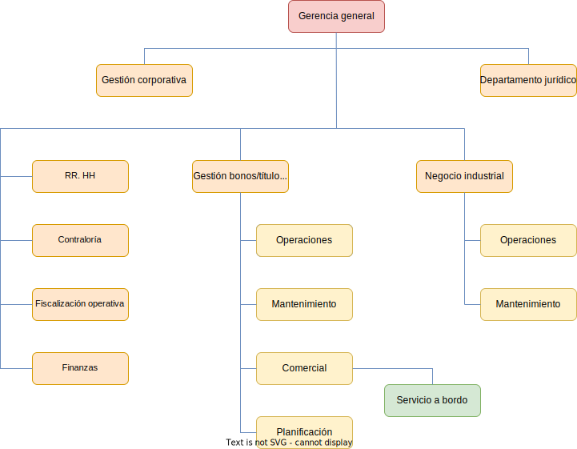

 

[Volver a la página anterior](https://github.com/emg842/INRE-UAL-ROJO-2022)

 

#  Especificación de los requisitos del software

 

##  Hoja de revisión

 

<table align = "center">
    <tr>
        <td><b>Fecha</b></td>
        <td><b>Versión</b></td>
        <td><b>Descripción</b></td>
        <td><b>Autor</b></td>
    </tr>
    <tr>
        <td>06/12/2022</td>
        <td>1.0</td>
        <td>Realización del DCU general</td>
        <td>Manuel Vallecillos Escobosa</td>
    </tr>
    <tr>
        <td>10/12/2022</td>
        <td>1.0</td>
        <td>Realización tablas requisitos funcionales</td>
        <td>Miguel Ángel Moncada Álvarez</td>
    </tr>
    <tr>
        <td>10/12/2022</td>
        <td>1.0</td>
        <td>Corrección tablas requisitos funcionales</td>
        <td>Miguel Ángel Moncada Álvarez</td>
    </tr>
    <tr>
        <td>10/12/2022</td>
        <td>1.0</td>
        <td>Corrección tablas requisitos funcionales</td>
        <td>Miguel Ángel Moncada Álvarez</td>
    </tr>
    <tr>
        <td>10/12/2022</td>
        <td>1.0</td>
        <td>Actualizar progreso en la Hoja de revisión</td>
        <td>Miguel Ángel Moncada Álvarez</td>
    </tr>
    <tr>
        <td>11/12/2022</td>
        <td>1.0</td>
        <td>Actualización del DCU general</td>
        <td>Manuel Vallecillos Escobosa</td>
    </tr>
    <tr>
        <td>11/12/2022</td>
        <td>1.0</td>
        <td>Adición de requisitos funcionales1</td>
        <td>Miguel Ángel Moncada Álvarez</td>
    </tr>
        <tr>
        <td>11/12/2022</td>
        <td>1.0</td>
        <td>Adición de requisitos No funcionales</td>
        <td>Miguel Ángel Moncada Álvarez</td>
    </tr>
    </tr>
        <tr>
        <td>13/12/2022</td>
        <td>1.0</td>
        <td>Introducción y objetivos de negocio</td>
        <td>Daniel López García</td>
    </tr>
    <tr>
        <td>13/12/2022</td>
        <td>1.0</td>
        <td>Diagrama E/R general</td>
        <td>Joaquín Murcia Escánez</td>
    </tr>
    <tr>
        <td>13/12/2022</td>
        <td>1.0</td>
        <td>Diagrama de casos de uso general actualizado en adición de fragmentos del mismo (DCU del usuario del portal, DCU del usuario del sistema de información y DCU del gestor)</td>
        <td>Manuel Vallecillos Escobosa</td>
    </tr>
    <tr>
        <td>14/12/2022</td>
        <td>1.0</td>
        <td>Diagrama de clases general</td>
        <td>Joaquín Murcia Escánez</td>
    </tr>
    <tr>
        <td>14/12/2022</td>
        <td>1.0</td>
        <td>Subida diagrama E/R fragmentado en dos (portal y sistema de información)</td>
        <td>Joaquín Murcia Escánez</td>
    </tr>
    <tr>
        <td>14/12/2022</td>
        <td>1.0</td>
        <td>Subida diagrama CU fragmentado en dos (portal y sistema de información)</td>
        <td>Manuel Vallecillos Escobosa</td>
    </tr>
        <tr>
        <td>14/12/2022</td>
        <td>1.0</td>
        <td>Subida diagrama de clases fragmentado en dos (portal y sistema de información)</td>
        <td>Joaquín Murcia Escánez</td>
    </tr>
    </tr>
        <tr>
        <td>14/12/2022</td>
        <td>1.0</td>
        <td>Separación de requisitos funcionales y no funcionales en función de si pertenecen al portal o al sistema de información</td>
        <td>Joaquín Murcia Escánez</td>
    </tr>
    </tr>
    <tr>
        <td>14/12/2022</td>
        <td>1.0</td>
        <td>Subida del organigrama</td>
        <td>Manuel Vallecillos Escobosa</td>
    </tr>
    <tr>
        <td>14/12/2022</td>
        <td>1.0</td>
        <td>Subida de los modelos de procesos de negocio</td>
        <td>Daniel López García</td>
    <tr>
        <td>15/12/2022</td>
        <td>1.0</td>
        <td>Listado de Casos de uso</td>
        <td>Miguel Ángel Moncada Álvarez</td>
    </tr>
    <tr>
        <td>15/12/2022</td>
        <td>1.0</td>
        <td>Subida de los requisitos de información</td>
        <td>Joaquín Murcia Escánez</td>
    </tr>
    <tr>
        <td>15/12/2022</td>
        <td>1.0</td>
        <td>Subida de los casos de uso del portal detallados</td>
        <td>Daniel López García</td>
    </tr>
        <tr>
        <td>16/12/2022</td>
        <td>1.0</td>
        <td>Subida de los casos de uso del Sistema de información detallados</td>
        <td>Miguel Ángel Moncada Álvarez</td>
    </tr>
</table>

  

##  Contenidos

 

[Hoja de revisión](#hojaderevision) 
[Contenidos](#contenidos) 
[1. &nbsp;&nbsp;&nbsp;&nbsp; Introducción](#introduccion) 
[2. &nbsp;&nbsp;&nbsp;&nbsp; Información del dominio del problema [opcional]](#informaciondeldominiodelproblema) 
&nbsp;&nbsp;&nbsp;&nbsp;&nbsp;&nbsp;&nbsp;&nbsp; [2.1. &nbsp;&nbsp;&nbsp;&nbsp; Organigrama](#organigrama) 
&nbsp;&nbsp;&nbsp;&nbsp;&nbsp;&nbsp;&nbsp;&nbsp; [2.2. &nbsp;&nbsp;&nbsp;&nbsp; Glosario de términos](#glosariodeterminos) 
[3. &nbsp;&nbsp;&nbsp;&nbsp; Necesidades del negocio](#necesidadesdelnegocio) 
&nbsp;&nbsp;&nbsp;&nbsp;&nbsp;&nbsp;&nbsp;&nbsp; [3.1. &nbsp;&nbsp;&nbsp;&nbsp; Objetivos del negocio](#objetivosdelnegocio) 
&nbsp;&nbsp;&nbsp;&nbsp;&nbsp;&nbsp;&nbsp;&nbsp; [3.2. &nbsp;&nbsp;&nbsp;&nbsp; Modelos de Procesos de Negocio [opcional]](#modelosdeprocesosdenegocio) 
&nbsp;&nbsp;&nbsp;&nbsp;&nbsp;&nbsp;&nbsp;&nbsp;&nbsp;&nbsp;&nbsp;&nbsp;&nbsp;&nbsp;&nbsp;&nbsp;&nbsp;&nbsp;&nbsp;&nbsp; [Procesos](#procesos) 
&nbsp;&nbsp;&nbsp;&nbsp;&nbsp;&nbsp;&nbsp;&nbsp;&nbsp;&nbsp;&nbsp;&nbsp;&nbsp;&nbsp;&nbsp;&nbsp;&nbsp;&nbsp;&nbsp;&nbsp; [Tareas](#tareas) 
[4. &nbsp;&nbsp;&nbsp;&nbsp; Requisitos del sistema a desarrollar](#requisitosdelsistemaadesarrollar) 
&nbsp;&nbsp;&nbsp;&nbsp;&nbsp;&nbsp;&nbsp;&nbsp; [4.1. &nbsp;&nbsp;&nbsp;&nbsp; Requisitos](#requisitos) 
&nbsp;&nbsp;&nbsp;&nbsp;&nbsp;&nbsp;&nbsp;&nbsp;&nbsp;&nbsp;&nbsp;&nbsp;&nbsp;&nbsp;&nbsp;&nbsp;&nbsp;&nbsp;&nbsp;&nbsp; [Requisitos funcionales del Portal](#requisitosfuncionalesdelportal) 
&nbsp;&nbsp;&nbsp;&nbsp;&nbsp;&nbsp;&nbsp;&nbsp;&nbsp;&nbsp;&nbsp;&nbsp;&nbsp;&nbsp;&nbsp;&nbsp;&nbsp;&nbsp;&nbsp;&nbsp; [Requisitos funcionales del Sistema de información](#requisitosfuncionalesdelsistemadeinformacion) 
&nbsp;&nbsp;&nbsp;&nbsp;&nbsp;&nbsp;&nbsp;&nbsp;&nbsp;&nbsp;&nbsp;&nbsp;&nbsp;&nbsp;&nbsp;&nbsp;&nbsp;&nbsp;&nbsp;&nbsp; [Requisitos no funcionales del Portal](#requisitosnofuncionalesdelportal) 
&nbsp;&nbsp;&nbsp;&nbsp;&nbsp;&nbsp;&nbsp;&nbsp;&nbsp;&nbsp;&nbsp;&nbsp;&nbsp;&nbsp;&nbsp;&nbsp;&nbsp;&nbsp;&nbsp;&nbsp; [Requisitos no funcionales del Sistema de Información](#requisitosnofuncionalesdelsistemadeinformacion) 
&nbsp;&nbsp;&nbsp;&nbsp;&nbsp;&nbsp;&nbsp;&nbsp;&nbsp;&nbsp;&nbsp;&nbsp;&nbsp;&nbsp;&nbsp;&nbsp;&nbsp;&nbsp;&nbsp;&nbsp; [Requisitos de información del Portal](#requisitosdeinformaciondelportal) 
&nbsp;&nbsp;&nbsp;&nbsp;&nbsp;&nbsp;&nbsp;&nbsp;&nbsp;&nbsp;&nbsp;&nbsp;&nbsp;&nbsp;&nbsp;&nbsp;&nbsp;&nbsp;&nbsp;&nbsp; [Requisitos de información del Sistema de Información](#requisitosdeinformaciondelsistemadeinformacion) 
&nbsp;&nbsp;&nbsp;&nbsp;&nbsp;&nbsp;&nbsp;&nbsp; [4.2. &nbsp;&nbsp;&nbsp;&nbsp; Casos de uso](#casosdeuso) 
&nbsp;&nbsp;&nbsp;&nbsp;&nbsp;&nbsp;&nbsp;&nbsp;&nbsp;&nbsp;&nbsp;&nbsp;&nbsp;&nbsp;&nbsp;&nbsp;&nbsp;&nbsp;&nbsp;&nbsp; [Lista de diagramas de casos de uso del modelo](#listadediagramasdecasosdeusodelmodelo) 
&nbsp;&nbsp;&nbsp;&nbsp;&nbsp;&nbsp;&nbsp;&nbsp;&nbsp;&nbsp;&nbsp;&nbsp;&nbsp;&nbsp;&nbsp;&nbsp;&nbsp;&nbsp;&nbsp;&nbsp; [Diagramas de casos de uso](#diagramasdecasosdeuso) 
&nbsp;&nbsp;&nbsp;&nbsp;&nbsp;&nbsp;&nbsp;&nbsp;&nbsp;&nbsp;&nbsp;&nbsp;&nbsp;&nbsp;&nbsp;&nbsp;&nbsp;&nbsp;&nbsp;&nbsp; [Lista de casos de uso del Portal](#listadecasosdeusodelportal) 
&nbsp;&nbsp;&nbsp;&nbsp;&nbsp;&nbsp;&nbsp;&nbsp;&nbsp;&nbsp;&nbsp;&nbsp;&nbsp;&nbsp;&nbsp;&nbsp;&nbsp;&nbsp;&nbsp;&nbsp; [Lista de casos de uso del Sistema de Información](#listadecasosdeusodelsistemadeinformacion) 
&nbsp;&nbsp;&nbsp;&nbsp;&nbsp;&nbsp;&nbsp;&nbsp;&nbsp;&nbsp;&nbsp;&nbsp;&nbsp;&nbsp;&nbsp;&nbsp;&nbsp;&nbsp;&nbsp;&nbsp; [Lista de actores del Portal](#listadeactoresdelportal) 
&nbsp;&nbsp;&nbsp;&nbsp;&nbsp;&nbsp;&nbsp;&nbsp;&nbsp;&nbsp;&nbsp;&nbsp;&nbsp;&nbsp;&nbsp;&nbsp;&nbsp;&nbsp;&nbsp;&nbsp; [Lista de actores del Sistema de información](#listadeactoresdelsistemadeinformacion) 
&nbsp;&nbsp;&nbsp;&nbsp;&nbsp;&nbsp;&nbsp;&nbsp;&nbsp;&nbsp;&nbsp;&nbsp;&nbsp;&nbsp;&nbsp;&nbsp;&nbsp;&nbsp;&nbsp;&nbsp; [Detalle de los casos de uso del Portal](#detalledeloscasosdeusodelportal) 
&nbsp;&nbsp;&nbsp;&nbsp;&nbsp;&nbsp;&nbsp;&nbsp;&nbsp;&nbsp;&nbsp;&nbsp;&nbsp;&nbsp;&nbsp;&nbsp;&nbsp;&nbsp;&nbsp;&nbsp; [Detalle de los casos de uso del Sistema de información](#detalledeloscasosdeusodelsistemadeinformacion) 
&nbsp;&nbsp;&nbsp;&nbsp;&nbsp;&nbsp;&nbsp;&nbsp; [4.3. &nbsp;&nbsp;&nbsp;&nbsp; Diagramas E/R y de clases asociados a los requisitos de información](#diagramaserydeclasesasociadosalosrequisitosdeinformacion) 
&nbsp;&nbsp;&nbsp;&nbsp;&nbsp;&nbsp;&nbsp;&nbsp;&nbsp;&nbsp;&nbsp;&nbsp;&nbsp;&nbsp;&nbsp;&nbsp;&nbsp;&nbsp;&nbsp;&nbsp; [Lista de diagramas E/R del modelo](#listadediagramaserdelmodelo) 
&nbsp;&nbsp;&nbsp;&nbsp;&nbsp;&nbsp;&nbsp;&nbsp;&nbsp;&nbsp;&nbsp;&nbsp;&nbsp;&nbsp;&nbsp;&nbsp;&nbsp;&nbsp;&nbsp;&nbsp; [Diagramas E/R del modelo](#diagramaserdelmodelo) 
&nbsp;&nbsp;&nbsp;&nbsp;&nbsp;&nbsp;&nbsp;&nbsp;&nbsp;&nbsp;&nbsp;&nbsp;&nbsp;&nbsp;&nbsp;&nbsp;&nbsp;&nbsp;&nbsp;&nbsp; [Lista de diagramas de clases del modelo](#listadediagramasdeclasesdelmodelo) 
&nbsp;&nbsp;&nbsp;&nbsp;&nbsp;&nbsp;&nbsp;&nbsp;&nbsp;&nbsp;&nbsp;&nbsp;&nbsp;&nbsp;&nbsp;&nbsp;&nbsp;&nbsp;&nbsp;&nbsp; [Diagramas de clases del modelo](#diagramasdeclasesdelmodelo) 
[Apéndices](#apendices)

  

##  1. Introducción

 

Una vez leído el pliego de las condiciones hemos decicido abarcar este proyecto para crear dos aplicaciones con objeto de favorecer y facilitar el uso de transporte público en la isla de Gran Canaria. Para ello hemos desarrollado una entrevista (ver anexo) con un usuario habitual para, de este modo, aclarar algunas dudas que nos han surgido durante el planteamiento inicial del proyecto. Una vez terminada, nos disponemos a crear el presente archivo con nuestra propuesta documentada de las aplicaciones del pliego inicial.

 

##  2. Información del Dominio del problema [opcional]

 

###  2.1. Organigrama

 

 

###  2.2. Glosario de términos

 

<table align = "center">
    <tr>
        <td><b>Término</b></td>
        <td><b>Descripción</b></td>
    </tr>
    <tr>
        <td>Cloud Tag</td>
        <td>Nube donde de forma gráfica en forma de etiquetas se pueden acceder a las funcionalidades de la página</td>
    </tr>
</table>

  

##  3. Necesidades del negocio

 

###  3.1. Objetivos del negocio

 

Como ya hemos visto la intención de este proyecto es la de crear dos aplicaciones, una aplicación que nos muestre información sobre eventos, rutas de autobuses, noticias e itinerarios de la isla, ... (entre otras muchas opciones) y otra aplicación que implementará una pasarela de pago para poder comprar billetes y reservar itinerarios, un mapa iteractivo sobre el que poder realizar diversas operaciones, etc. Nuestro propósito es el de crear ambas aplicaciones con una grata experiencia de usuario y de manera eficiente. Siempre, claro está, cuidando que sea accesible para la gran mayoría de usuarios.

 

###  3.2. Modelos de Procesos de Negocio [opcional]

 

###  Procesos

 

<table align = "center">
    <tr>
        <td><b>Nombre</b></td>
        <td><b>Descripción</b></td>
    </tr>
    <tr>
        <td>Validación del DNI al registrarse</td>
        <td>Un usuario no registrado envía una foto la cual será recibida por el gestor de contenidos, este a su vez lo enviará por un proceso de verificación llevado a cabo por el software externo a la empresa. En caso de que el software verifique la validez del DNI este enviará un informe comentando dicho resultado al gestor de contenidos y en caso de ser rechazada la imagen se enviará un informe con los fallos al gestor de contenidos. Cuando el gestor reciba el informe de los fallos se lo mandará al usuario para que vuelva a mandar la imagen del DNI y haga de nuevo el proceso de verificación. Si la foto ha sido validada le mandará al usuario un mensaje de verificación y terminará el proceso</td>
    </tr>
    <tr>
        <td>Adquisición de un bono o de un título único de transporte</td>
        <td>El usuario tendrá la opción tanto de comprar un bono, como de adquirir el título de transporte. Una vez seleccionada la opción, se deberá enviar el formulario del servicio escogido al sistema. En caso de que cumpla los requisitos, se proporcionará el bono o título solicitado al usuario en cuestión, haciéndole llegar un mensaje con las credenciales correspondientes a dicho bono o título a su correo. En caso contrario, se le mandará un mensaje comunicándole que el formulario debe volver a ser rellenado pues ha habido algún tipo de error</td>
    </tr>
    <tr>
        <td>Reserva de itinerario</td>
        <td>1. El proceso comienza cuando un cliente busca un itinerario y solicita su reserva. 
        2. La solicitud es recibida por el sistema de reservas, que verifica la disponibilidad de los servicios solicitados. 
        3. Si hay disponibilidad, se procede a generar una factura del precio total del itinerario y se envía al cliente. 
        4. Si no hay disponibilidad se mandará un aviso al cliente. 
        5. Cuando el cliente recibe la factura podrá realizar el pago o cancelar la reserva terminando el proceso. 
        6. Cuando el cliente reciba el aviso de que no hay disponibilidad, podrá buscar otro itinerario iniciando de nuevo el proceso o terminar el proceso. 
        7. Cuando realice el pago le llegará un aviso al sistema de reservas, este se encargará de generar el recibo y de enviárselo al cliente. 
        8. Cuando al cliente le llega el recibo se termina el proceso.</td>
    </tr>
</table>

 

###  Tareas

 

- Tareas del proceso 1: Validación del DNI al registrarse

 

Un usuario no registrado envía una foto la cual será recibida por el gestor de contenidos, este a su vez lo enviará por un proceso de verificación llevado a cabo por el software externo a la empresa. En caso de que el software verifique la validez del DNI este enviará un informe comentando dicho resultado al gestor de contenidos y en caso de ser rechazada la imagen se enviará un informe con los fallos al gestor de contenidos. Cuando el gestor reciba el informe de los fallos se lo mandará al usuario para que vuelva a mandar la imagen del DNI y haga de nuevo el proceso de verificación. Si la foto ha sido validada le mandará al usuario un mensaje de verificación y terminará el proceso

 

 

- Tareas del proceso 2: Adquisición de un bono o de un título único de transporte

 

El usuario tendrá la opción tanto de comprar un bono, como de adquirir el título de transporte. Una vez seleccionada la opción, se deberá enviar el formulario del servicio escogido al sistema. En caso de que cumpla los requisitos, se proporcionará el bono o título solicitado al usuario en cuestión, haciéndole llegar un mensaje con las credenciales correspondientes a dicho bono o título a su correo. En caso contrario, se le mandará un mensaje comunicándole que el formulario debe volver a ser rellenado pues ha habido algún tipo de error

 

 

- Tareas del proceso 3: Reserva de itinerario

 

1. El proceso comienza cuando un cliente busca un itinerario y solicita su reserva. 
2. La solicitud es recibida por el sistema de reservas, que verifica la disponibilidad de los servicios solicitados. 
3. Si hay disponibilidad, se procede a generar una factura del precio total del itinerario y se envía al cliente. 
4. Si no hay disponibilidad se mandará un aviso al cliente. 
5. Cuando el cliente recibe la factura podrá realizar el pago o cancelar la reserva terminando el proceso. 
6. Cuando el cliente reciba el aviso de que no hay disponibilidad, podrá buscar otro itinerario iniciando de nuevo el proceso o terminar el proceso. 
7. Cuando realice el pago le llegará un aviso al sistema de reservas, este se encargará de generar el recibo y de enviárselo al cliente. 
8. Cuando al cliente le llega el recibo se termina el proceso.</td>

 

  

##  4. Requisitos del sistema a desarrollar

 

###  4.1. Requisitos

 

###  Requisitos funcionales del Portal

 

<table align = "center">
    <tr>
        <td><b>FR-01:</b></td>
        <td>Acceder al blog</td>
    </tr>
    <tr>
        <td><b>Versión:</b></td>
        <td>1.0 (Diciembre-2022)</td>
    </tr>
    <tr>
        <td><b>Autor:</b></td>
        <td>Manuel Vallecillos Escobosa</td>
    </tr>
    <tr>
        <td><b>Fuentes:</b></td>
        <td>Pliego de condiciones y entrevista</td>
    </tr>
    <tr>
        <td><b>Referencias:</b></td>
        <td>UC-03</td>
    </tr>
    <tr>
        <td><b>Descripción:</b></td>
        <td>El sistema ofrece acceso al blog con información acerca del transporte en las Islas Canarias</td>
    </tr>
    <tr>
        <td><b>Importancia:</b></td>
        <td>Muy elevada</td>
    </tr>
    <tr>
        <td><b>Estado:</b></td>
        <td>Aceptado</td>
    </tr>
    <tr>
        <td><b>Comentarios:</b></td>
        <td></td>
    </tr>
</table>

 

<table align = "center">
    <tr>
        <td><b>FR-02:</b></td>
        <td>Acceder al foro</td>
    </tr>
    <tr>
        <td><b>Versión:</b></td>
        <td>1.0 (Diciembre-2022)</td>
    </tr>
    <tr>
        <td><b>Autor:</b></td>
        <td>Manuel Vallecillos Escobosa</td>
    </tr>
    <tr>
        <td><b>Fuentes:</b></td>
        <td>Pliego de condiciones y entrevista</td>
    </tr>
    <tr>
        <td><b>Referencias:</b></td>
        <td>UC-04</td>
    </tr>
    <tr>
        <td><b>Descripción:</b></td>
        <td>El sistema ofrece acceso al foro de la página donde se podrá comentar acerca de la situación del transporte, rutas, servicios ofrecidos... etc </td>
    </tr>
    <tr>
        <td><b>Importancia:</b></td>
        <td>Muy elevada</td>
    </tr>
    <tr>
        <td><b>Estado:</b></td>
        <td>Aceptado</td>
    </tr>
    <tr>
        <td><b>Comentarios:</b></td>
        <td></td>
    </tr>
</table>

 

<table align = "center">
    <tr>
        <td><b>FR-03:</b></td>
        <td>Acceder a cloud tag</td>
    </tr>
    <tr>
        <td><b>Versión:</b></td>
        <td>1.0 (Diciembre-2022)</td>
    </tr>
    <tr>
        <td><b>Autor:</b></td>
        <td>Manuel Vallecillos Escobosa</td>
    </tr>
    <tr>
        <td><b>Fuentes:</b></td>
        <td>Pliego de condiciones y entrevista</td>
    </tr>
    <tr>
        <td><b>Referencias:</b></td>
        <td>UC-05</td>
    </tr>
    <tr>
        <td><b>Descripción:</b></td>
        <td>Ofrece de forma gráfica acceso a las funcionalidades de la página a través de etiquetas visuales en la nube</td>
    </tr>
    <tr>
        <td><b>Importancia:</b></td>
        <td>Muy elevada</td>
    </tr>
    <tr>
        <td><b>Estado:</b></td>
        <td>Aceptado</td>
    </tr>
    <tr>
        <td><b>Comentarios:</b></td>
        <td></td>
    </tr>
</table>

 

<table align = "center">
    <tr>
        <td><b>FR-04:</b></td>
        <td>Buscador (Portal)</td>
    </tr>
    <tr>
        <td><b>Versión:</b></td>
        <td>1.0 (Diciembre-2022)</td>
    </tr>
    <tr>
        <td><b>Autor:</b></td>
        <td>Manuel Vallecillos Escobosa</td>
    </tr>
    <tr>
        <td><b>Fuentes:</b></td>
        <td>Pliego de condiciones y entrevista</td>
    </tr>
    <tr>
        <td><b>Referencias:</b></td>
        <td>UC-06</td>
    </tr>
    <tr>
        <td><b>Descripción:</b></td>
        <td>Permitirá la localización de cualquier contenido de manera inmediata mediante la introducción de términos clave</td>
    </tr>
    <tr>
        <td><b>Importancia:</b></td>
        <td>Muy elevada</td>
    </tr>
    <tr>
        <td><b>Estado:</b></td>
        <td>Aceptado</td>
    </tr>
    <tr>
        <td><b>Comentarios:</b></td>
        <td>- En las búsquedas no se diferenciarán las palabras con o sin acento, mayúsculas o minúsculas. 
        - Dispondrá de opciones que permitan la parametrización de las búsquedas considerando características como el idioma, secciones del sitio, etc </td>
    </tr>
</table>

 

<table align = "center">
    <tr>
        <td><b>FR-05:</b></td>
        <td>Ver noticias</td>
    </tr>
    <tr>
        <td><b>Versión:</b></td>
        <td>1.0 (Diciembre-2022)</td>
    </tr>
    <tr>
        <td><b>Autor:</b></td>
        <td>Manuel Vallecillos Escobosa</td>
    </tr>
    <tr>
        <td><b>Fuentes:</b></td>
        <td>Pliego de condiciones y entrevista</td>
    </tr>
    <tr>
        <td><b>Referencias:</b></td>
        <td>UC-08</td>
    </tr>
    <tr>
        <td><b>Descripción:</b></td>
        <td>Ofrece la posibilidad de ver las noticias acerca de eventos en las Islas Canarias y la disponibilidad del transporte </td>
    </tr>
    <tr>
        <td><b>Importancia:</b></td>
        <td>Muy elevada</td>
    </tr>
    <tr>
        <td><b>Estado:</b></td>
        <td>Aceptado</td>
    </tr>
    <tr>
        <td><b>Comentarios:</b></td>
        <td></td>
    </tr>
</table>

 

<table align = "center">
    <tr>
        <td><b>FR-06:</b></td>
        <td>Contactar con el equipo de la aplicación</td>
    </tr>
    <tr>
        <td><b>Versión:</b></td>
        <td>1.0 (Diciembre-2022)</td>
    </tr>
    <tr>
        <td><b>Autor:</b></td>
        <td>Manuel Vallecillos Escobosa</td>
    </tr>
    <tr>
        <td><b>Fuentes:</b></td>
        <td>Pliego de condiciones y entrevista</td>
    </tr>
    <tr>
        <td><b>Referencias:</b></td>
        <td>UC-09</td>
    </tr>
    <tr>
        <td><b>Descripción:</b></td>
        <td>Da la posibilidad de contactar con el equipo de la aplicación ya sea a través del correo electrónico o de un número de teléfono</td>
    </tr>
    <tr>
        <td><b>Importancia:</b></td>
        <td>Muy elevada</td>
    </tr>
    <tr>
        <td><b>Estado:</b></td>
        <td>Aceptado</td>
    </tr>
    <tr>
        <td><b>Comentarios:</b></td>
        <td></td>
    </tr>
</table>

 

<table align = "center">
    <tr>
        <td><b>FR-07:</b></td>
        <td>Ver horarios de las líneas</td>
    </tr>
    <tr>
        <td><b>Versión:</b></td>
        <td>1.0 (Diciembre-2022)</td>
    </tr>
    <tr>
        <td><b>Autor:</b></td>
        <td>Manuel Vallecillos Escobosa</td>
    </tr>
    <tr>
        <td><b>Fuentes:</b></td>
        <td>Pliego de condiciones y entrevista</td>
    </tr>
    <tr>
        <td><b>Referencias:</b></td>
        <td>UC-02</td>
    </tr>
    <tr>
        <td><b>Descripción:</b></td>
        <td>Muestra la hora a la que pasa un determinado transporte por una determinada parada de la línea que se esté consultando</td>
    </tr>
    <tr>
        <td><b>Importancia:</b></td>
        <td>Muy elevada</td>
    </tr>
    <tr>
        <td><b>Estado:</b></td>
        <td>Aceptado</td>
    </tr>
    <tr>
        <td><b>Comentarios:</b></td>
        <td></td>
    </tr>
</table>

 

<table align = "center">
    <tr>
        <td><b>FR-08:</b></td>
        <td>Ver itinerarios destacados</td>
    </tr>
    <tr>
        <td><b>Versión:</b></td>
        <td>1.0 (Diciembre-2022)</td>
    </tr>
    <tr>
        <td><b>Autor:</b></td>
        <td>Manuel Vallecillos Escobosa</td>
    </tr>
    <tr>
        <td><b>Fuentes:</b></td>
        <td>Pliego de condiciones y entrevista</td>
    </tr>
    <tr>
        <td><b>Referencias:</b></td>
        <td>UC-15</td>
    </tr>
    <tr>
        <td><b>Descripción:</b></td>
        <td>Ofrece una lista con los itinerarios más destacados entre los usuarios</td>
    </tr>
    <tr>
        <td><b>Importancia:</b></td>
        <td>Muy elevada</td>
    </tr>
    <tr>
        <td><b>Estado:</b></td>
        <td>Aceptado</td>
    </tr>
    <tr>
        <td><b>Comentarios:</b></td>
        <td></td>
    </tr>
</table>

 

<table align = "center">
    <tr>
        <td><b>FR-09:</b></td>
        <td>Ver tarifas y títulos de transporte</td>
    </tr>
    <tr>
        <td><b>Versión:</b></td>
        <td>1.0 (Diciembre-2022)</td>
    </tr>
    <tr>
        <td><b>Autor:</b></td>
        <td>Manuel Vallecillos Escobosa</td>
    </tr>
    <tr>
        <td><b>Fuentes:</b></td>
        <td>Pliego de condiciones y entrevista</td>
    </tr>
    <tr>
        <td><b>Referencias:</b></td>
        <td>UC-16</td>
    </tr>
    <tr>
        <td><b>Descripción:</b></td>
        <td>Ofrece una vista de las distintas tarifas y titulos disponibles para adquirir</td>
    </tr>
    <tr>
        <td><b>Importancia:</b></td>
        <td>Muy elevada</td>
    </tr>
    <tr>
        <td><b>Estado:</b></td>
        <td>Aceptado</td>
    </tr>
    <tr>
        <td><b>Comentarios:</b></td>
        <td></td>
    </tr>
</table>

 

<table align = "center">
    <tr>
        <td><b>FR-10:</b></td>
        <td>Mostrar publicidad</td>
    </tr>
    <tr>
        <td><b>Versión:</b></td>
        <td>1.0 (Diciembre-2022)</td>
    </tr>
    <tr>
        <td><b>Autor:</b></td>
        <td>Manuel Vallecillos Escobosa</td>
    </tr>
    <tr>
        <td><b>Fuentes:</b></td>
        <td>Pliego de condiciones y entrevista</td>
    </tr>
    <tr>
        <td><b>Referencias:</b></td>
        <td>UC-17</td>
    </tr>
    <tr>
        <td><b>Descripción:</b></td>
        <td>Aparecen anuncios acerca del transporte en la isla o anuncios de otras empresas externas</td>
    </tr>
    <tr>
        <td><b>Importancia:</b></td>
        <td>Muy elevada</td>
    </tr>
    <tr>
        <td><b>Estado:</b></td>
        <td>Aceptado</td>
    </tr>
    <tr>
        <td><b>Comentarios:</b></td>
        <td></td>
    </tr>
</table>

 

<table align = "center">
    <tr>
        <td><b>FR-11:</b></td>
        <td>Ver información corporativa</td>
    </tr>
    <tr>
        <td><b>Versión:</b></td>
        <td>1.0 (Diciembre-2022)</td>
    </tr>
    <tr>
        <td><b>Autor:</b></td>
        <td>Manuel Vallecillos Escobosa</td>
    </tr>
    <tr>
        <td><b>Fuentes:</b></td>
        <td>Pliego de condiciones y entrevista</td>
    </tr>
    <tr>
        <td><b>Referencias:</b></td>
        <td>UC-01</td>
    </tr>
    <tr>
        <td><b>Descripción:</b></td>
        <td>Ofrece la información corporativa del ayuntamiento de las Islas Canarias</td>
    </tr>
    <tr>
        <td><b>Importancia:</b></td>
        <td>Muy elevada</td>
    </tr>
    <tr>
        <td><b>Estado:</b></td>
        <td>Aceptado</td>
    </tr>
    <tr>
        <td><b>Comentarios:</b></td>
        <td></td>
    </tr>
</table>

 

<table align = "center">
    <tr>
        <td><b>FR-12:</b></td>
        <td>Cambio de idioma</td>
    </tr>
    <tr>
        <td><b>Versión:</b></td>
        <td>1.0 (Diciembre-2022)</td>
    </tr>
    <tr>
        <td><b>Autor:</b></td>
        <td>Manuel Vallecillos Escobosa</td>
    </tr>
    <tr>
        <td><b>Fuentes:</b></td>
        <td>Pliego de condiciones y entrevista</td>
    </tr>
    <tr>
        <td><b>Referencias:</b></td>
        <td>UC-07</td>
    </tr>
    <tr>
        <td><b>Descripción:</b></td>
        <td>Ofrece la posibilidad de cambiar el idioma en el que aparece el contenido de la página</td>
    </tr>
    <tr>
        <td><b>Importancia:</b></td>
        <td>Muy elevada</td>
    </tr>
    <tr>
        <td><b>Estado:</b></td>
        <td>Aceptado</td>
    </tr>
    <tr>
        <td><b>Comentarios:</b></td>
        <td></td>
    </tr>
</table>

 

<table align = "center">
    <tr>
        <td><b>FR-13:</b></td>
        <td>Ver información acerca de lugares de interés</td>
    </tr>
    <tr>
        <td><b>Versión:</b></td>
        <td>1.0 (Diciembre-2022)</td>
    </tr>
    <tr>
        <td><b>Autor:</b></td>
        <td>Manuel Vallecillos Escobosa</td>
    </tr>
    <tr>
        <td><b>Fuentes:</b></td>
        <td>Pliego de condiciones y entrevista</td>
    </tr>
    <tr>
        <td><b>Referencias:</b></td>
        <td>UC-10</td>
    </tr>
    <tr>
        <td><b>Descripción:</b></td>
        <td>Ofrece información acerca de los distintos lugares de interés de las Islas Canarias</td>
    </tr>
    <tr>
        <td><b>Importancia:</b></td>
        <td>Muy elevada</td>
    </tr>
    <tr>
        <td><b>Estado:</b></td>
        <td>Aceptado</td>
    </tr>
    <tr>
        <td><b>Comentarios:</b></td>
        <td></td>
    </tr>
</table>

 

<table align = "center">
    <tr>
        <td><b>FR-14:</b></td>
        <td>Ver información acerca de eventos</td>
    </tr>
    <tr>
        <td><b>Versión:</b></td>
        <td>1.0 (Diciembre-2022)</td>
    </tr>
    <tr>
        <td><b>Autor:</b></td>
        <td>Manuel Vallecillos Escobosa</td>
    </tr>
    <tr>
        <td><b>Fuentes:</b></td>
        <td>Pliego de condiciones y entrevista</td>
    </tr>
    <tr>
        <td><b>Referencias:</b></td>
        <td>UC-11</td>
    </tr>
    <tr>
        <td><b>Descripción:</b></td>
        <td>Ofrece información acerca de los distintos eventos que se celebran en las Islas Canarias</td>
    </tr>
    <tr>
        <td><b>Importancia:</b></td>
        <td>Muy elevada</td>
    </tr>
    <tr>
        <td><b>Estado:</b></td>
        <td>Aceptado</td>
    </tr>
    <tr>
        <td><b>Comentarios:</b></td>
        <td></td>
    </tr>
</table>

 

<table align = "center">
    <tr>
        <td><b>FR-15:</b></td>
        <td>Ver información acerca de monumentos</td>
    </tr>
    <tr>
        <td><b>Versión:</b></td>
        <td>1.0 (Diciembre-2022)</td>
    </tr>
    <tr>
        <td><b>Autor:</b></td>
        <td>Manuel Vallecillos Escobosa</td>
    </tr>
    <tr>
        <td><b>Fuentes:</b></td>
        <td>Pliego de condiciones y entrevista</td>
    </tr>
    <tr>
        <td><b>Referencias:</b></td>
        <td>UC-12</td>
    </tr>
    <tr>
        <td><b>Descripción:</b></td>
        <td>Ofrece información acerca de los distintos monumentos que se encuentran en las Islas Canarias</td>
    </tr>
    <tr>
        <td><b>Importancia:</b></td>
        <td>Muy elevada</td>
    </tr>
    <tr>
        <td><b>Estado:</b></td>
        <td>Aceptado</td>
    </tr>
    <tr>
        <td><b>Comentarios:</b></td>
        <td></td>
    </tr>
</table>

<table align = "center">
    <tr>
        <td><b>FR-16:</b></td>
        <td>Ver información acerca de sitios turísticos</td>
    </tr>
    <tr>
        <td><b>Versión:</b></td>
        <td>1.0 (Diciembre-2022)</td>
    </tr>
    <tr>
        <td><b>Autor:</b></td>
        <td>Manuel Vallecillos Escobosa</td>
    </tr>
    <tr>
        <td><b>Fuentes:</b></td>
        <td>Pliego de condiciones y entrevista</td>
    </tr>
    <tr>
        <td><b>Referencias:</b></td>
        <td>UC-13</td>
    </tr>
    <tr>
        <td><b>Descripción:</b></td>
        <td>Ofrece información acerca de los sitios más turísticos de las Islas Canarias</td>
    </tr>
    <tr>
        <td><b>Importancia:</b></td>
        <td>Muy elevada</td>
    </tr>
    <tr>
        <td><b>Estado:</b></td>
        <td>Aceptado</td>
    </tr>
    <tr>
        <td><b>Comentarios:</b></td>
        <td></td>
    </tr>
</table>

 

<table align = "center">
    <tr>
        <td><b>FR-17:</b></td>
        <td>Ver avisos</td>
    </tr>
    <tr>
        <td><b>Versión:</b></td>
        <td>1.0 (Diciembre-2022)</td>
    </tr>
    <tr>
        <td><b>Autor:</b></td>
        <td>Manuel Vallecillos Escobosa</td>
    </tr>
    <tr>
        <td><b>Fuentes:</b></td>
        <td>Pliego de condiciones y entrevista</td>
    </tr>
    <tr>
        <td><b>Referencias:</b></td>
        <td>UC-14</td>
    </tr>
    <tr>
        <td><b>Descripción:</b></td>
        <td>Ofrece información acerca de posibles cambios o alteraciones en en el turismo de las Islas Canarias</td>
    </tr>
    <tr>
        <td><b>Importancia:</b></td>
        <td>Muy elevada</td>
    </tr>
    <tr>
        <td><b>Estado:</b></td>
        <td>Aceptado</td>
    </tr>
    <tr>
        <td><b>Comentarios:</b></td>
        <td></td>
    </tr>
</table>
 

<table align = "center">
    <tr>
        <td><b>FR-18:</b></td>
        <td>Agregar datos</td>
    </tr>
    <tr>
        <td><b>Versión:</b></td>
        <td>1.0 (Diciembre-2022)</td>
    </tr>
    <tr>
        <td><b>Autor:</b></td>
        <td>Manuel Vallecillos Escobosa</td>
    </tr>
    <tr>
        <td><b>Fuentes:</b></td>
        <td>Pliego de condiciones y entrevista</td>
    </tr>
    <tr>
        <td><b>Referencias:</b></td>
        <td>UC-18</td>
    </tr>
    <tr>
        <td><b>Descripción:</b></td>
        <td>Se podrán agregar datos e información nueva a la página web</td>
    </tr>
    <tr>
        <td><b>Importancia:</b></td>
        <td>Muy elevada</td>
    </tr>
    <tr>
        <td><b>Estado:</b></td>
        <td>Aceptado</td>
    </tr>
    <tr>
        <td><b>Comentarios:</b></td>
        <td></td>
    </tr>
</table>
 

<table align = "center">
    <tr>
        <td><b>FR-19:</b></td>
        <td>Crear nuevas páginas</td>
    </tr>
    <tr>
        <td><b>Versión:</b></td>
        <td>1.0 (Diciembre-2022)</td>
    </tr>
    <tr>
        <td><b>Autor:</b></td>
        <td>Manuel Vallecillos Escobosa</td>
    </tr>
    <tr>
        <td><b>Fuentes:</b></td>
        <td>Pliego de condiciones y entrevista</td>
    </tr>
    <tr>
        <td><b>Referencias:</b></td>
        <td>UC-26</td>
    </tr>
    <tr>
        <td><b>Descripción:</b></td>
        <td>Se podrán crear nuevas páginas en la web</td>
    </tr>
    <tr>
        <td><b>Importancia:</b></td>
        <td>Muy elevada</td>
    </tr>
    <tr>
        <td><b>Estado:</b></td>
        <td>Aceptado</td>
    </tr>
    <tr>
        <td><b>Comentarios:</b></td>
        <td></td>
    </tr>
</table>
 

<table align = "center">
    <tr>
        <td><b>FR-20:</b></td>
        <td>Visualizar páginas nuevas</td>
    </tr>
    <tr>
        <td><b>Versión:</b></td>
        <td>1.0 (Diciembre-2022)</td>
    </tr>
    <tr>
        <td><b>Autor:</b></td>
        <td>Manuel Vallecillos Escobosa</td>
    </tr>
    <tr>
        <td><b>Fuentes:</b></td>
        <td>Pliego de condiciones y entrevista</td>
    </tr>
    <tr>
        <td><b>Referencias:</b></td>
        <td>UC-27</td>
    </tr>
    <tr>
        <td><b>Descripción:</b></td>
        <td>Se podrán visualizar las nuevas páginas que se han creado antes de añadirlas a la web</td>
    </tr>
    <tr>
        <td><b>Importancia:</b></td>
        <td>Muy elevada</td>
    </tr>
    <tr>
        <td><b>Estado:</b></td>
        <td>Aceptado</td>
    </tr>
    <tr>
        <td><b>Comentarios:</b></td>
        <td></td>
    </tr>
</table>
 

<table align = "center">
    <tr>
        <td><b>FR-21:</b></td>
        <td>Modificar datos</td>
    </tr>
    <tr>
        <td><b>Versión:</b></td>
        <td>1.0 (Diciembre-2022)</td>
    </tr>
    <tr>
        <td><b>Autor:</b></td>
        <td>Manuel Vallecillos Escobosa</td>
    </tr>
    <tr>
        <td><b>Fuentes:</b></td>
        <td>Pliego de condiciones y entrevista</td>
    </tr>
    <tr>
        <td><b>Referencias:</b></td>
        <td>UC-25</td>
    </tr>
    <tr>
        <td><b>Descripción:</b></td>
        <td>Se podrán modificar datos ya existentes en la página web</td>
    </tr>
    <tr>
        <td><b>Importancia:</b></td>
        <td>Muy elevada</td>
    </tr>
    <tr>
        <td><b>Estado:</b></td>
        <td>Aceptado</td>
    </tr>
    <tr>
        <td><b>Comentarios:</b></td>
        <td></td>
    </tr>
</table>
 

<table align = "center">
    <tr>
        <td><b>FR-22:</b></td>
        <td>Gestionar publicidad</td>
    </tr>
    <tr>
        <td><b>Versión:</b></td>
        <td>1.0 (Diciembre-2022)</td>
    </tr>
    <tr>
        <td><b>Autor:</b></td>
        <td>Manuel Vallecillos Escobosa</td>
    </tr>
    <tr>
        <td><b>Fuentes:</b></td>
        <td>Pliego de condiciones y entrevista</td>
    </tr>
    <tr>
        <td><b>Referencias:</b></td>
        <td>UC-24</td>
    </tr>
    <tr>
        <td><b>Descripción:</b></td>
        <td>Se podrá gestionar la publicidad que se muestra en la web</td>
    </tr>
    <tr>
        <td><b>Importancia:</b></td>
        <td>Muy elevada</td>
    </tr>
    <tr>
        <td><b>Estado:</b></td>
        <td>Aceptado</td>
    </tr>
    <tr>
        <td><b>Comentarios:</b></td>
        <td></td>
    </tr>
</table>
 

<table align = "center">
    <tr>
        <td><b>FR-23:</b></td>
        <td>Ver estadísticas de acceso</td>
    </tr>
    <tr>
        <td><b>Versión:</b></td>
        <td>1.0 (Diciembre-2022)</td>
    </tr>
    <tr>
        <td><b>Autor:</b></td>
        <td>Manuel Vallecillos Escobosa</td>
    </tr>
    <tr>
        <td><b>Fuentes:</b></td>
        <td>Pliego de condiciones y entrevista</td>
    </tr>
    <tr>
        <td><b>Referencias:</b></td>
        <td>UC-23</td>
    </tr>
    <tr>
        <td><b>Descripción:</b></td>
        <td>Se podrán visualizar las estadísticas de acceso a la web</td>
    </tr>
    <tr>
        <td><b>Importancia:</b></td>
        <td>Muy elevada</td>
    </tr>
    <tr>
        <td><b>Estado:</b></td>
        <td>Aceptado</td>
    </tr>
    <tr>
        <td><b>Comentarios:</b></td>
        <td></td>
    </tr>
</table>
 

<table align = "center">
    <tr>
        <td><b>FR-24:</b></td>
        <td>Eliminar páginas</td>
    </tr>
    <tr>
        <td><b>Versión:</b></td>
        <td>1.0 (Diciembre-2022)</td>
    </tr>
    <tr>
        <td><b>Autor:</b></td>
        <td>Manuel Vallecillos Escobosa</td>
    </tr>
    <tr>
        <td><b>Fuentes:</b></td>
        <td>Pliego de condiciones y entrevista</td>
    </tr>
    <tr>
        <td><b>Referencias:</b></td>
        <td>UC-22</td>
    </tr>
    <tr>
        <td><b>Descripción:</b></td>
        <td>Se podrán eliminar páginas de la web</td>
    </tr>
    <tr>
        <td><b>Importancia:</b></td>
        <td>Muy elevada</td>
    </tr>
    <tr>
        <td><b>Estado:</b></td>
        <td>Aceptado</td>
    </tr>
    <tr>
        <td><b>Comentarios:</b></td>
        <td></td>
    </tr>
</table>
 

<table align = "center">
    <tr>
        <td><b>FR-25:</b></td>
        <td>Añadir listado de horarios y servicios</td>
    </tr>
    <tr>
        <td><b>Versión:</b></td>
        <td>1.0 (Diciembre-2022)</td>
    </tr>
    <tr>
        <td><b>Autor:</b></td>
        <td>Manuel Vallecillos Escobosa</td>
    </tr>
    <tr>
        <td><b>Fuentes:</b></td>
        <td>Pliego de condiciones y entrevista</td>
    </tr>
    <tr>
        <td><b>Referencias:</b></td>
        <td>UC-19</td>
    </tr>
    <tr>
        <td><b>Descripción:</b></td>
        <td>Se podrán añadir nuevos listados de horarios y servicios a la web</td>
    </tr>
    <tr>
        <td><b>Importancia:</b></td>
        <td>Muy elevada</td>
    </tr>
    <tr>
        <td><b>Estado:</b></td>
        <td>Aceptado</td>
    </tr>
    <tr>
        <td><b>Comentarios:</b></td>
        <td></td>
    </tr>
</table>
 

<table align = "center">
    <tr>
        <td><b>FR-26:</b></td>
        <td>Gestionar idiomas</td>
    </tr>
    <tr>
        <td><b>Versión:</b></td>
        <td>1.0 (Diciembre-2022)</td>
    </tr>
    <tr>
        <td><b>Autor:</b></td>
        <td>Manuel Vallecillos Escobosa</td>
    </tr>
    <tr>
        <td><b>Fuentes:</b></td>
        <td>Pliego de condiciones y entrevista</td>
    </tr>
    <tr>
        <td><b>Referencias:</b></td>
        <td>UC-20</td>
    </tr>
    <tr>
        <td><b>Descripción:</b></td>
        <td>Se podrán gestionar los distintos idiomas que va a soportar la web</td>
    </tr>
    <tr>
        <td><b>Importancia:</b></td>
        <td>Muy elevada</td>
    </tr>
    <tr>
        <td><b>Estado:</b></td>
        <td>Aceptado</td>
    </tr>
    <tr>
        <td><b>Comentarios:</b></td>
        <td></td>
    </tr>
</table>
 

<table align = "center">
    <tr>
        <td><b>FR-27:</b></td>
        <td>Modificar diseño común</td>
    </tr>
    <tr>
        <td><b>Versión:</b></td>
        <td>1.0 (Diciembre-2022)</td>
    </tr>
    <tr>
        <td><b>Autor:</b></td>
        <td>Manuel Vallecillos Escobosa</td>
    </tr>
    <tr>
        <td><b>Fuentes:</b></td>
        <td>Pliego de condiciones y entrevista</td>
    </tr>
    <tr>
        <td><b>Referencias:</b></td>
        <td>UC-21</td>
    </tr>
    <tr>
        <td><b>Descripción:</b></td>
        <td>Se podrá modificar el diseño común de la página web</td>
    </tr>
    <tr>
        <td><b>Importancia:</b></td>
        <td>Muy elevada</td>
    </tr>
    <tr>
        <td><b>Estado:</b></td>
        <td>Aceptado</td>
    </tr>
    <tr>
        <td><b>Comentarios:</b></td>
        <td></td>
    </tr>
</table>
 

###  Requisitos funcionales del Sistema de información

 

<table align = "center">
    <tr>
        <td><b>FR-01:</b></td>
        <td>Búsqueda de itinerarios</td>
    </tr>
    <tr>
        <td><b>Versión:</b></td>
        <td>1.0 (Diciembre-2022)</td>
    </tr>
    <tr>
        <td><b>Autor:</b></td>
        <td>Manuel Vallecillos Escobosa</td>
    </tr>
    <tr>
        <td><b>Fuentes:</b></td>
        <td>Pliego de condiciones y entrevista</td>
    </tr>
    <tr>
        <td><b>Referencias:</b></td>
        <td>UC-38</td>
    </tr>
    <tr>
        <td><b>Descripción:</b></td>
        <td>Se realiza una búsqueda de itinerarios</td>
    </tr>
    <tr>
        <td><b>Importancia:</b></td>
        <td>Muy elevada</td>
    </tr>
    <tr>
        <td><b>Estado:</b></td>
        <td>Aceptado</td>
    </tr>
    <tr>
        <td><b>Comentarios:</b></td>
        <td></td>
    </tr>
</table>

 

<table align = "center">
    <tr>
        <td><b>FR-02:</b></td>
        <td>Mostrar transbordos de un itinerario</td>
    </tr>
    <tr>
        <td><b>Versión:</b></td>
        <td>1.0 (Diciembre-2022)</td>
    </tr>
    <tr>
        <td><b>Autor:</b></td>
        <td>Manuel Vallecillos Escobosa</td>
    </tr>
    <tr>
        <td><b>Fuentes:</b></td>
        <td>Pliego de condiciones y entrevista</td>
    </tr>
    <tr>
        <td><b>Referencias:</b></td>
        <td>UC-41</td>
    </tr>
    <tr>
        <td><b>Descripción:</b></td>
        <td>Se podrán ver los transbordos del itinerario escogido</td>
    </tr>
    <tr>
        <td><b>Importancia:</b></td>
        <td>Muy elevada</td>
    </tr>
    <tr>
        <td><b>Estado:</b></td>
        <td>Aceptado</td>
    </tr>
    <tr>
        <td><b>Comentarios:</b></td>
        <td></td>
    </tr>
</table>

 

<table align = "center">
    <tr>
        <td><b>FR-03:</b></td>
        <td>Mostrar tarifas por etapas de un itinerario</td>
    </tr>
    <tr>
        <td><b>Versión:</b></td>
        <td>1.0 (Diciembre-2022)</td>
    </tr>
    <tr>
        <td><b>Autor:</b></td>
        <td>Manuel Vallecillos Escobosa</td>
    </tr>
    <tr>
        <td><b>Fuentes:</b></td>
        <td>Pliego de condiciones y entrevista</td>
    </tr>
    <tr>
        <td><b>Referencias:</b></td>
        <td>UC-42</td>
    </tr>
    <tr>
        <td><b>Descripción:</b></td>
        <td>Se podrán ver las tarifas por etapas del itinerario escogido</td>
    </tr>
    <tr>
        <td><b>Importancia:</b></td>
        <td>Muy elevada</td>
    </tr>
    <tr>
        <td><b>Estado:</b></td>
        <td>Aceptado</td>
    </tr>
    <tr>
        <td><b>Comentarios:</b></td>
        <td></td>
    </tr>
</table>

 

<table align = "center">
    <tr>
        <td><b>FR-04:</b></td>
        <td>Mostrar tiempo y distancia total de un itinerario</td>
    </tr>
    <tr>
        <td><b>Versión:</b></td>
        <td>1.0 (Diciembre-2022)</td>
    </tr>
    <tr>
        <td><b>Autor:</b></td>
        <td>Manuel Vallecillos Escobosa</td>
    </tr>
    <tr>
        <td><b>Fuentes:</b></td>
        <td>Pliego de condiciones y entrevista</td>
    </tr>
    <tr>
        <td><b>Referencias:</b></td>
        <td>UC-40</td>
    </tr>
    <tr>
        <td><b>Descripción:</b></td>
        <td>Se podrá ver la distancia total y el tiempo requerido del itinerario escogido</td>
    </tr>
    <tr>
        <td><b>Importancia:</b></td>
        <td>Muy elevada</td>
    </tr>
    <tr>
        <td><b>Estado:</b></td>
        <td>Aceptado</td>
    </tr>
    <tr>
        <td><b>Comentarios:</b></td>
        <td></td>
    </tr>
</table>

 

<table align = "center">
    <tr>
        <td><b>FR-05:</b></td>
        <td>Seleccionar fecha y hora de un itinerario</td>
    </tr>
    <tr>
        <td><b>Versión:</b></td>
        <td>1.0 (Diciembre-2022)</td>
    </tr>
    <tr>
        <td><b>Autor:</b></td>
        <td>Manuel Vallecillos Escobosa</td>
    </tr>
    <tr>
        <td><b>Fuentes:</b></td>
        <td>Pliego de condiciones y entrevista</td>
    </tr>
    <tr>
        <td><b>Referencias:</b></td>
        <td>UC-47</td>
    </tr>
    <tr>
        <td><b>Descripción:</b></td>
        <td>Se podrá seleccionar la fecha y la hora de salida o llegada que se desee para llegar hasta algún punto. Como resultado, se mostrarán los itinerarios que se adapten a estos requisitos</td>
    </tr>
    <tr>
        <td><b>Importancia:</b></td>
        <td>Muy elevada</td>
    </tr>
    <tr>
        <td><b>Estado:</b></td>
        <td>Aceptado</td>
    </tr>
    <tr>
        <td><b>Comentarios:</b></td>
        <td></td>
    </tr>
</table>

 

<table align = "center">
    <tr>
        <td><b>FR-06:</b></td>
        <td>Seleccionar origen-destino</td>
    </tr>
    <tr>
        <td><b>Versión:</b></td>
        <td>1.0 (Diciembre-2022)</td>
    </tr>
    <tr>
        <td><b>Autor:</b></td>
        <td>Manuel Vallecillos Escobosa</td>
    </tr>
    <tr>
        <td><b>Fuentes:</b></td>
        <td>Pliego de condiciones y entrevista</td>
    </tr>
    <tr>
        <td><b>Referencias:</b></td>
        <td>UC-39</td>
    </tr>
    <tr>
        <td><b>Descripción:</b></td>
        <td>Selección del origen y el destino del itinerario</td>
    </tr>
    <tr>
        <td><b>Importancia:</b></td>
        <td>Muy elevada</td>
    </tr>
    <tr>
        <td><b>Estado:</b></td>
        <td>Aceptado</td>
    </tr>
    <tr>
        <td><b>Comentarios:</b></td>
        <td></td>
    </tr>
</table>

 

<table align = "center">
    <tr>
        <td><b>FR-07:</b></td>
        <td>Mostrar esquema del recorrido</td>
    </tr>
    <tr>
        <td><b>Versión:</b></td>
        <td>1.0 (Diciembre-2022)</td>
    </tr>
    <tr>
        <td><b>Autor:</b></td>
        <td>Manuel Vallecillos Escobosa</td>
    </tr>
    <tr>
        <td><b>Fuentes:</b></td>
        <td>Pliego de condiciones y entrevista</td>
    </tr>
    <tr>
        <td><b>Referencias:</b></td>
        <td>UC-48</td>
    </tr>
    <tr>
        <td><b>Descripción:</b></td>
        <td>Muestra un esquema del recorrido correspondiente al itinerario en cuestión</td>
    </tr>
    <tr>
        <td><b>Importancia:</b></td>
        <td>Muy elevada</td>
    </tr>
    <tr>
        <td><b>Estado:</b></td>
        <td>Aceptado</td>
    </tr>
    <tr>
        <td><b>Comentarios:</b></td>
        <td></td>
    </tr>
</table>

 

<table align = "center">
    <tr>
        <td><b>FR-08:</b></td>
        <td>Imprimir esquema del recorrido</td>
    </tr>
    <tr>
        <td><b>Versión:</b></td>
        <td>1.0 (Diciembre-2022)</td>
    </tr>
    <tr>
        <td><b>Autor:</b></td>
        <td>Manuel Vallecillos Escobosa</td>
    </tr>
    <tr>
        <td><b>Fuentes:</b></td>
        <td>Pliego de condiciones y entrevista</td>
    </tr>
    <tr>
        <td><b>Referencias:</b></td>
        <td>UC-49</td>
    </tr>
    <tr>
        <td><b>Descripción:</b></td>
        <td>Imprime el esquema del recorrido</td>
    </tr>
    <tr>
        <td><b>Importancia:</b></td>
        <td>Muy elevada</td>
    </tr>
    <tr>
        <td><b>Estado:</b></td>
        <td>Aceptado</td>
    </tr>
    <tr>
        <td><b>Comentarios:</b></td>
        <td></td>
    </tr>
</table>

 

<table align = "center">
    <tr>
        <td><b>FR-09:</b></td>
        <td>Seleccionar orden de la búsqueda de itinerarios</td>
    </tr>
    <tr>
        <td><b>Versión:</b></td>
        <td>1.0 (Diciembre-2022)</td>
    </tr>
    <tr>
        <td><b>Autor:</b></td>
        <td>Manuel Vallecillos Escobosa</td>
    </tr>
    <tr>
        <td><b>Fuentes:</b></td>
        <td>Pliego de condiciones y entrevista</td>
    </tr>
    <tr>
        <td><b>Referencias:</b></td>
        <td>UC-43</td>
    </tr>
    <tr>
        <td><b>Descripción:</b></td>
        <td>Se ordenan los distintos itinerarios que se muestran en base a la opción escogida</td>
    </tr>
    <tr>
        <td><b>Importancia:</b></td>
        <td>Muy elevada</td>
    </tr>
    <tr>
        <td><b>Estado:</b></td>
        <td>Aceptado</td>
    </tr>
    <tr>
        <td><b>Comentarios:</b></td>
        <td></td>
    </tr>
</table>

 

<table align = "center">
    <tr>
        <td><b>FR-10:</b></td>
        <td>Ordenar la búsqueda por coste</td>
    </tr>
    <tr>
        <td><b>Versión:</b></td>
        <td>1.0 (Diciembre-2022)</td>
    </tr>
    <tr>
        <td><b>Autor:</b></td>
        <td>Manuel Vallecillos Escobosa</td>
    </tr>
    <tr>
        <td><b>Fuentes:</b></td>
        <td>Pliego de condiciones y entrevista</td>
    </tr>
    <tr>
        <td><b>Referencias:</b></td>
        <td>UC-44</td>
    </tr>
    <tr>
        <td><b>Descripción:</b></td>
        <td>Se ordenan los distintos itinerarios que se muestran en base al menor coste de estos</td>
    </tr>
    <tr>
        <td><b>Importancia:</b></td>
        <td>Muy elevada</td>
    </tr>
    <tr>
        <td><b>Estado:</b></td>
        <td>Aceptado</td>
    </tr>
    <tr>
        <td><b>Comentarios:</b></td>
        <td></td>
    </tr>
</table>

 

<table align = "center">
    <tr>
        <td><b>FR-11:</b></td>
        <td>Ordenar la búsqueda por tiempo</td>
    </tr>
    <tr>
        <td><b>Versión:</b></td>
        <td>1.0 (Diciembre-2022)</td>
    </tr>
    <tr>
        <td><b>Autor:</b></td>
        <td>Manuel Vallecillos Escobosa</td>
    </tr>
    <tr>
        <td><b>Fuentes:</b></td>
        <td>Pliego de condiciones y entrevista</td>
    </tr>
    <tr>
        <td><b>Referencias:</b></td>
        <td>UC-45</td>
    </tr>
    <tr>
        <td><b>Descripción:</b></td>
        <td>Se ordenan los distintos itinerarios que se muestran en base a la duración del trayecto total</td>
    </tr>
    <tr>
        <td><b>Importancia:</b></td>
        <td>Muy elevada</td>
    </tr>
    <tr>
        <td><b>Estado:</b></td>
        <td>Aceptado</td>
    </tr>
    <tr>
        <td><b>Comentarios:</b></td>
        <td></td>
    </tr>
</table>

 

<table align = "center">
    <tr>
        <td><b>FR-12:</b></td>
        <td>Ordenar la búsqueda por transbordos</td>
    </tr>
    <tr>
        <td><b>Versión:</b></td>
        <td>1.0 (Diciembre-2022)</td>
    </tr>
    <tr>
        <td><b>Autor:</b></td>
        <td>Manuel Vallecillos Escobosa</td>
    </tr>
    <tr>
        <td><b>Fuentes:</b></td>
        <td>Pliego de condiciones y entrevista</td>
    </tr>
    <tr>
        <td><b>Referencias:</b></td>
        <td>UC-46</td>
    </tr>
    <tr>
        <td><b>Descripción:</b></td>
        <td>Se ordenan los distintos itinerarios que se muestran en base a los que requieran menos transbordos</td>
    </tr>
    <tr>
        <td><b>Importancia:</b></td>
        <td>Muy elevada</td>
    </tr>
    <tr>
        <td><b>Estado:</b></td>
        <td>Aceptado</td>
    </tr>
    <tr>
        <td><b>Comentarios:</b></td>
        <td></td>
    </tr>
</table>

 

<table align = "center">
    <tr>
        <td><b>FR-13:</b></td>
        <td>Representar recorrido de una línea</td>
    </tr>
    <tr>
        <td><b>Versión:</b></td>
        <td>1.0 (Diciembre-2022)</td>
    </tr>
    <tr>
        <td><b>Autor:</b></td>
        <td>Manuel Vallecillos Escobosa</td>
    </tr>
    <tr>
        <td><b>Fuentes:</b></td>
        <td>Pliego de condiciones y entrevista</td>
    </tr>
    <tr>
        <td><b>Referencias:</b></td>
        <td>UC-31</td>
    </tr>
    <tr>
        <td><b>Descripción:</b></td>
        <td>Representa el recorrido de la línea en el mapa</td>
    </tr>
    <tr>
        <td><b>Importancia:</b></td>
        <td>Muy elevada</td>
    </tr>
    <tr>
        <td><b>Estado:</b></td>
        <td>Aceptado</td>
    </tr>
    <tr>
        <td><b>Comentarios:</b></td>
        <td></td>
    </tr>
</table>

 

<table align = "center">
    <tr>
        <td><b>FR-14:</b></td>
        <td>Iniciar sesión</td>
    </tr>
    <tr>
        <td><b>Versión:</b></td>
        <td>1.0 (Diciembre-2022)</td>
    </tr>
    <tr>
        <td><b>Autor:</b></td>
        <td>Manuel Vallecillos Escobosa</td>
    </tr>
    <tr>
        <td><b>Fuentes:</b></td>
        <td>Pliego de condiciones y entrevista</td>
    </tr>
    <tr>
        <td><b>Referencias:</b></td>
        <td>UC-24</td>
    </tr>
    <tr>
        <td><b>Descripción:</b></td>
        <td>Inicia sesión introduciendo tanto el nombre de usuario como su contraseña</td>
    </tr>
    <tr>
        <td><b>Importancia:</b></td>
        <td>Muy elevada</td>
    </tr>
    <tr>
        <td><b>Estado:</b></td>
        <td>Aceptado</td>
    </tr>
    <tr>
        <td><b>Comentarios:</b></td>
        <td></td>
    </tr>
</table>

 

<table align = "center">
    <tr>
        <td><b>FR-15:</b></td>
        <td>Registrarse</td>
    </tr>
    <tr>
        <td><b>Versión:</b></td>
        <td>1.0 (Diciembre-2022)</td>
    </tr>
    <tr>
        <td><b>Autor:</b></td>
        <td>Manuel Vallecillos Escobosa</td>
    </tr>
    <tr>
        <td><b>Fuentes:</b></td>
        <td>Pliego de condiciones y entrevista</td>
    </tr>
    <tr>
        <td><b>Referencias:</b></td>
        <td>UC-25</td>
    </tr>
    <tr>
        <td><b>Descripción:</b></td>
        <td>El usuario se podrá registrar en la web</td>
    </tr>
    <tr>
        <td><b>Importancia:</b></td>
        <td>Muy elevada</td>
    </tr>
    <tr>
        <td><b>Estado:</b></td>
        <td>Aceptado</td>
    </tr>
    <tr>
        <td><b>Comentarios:</b></td>
        <td></td>
    </tr>
</table>

 

<table align = "center">
    <tr>
        <td><b>FR-16:</b></td>
        <td>Renovar tarjeta</td>
    </tr>
    <tr>
        <td><b>Versión:</b></td>
        <td>1.0 (Diciembre-2022)</td>
    </tr>
    <tr>
        <td><b>Autor:</b></td>
        <td>Manuel Vallecillos Escobosa</td>
    </tr>
    <tr>
        <td><b>Fuentes:</b></td>
        <td>Pliego de condiciones y entrevista</td>
    </tr>
    <tr>
        <td><b>Referencias:</b></td>
        <td>UC-22</td>
    </tr>
    <tr>
        <td><b>Descripción:</b></td>
        <td>Renueva la tarjeta de transporte actual</td>
    </tr>
    <tr>
        <td><b>Importancia:</b></td>
        <td>Muy elevada</td>
    </tr>
    <tr>
        <td><b>Estado:</b></td>
        <td>Aceptado</td>
    </tr>
    <tr>
        <td><b>Comentarios:</b></td>
        <td></td>
    </tr>
</table>

 

<table align = "center">
    <tr>
        <td><b>FR-17:</b></td>
        <td>Comprar tarjeta de transporte</td>
    </tr>
    <tr>
        <td><b>Versión:</b></td>
        <td>1.0 (Diciembre-2022)</td>
    </tr>
    <tr>
        <td><b>Autor:</b></td>
        <td>Manuel Vallecillos Escobosa</td>
    </tr>
    <tr>
        <td><b>Fuentes:</b></td>
        <td>Pliego de condiciones y entrevista</td>
    </tr>
    <tr>
        <td><b>Referencias:</b></td>
        <td>UC-27</td>
    </tr>
    <tr>
        <td><b>Descripción:</b></td>
        <td>Ofrece la posibilidad de comprar una tarjeta de transporte</td>
    </tr>
    <tr>
        <td><b>Importancia:</b></td>
        <td>Muy elevada</td>
    </tr>
    <tr>
        <td><b>Estado:</b></td>
        <td>Aceptado</td>
    </tr>
    <tr>
        <td><b>Comentarios:</b></td>
        <td></td>
    </tr>
</table>

 

<table align = "center">
    <tr>
        <td><b>FR-18:</b></td>
        <td>Recargar saldo tarjeta de transporte/td>
    </tr>
    <tr>
        <td><b>Versión:</b></td>
        <td>1.0 (Diciembre-2022)</td>
    </tr>
    <tr>
        <td><b>Autor:</b></td>
        <td>Manuel Vallecillos Escobosa</td>
    </tr>
    <tr>
        <td><b>Fuentes:</b></td>
        <td>Pliego de condiciones y entrevista</td>
    </tr>
    <tr>
        <td><b>Referencias:</b></td>
        <td>UC-26</td>
    </tr>
    <tr>
        <td><b>Descripción:</b></td>
        <td>Recarga el saldo de la tarjeta de transporte adjuntada a la cuenta iniciada</td>
    </tr>
    <tr>
        <td><b>Importancia:</b></td>
        <td>Muy elevada</td>
    </tr>
    <tr>
        <td><b>Estado:</b></td>
        <td>Aceptado</td>
    </tr>
    <tr>
        <td><b>Comentarios:</b></td>
        <td></td>
    </tr>
</table>

 

<table align = "center">
    <tr>
        <td><b>FR-19:</b></td>
        <td>Adquirir bono transporte</td>
    </tr>
    <tr>
        <td><b>Versión:</b></td>
        <td>1.0 (Diciembre-2022)</td>
    </tr>
    <tr>
        <td><b>Autor:</b></td>
        <td>Manuel Vallecillos Escobosa</td>
    </tr>
    <tr>
        <td><b>Fuentes:</b></td>
        <td>Pliego de condiciones y entrevista</td>
    </tr>
    <tr>
        <td><b>Referencias:</b></td>
        <td>UC-27</td>
    </tr>
    <tr>
        <td><b>Descripción:</b></td>
        <td>Se podrá adquirir un bono transporte</td>
    </tr>
    <tr>
        <td><b>Importancia:</b></td>
        <td>Muy elevada</td>
    </tr>
    <tr>
        <td><b>Estado:</b></td>
        <td>Aceptado</td>
    </tr>
    <tr>
        <td><b>Comentarios:</b></td>
        <td></td>
    </tr>
</table>

 

<table align = "center">
    <tr>
        <td><b>FR-20:</b></td>
        <td>Ver histórico de itinerarias</td>
    </tr>
    <tr>
        <td><b>Versión:</b></td>
        <td>1.0 (Diciembre-2022)</td>
    </tr>
    <tr>
        <td><b>Autor:</b></td>
        <td>Manuel Vallecillos Escobosa</td>
    </tr>
    <tr>
        <td><b>Fuentes:</b></td>
        <td>Pliego de condiciones y entrevista</td>
    </tr>
    <tr>
        <td><b>Referencias:</b></td>
        <td>UC-23</td>
    </tr>
    <tr>
        <td><b>Descripción:</b></td>
        <td>Se podrá ver el historial de itinerarios realizados con anterioridad</td>
    </tr>
    <tr>
        <td><b>Importancia:</b></td>
        <td>Muy elevada</td>
    </tr>
    <tr>
        <td><b>Estado:</b></td>
        <td>Aceptado</td>
    </tr>
    <tr>
        <td><b>Comentarios:</b></td>
        <td></td>
    </tr>
</table>

 

<table align = "center">
    <tr>
        <td><b>FR-21:</b></td>
        <td>Gestionar sistema de ventas y título de transporte</td>
    </tr>
    <tr>
        <td><b>Versión:</b></td>
        <td>1.0 (Diciembre-2022)</td>
    </tr>
    <tr>
        <td><b>Autor:</b></td>
        <td>Manuel Vallecillos Escobosa</td>
    </tr>
    <tr>
        <td><b>Fuentes:</b></td>
        <td>Pliego de condiciones y entrevista</td>
    </tr>
    <tr>
        <td><b>Referencias:</b></td>
        <td>UC-12</td>
    </tr>
    <tr>
        <td><b>Descripción:</b></td>
        <td>Gestiona las acciones de venta de servicios de transporte y el título de transporte único para cada usuario siempre que esté registrado</td>
    </tr>
    <tr>
        <td><b>Importancia:</b></td>
        <td>Muy elevada</td>
    </tr>
    <tr>
        <td><b>Estado:</b></td>
        <td>Aceptado</td>
    </tr>
    <tr>
        <td><b>Comentarios:</b></td>
        <td></td>
    </tr>
</table>

 

<table align = "center">
    <tr>
        <td><b>FR-22:</b></td>
        <td>Crear aviso por correo electrónico</td>
    </tr>
    <tr>
        <td><b>Versión:</b></td>
        <td>1.0 (Diciembre-2022)</td>
    </tr>
    <tr>
        <td><b>Autor:</b></td>
        <td>Manuel Vallecillos Escobosa</td>
    </tr>
    <tr>
        <td><b>Fuentes:</b></td>
        <td>Pliego de condiciones y entrevista</td>
    </tr>
    <tr>
        <td><b>Referencias:</b></td>
        <td>UC-20</td>
    </tr>
    <tr>
        <td><b>Descripción:</b></td>
        <td>Se mandarán avisos de incidencias/alteraciones/novedades al correo electrónico de los usuarios</td>
    </tr>
    <tr>
        <td><b>Importancia:</b></td>
        <td>Muy elevada</td>
    </tr>
    <tr>
        <td><b>Estado:</b></td>
        <td>Aceptado</td>
    </tr>
    <tr>
        <td><b>Comentarios:</b></td>
        <td></td>
    </tr>
</table>

 

<table align = "center">
    <tr>
        <td><b>FR-23:</b></td>
        <td>Crear aviso por sms</td>
    </tr>
    <tr>
        <td><b>Versión:</b></td>
        <td>1.0 (Diciembre-2022)</td>
    </tr>
    <tr>
        <td><b>Autor:</b></td>
        <td>Manuel Vallecillos Escobosa</td>
    </tr>
    <tr>
        <td><b>Fuentes:</b></td>
        <td>Pliego de condiciones y entrevista</td>
    </tr>
    <tr>
        <td><b>Referencias:</b></td>
        <td>UC-19</td>
    </tr>
    <tr>
        <td><b>Descripción:</b></td>
        <td>Se mandarán avisos de incidencias/alteraciones/novedades al teléfono móvil de los usuarios vía sms</td>
    </tr>
    <tr>
        <td><b>Importancia:</b></td>
        <td>Muy elevada</td>
    </tr>
    <tr>
        <td><b>Estado:</b></td>
        <td>Aceptado</td>
    </tr>
    <tr>
        <td><b>Comentarios:</b></td>
        <td></td>
    </tr>
</table>

 

<table align = "center">
    <tr>
        <td><b>FR-24:</b></td>
        <td>Crear aviso visual</td>
    </tr>
    <tr>
        <td><b>Versión:</b></td>
        <td>1.0 (Diciembre-2022)</td>
    </tr>
    <tr>
        <td><b>Autor:</b></td>
        <td>Manuel Vallecillos Escobosa</td>
    </tr>
    <tr>
        <td><b>Fuentes:</b></td>
        <td>Pliego de condiciones y entrevista</td>
    </tr>
    <tr>
        <td><b>Referencias:</b></td>
        <td>UC-18</td>
    </tr>
    <tr>
        <td><b>Descripción:</b></td>
        <td>Se crearán avisos visuales de incidencias/alteraciones/novedades</td>
    </tr>
    <tr>
        <td><b>Importancia:</b></td>
        <td>Muy elevada</td>
    </tr>
    <tr>
        <td><b>Estado:</b></td>
        <td>Aceptado</td>
    </tr>
    <tr>
        <td><b>Comentarios:</b></td>
        <td></td>
    </tr>
</table>

 

<table align = "center">
    <tr>
        <td><b>FR-25:</b></td>
        <td>Crear aviso acústico</td>
    </tr>
    <tr>
        <td><b>Versión:</b></td>
        <td>1.0 (Diciembre-2022)</td>
    </tr>
    <tr>
        <td><b>Autor:</b></td>
        <td>Manuel Vallecillos Escobosa</td>
    </tr>
    <tr>
        <td><b>Fuentes:</b></td>
        <td>Pliego de condiciones y entrevista</td>
    </tr>
    <tr>
        <td><b>Referencias:</b></td>
        <td>UC-17</td>
    </tr>
    <tr>
        <td><b>Descripción:</b></td>
        <td>Se crearán avisos acústicos de incidencias/alteraciones/novedades</td>
    </tr>
    <tr>
        <td><b>Importancia:</b></td>
        <td>Muy elevada</td>
    </tr>
    <tr>
        <td><b>Estado:</b></td>
        <td>Aceptado</td>
    </tr>
    <tr>
        <td><b>Comentarios:</b></td>
        <td></td>
    </tr>
</table>

 

<table align = "center">
    <tr>
        <td><b>FR-26:</b></td>
        <td>Gestionar usuarios</td>
    </tr>
    <tr>
        <td><b>Versión:</b></td>
        <td>1.0 (Diciembre-2022)</td>
    </tr>
    <tr>
        <td><b>Autor:</b></td>
        <td>Manuel Vallecillos Escobosa</td>
    </tr>
    <tr>
        <td><b>Fuentes:</b></td>
        <td>Pliego de condiciones y entrevista</td>
    </tr>
    <tr>
        <td><b>Referencias:</b></td>
        <td>UC-14</td>
    </tr>
    <tr>
        <td><b>Descripción:</b></td>
        <td>Se podrán gestionar los usuarios registrados en la web</td>
    </tr>
    <tr>
        <td><b>Importancia:</b></td>
        <td>Muy elevada</td>
    </tr>
    <tr>
        <td><b>Estado:</b></td>
        <td>Aceptado</td>
    </tr>
    <tr>
        <td><b>Comentarios:</b></td>
        <td></td>
    </tr>
</table>

 

<table align = "center">
    <tr>
        <td><b>FR-27:</b></td>
        <td>Definir condiciones</td>
    </tr>
    <tr>
        <td><b>Versión:</b></td>
        <td>1.0 (Diciembre-2022)</td>
    </tr>
    <tr>
        <td><b>Autor:</b></td>
        <td>Manuel Vallecillos Escobosa</td>
    </tr>
    <tr>
        <td><b>Fuentes:</b></td>
        <td>Pliego de condiciones y entrevista</td>
    </tr>
    <tr>
        <td><b>Referencias:</b></td>
        <td>UC-16</td>
    </tr>
    <tr>
        <td><b>Descripción:</b></td>
        <td>Se podrán crear condiciones en el flujo de la web</td>
    </tr>
    <tr>
        <td><b>Importancia:</b></td>
        <td>Muy elevada</td>
    </tr>
    <tr>
        <td><b>Estado:</b></td>
        <td>Aceptado</td>
    </tr>
    <tr>
        <td><b>Comentarios:</b></td>
        <td></td>
    </tr>
</table>

 

<table align = "center">
    <tr>
        <td><b>FR-28:</b></td>
        <td>Definir variables</td>
    </tr>
    <tr>
        <td><b>Versión:</b></td>
        <td>1.0 (Diciembre-2022)</td>
    </tr>
    <tr>
        <td><b>Autor:</b></td>
        <td>Manuel Vallecillos Escobosa</td>
    </tr>
    <tr>
        <td><b>Fuentes:</b></td>
        <td>Pliego de condiciones y entrevista</td>
    </tr>
    <tr>
        <td><b>Referencias:</b></td>
        <td>UC-15</td>
    </tr>
    <tr>
        <td><b>Descripción:</b></td>
        <td>Se podrán definir variables en el flujo de la web</td>
    </tr>
    <tr>
        <td><b>Importancia:</b></td>
        <td>Muy elevada</td>
    </tr>
    <tr>
        <td><b>Estado:</b></td>
        <td>Aceptado</td>
    </tr>
    <tr>
        <td><b>Comentarios:</b></td>
        <td></td>
    </tr>
</table>

 

<table align = "center">
    <tr>
        <td><b>FR-29:</b></td>
        <td>Definir eventos/incidencias</td>
    </tr>
    <tr>
        <td><b>Versión:</b></td>
        <td>1.0 (Diciembre-2022)</td>
    </tr>
    <tr>
        <td><b>Autor:</b></td>
        <td>Manuel Vallecillos Escobosa</td>
    </tr>
    <tr>
        <td><b>Fuentes:</b></td>
        <td>Pliego de condiciones y entrevista</td>
    </tr>
    <tr>
        <td><b>Referencias:</b></td>
        <td>UC-13</td>
    </tr>
    <tr>
        <td><b>Descripción:</b></td>
        <td>Se podrán definir eventos e incidencias en la web</td>
    </tr>
    <tr>
        <td><b>Importancia:</b></td>
        <td>Muy elevada</td>
    </tr>
    <tr>
        <td><b>Estado:</b></td>
        <td>Aceptado</td>
    </tr>
    <tr>
        <td><b>Comentarios:</b></td>
        <td></td>
    </tr>
</table>

 

<table align = "center">
    <tr>
        <td><b>FR-30:</b></td>
        <td>Mostrar actividad de los operadores</td>
    </tr>
    <tr>
        <td><b>Versión:</b></td>
        <td>1.0 (Diciembre-2022)</td>
    </tr>
    <tr>
        <td><b>Autor:</b></td>
        <td>Manuel Vallecillos Escobosa</td>
    </tr>
    <tr>
        <td><b>Fuentes:</b></td>
        <td>Pliego de condiciones y entrevista</td>
    </tr>
    <tr>
        <td><b>Referencias:</b></td>
        <td>UC-09</td>
    </tr>
    <tr>
        <td><b>Descripción:</b></td>
        <td>Examina la actividad de los operadores en base a los datos de las jornadas laborales de estos</td>
    </tr>
    <tr>
        <td><b>Importancia:</b></td>
        <td>Muy elevada</td>
    </tr>
    <tr>
        <td><b>Estado:</b></td>
        <td>Aceptado</td>
    </tr>
    <tr>
        <td><b>Comentarios:</b></td>
        <td>Se estudian tanto grupal como individualmente</td>
    </tr>
</table>

 

<table align = "center">
    <tr>
        <td><b>FR-31:</b></td>
        <td>Guardar foto de estado de la actividad de los operadores</td>
    </tr>
    <tr>
        <td><b>Versión:</b></td>
        <td>1.0 (Diciembre-2022)</td>
    </tr>
    <tr>
        <td><b>Autor:</b></td>
        <td>Manuel Vallecillos Escobosa</td>
    </tr>
    <tr>
        <td><b>Fuentes:</b></td>
        <td>Pliego de condiciones y entrevista</td>
    </tr>
    <tr>
        <td><b>Referencias:</b></td>
        <td>UC-05</td>
    </tr>
    <tr>
        <td><b>Descripción:</b></td>
        <td>Se guarda la foto del estado actual de la actividad realizada por los operadores durante sus jornadas laborales</td>
    </tr>
    <tr>
        <td><b>Importancia:</b></td>
        <td>Muy elevada</td>
    </tr>
    <tr>
        <td><b>Estado:</b></td>
        <td>Aceptado</td>
    </tr>
    <tr>
        <td><b>Comentarios:</b></td>
        <td>Se estudian tanto grupal como individualmente</td>
    </tr>
</table>

 

<table align = "center">
    <tr>
        <td><b>FR-32:</b></td>
        <td>Guardar película de evolución temporal de los operadores</td>
    </tr>
    <tr>
        <td><b>Versión:</b></td>
        <td>1.0 (Diciembre-2022)</td>
    </tr>
    <tr>
        <td><b>Autor:</b></td>
        <td>Manuel Vallecillos Escobosa</td>
    </tr>
    <tr>
        <td><b>Fuentes:</b></td>
        <td>Pliego de condiciones y entrevista</td>
    </tr>
    <tr>
        <td><b>Referencias:</b></td>
        <td>UC-06</td>
    </tr>
    <tr>
        <td><b>Descripción:</b></td>
        <td>Se guarda una película de evolución temporal de la actividad realizada por los operadores</td>
    </tr>
    <tr>
        <td><b>Importancia:</b></td>
        <td>Muy elevada</td>
    </tr>
    <tr>
        <td><b>Estado:</b></td>
        <td>Aceptado</td>
    </tr>
    <tr>
        <td><b>Comentarios:</b></td>
        <td>Se estudian tanto grupal como individualmente</td>
    </tr>
</table>

 

<table align = "center">
    <tr>
        <td><b>FR-33:</b></td>
        <td>Gestionar elementos del mapa</td>
    </tr>
    <tr>
        <td><b>Versión:</b></td>
        <td>1.0 (Diciembre-2022)</td>
    </tr>
    <tr>
        <td><b>Autor:</b></td>
        <td>Manuel Vallecillos Escobosa</td>
    </tr>
    <tr>
        <td><b>Fuentes:</b></td>
        <td>Pliego de condiciones y entrevista</td>
    </tr>
    <tr>
        <td><b>Referencias:</b></td>
        <td>UC-07</td>
    </tr>
    <tr>
        <td><b>Descripción:</b></td>
        <td>Se podrán gestionar los distintos elementos del mapa interactivo</td>
    </tr>
    <tr>
        <td><b>Importancia:</b></td>
        <td>Muy elevada</td>
    </tr>
    <tr>
        <td><b>Estado:</b></td>
        <td>Aceptado</td>
    </tr>
    <tr>
        <td><b>Comentarios:</b></td>
        <td>Se estudian tanto grupal como individualmente</td>
    </tr>
</table>

 

<table align = "center">
    <tr>
        <td><b>FR-34:</b></td>
        <td>Gestionar líneas</td>
    </tr>
    <tr>
        <td><b>Versión:</b></td>
        <td>1.0 (Diciembre-2022)</td>
    </tr>
    <tr>
        <td><b>Autor:</b></td>
        <td>Manuel Vallecillos Escobosa</td>
    </tr>
    <tr>
        <td><b>Fuentes:</b></td>
        <td>Pliego de condiciones y entrevista</td>
    </tr>
    <tr>
        <td><b>Referencias:</b></td>
        <td>UC-08</td>
    </tr>
    <tr>
        <td><b>Descripción:</b></td>
        <td>Se podrán gestionar las distintas líneas de transporte del mapa interactivo/td>
    </tr>
    <tr>
        <td><b>Importancia:</b></td>
        <td>Muy elevada</td>
    </tr>
    <tr>
        <td><b>Estado:</b></td>
        <td>Aceptado</td>
    </tr>
    <tr>
        <td><b>Comentarios:</b></td>
        <td>Se estudian tanto grupal como individualmente</td>
    </tr>
</table>

 

<table align = "center">
    <tr>
        <td><b>FR-35:</b></td>
        <td>Ver adelantos o retrasos de cada línea</td>
    </tr>
    <tr>
        <td><b>Versión:</b></td>
        <td>1.0 (Diciembre-2022)</td>
    </tr>
    <tr>
        <td><b>Autor:</b></td>
        <td>Manuel Vallecillos Escobosa</td>
    </tr>
    <tr>
        <td><b>Fuentes:</b></td>
        <td>Pliego de condiciones y entrevista</td>
    </tr>
    <tr>
        <td><b>Referencias:</b></td>
        <td>UC-11</td>
    </tr>
    <tr>
        <td><b>Descripción:</b></td>
        <td>Se registra la llegada anticipada o retrasada de un operador a las paradas respecto a su hora habitual</td>
    </tr>
    <tr>
        <td><b>Importancia:</b></td>
        <td>Muy elevada</td>
    </tr>
    <tr>
        <td><b>Estado:</b></td>
        <td>Aceptado</td>
    </tr>
    <tr>
        <td><b>Comentarios:</b></td>
        <td></td>
    </tr>
</table>

 

<table align = "center">
    <tr>
        <td><b>FR-36:</b></td>
        <td>Hacer clic sobre una parada/estación</td>
    </tr>
    <tr>
        <td><b>Versión:</b></td>
        <td>1.0 (Diciembre-2022)</td>
    </tr>
    <tr>
        <td><b>Autor:</b></td>
        <td>Manuel Vallecillos Escobosa</td>
    </tr>
    <tr>
        <td><b>Fuentes:</b></td>
        <td>Pliego de condiciones y entrevista</td>
    </tr>
    <tr>
        <td><b>Referencias:</b></td>
        <td>UC-10</td>
    </tr>
    <tr>
        <td><b>Descripción:</b></td>
        <td>Se podrá hacer clic sobre una parada u estación</td>
    </tr>
    <tr>
        <td><b>Importancia:</b></td>
        <td>Muy elevada</td>
    </tr>
    <tr>
        <td><b>Estado:</b></td>
        <td>Aceptado</td>
    </tr>
    <tr>
        <td><b>Comentarios:</b></td>
        <td></td>
    </tr>
</table>

 

<table align = "center">
    <tr>
        <td><b>FR-37:</b></td>
        <td>Mostrar información de la parada u estación</td>
    </tr>
    <tr>
        <td><b>Versión:</b></td>
        <td>1.0 (Diciembre-2022)</td>
    </tr>
    <tr>
        <td><b>Autor:</b></td>
        <td>Manuel Vallecillos Escobosa</td>
    </tr>
    <tr>
        <td><b>Fuentes:</b></td>
        <td>Pliego de condiciones y entrevista</td>
    </tr>
    <tr>
        <td><b>Referencias:</b></td>
        <td>UC-01</td>
    </tr>
    <tr>
        <td><b>Descripción:</b></td>
        <td>Se podrá ver la información relacionada con una parada u estación haciendo clic sobre la misma</td>
    </tr>
    <tr>
        <td><b>Importancia:</b></td>
        <td>Muy elevada</td>
    </tr>
    <tr>
        <td><b>Estado:</b></td>
        <td>Aceptado</td>
    </tr>
    <tr>
        <td><b>Comentarios:</b></td>
        <td></td>
    </tr>
</table>

 

<table align = "center">
    <tr>
        <td><b>FR-38:</b></td>
        <td>Hacer clic sobre un sitio de interés</td>
    </tr>
    <tr>
        <td><b>Versión:</b></td>
        <td>1.0 (Diciembre-2022)</td>
    </tr>
    <tr>
        <td><b>Autor:</b></td>
        <td>Manuel Vallecillos Escobosa</td>
    </tr>
    <tr>
        <td><b>Fuentes:</b></td>
        <td>Pliego de condiciones y entrevista</td>
    </tr>
    <tr>
        <td><b>Referencias:</b></td>
        <td>UC-04</td>
    </tr>
    <tr>
        <td><b>Descripción:</b></td>
        <td>Se podrá hacer clic sobre un sitio de interés</td>
    </tr>
    <tr>
        <td><b>Importancia:</b></td>
        <td>Muy elevada</td>
    </tr>
    <tr>
        <td><b>Estado:</b></td>
        <td>Aceptado</td>
    </tr>
    <tr>
        <td><b>Comentarios:</b></td>
        <td></td>
    </tr>
</table>

 

<table align = "center">
    <tr>
        <td><b>FR-39:</b></td>
        <td>Mostrar información de un sitio de interés</td>
    </tr>
    <tr>
        <td><b>Versión:</b></td>
        <td>1.0 (Diciembre-2022)</td>
    </tr>
    <tr>
        <td><b>Autor:</b></td>
        <td>Manuel Vallecillos Escobosa</td>
    </tr>
    <tr>
        <td><b>Fuentes:</b></td>
        <td>Pliego de condiciones y entrevista</td>
    </tr>
    <tr>
        <td><b>Referencias:</b></td>
        <td>UC-03</td>
    </tr>
    <tr>
        <td><b>Descripción:</b></td>
        <td>Se podrá ver la información relacionada con un sitio de interés haciendo clic sobre el misma</td>
    </tr>
    <tr>
        <td><b>Importancia:</b></td>
        <td>Muy elevada</td>
    </tr>
    <tr>
        <td><b>Estado:</b></td>
        <td>Aceptado</td>
    </tr>
    <tr>
        <td><b>Comentarios:</b></td>
        <td></td>
    </tr>
</table>

 

<table align = "center">
    <tr>
        <td><b>FR-40:</b></td>
        <td>Reservar itinerario</td>
    </tr>
    <tr>
        <td><b>Versión:</b></td>
        <td>1.0 (Diciembre-2022)</td>
    </tr>
    <tr>
        <td><b>Autor:</b></td>
        <td>Manuel Vallecillos Escobosa</td>
    </tr>
    <tr>
        <td><b>Fuentes:</b></td>
        <td>Pliego de condiciones y entrevista</td>
    </tr>
    <tr>
        <td><b>Referencias:</b></td>
        <td>UC-28</td>
    </tr>
    <tr>
        <td><b>Descripción:</b></td>
        <td>Se podrá reservar un itinerario</td>
    </tr>
    <tr>
        <td><b>Importancia:</b></td>
        <td>Muy elevada</td>
    </tr>
    <tr>
        <td><b>Estado:</b></td>
        <td>Aceptado</td>
    </tr>
    <tr>
        <td><b>Comentarios:</b></td>
        <td></td>
    </tr>
</table>

 

<table align = "center">
    <tr>
        <td><b>FR-41:</b></td>
        <td>Pagar reserva de itinerario</td>
    </tr>
    <tr>
        <td><b>Versión:</b></td>
        <td>1.0 (Diciembre-2022)</td>
    </tr>
    <tr>
        <td><b>Autor:</b></td>
        <td>Manuel Vallecillos Escobosa</td>
    </tr>
    <tr>
        <td><b>Fuentes:</b></td>
        <td>Pliego de condiciones y entrevista</td>
    </tr>
    <tr>
        <td><b>Referencias:</b></td>
        <td>UC-29</td>
    </tr>
    <tr>
        <td><b>Descripción:</b></td>
        <td>Se podrá pagar la reserva de un itinerario</td>
    </tr>
    <tr>
        <td><b>Importancia:</b></td>
        <td>Muy elevada</td>
    </tr>
    <tr>
        <td><b>Estado:</b></td>
        <td>Aceptado</td>
    </tr>
    <tr>
        <td><b>Comentarios:</b></td>
        <td></td>
    </tr>
</table>

 

<table align = "center">
    <tr>
        <td><b>FR-42:</b></td>
        <td>Imprimir ticket de la reserva de un itinerario</td>
    </tr>
    <tr>
        <td><b>Versión:</b></td>
        <td>1.0 (Diciembre-2022)</td>
    </tr>
    <tr>
        <td><b>Autor:</b></td>
        <td>Manuel Vallecillos Escobosa</td>
    </tr>
    <tr>
        <td><b>Fuentes:</b></td>
        <td>Pliego de condiciones y entrevista</td>
    </tr>
    <tr>
        <td><b>Referencias:</b></td>
        <td>UC-30</td>
    </tr>
    <tr>
        <td><b>Descripción:</b></td>
        <td>Se podrá imprimir el ticket de la reserva de un itinerario</td>
    </tr>
    <tr>
        <td><b>Importancia:</b></td>
        <td>Muy elevada</td>
    </tr>
    <tr>
        <td><b>Estado:</b></td>
        <td>Aceptado</td>
    </tr>
    <tr>
        <td><b>Comentarios:</b></td>
        <td></td>
    </tr>
</table>

 

<table align = "center">
    <tr>
        <td><b>FR-43:</b></td>
        <td>Presentar recorridos de una línea</td>
    </tr>
    <tr>
        <td><b>Versión:</b></td>
        <td>1.0 (Diciembre-2022)</td>
    </tr>
    <tr>
        <td><b>Autor:</b></td>
        <td>Manuel Vallecillos Escobosa</td>
    </tr>
    <tr>
        <td><b>Fuentes:</b></td>
        <td>Pliego de condiciones y entrevista</td>
    </tr>
    <tr>
        <td><b>Referencias:</b></td>
        <td>UC-31</td>
    </tr>
    <tr>
        <td><b>Descripción:</b></td>
        <td>Se mostrarán los distintos recorridos de una linea</td>
    </tr>
    <tr>
        <td><b>Importancia:</b></td>
        <td>Muy elevada</td>
    </tr>
    <tr>
        <td><b>Estado:</b></td>
        <td>Aceptado</td>
    </tr>
    <tr>
        <td><b>Comentarios:</b></td>
        <td></td>
    </tr>
</table>

 

<table align = "center">
    <tr>
        <td><b>FR-44:</b></td>
        <td>Buscar una parada</td>
    </tr>
    <tr>
        <td><b>Versión:</b></td>
        <td>1.0 (Diciembre-2022)</td>
    </tr>
    <tr>
        <td><b>Autor:</b></td>
        <td>Manuel Vallecillos Escobosa</td>
    </tr>
    <tr>
        <td><b>Fuentes:</b></td>
        <td>Pliego de condiciones y entrevista</td>
    </tr>
    <tr>
        <td><b>Referencias:</b></td>
        <td>UC-32</td>
    </tr>
    <tr>
        <td><b>Descripción:</b></td>
        <td>Se podrá buscar una parada en concreto</td>
    </tr>
    <tr>
        <td><b>Importancia:</b></td>
        <td>Muy elevada</td>
    </tr>
    <tr>
        <td><b>Estado:</b></td>
        <td>Aceptado</td>
    </tr>
    <tr>
        <td><b>Comentarios:</b></td>
        <td></td>
    </tr>
</table>

 

<table align = "center">
    <tr>
        <td><b>FR-45:</b></td>
        <td>Introducción identificador de parada</td>
    </tr>
    <tr>
        <td><b>Versión:</b></td>
        <td>1.0 (Diciembre-2022)</td>
    </tr>
    <tr>
        <td><b>Autor:</b></td>
        <td>Manuel Vallecillos Escobosa</td>
    </tr>
    <tr>
        <td><b>Fuentes:</b></td>
        <td>Pliego de condiciones y entrevista</td>
    </tr>
    <tr>
        <td><b>Referencias:</b></td>
        <td>UC-33</td>
    </tr>
    <tr>
        <td><b>Descripción:</b></td>
        <td>Se podrá introducir un identificador de parada facilitar la búsqueda de la misma</td>
    </tr>
    <tr>
        <td><b>Importancia:</b></td>
        <td>Muy elevada</td>
    </tr>
    <tr>
        <td><b>Estado:</b></td>
        <td>Aceptado</td>
    </tr>
    <tr>
        <td><b>Comentarios:</b></td>
        <td></td>
    </tr>
</table>

 

<table align = "center">
    <tr>
        <td><b>FR-46:</b></td>
        <td>Parametrizar búsqueda de paradas/estaciones</td>
    </tr>
    <tr>
        <td><b>Versión:</b></td>
        <td>1.0 (Diciembre-2022)</td>
    </tr>
    <tr>
        <td><b>Autor:</b></td>
        <td>Manuel Vallecillos Escobosa</td>
    </tr>
    <tr>
        <td><b>Fuentes:</b></td>
        <td>Pliego de condiciones y entrevista</td>
    </tr>
    <tr>
        <td><b>Referencias:</b></td>
        <td>UC-34</td>
    </tr>
    <tr>
        <td><b>Descripción:</b></td>
        <td>Se podrá parametrizar la búsqueda de paradas o estaciones concretas según determinados filtros</td>
    </tr>
    <tr>
        <td><b>Importancia:</b></td>
        <td>Muy elevada</td>
    </tr>
    <tr>
        <td><b>Estado:</b></td>
        <td>Aceptado</td>
    </tr>
    <tr>
        <td><b>Comentarios:</b></td>
        <td></td>
    </tr>
</table>

 

<table align = "center">
    <tr>
        <td><b>FR-47:</b></td>
        <td>Búsqueda de paradas/estaciones pertenecientes a un lugar</td>
    </tr>
    <tr>
        <td><b>Versión:</b></td>
        <td>1.0 (Diciembre-2022)</td>
    </tr>
    <tr>
        <td><b>Autor:</b></td>
        <td>Manuel Vallecillos Escobosa</td>
    </tr>
    <tr>
        <td><b>Fuentes:</b></td>
        <td>Pliego de condiciones y entrevista</td>
    </tr>
    <tr>
        <td><b>Referencias:</b></td>
        <td>UC-35</td>
    </tr>
    <tr>
        <td><b>Descripción:</b></td>
        <td>Se podrán buscar las paradas o estaciones que pertenezcan a un lugar en concreto</td>
    </tr>
    <tr>
        <td><b>Importancia:</b></td>
        <td>Muy elevada</td>
    </tr>
    <tr>
        <td><b>Estado:</b></td>
        <td>Aceptado</td>
    </tr>
    <tr>
        <td><b>Comentarios:</b></td>
        <td></td>
    </tr>
</table>

 

<table align = "center">
    <tr>
        <td><b>FR-48:</b></td>
        <td>Búsqueda de paradas/estaciones pertenecientes a una línea</td>
    </tr>
    <tr>
        <td><b>Versión:</b></td>
        <td>1.0 (Diciembre-2022)</td>
    </tr>
    <tr>
        <td><b>Autor:</b></td>
        <td>Manuel Vallecillos Escobosa</td>
    </tr>
    <tr>
        <td><b>Fuentes:</b></td>
        <td>Pliego de condiciones y entrevista</td>
    </tr>
    <tr>
        <td><b>Referencias:</b></td>
        <td>UC-36</td>
    </tr>
    <tr>
        <td><b>Descripción:</b></td>
        <td>Se podrán buscar las paradas o estaciones que pertenezcan a una línea en concreto</td>
    </tr>
    <tr>
        <td><b>Importancia:</b></td>
        <td>Muy elevada</td>
    </tr>
    <tr>
        <td><b>Estado:</b></td>
        <td>Aceptado</td>
    </tr>
    <tr>
        <td><b>Comentarios:</b></td>
        <td></td>
    </tr>
</table>

 

<table align = "center">
    <tr>
        <td><b>FR-49:</b></td>
        <td>Búsqueda de paradas/estaciones cerca de un origen/destino determinado</td>
    </tr>
    <tr>
        <td><b>Versión:</b></td>
        <td>1.0 (Diciembre-2022)</td>
    </tr>
    <tr>
        <td><b>Autor:</b></td>
        <td>Manuel Vallecillos Escobosa</td>
    </tr>
    <tr>
        <td><b>Fuentes:</b></td>
        <td>Pliego de condiciones y entrevista</td>
    </tr>
    <tr>
        <td><b>Referencias:</b></td>
        <td>UC-37</td>
    </tr>
    <tr>
        <td><b>Descripción:</b></td>
        <td>Se podrán buscar las paradas o estaciones más cercanas a un punto de origen o destino</td>
    </tr>
    <tr>
        <td><b>Importancia:</b></td>
        <td>Muy elevada</td>
    </tr>
    <tr>
        <td><b>Estado:</b></td>
        <td>Aceptado</td>
    </tr>
    <tr>
        <td><b>Comentarios:</b></td>
        <td></td>
    </tr>
</table>

 

###  Requisitos no funcionales del Portal

 

<table align = "center">
    <tr>
        <td><b>NFR-01:</b></td>
        <td>Dar un servicio multidispositivo soportado</td>
    </tr>
    <tr>
        <td><b>Versión:</b></td>
        <td>1.0 (Diciembre-2022)</td>
    </tr>
    <tr>
        <td><b>Autor:</b></td>
        <td>Manuel Vallecillos Escobosa</td>
    </tr>
    <tr>
        <td><b>Fuentes:</b></td>
        <td>Pliego de condiciones y entrevista</td>
    </tr>
    <tr>
        <td><b>Referencias:</b></td>
        <td>Identificadores de casos de uso, de requisitos funcionales, no funcionales y de requisitos información del sistema</td>
    </tr>
    <tr>
        <td><b>Descripción:</b></td>
        <td>Permite el funcionamiento de la página en cualquier dispositivo</td>
    </tr>
    <tr>
        <td><b>Importancia:</b></td>
        <td>Muy elevada</td>
    </tr>
    <tr>
        <td><b>Estado:</b></td>
        <td>Aceptado</td>
    </tr>
    <tr>
        <td><b>Comentarios:</b></td>
        <td></td>
    </tr>
</table>

 

<table align = "center">
    <tr>
        <td><b>NFR-02:</b></td>
        <td>Ofrecer un buscador insensible a acentos o mayúsculas</td>
    </tr>
    <tr>
        <td><b>Versión:</b></td>
        <td>1.0 (Diciembre-2022)</td>
    </tr>
    <tr>
        <td><b>Autor:</b></td>
        <td>Manuel Vallecillos Escobosa</td>
    </tr>
    <tr>
        <td><b>Fuentes:</b></td>
        <td>Pliego de condiciones y entrevista</td>
    </tr>
    <tr>
        <td><b>Referencias:</b></td>
        <td>Identificadores de casos de uso, de requisitos funcionales, no funcionales y de requisitos información del sistema</td>
    </tr>
    <tr>
        <td><b>Descripción:</b></td>
        <td>Ofrecer los mismos resultados independientemente de escribir en mayúscula o con acentos</td>
    </tr>
    <tr>
        <td><b>Importancia:</b></td>
        <td>Muy elevada</td>
    </tr>
    <tr>
        <td><b>Estado:</b></td>
        <td>Aceptado</td>
    </tr>
    <tr>
        <td><b>Comentarios:</b></td>
        <td></td>
    </tr>
</table>

 

<table align = "center">
    <tr>
        <td><b>NFR-03:</b></td>
        <td>Editor WYSIMYG</td>
    </tr>
    <tr>
        <td><b>Versión:</b></td>
        <td>1.0 (Diciembre-2022)</td>
    </tr>
    <tr>
        <td><b>Autor:</b></td>
        <td>Manuel Vallecillos Escobosa</td>
    </tr>
    <tr>
        <td><b>Fuentes:</b></td>
        <td>Pliego de condiciones y entrevista</td>
    </tr>
    <tr>
        <td><b>Referencias:</b></td>
        <td>Identificadores de casos de uso, de requisitos funcionales, no funcionales y de requisitos información del sistema</td>
    </tr>
    <tr>
        <td><b>Descripción:</b></td>
        <td>Proporcionar un editor WYSIWYG de manera que el gestor no tenga necesidad de tener conocimientos de codificación para editar la página</td>
    </tr>
    <tr>
        <td><b>Importancia:</b></td>
        <td>Muy elevada</td>
    </tr>
    <tr>
        <td><b>Estado:</b></td>
        <td>Aceptado</td>
    </tr>
    <tr>
        <td><b>Comentarios:</b></td>
        <td></td>
    </tr>
</table>

 

<table align = "center">
    <tr>
        <td><b>NFR-04:</b></td>
        <td>Establecer sistema de seguridad</td>
    </tr>
    <tr>
        <td><b>Versión:</b></td>
        <td>1.0 (Diciembre-2022)</td>
    </tr>
    <tr>
        <td><b>Autor:</b></td>
        <td>Manuel Vallecillos Escobosa</td>
    </tr>
    <tr>
        <td><b>Fuentes:</b></td>
        <td>Pliego de condiciones y entrevista</td>
    </tr>
    <tr>
        <td><b>Referencias:</b></td>
        <td>Identificadores de casos de uso, de requisitos funcionales, no funcionales y de requisitos información del sistema</td>
    </tr>
    <tr>
        <td><b>Descripción:</b></td>
        <td>Proteger los datos y proporcionar una navegación segura al hacer uso de la página</td>
    </tr>
    <tr>
        <td><b>Importancia:</b></td>
        <td>Muy elevada</td>
    </tr>
    <tr>
        <td><b>Estado:</b></td>
        <td>Aceptado</td>
    </tr>
    <tr>
        <td><b>Comentarios:</b></td>
        <td></td>
    </tr>
</table>

 

<table align = "center">
    <tr>
        <td><b>NFR-05:</b></td>
        <td>Emplear lenguaje PL/SQL</td>
    </tr>
    <tr>
        <td><b>Versión:</b></td>
        <td>1.0 (Diciembre-2022)</td>
    </tr>
    <tr>
        <td><b>Autor:</b></td>
        <td>Manuel Vallecillos Escobosa</td>
    </tr>
    <tr>
        <td><b>Fuentes:</b></td>
        <td>Pliego de condiciones y entrevista</td>
    </tr>
    <tr>
        <td><b>Referencias:</b></td>
        <td>Identificadores de casos de uso, de requisitos funcionales, no funcionales y de requisitos información del sistema</td>
    </tr>
    <tr>
        <td><b>Descripción:</b></td>
        <td>Realizar las tareas de codificación empleando lenguaje PL/SQL</td>
    </tr>
    <tr>
        <td><b>Importancia:</b></td>
        <td>Muy elevada</td>
    </tr>
    <tr>
        <td><b>Estado:</b></td>
        <td>Aceptado</td>
    </tr>
    <tr>
        <td><b>Comentarios:</b></td>
        <td></td>
    </tr>
</table>

 

###  Requisitos no funcionales del Sistema de información

 

<table align = "center">
    <tr>
        <td><b>NFR-01:</b></td>
        <td>Dar un servicio multidispositivo soportado</td>
    </tr>
    <tr>
        <td><b>Versión:</b></td>
        <td>1.0 (Diciembre-2022)</td>
    </tr>
    <tr>
        <td><b>Autor:</b></td>
        <td>Manuel Vallecillos Escobosa</td>
    </tr>
    <tr>
        <td><b>Fuentes:</b></td>
        <td>Pliego de condiciones y entrevista</td>
    </tr>
    <tr>
        <td><b>Referencias:</b></td>
        <td>Identificadores de casos de uso, de requisitos funcionales, no funcionales y de requisitos información del sistema</td>
    </tr>
    <tr>
        <td><b>Descripción:</b></td>
        <td>Permite el funcionamiento de la página en cualquier dispositivo</td>
    </tr>
    <tr>
        <td><b>Importancia:</b></td>
        <td>Muy elevada</td>
    </tr>
    <tr>
        <td><b>Estado:</b></td>
        <td>Aceptado</td>
    </tr>
    <tr>
        <td><b>Comentarios:</b></td>
        <td></td>
    </tr>
</table>

 

<table align = "center">
    <tr>
        <td><b>NFR-02:</b></td>
        <td>Ofrecer un buscador insensible a acentos o mayúsculas</td>
    </tr>
    <tr>
        <td><b>Versión:</b></td>
        <td>1.0 (Diciembre-2022)</td>
    </tr>
    <tr>
        <td><b>Autor:</b></td>
        <td>Manuel Vallecillos Escobosa</td>
    </tr>
    <tr>
        <td><b>Fuentes:</b></td>
        <td>Pliego de condiciones y entrevista</td>
    </tr>
    <tr>
        <td><b>Referencias:</b></td>
        <td>Identificadores de casos de uso, de requisitos funcionales, no funcionales y de requisitos información del sistema</td>
    </tr>
    <tr>
        <td><b>Descripción:</b></td>
        <td>Ofrecer los mismos resultados independientemente de escribir en mayúscula o con acentos</td>
    </tr>
    <tr>
        <td><b>Importancia:</b></td>
        <td>Muy elevada</td>
    </tr>
    <tr>
        <td><b>Estado:</b></td>
        <td>Aceptado</td>
    </tr>
    <tr>
        <td><b>Comentarios:</b></td>
        <td></td>
    </tr>
</table>

 

<table align = "center">
    <tr>
        <td><b>NFR-03:</b></td>
        <td>Establecer sistema de seguridad</td>
    </tr>
    <tr>
        <td><b>Versión:</b></td>
        <td>1.0 (Diciembre-2022)</td>
    </tr>
    <tr>
        <td><b>Autor:</b></td>
        <td>Manuel Vallecillos Escobosa</td>
    </tr>
    <tr>
        <td><b>Fuentes:</b></td>
        <td>Pliego de condiciones y entrevista</td>
    </tr>
    <tr>
        <td><b>Referencias:</b></td>
        <td>Identificadores de casos de uso, de requisitos funcionales, no funcionales y de requisitos información del sistema</td>
    </tr>
    <tr>
        <td><b>Descripción:</b></td>
        <td>Proteger los datos y proporcionar una navegación segura al hacer uso de la página</td>
    </tr>
    <tr>
        <td><b>Importancia:</b></td>
        <td>Muy elevada</td>
    </tr>
    <tr>
        <td><b>Estado:</b></td>
        <td>Aceptado</td>
    </tr>
    <tr>
        <td><b>Comentarios:</b></td>
        <td></td>
    </tr>
</table>

 

<table align = "center">
    <tr>
        <td><b>NFR-04:</b></td>
        <td>Tiempo de búsqueda de itinerarios menor a 100ms</td>
    </tr>
    <tr>
        <td><b>Versión:</b></td>
        <td>1.0 (Diciembre-2022)</td>
    </tr>
    <tr>
        <td><b>Autor:</b></td>
        <td>Manuel Vallecillos Escobosa</td>
    </tr>
    <tr>
        <td><b>Fuentes:</b></td>
        <td>Pliego de condiciones y entrevista</td>
    </tr>
    <tr>
        <td><b>Referencias:</b></td>
        <td>Identificadores de casos de uso, de requisitos funcionales, no funcionales y de requisitos información del sistema</td>
    </tr>
    <tr>
        <td><b>Descripción:</b></td>
        <td>Ofrecer los resultados de búsqueda de un itinerario en un tiempo menor a 100ms</td>
    </tr>
    <tr>
        <td><b>Importancia:</b></td>
        <td>Muy elevada</td>
    </tr>
    <tr>
        <td><b>Estado:</b></td>
        <td>Aceptado</td>
    </tr>
    <tr>
        <td><b>Comentarios:</b></td>
        <td></td>
    </tr>
</table>

 

###  Requisitos de información del Portal

 

<table align = "center">
    <tr>
        <td><b>IR-01:</b></td>
        <td>Usuario</td>
    </tr>
    <tr>
        <td><b>Versión:</b></td>
        <td>1.0 (Diciembre-2022)</td>
    </tr>
    <tr>
        <td><b>Autor:</b></td>
        <td>Joaquín Murcia Escánez</td>
    </tr>
    <tr>
        <td><b>Fuentes:</b></td>
        <td>Pliego de condiciones y entrevista</td>
    </tr>
    <tr>
        <td><b>Referencias:</b></td>
        <td></td>
    </tr>
    <tr>
        <td><b>Descripción:</b></td>
        <td>El sistema deberá almacenar la información correspondiente a los usuarios del mismo. En concreto:</td>
    </tr>
    <tr>
        <td><b>Datos específicos:</b></td>
        <td>- Identificador de usuario 
        - Número del documento nacional de identidad 
        - Nombre y apellidos 
        - Fecha de nacimiento 
        - Sexo 
        - Fecha de alta como usuario 
        - Dirección 
        - Teléfono 
        - Correo electrónico</td>
    </tr>
    <tr>
        <td><b>Importancia:</b></td>
        <td>Muy elevada</td>
    </tr>
    <tr>
        <td><b>Estado:</b></td>
        <td>Aceptado</td>
    </tr>
    <tr>
        <td><b>Comentarios:</b></td>
        <td></td>
    </tr>
</table>

 

<table align = "center">
    <tr>
        <td><b>IR-02:</b></td>
        <td>Gestor</td>
    </tr>
    <tr>
        <td><b>Versión:</b></td>
        <td>1.0 (Diciembre-2022)</td>
    </tr>
    <tr>
        <td><b>Autor:</b></td>
        <td>Joaquín Murcia Escánez</td>
    </tr>
    <tr>
        <td><b>Fuentes:</b></td>
        <td>Pliego de condiciones y entrevista</td>
    </tr>
    <tr>
        <td><b>Referencias:</b></td>
        <td></td>
    </tr>
    <tr>
        <td><b>Descripción:</b></td>
        <td>El sistema deberá almacenar la información correspondiente a los gestores del mismo. En concreto:</td>
    </tr>
    <tr>
        <td><b>Datos específicos:</b></td>
        <td>- Identificador de gestor 
        - Número del documento nacional de identidad 
        - Nombre y apellidos 
        - Fecha de nacimiento 
        - Sexo 
        - Fecha de alta como gestor 
        - Dirección 
        - Teléfono 
        - Correo electrónico</td>
    </tr>
    <tr>
        <td><b>Importancia:</b></td>
        <td>Muy elevada</td>
    </tr>
    <tr>
        <td><b>Estado:</b></td>
        <td>Aceptado</td>
    </tr>
    <tr>
        <td><b>Comentarios:</b></td>
        <td></td>
    </tr>
</table>

 

<table align = "center">
    <tr>
        <td><b>IR-03:</b></td>
        <td>Imagen</td>
    </tr>
    <tr>
        <td><b>Versión:</b></td>
        <td>1.0 (Diciembre-2022)</td>
    </tr>
    <tr>
        <td><b>Autor:</b></td>
        <td>Joaquín Murcia Escánez</td>
    </tr>
    <tr>
        <td><b>Fuentes:</b></td>
        <td>Pliego de condiciones y entrevista</td>
    </tr>
    <tr>
        <td><b>Referencias:</b></td>
        <td>UC-01, UC-02, UC-05, UC-08, UC-09, UC-10, UC-11, UC-12, UC-13, UC-14, UC-15, UC-16, UC-17, UC-19, UC-24, IR-04, IR-06, IR-08, IR-10, IR-12, IR-14, IR-16, IR-18, IR-20</td>
    </tr>
    <tr>
        <td><b>Descripción:</b></td>
        <td>El sistema deberá almacenar la información correspondiente a las imágenes del mismo. En concreto:</td>
    </tr>
    <tr>
        <td><b>Datos específicos:</b></td>
        <td>- Identificador de imagen 
        - Título identificativo de imagen 
        - Url de imagen</td>
    </tr>
    <tr>
        <td><b>Importancia:</b></td>
        <td>Muy elevada</td>
    </tr>
    <tr>
        <td><b>Estado:</b></td>
        <td>Aceptado</td>
    </tr>
    <tr>
        <td><b>Comentarios:</b></td>
        <td></td>
    </tr>
</table>

 

<table align = "center">
    <tr>
        <td><b>IR-04:</b></td>
        <td>ImagenAvisoInformativo</td>
    </tr>
    <tr>
        <td><b>Versión:</b></td>
        <td>1.0 (Diciembre-2022)</td>
    </tr>
    <tr>
        <td><b>Autor:</b></td>
        <td>Joaquín Murcia Escánez</td>
    </tr>
    <tr>
        <td><b>Fuentes:</b></td>
        <td>Pliego de condiciones y entrevista</td>
    </tr>
    <tr>
        <td><b>Referencias:</b></td>
        <td>UC-14, IR-03, IR-05</td>
    </tr>
    <tr>
        <td><b>Descripción:</b></td>
        <td>El sistema deberá almacenar la información correspondiente a las imágenes relacionadas con los avisos informativos del mismo. En concreto:</td>
    </tr>
    <tr>
        <td><b>Datos específicos:</b></td>
        <td>- Identificador de imagen 
        - Identificador de aviso 
        - Idioma del aviso (español, inglés, alemán, francés o italiano)</td>
    </tr>
    <tr>
        <td><b>Importancia:</b></td>
        <td>Muy elevada</td>
    </tr>
    <tr>
        <td><b>Estado:</b></td>
        <td>Aceptado</td>
    </tr>
    <tr>
        <td><b>Comentarios:</b></td>
        <td></td>
    </tr>
</table>

 

<table align = "center">
    <tr>
        <td><b>IR-05:</b></td>
        <td>AvisoInformativo</td>
    </tr>
    <tr>
        <td><b>Versión:</b></td>
        <td>1.0 (Diciembre-2022)</td>
    </tr>
    <tr>
        <td><b>Autor:</b></td>
        <td>Joaquín Murcia Escánez</td>
    </tr>
    <tr>
        <td><b>Fuentes:</b></td>
        <td>Pliego de condiciones y entrevista</td>
    </tr>
    <tr>
        <td><b>Referencias:</b></td>
        <td>UC-14, UC-23, IR-04</td>
    </tr>
    <tr>
        <td><b>Descripción:</b></td>
        <td>El sistema deberá almacenar la información correspondiente a los avisos informativos del mismo. En concreto:</td>
    </tr>
    <tr>
        <td><b>Datos específicos:</b></td>
        <td>- Identificador de aviso 
        - Idioma del aviso (español, inglés, alemán, francés o italiano) 
        - Cabecera del aviso 
        - Cuerpo del aviso 
        - Texto adicional nº 1 
        - Texto adicional nº 2</td>
    </tr>
    <tr>
        <td><b>Importancia:</b></td>
        <td>Muy elevada</td>
    </tr>
    <tr>
        <td><b>Estado:</b></td>
        <td>Aceptado</td>
    </tr>
    <tr>
        <td><b>Comentarios:</b></td>
        <td></td>
    </tr>
</table>

 

<table align = "center">
    <tr>
        <td><b>IR-06:</b></td>
        <td>ImagenInfoContacto</td>
    </tr>
    <tr>
        <td><b>Versión:</b></td>
        <td>1.0 (Diciembre-2022)</td>
    </tr>
    <tr>
        <td><b>Autor:</b></td>
        <td>Joaquín Murcia Escánez</td>
    </tr>
    <tr>
        <td><b>Fuentes:</b></td>
        <td>Pliego de condiciones y entrevista</td>
    </tr>
    <tr>
        <td><b>Referencias:</b></td>
        <td>UC-09, IR-03, IR-07</td>
    </tr>
    <tr>
        <td><b>Descripción:</b></td>
        <td>El sistema deberá almacenar la información correspondiente a las imágenes relacionadas con la página de contacto del mismo. En concreto:</td>
    </tr>
    <tr>
        <td><b>Datos específicos:</b></td>
        <td>- Identificador de imagen 
        - Idioma de la página de contacto (español, inglés, alemán, francés o italiano)</td>
    </tr>
    <tr>
        <td><b>Importancia:</b></td>
        <td>Muy elevada</td>
    </tr>
    <tr>
        <td><b>Estado:</b></td>
        <td>Aceptado</td>
    </tr>
    <tr>
        <td><b>Comentarios:</b></td>
        <td></td>
    </tr>
</table>

 

<table align = "center">
    <tr>
        <td><b>IR-07:</b></td>
        <td>InfoContacto</td>
    </tr>
    <tr>
        <td><b>Versión:</b></td>
        <td>1.0 (Diciembre-2022)</td>
    </tr>
    <tr>
        <td><b>Autor:</b></td>
        <td>Joaquín Murcia Escánez</td>
    </tr>
    <tr>
        <td><b>Fuentes:</b></td>
        <td>Pliego de condiciones y entrevista</td>
    </tr>
    <tr>
        <td><b>Referencias:</b></td>
        <td>UC-09, UC-23, IR-06</td>
    </tr>
    <tr>
        <td><b>Descripción:</b></td>
        <td>El sistema deberá almacenar la información correspondiente a la página de contacto del mismo. En concreto:</td>
    </tr>
    <tr>
        <td><b>Datos específicos:</b></td>
        <td>- Idioma de la página de contacto (español, inglés, alemán, francés o italiano) 
        - Cuerpo de la página 
        - Texto adicional nº 1 
        - Texto adicional nº 2 
        - Número de accesos a la página</td>
    </tr>
    <tr>
        <td><b>Importancia:</b></td>
        <td>Muy elevada</td>
    </tr>
    <tr>
        <td><b>Estado:</b></td>
        <td>Aceptado</td>
    </tr>
    <tr>
        <td><b>Comentarios:</b></td>
        <td></td>
    </tr>
</table>

 

<table align = "center">
    <tr>
        <td><b>IR-08:</b></td>
        <td>ImagenInfoCorporativa</td>
    </tr>
    <tr>
        <td><b>Versión:</b></td>
        <td>1.0 (Diciembre-2022)</td>
    </tr>
    <tr>
        <td><b>Autor:</b></td>
        <td>Joaquín Murcia Escánez</td>
    </tr>
    <tr>
        <td><b>Fuentes:</b></td>
        <td>Pliego de condiciones y entrevista</td>
    </tr>
    <tr>
        <td><b>Referencias:</b></td>
        <td>UC-01, IR-03, IR-09</td>
    </tr>
    <tr>
        <td><b>Descripción:</b></td>
        <td>El sistema deberá almacenar la información correspondiente a las imágenes relacionadas con la página de información corporativa del mismo. En concreto:</td>
    </tr>
    <tr>
        <td><b>Datos específicos:</b></td>
        <td>- Identificador de imagen 
        - Idioma de la página de información corporativa (español, inglés, alemán, francés o italiano)</td>
    </tr>
    <tr>
        <td><b>Importancia:</b></td>
        <td>Muy elevada</td>
    </tr>
    <tr>
        <td><b>Estado:</b></td>
        <td>Aceptado</td>
    </tr>
    <tr>
        <td><b>Comentarios:</b></td>
        <td></td>
    </tr>
</table>

 

<table align = "center">
    <tr>
        <td><b>IR-09:</b></td>
        <td>InfoCorporativa</td>
    </tr>
    <tr>
        <td><b>Versión:</b></td>
        <td>1.0 (Diciembre-2022)</td>
    </tr>
    <tr>
        <td><b>Autor:</b></td>
        <td>Joaquín Murcia Escánez</td>
    </tr>
    <tr>
        <td><b>Fuentes:</b></td>
        <td>Pliego de condiciones y entrevista</td>
    </tr>
    <tr>
        <td><b>Referencias:</b></td>
        <td>UC-01, UC-23, IR-08</td>
    </tr>
    <tr>
        <td><b>Descripción:</b></td>
        <td>El sistema deberá almacenar la información correspondiente a la página de información corporativa del mismo. En concreto:</td>
    </tr>
    <tr>
        <td><b>Datos específicos:</b></td>
        <td>- Idioma de la página de información corporativa (español, inglés, alemán, francés o italiano) 
        - Cuerpo de la página 
        - Texto adicional nº 1 
        - Texto adicional nº 2 
        - Número de accesos a la página</td>
    </tr>
    <tr>
        <td><b>Importancia:</b></td>
        <td>Muy elevada</td>
    </tr>
    <tr>
        <td><b>Estado:</b></td>
        <td>Aceptado</td>
    </tr>
    <tr>
        <td><b>Comentarios:</b></td>
        <td></td>
    </tr>
</table>

 

<table align = "center">
    <tr>
        <td><b>IR-10:</b></td>
        <td>ImagenInfoHorariosServicios</td>
    </tr>
    <tr>
        <td><b>Versión:</b></td>
        <td>1.0 (Diciembre-2022)</td>
    </tr>
    <tr>
        <td><b>Autor:</b></td>
        <td>Joaquín Murcia Escánez</td>
    </tr>
    <tr>
        <td><b>Fuentes:</b></td>
        <td>Pliego de condiciones y entrevista</td>
    </tr>
        <tr>
        <td><b>Referencias:</b></td>
        <td>UC-02, UC-19, IR-03, IR-11</td>
    </tr>
    <tr>
        <td><b>Descripción:</b></td>
        <td>El sistema deberá almacenar la información correspondiente a las imágenes relacionadas con la página de horarios y servicios del mismo. En concreto:</td>
    </tr>
    <tr>
        <td><b>Datos específicos:</b></td>
        <td>- Identificador de imagen 
        - Idioma de la página de horarios y servicios (español, inglés, alemán, francés o italiano)</td>
    </tr>
    <tr>
        <td><b>Importancia:</b></td>
        <td>Muy elevada</td>
    </tr>
    <tr>
        <td><b>Estado:</b></td>
        <td>Aceptado</td>
    </tr>
    <tr>
        <td><b>Comentarios:</b></td>
        <td></td>
    </tr>
</table>

 

<table align = "center">
    <tr>
        <td><b>IR-11:</b></td>
        <td>InfoHorariosServicios</td>
    </tr>
    <tr>
        <td><b>Versión:</b></td>
        <td>1.0 (Diciembre-2022)</td>
    </tr>
    <tr>
        <td><b>Autor:</b></td>
        <td>Joaquín Murcia Escánez</td>
    </tr>
    <tr>
        <td><b>Fuentes:</b></td>
        <td>Pliego de condiciones y entrevista</td>
    </tr>
    <tr>
        <td><b>Referencias:</b></td>
        <td>UC-02, UC-19, UC-23, IR-10</td>
    </tr>
    <tr>
        <td><b>Descripción:</b></td>
        <td>El sistema deberá almacenar la información correspondiente a la página de horarios y servicios del mismo. En concreto:</td>
    </tr>
    <tr>
        <td><b>Datos específicos:</b></td>
        <td>- Idioma de la página de horarios y servicios (español, inglés, alemán, francés o italiano) 
        - Cuerpo de la página 
        - Texto adicional nº 1 
        - Texto adicional nº 2 
        - Número de accesos a la página</td>
    </tr>
    <tr>
        <td><b>Importancia:</b></td>
        <td>Muy elevada</td>
    </tr>
    <tr>
        <td><b>Estado:</b></td>
        <td>Aceptado</td>
    </tr>
    <tr>
        <td><b>Comentarios:</b></td>
        <td></td>
    </tr>
</table>

 

<table align = "center">
    <tr>
        <td><b>IR-12:</b></td>
        <td>ImagenInfoItinerariosDestacados</td>
    </tr>
    <tr>
        <td><b>Versión:</b></td>
        <td>1.0 (Diciembre-2022)</td>
    </tr>
    <tr>
        <td><b>Autor:</b></td>
        <td>Joaquín Murcia Escánez</td>
    </tr>
    <tr>
        <td><b>Fuentes:</b></td>
        <td>Pliego de condiciones y entrevista</td>
    </tr>
    <tr>
        <td><b>Referencias:</b></td>
        <td>UC-15, IR-03, IR-13</td>
    </tr>
      <tr>
        <td><b>Descripción:</b></td>
        <td>El sistema deberá almacenar la información correspondiente a las imágenes relacionadas con la página de itinerarios destacados del mismo. En concreto:</td>
    </tr>
    <tr>
        <td><b>Datos específicos:</b></td>
        <td>- Identificador de imagen 
        - Idioma de la página de itinerarios destacados (español, inglés, alemán, francés o italiano)</td>
    </tr>
    <tr>
        <td><b>Importancia:</b></td>
        <td>Muy elevada</td>
    </tr>
    <tr>
        <td><b>Estado:</b></td>
        <td>Aceptado</td>
    </tr>
    <tr>
        <td><b>Comentarios:</b></td>
        <td></td>
    </tr>
</table>

 

<table align = "center">
    <tr>
        <td><b>IR-13:</b></td>
        <td>InfoItinerariosDestacados</td>
    </tr>
    <tr>
        <td><b>Versión:</b></td>
        <td>1.0 (Diciembre-2022)</td>
    </tr>
    <tr>
        <td><b>Autor:</b></td>
        <td>Joaquín Murcia Escánez</td>
    </tr>
    <tr>
        <td><b>Fuentes:</b></td>
        <td>Pliego de condiciones y entrevista</td>
    </tr>
    <tr>
        <td><b>Referencias:</b></td>
        <td>UC-15, UC-23, IR-12</td>
    </tr>
    <tr>
        <td><b>Descripción:</b></td>
        <td>El sistema deberá almacenar la información correspondiente a la página de itinerarios destacados del mismo. En concreto:</td>
    </tr>
    <tr>
        <td><b>Datos específicos:</b></td>
        <td>- Idioma de la página de itinerarios destacados (español, inglés, alemán, francés o italiano) 
        - Cuerpo de la página 
        - Texto adicional nº 1 
        - Texto adicional nº 2 
        - Número de accesos a la página</td>
    </tr>
    <tr>
        <td><b>Importancia:</b></td>
        <td>Muy elevada</td>
    </tr>
    <tr>
        <td><b>Estado:</b></td>
        <td>Aceptado</td>
    </tr>
    <tr>
        <td><b>Comentarios:</b></td>
        <td></td>
    </tr>
</table>

 

<table align = "center">
    <tr>
        <td><b>IR-14:</b></td>
        <td>ImagenInfoLugares</td>
    </tr>
    <tr>
        <td><b>Versión:</b></td>
        <td>1.0 (Diciembre-2022)</td>
    </tr>
    <tr>
        <td><b>Autor:</b></td>
        <td>Joaquín Murcia Escánez</td>
    </tr>
    <tr>
        <td><b>Fuentes:</b></td>
        <td>Pliego de condiciones y entrevista</td>
    </tr>
    <tr>
        <td><b>Referencias:</b></td>
        <td>UC-10, UC-11, UC-12, UC-13, IR-03, IR-15</td>
    </tr>
    <tr>
        <td><b>Descripción:</b></td>
        <td>El sistema deberá almacenar la información correspondiente a las imágenes relacionadas con la página de lugares del mismo. En concreto:</td>
    </tr>
    <tr>
        <td><b>Datos específicos:</b></td>
        <td>- Identificador de imagen 
        - Idioma de la página de lugares (español, inglés, alemán, francés o italiano)</td>
    </tr>
    <tr>
        <td><b>Importancia:</b></td>
        <td>Muy elevada</td>
    </tr>
    <tr>
        <td><b>Estado:</b></td>
        <td>Aceptado</td>
    </tr>
    <tr>
        <td><b>Comentarios:</b></td>
        <td></td>
    </tr>
</table>

 

<table align = "center">
    <tr>
        <td><b>IR-15:</b></td>
        <td>InfoLugares</td>
    </tr>
    <tr>
        <td><b>Versión:</b></td>
        <td>1.0 (Diciembre-2022)</td>
    </tr>
    <tr>
        <td><b>Autor:</b></td>
        <td>Joaquín Murcia Escánez</td>
    </tr>
    <tr>
        <td><b>Fuentes:</b></td>
        <td>Pliego de condiciones y entrevista</td>
    </tr>
    <tr>
        <td><b>Referencias:</b></td>
        <td>UC-10, UC-11, UC-12, UC-13, UC-23, IR-14</td>
    </tr>
    <tr>
        <td><b>Descripción:</b></td>
        <td>El sistema deberá almacenar la información correspondiente a la página de lugares del mismo. En concreto:</td>
    </tr>
    <tr>
        <td><b>Datos específicos:</b></td>
        <td>- Idioma de la página de lugares (español, inglés, alemán, francés o italiano) 
        - Cuerpo de la página 
        - Texto adicional nº 1 
        - Texto adicional nº 2 
        - Número de accesos a la página</td>
    </tr>
    <tr>
        <td><b>Importancia:</b></td>
        <td>Muy elevada</td>
    </tr>
    <tr>
        <td><b>Estado:</b></td>
        <td>Aceptado</td>
    </tr>
    <tr>
        <td><b>Comentarios:</b></td>
        <td></td>
    </tr>
</table>

 

<table align = "center">
    <tr>
        <td><b>IR-16:</b></td>
        <td>ImagenInfoNoticias</td>
    </tr>
    <tr>
        <td><b>Versión:</b></td>
        <td>1.0 (Diciembre-2022)</td>
    </tr>
    <tr>
        <td><b>Autor:</b></td>
        <td>Joaquín Murcia Escánez</td>
    </tr>
    <tr>
        <td><b>Fuentes:</b></td>
        <td>Pliego de condiciones y entrevista</td>
    </tr>
    <tr>
        <td><b>Referencias:</b></td>
        <td>UC-08, IR-03, IR-17</td>
    </tr>
    <tr>
        <td><b>Descripción:</b></td>
        <td>El sistema deberá almacenar la información correspondiente a las imágenes relacionadas con la página de noticias del mismo. En concreto:</td>
    </tr>
    <tr>
        <td><b>Datos específicos:</b></td>
        <td>- Identificador de imagen 
        - Idioma de la página de noticias (español, inglés, alemán, francés o italiano)</td>
    </tr>
    <tr>
        <td><b>Importancia:</b></td>
        <td>Muy elevada</td>
    </tr>
    <tr>
        <td><b>Estado:</b></td>
        <td>Aceptado</td>
    </tr>
    <tr>
        <td><b>Comentarios:</b></td>
        <td></td>
    </tr>
</table>

 

<table align = "center">
    <tr>
        <td><b>IR-17:</b></td>
        <td>InfoNoticias</td>
    </tr>
    <tr>
        <td><b>Versión:</b></td>
        <td>1.0 (Diciembre-2022)</td>
    </tr>
    <tr>
        <td><b>Autor:</b></td>
        <td>Joaquín Murcia Escánez</td>
    </tr>
    <tr>
        <td><b>Fuentes:</b></td>
        <td>Pliego de condiciones y entrevista</td>
    </tr>
    <tr>
        <td><b>Referencias:</b></td>
        <td>UC-08, UC-23, IR-16</td>
    </tr>
    <tr>
        <td><b>Descripción:</b></td>
        <td>El sistema deberá almacenar la información correspondiente a la página de noticias del mismo. En concreto:</td>
    </tr>
    <tr>
        <td><b>Datos específicos:</b></td>
        <td>- Idioma de la página de noticias (español, inglés, alemán, francés o italiano) 
        - Cuerpo de la página 
        - Texto adicional nº 1 
        - Texto adicional nº 2 
        - Número de accesos a la página</td>
    </tr>
    <tr>
        <td><b>Importancia:</b></td>
        <td>Muy elevada</td>
    </tr>
    <tr>
        <td><b>Estado:</b></td>
        <td>Aceptado</td>
    </tr>
    <tr>
        <td><b>Comentarios:</b></td>
        <td></td>
    </tr>
</table>

 

<table align = "center">
    <tr>
        <td><b>IR-18:</b></td>
        <td>ImagenInfoTitulosTarifas</td>
    </tr>
    <tr>
        <td><b>Versión:</b></td>
        <td>1.0 (Diciembre-2022)</td>
    </tr>
    <tr>
        <td><b>Autor:</b></td>
        <td>Joaquín Murcia Escánez</td>
    </tr>
    <tr>
        <td><b>Fuentes:</b></td>
        <td>Pliego de condiciones y entrevista</td>
    </tr>
    <tr>
        <td><b>Referencias:</b></td>
        <td>UC-16, IR-03, IR-19</td>
    </tr>
    <tr>
        <td><b>Descripción:</b></td>
        <td>El sistema deberá almacenar la información correspondiente a las imágenes relacionadas con la página de títulos y tarifas del mismo. En concreto:</td>
    </tr>
    <tr>
        <td><b>Datos específicos:</b></td>
        <td>- Identificador de imagen 
        - Idioma de la página de títulos y tarifas (español, inglés, alemán, francés o italiano)</td>
    </tr>
    <tr>
        <td><b>Importancia:</b></td>
        <td>Muy elevada</td>
    </tr>
    <tr>
        <td><b>Estado:</b></td>
        <td>Aceptado</td>
    </tr>
    <tr>
        <td><b>Comentarios:</b></td>
        <td></td>
    </tr>
</table>

 

<table align = "center">
    <tr>
        <td><b>IR-19:</b></td>
        <td>InfoTitulosTarifas</td>
    </tr>
    <tr>
        <td><b>Versión:</b></td>
        <td>1.0 (Diciembre-2022)</td>
    </tr>
    <tr>
        <td><b>Autor:</b></td>
        <td>Joaquín Murcia Escánez</td>
    </tr>
    <tr>
        <td><b>Fuentes:</b></td>
        <td>Pliego de condiciones y entrevista</td>
    </tr>
    <tr>
        <td><b>Referencias:</b></td>
        <td>UC-16, UC-23, IR-18</td>
    </tr>
    <tr>
        <td><b>Descripción:</b></td>
        <td>El sistema deberá almacenar la información correspondiente a la página de títulos y tarifas del mismo. En concreto:</td>
    </tr>
    <tr>
        <td><b>Datos específicos:</b></td>
        <td>- Idioma de la página de títulos y tarifas (español, inglés, alemán, francés o italiano) 
        - Cuerpo de la página 
        - Texto adicional nº 1 
        - Texto adicional nº 2 
        - Número de accesos a la página</td>
    </tr>
    <tr>
        <td><b>Importancia:</b></td>
        <td>Muy elevada</td>
    </tr>
    <tr>
        <td><b>Estado:</b></td>
        <td>Aceptado</td>
    </tr>
    <tr>
        <td><b>Comentarios:</b></td>
        <td></td>
    </tr>
</table>

 

<table align = "center">
    <tr>
        <td><b>IR-20:</b></td>
        <td>ImagenPublicidad</td>
    </tr>
    <tr>
        <td><b>Versión:</b></td>
        <td>1.0 (Diciembre-2022)</td>
    </tr>
    <tr>
        <td><b>Autor:</b></td>
        <td>Joaquín Murcia Escánez</td>
    </tr>
    <tr>
        <td><b>Fuentes:</b></td>
        <td>Pliego de condiciones y entrevista</td>
    </tr>
    <tr>
        <td><b>Referencias:</b></td>
        <td>UC-17, UC-24, IR-03, IR-21</td>
    </tr>
     <tr>
        <td><b>Descripción:</b></td>
        <td>El sistema deberá almacenar la información correspondiente a las imágenes relacionadas con la publicidad del mismo. En concreto:</td>
    </tr>
    <tr>
        <td><b>Datos específicos:</b></td>
        <td>- Identificador de imagen 
        - Identificador de publicidad 
        - Idioma de la publicidad (español, inglés, alemán, francés o italiano)</td>
    <tr>
        <td><b>Importancia:</b></td>
        <td>Muy elevada</td>
    </tr>
    <tr>
        <td><b>Estado:</b></td>
        <td>Aceptado</td>
    </tr>
    <tr>
        <td><b>Comentarios:</b></td>
        <td></td>
    </tr>
</table>

 

<table align = "center">
    <tr>
        <td><b>IR-21:</b></td>
        <td>Publicidad</td>
    </tr>
    <tr>
        <td><b>Versión:</b></td>
        <td>1.0 (Diciembre-2022)</td>
    </tr>
    <tr>
        <td><b>Autor:</b></td>
        <td>Joaquín Murcia Escánez</td>
    </tr>
    <tr>
        <td><b>Fuentes:</b></td>
        <td>Pliego de condiciones y entrevista</td>
    </tr>
        <tr>
        <td><b>Referencias:</b></td>
        <td>UC-17, UC-23, UC-24, IR-20</td>
    </tr>
    <tr>
        <td><b>Descripción:</b></td>
        <td>El sistema deberá almacenar la información correspondiente a la publicidad del mismo. En concreto:</td>
    </tr>
    <tr>
        <td><b>Datos específicos:</b></td>
        <td>- Identificador de publicidad 
        - Idioma de la publicidad (español, inglés, alemán, francés o italiano) 
        - Cuerpo del aviso 
        - Texto adicional nº 1 
        - Texto adicional nº 2 
        - Fecha de expiración de la publicidad</td>
    </tr>
    <tr>
        <td><b>Importancia:</b></td>
        <td>Muy elevada</td>
    </tr>
    <tr>
        <td><b>Estado:</b></td>
        <td>Aceptado</td>
    </tr>
    <tr>
        <td><b>Comentarios:</b></td>
        <td></td>
    </tr>
</table>

 

###  Requisitos de información del Sistema de información

 

<table align = "center">
    <tr>
        <td><b>IR-01:</b></td>
        <td>Aviso</td>
    </tr>
    <tr>
        <td><b>Versión:</b></td>
        <td>1.0 (Diciembre-2022)</td>
    </tr>
    <tr>
        <td><b>Autor:</b></td>
        <td>Joaquín Murcia Escánez</td>
    </tr>
    <tr>
        <td><b>Fuentes:</b></td>
        <td>Pliego de condiciones y entrevista</td>
    </tr>
    <tr>
        <td><b>Referencias:</b></td>
        <td>UC-17, UC-18, UC-19, UC-20, IR-02, IR-05</td>
    </tr>
    <tr>
        <td><b>Descripción:</b></td>
        <td>El sistema deberá almacenar la información correspondiente a los avisos del mismo. En concreto:</td>
    </tr>
    <tr>
        <td><b>Datos específicos:</b></td>
        <td>- Identificador de aviso 
        - Identificador de gestor 
        - Motivo del aviso 
        - Cuerpo del aviso 
        - Tipo de aviso (Acústico, visual, SMS o correo)</td>
    </tr>
    <tr>
        <td><b>Importancia:</b></td>
        <td>Muy elevada</td>
    </tr>
    <tr>
        <td><b>Estado:</b></td>
        <td>Aceptado</td>
    </tr>
    <tr>
        <td><b>Comentarios:</b></td>
        <td></td>
    </tr>
</table>

 

<table align = "center">
    <tr>
        <td><b>IR-02:</b></td>
        <td>AvisoCondicion</td>
    </tr>
    <tr>
        <td><b>Versión:</b></td>
        <td>1.0 (Diciembre-2022)</td>
    </tr>
    <tr>
        <td><b>Autor:</b></td>
        <td>Joaquín Murcia Escánez</td>
    </tr>
    <tr>
        <td><b>Fuentes:</b></td>
        <td>Pliego de condiciones y entrevista</td>
    </tr>
    <tr>
        <td><b>Referencias:</b></td>
        <td>IR-01, IR-03</td>
    </tr>
    <tr>
        <td><b>Descripción:</b></td>
        <td>El sistema deberá almacenar la información correspondiente a los avisos generados por una condición creada por un gestor del mismo. En concreto:</td>
    </tr>
    <tr>
        <td><b>Datos específicos:</b></td>
        <td>- Identificador de aviso 
        - Identificador de condición</td>
    </tr>
    <tr>
        <td><b>Importancia:</b></td>
        <td>Muy elevada</td>
    </tr>
    <tr>
        <td><b>Estado:</b></td>
        <td>Aceptado</td>
    </tr>
    <tr>
        <td><b>Comentarios:</b></td>
        <td></td>
    </tr>
</table>

 

<table align = "center">
    <tr>
        <td><b>IR-03:</b></td>
        <td>Condicion</td>
    </tr>
    <tr>
        <td><b>Versión:</b></td>
        <td>1.0 (Diciembre-2022)</td>
    </tr>
    <tr>
        <td><b>Autor:</b></td>
        <td>Joaquín Murcia Escánez</td>
    </tr>
    <tr>
        <td><b>Fuentes:</b></td>
        <td>Pliego de condiciones y entrevista</td>
    </tr>
    <tr>
        <td><b>Referencias:</b></td>
        <td>UC-16, IR-02, IR-04, IR-05</td>
    </tr>
    <tr>
        <td><b>Descripción:</b></td>
        <td>El sistema deberá almacenar la información correspondiente a las condiciones creadas por gestores del mismo para la generación de avisos. En concreto:</td>
    </tr>
    <tr>
        <td><b>Datos específicos:</b></td>
        <td>- Identificador de condición 
        - Identificador de gestor 
        - Descripción de la condición 
        - Controlador de la activación de la condición (si se quiere tener en cuenta o ser ignorada)</td>
    </tr>
    <tr>
        <td><b>Importancia:</b></td>
        <td>Muy elevada</td>
    </tr>
    <tr>
        <td><b>Estado:</b></td>
        <td>Aceptado</td>
    </tr>
    <tr>
        <td><b>Comentarios:</b></td>
        <td></td>
    </tr>
</table>

 

<table align = "center">
    <tr>
        <td><b>IR-04:</b></td>
        <td>CondicionVariable</td>
    </tr>
    <tr>
        <td><b>Versión:</b></td>
        <td>1.0 (Diciembre-2022)</td>
    </tr>
    <tr>
        <td><b>Autor:</b></td>
        <td>Joaquín Murcia Escánez</td>
    </tr>
    <tr>
        <td><b>Fuentes:</b></td>
        <td>Pliego de condiciones y entrevista</td>
    </tr>
    <tr>
        <td><b>Referencias:</b></td>
        <td>IR-03, IR-06</td>
    </tr>
    <tr>
        <td><b>Descripción:</b></td>
        <td>El sistema deberá almacenar la información correspondiente a las variables asociadas a la activación de condiciones creadas por gestores del mismo para la generación de avisos. En concreto:</td>
    </tr>
    <tr>
        <td><b>Datos específicos:</b></td>
        <td>- Identificador de condición 
        - Identificador de variable</td>
    </tr>
    <tr>
        <td><b>Importancia:</b></td>
        <td>Muy elevada</td>
    </tr>
    <tr>
        <td><b>Estado:</b></td>
        <td>Aceptado</td>
    </tr>
    <tr>
        <td><b>Comentarios:</b></td>
        <td></td>
    </tr>
</table>

 

<table align = "center">
    <tr>
        <td><b>IR-05:</b></td>
        <td>Gestor</td>
    </tr>
    <tr>
        <td><b>Versión:</b></td>
        <td>1.0 (Diciembre-2022)</td>
    </tr>
    <tr>
        <td><b>Autor:</b></td>
        <td>Joaquín Murcia Escánez</td>
    </tr>
    <tr>
        <td><b>Fuentes:</b></td>
        <td>Pliego de condiciones y entrevista</td>
    </tr>
    <tr>
        <td><b>Referencias:</b></td>
        <td>IR-01, IR-03, IR-06, IR-11</td>
    </tr>
    <tr>
        <td><b>Descripción:</b></td>
        <td>El sistema deberá almacenar la información correspondiente a los gestores del mismo. En concreto:</td>
    </tr>
    <tr>
        <td><b>Datos específicos:</b></td>
        <td>- Identificador de gestor 
        - Número del documento nacional de identidad 
        - Nombre y apellidos 
        - Fecha de nacimiento 
        - Sexo 
        - Fecha de alta como gestor 
        - Dirección 
        - Teléfono 
        - Correo electrónico</td>
    </tr>
    <tr>
        <td><b>Importancia:</b></td>
        <td>Muy elevada</td>
    </tr>
    <tr>
        <td><b>Estado:</b></td>
        <td>Aceptado</td>
    </tr>
    <tr>
        <td><b>Comentarios:</b></td>
        <td></td>
    </tr>
</table>

 

<table align = "center">
    <tr>
        <td><b>IR-06:</b></td>
        <td>Variable</td>
    </tr>
    <tr>
        <td><b>Versión:</b></td>
        <td>1.0 (Diciembre-2022)</td>
    </tr>
    <tr>
        <td><b>Autor:</b></td>
        <td>Joaquín Murcia Escánez</td>
    </tr>
    <tr>
        <td><b>Fuentes:</b></td>
        <td>Pliego de condiciones y entrevista</td>
    </tr>
    <tr>
        <td><b>Referencias:</b></td>
        <td>UC-15, IR-04, IR-05</td>
    </tr>
    <tr>
        <td><b>Descripción:</b></td>
        <td>El sistema deberá almacenar la información correspondiente a las variables creadas por gestores del mismo para la activación de condiciones generadoras de avisos. En concreto:</td>
    </tr>
    <tr>
        <td><b>Datos específicos:</b></td>
        <td>- Identificador de variable 
        - Identificador de gestor 
        - Descripción de la variable 
        - Controlador de la activación de la variable (si se quiere tener en cuenta o ser ignorada)</td>
    </tr>
    <tr>
        <td><b>Importancia:</b></td>
        <td>Muy elevada</td>
    </tr>
    <tr>
        <td><b>Estado:</b></td>
        <td>Aceptado</td>
    </tr>
    <tr>
        <td><b>Comentarios:</b></td>
        <td></td>
    </tr>
</table>

 

<table align = "center">
    <tr>
        <td><b>IR-07:</b></td>
        <td>Calle</td>
    </tr>
    <tr>
        <td><b>Versión:</b></td>
        <td>1.0 (Diciembre-2022)</td>
    </tr>
    <tr>
        <td><b>Autor:</b></td>
        <td>Joaquín Murcia Escánez</td>
    </tr>
    <tr>
        <td><b>Fuentes:</b></td>
        <td>Pliego de condiciones y entrevista</td>
    </tr>
    <tr>
        <td><b>Referencias:</b></td>
        <td>IR-08, IR-10, IR-12, IR-19</td>
    </tr>
    <tr>
        <td><b>Descripción:</b></td>
        <td>El sistema deberá almacenar la información correspondiente a las calles de interés para el mismo. En concreto:</td>
    </tr>
    <tr>
        <td><b>Datos específicos:</b></td>
        <td>- Identificador de calle 
        - Identificador de lugar 
        - Nombre de la calle 
        - Tipo de calle (calle, carretera, avenida, plaza, camino o paseo) 
        - Número de visitas 
        - Información adicional</td>
    </tr>
    <tr>
        <td><b>Importancia:</b></td>
        <td>Muy elevada</td>
    </tr>
    <tr>
        <td><b>Estado:</b></td>
        <td>Aceptado</td>
    </tr>
    <tr>
        <td><b>Comentarios:</b></td>
        <td></td>
    </tr>
</table>

 

<table align = "center">
    <tr>
        <td><b>IR-08:</b></td>
        <td>CoordenadasGeograficas</td>
    </tr>
    <tr>
        <td><b>Versión:</b></td>
        <td>1.0 (Diciembre-2022)</td>
    </tr>
    <tr>
        <td><b>Autor:</b></td>
        <td>Joaquín Murcia Escánez</td>
    </tr>
    <tr>
        <td><b>Fuentes:</b></td>
        <td>Pliego de condiciones y entrevista</td>
    </tr>
    <tr>
        <td><b>Referencias:</b></td>
        <td>IR-07, IR-10, IR-11, IR-12</td>
    </tr>
    <tr>
        <td><b>Descripción:</b></td>
        <td>El sistema deberá almacenar la información correspondiente a las coordenadas geográficas de interés para el mismo. En concreto:</td>
    </tr>
    <tr>
        <td><b>Datos específicos:</b></td>
        <td>- Latitud 
        - Longitud 
        - Altura 
        - Identificador de calle 
        - Identificador de lugar</td>
    </tr>
    <tr>
        <td><b>Importancia:</b></td>
        <td>Muy elevada</td>
    </tr>
    <tr>
        <td><b>Estado:</b></td>
        <td>Aceptado</td>
    </tr>
    <tr>
        <td><b>Comentarios:</b></td>
        <td></td>
    </tr>
</table>

 

<table align = "center">
    <tr>
        <td><b>IR-09:</b></td>
        <td>EventoCultural</td>
    </tr>
    <tr>
        <td><b>Versión:</b></td>
        <td>1.0 (Diciembre-2022)</td>
    </tr>
    <tr>
        <td><b>Autor:</b></td>
        <td>Joaquín Murcia Escánez</td>
    </tr>
    <tr>
        <td><b>Fuentes:</b></td>
        <td>Pliego de condiciones y entrevista</td>
    </tr>
    <tr>
        <td><b>Referencias:</b></td>
        <td>IR-12, IR-15</td>
    </tr>
    <tr>
        <td><b>Descripción:</b></td>
        <td>El sistema deberá almacenar la información correspondiente a los eventos culturales de interés para el mismo. En concreto:</td>
    </tr>
    <tr>
        <td><b>Datos específicos:</b></td>
        <td>- Identificador de evento cultural 
        - Identificador de lugar 
        - Nombre del evento cultural 
        - Descripción del evento cultural 
        - Fecha y hora de celebración del evento cultural 
        - Información adicional</td>
    </tr>
    <tr>
        <td><b>Importancia:</b></td>
        <td>Muy elevada</td>
    </tr>
    <tr>
        <td><b>Estado:</b></td>
        <td>Aceptado</td>
    </tr>
    <tr>
        <td><b>Comentarios:</b></td>
        <td></td>
    </tr>
</table>

 

<table align = "center">
    <tr>
        <td><b>IR-10:</b></td>
        <td>Portal</td>
    </tr>
    <tr>
        <td><b>Versión:</b></td>
        <td>1.0 (Diciembre-2022)</td>
    </tr>
    <tr>
        <td><b>Autor:</b></td>
        <td>Joaquín Murcia Escánez</td>
    </tr>
    <tr>
        <td><b>Fuentes:</b></td>
        <td>Pliego de condiciones y entrevista</td>
    </tr>
    <tr>
        <td><b>Referencias:</b></td>
        <td>IR-07, IR-08</td>
    </tr>
    <tr>
        <td><b>Descripción:</b></td>
        <td>El sistema deberá almacenar la información correspondiente a los portales de interés para el mismo. En concreto:</td>
    </tr>
    <tr>
        <td><b>Datos específicos:</b></td>
        <td>- Número de portal 
        - Identificador de calle 
        - Latitud 
        - Longitud 
        - Altura 
        - Nombre identificativo de portal 
        - Número de visitas</td>
    </tr>
    <tr>
        <td><b>Importancia:</b></td>
        <td>Muy elevada</td>
    </tr>
    <tr>
        <td><b>Estado:</b></td>
        <td>Aceptado</td>
    </tr>
    <tr>
        <td><b>Comentarios:</b></td>
        <td></td>
    </tr>
</table>

 

<table align = "center">
    <tr>
        <td><b>IR-11:</b></td>
        <td>EventoIncidencia</td>
    </tr>
    <tr>
        <td><b>Versión:</b></td>
        <td>1.0 (Diciembre-2022)</td>
    </tr>
    <tr>
        <td><b>Autor:</b></td>
        <td>Joaquín Murcia Escánez</td>
    </tr>
    <tr>
        <td><b>Fuentes:</b></td>
        <td>Pliego de condiciones y entrevista</td>
    </tr>
    <tr>
        <td><b>Referencias:</b></td>
        <td>UC-13, IR-05, IR-08, IR-15</td>
    </tr>
    <tr>
        <td><b>Descripción:</b></td>
        <td>El sistema deberá almacenar la información correspondiente a los eventos/incidencias definidos por gestores del mismo. En concreto:</td>
    </tr>
    <tr>
        <td><b>Datos específicos:</b></td>
        <td>- Identificador de evento/incidencia 
        - Latitud 
        - Longitud 
        - Altura 
        - Identificador de gestor 
        - Cabecera del evento/incidencia 
        - Descripción del evento/incidencia 
        - Fecha y hora de suceso del evento/incidencia 
        - Información adicional</td>
    </tr>
    <tr>
        <td><b>Importancia:</b></td>
        <td>Muy elevada</td>
    </tr>
    <tr>
        <td><b>Estado:</b></td>
        <td>Aceptado</td>
    </tr>
    <tr>
        <td><b>Comentarios:</b></td>
        <td></td>
    </tr>
</table>

 

<table align = "center">
    <tr>
        <td><b>IR-12:</b></td>
        <td>Lugar</td>
    </tr>
    <tr>
        <td><b>Versión:</b></td>
        <td>1.0 (Diciembre-2022)</td>
    </tr>
    <tr>
        <td><b>Autor:</b></td>
        <td>Joaquín Murcia Escánez</td>
    </tr>
    <tr>
        <td><b>Fuentes:</b></td>
        <td>Pliego de condiciones y entrevista</td>
    </tr>
    <tr>
        <td><b>Referencias:</b></td>
        <td>UC-35, IR-07, IR-08, IR-09, IR-12, IR-20</td>
    </tr>
    <tr>
        <td><b>Descripción:</b></td>
        <td>El sistema deberá almacenar la información correspondiente a los lugares de interés para el mismo. En concreto:</td>
    </tr>
    <tr>
        <td><b>Datos específicos:</b></td>
        <td>- Identificador de lugar 
        - Identificador de lugar contenedor 
        - Nombre del lugar 
        - Tipo de lugar (zona, barrio o municipio) 
        - Número de visitas 
        - Información adicional</td>
    </tr>
    <tr>
        <td><b>Importancia:</b></td>
        <td>Muy elevada</td>
    </tr>
    <tr>
        <td><b>Estado:</b></td>
        <td>Aceptado</td>
    </tr>
    <tr>
        <td><b>Comentarios:</b></td>
        <td></td>
    </tr>
</table>

 

<table align = "center">
    <tr>
        <td><b>IR-13:</b></td>
        <td>Linea</td>
    </tr>
    <tr>
        <td><b>Versión:</b></td>
        <td>1.0 (Diciembre-2022)</td>
    </tr>
    <tr>
        <td><b>Autor:</b></td>
        <td>Joaquín Murcia Escánez</td>
    </tr>
    <tr>
        <td><b>Fuentes:</b></td>
        <td>Pliego de condiciones y entrevista</td>
    </tr>
    <tr>
        <td><b>Referencias:</b></td>
        <td>UC-08, UC-36, IR-14</td>
    </tr>
    <tr>
        <td><b>Descripción:</b></td>
        <td>El sistema deberá almacenar la información correspondiente a las líneas de interés para el mismo. En concreto:</td>
    </tr>
    <tr>
        <td><b>Datos específicos:</b></td>
        <td>- Identificador de línea 
        - Nombre identificativo de línea 
        - Descripción de la línea 
        - Número de visitas 
        - Información adicional</td>
    </tr>
    <tr>
        <td><b>Importancia:</b></td>
        <td>Muy elevada</td>
    </tr>
    <tr>
        <td><b>Estado:</b></td>
        <td>Aceptado</td>
    </tr>
    <tr>
        <td><b>Comentarios:</b></td>
        <td></td>
    </tr>
</table>

 

<table align = "center">
    <tr>
        <td><b>IR-14:</b></td>
        <td>ParadaEstacionLinea</td>
    </tr>
    <tr>
        <td><b>Versión:</b></td>
        <td>1.0 (Diciembre-2022)</td>
    </tr>
    <tr>
        <td><b>Autor:</b></td>
        <td>Joaquín Murcia Escánez</td>
    </tr>
    <tr>
        <td><b>Fuentes:</b></td>
        <td>Pliego de condiciones y entrevista</td>
    </tr>
    <tr>
        <td><b>Referencias:</b></td>
        <td>UC-11, IR-13, IR-19</td>
    </tr>
    <tr>
        <td><b>Descripción:</b></td>
        <td>El sistema deberá almacenar la información correspondiente a las paradas/estaciones de las líneas de interés para el mismo. En concreto:</td>
    </tr>
    <tr>
        <td><b>Datos específicos:</b></td>
        <td>- Identificador de línea 
        - Identificador de parada/estación 
        - Función de la parada/estación (origen, destino o paso por parada) 
        - Número de parada 
        - Hora de paso por parada/estación</td>
    </tr>
    <tr>
        <td><b>Importancia:</b></td>
        <td>Muy elevada</td>
    </tr>
    <tr>
        <td><b>Estado:</b></td>
        <td>Aceptado</td>
    </tr>
    <tr>
        <td><b>Comentarios:</b></td>
        <td></td>
    </tr>
</table>

 

<table align = "center">
    <tr>
        <td><b>IR-15:</b></td>
        <td>Imagen</td>
    </tr>
    <tr>
        <td><b>Versión:</b></td>
        <td>1.0 (Diciembre-2022)</td>
    </tr>
    <tr>
        <td><b>Autor:</b></td>
        <td>Joaquín Murcia Escánez</td>
    </tr>
    <tr>
        <td><b>Fuentes:</b></td>
        <td>Pliego de condiciones y entrevista</td>
    </tr>
    <tr>
        <td><b>Referencias:</b></td>
        <td>IR-09, IR-11, IR-19, IR-20, IR-21</td>
    </tr>
    <tr>
        <td><b>Descripción:</b></td>
        <td>El sistema deberá almacenar la información correspondiente a las imágenes del mismo. En concreto:</td>
    </tr>
    <tr>
        <td><b>Datos específicos:</b></td>
        <td>- Identificador de imagen 
        - Identificador de parada/estación 
        - Identificador de sitio de interés turístico 
        - Identificador de evento cultural 
        - Identificador de situación 
        - Identificador de evento/incidencia 
        - Título identificativo de imagen 
        - Url de imagen</td>
    </tr>
    <tr>
        <td><b>Importancia:</b></td>
        <td>Muy elevada</td>
    </tr>
    <tr>
        <td><b>Estado:</b></td>
        <td>Aceptado</td>
    </tr>
    <tr>
        <td><b>Comentarios:</b></td>
        <td></td>
    </tr>
</table>

 

<table align = "center">
    <tr>
        <td><b>IR-16:</b></td>
        <td>Servicio</td>
    </tr>
    <tr>
        <td><b>Versión:</b></td>
        <td>1.0 (Diciembre-2022)</td>
    </tr>
    <tr>
        <td><b>Autor:</b></td>
        <td>Joaquín Murcia Escánez</td>
    </tr>
    <tr>
        <td><b>Fuentes:</b></td>
        <td>Pliego de condiciones y entrevista</td>
    </tr>
    <tr>
        <td><b>Referencias:</b></td>
        <td>UC-09, IR-21, IR-22</td>
    </tr>
    <tr>
        <td><b>Descripción:</b></td>
        <td>El sistema deberá almacenar la información correspondiente a los servicios ofrecidos por los operadores del mismo. En concreto:</td>
    </tr>
    <tr>
        <td><b>Datos específicos:</b></td>
        <td>- Identificador de servicio 
        - Cabecera identificativa de servicio 
        - Descripción del servicio 
        - Fecha y hora inicial del servicio 
        - Fecha y hora inicial real del servicio 
        - Fecha y hora final del servicio 
        - Fecha y hora final real del servicio 
        - Controlador de la cancelación del servicio 
        - Información adicional</td>
    </tr>
    <tr>
        <td><b>Importancia:</b></td>
        <td>Muy elevada</td>
    </tr>
    <tr>
        <td><b>Estado:</b></td>
        <td>Aceptado</td>
    </tr>
    <tr>
        <td><b>Comentarios:</b></td>
        <td></td>
    </tr>
</table>

 

<table align = "center">
    <tr>
        <td><b>IR-17:</b></td>
        <td>Operador</td>
    </tr>
    <tr>
        <td><b>Versión:</b></td>
        <td>1.0 (Diciembre-2022)</td>
    </tr>
    <tr>
        <td><b>Autor:</b></td>
        <td>Joaquín Murcia Escánez</td>
    </tr>
    <tr>
        <td><b>Fuentes:</b></td>
        <td>Pliego de condiciones y entrevista</td>
    </tr>
    <tr>
        <td><b>Referencias:</b></td>
        <td>IR-22</td>
    </tr>
    <tr>
        <td><b>Descripción:</b></td>
        <td>El sistema deberá almacenar la información correspondiente a los operadores del mismo. En concreto:</td>
    </tr>
    <tr>
        <td><b>Datos específicos:</b></td>
        <td>- Matrícula del operador 
        - Medio de transporte (guagua urbana, guagua interurbana, coche/taxi, embarcación pesada o avión) 
        - Capacidad del operador 
        - Ocupación del operador 
        - Controlador de la disponibilidad del operador 
        - Información adicional</td>
    </tr>
    <tr>
        <td><b>Importancia:</b></td>
        <td>Muy elevada</td>
    </tr>
    <tr>
        <td><b>Estado:</b></td>
        <td>Aceptado</td>
    </tr>
    <tr>
        <td><b>Comentarios:</b></td>
        <td></td>
    </tr>
</table>

 

<table align = "center">
    <tr>
        <td><b>IR-18:</b></td>
        <td>Etapa</td>
    </tr>
    <tr>
        <td><b>Versión:</b></td>
        <td>1.0 (Diciembre-2022)</td>
    </tr>
    <tr>
        <td><b>Autor:</b></td>
        <td>Joaquín Murcia Escánez</td>
    </tr>
    <tr>
        <td><b>Fuentes:</b></td>
        <td>Pliego de condiciones y entrevista</td>
    </tr>
    <tr>
        <td><b>Referencias:</b></td>
        <td>UC-42, IR-23, IR-24</td>
    </tr>
    <tr>
        <td><b>Descripción:</b></td>
        <td>El sistema deberá almacenar la información correspondiente a las etapas de interés para el mismo. En concreto:</td>
    </tr>
    <tr>
        <td><b>Datos específicos:</b></td>
        <td>- Identificador de etapa 
        - Lugar de origen de la etapa 
        - Lugar de destino de la etapa 
        - Distancia (en km) de la etapa 
        - Coste de la etapa 
        - Fecha y hora de salida del lugar de origen de la etapa 
        - Fecha y hora de llegada al lugar de destino de la etapa 
        - Medio de transporte en que se realiza la etapa (guagua urbana, guagua interurbana, coche/taxi, embarcación pesada o avión) 
        - Número de visitas 
        - Información adicional</td>
    </tr>
    <tr>
        <td><b>Importancia:</b></td>
        <td>Muy elevada</td>
    </tr>
    <tr>
        <td><b>Estado:</b></td>
        <td>Aceptado</td>
    </tr>
    <tr>
        <td><b>Comentarios:</b></td>
        <td></td>
    </tr>
</table>

 

<table align = "center">
    <tr>
        <td><b>IR-19:</b></td>
        <td>ParadaEstacion</td>
    </tr>
    <tr>
        <td><b>Versión:</b></td>
        <td>1.0 (Diciembre-2022)</td>
    </tr>
    <tr>
        <td><b>Autor:</b></td>
        <td>Joaquín Murcia Escánez</td>
    </tr>
    <tr>
        <td><b>Fuentes:</b></td>
        <td>Pliego de condiciones y entrevista</td>
    </tr>
    <tr>
        <td><b>Referencias:</b></td>
        <td>UC-01, IR-07, IR-14, IR-15, IR-24</td>
    </tr>
    <tr>
        <td><b>Descripción:</b></td>
        <td>El sistema deberá almacenar la información correspondiente a las paradas/estaciones de interés para el mismo. En concreto:</td>
    </tr>
    <tr>
        <td><b>Datos específicos:</b></td>
        <td>- Identificador de parada/estación 
        - Identificador de calle 
        - Nombre de la parada/estación 
        - Tipo (parada o estación) 
        - Controlador de la disponibilidad de la parada/estación 
        - Número de visitas 
        - Información adicional</td>
    </tr>
    <tr>
        <td><b>Importancia:</b></td>
        <td>Muy elevada</td>
    </tr>
    <tr>
        <td><b>Estado:</b></td>
        <td>Aceptado</td>
    </tr>
    <tr>
        <td><b>Comentarios:</b></td>
        <td></td>
    </tr>
</table>

 

<table align = "center">
    <tr>
        <td><b>IR-20:</b></td>
        <td>SitioInteresTuristico</td>
    </tr>
    <tr>
        <td><b>Versión:</b></td>
        <td>1.0 (Diciembre-2022)</td>
    </tr>
    <tr>
        <td><b>Autor:</b></td>
        <td>Joaquín Murcia Escánez</td>
    </tr>
    <tr>
        <td><b>Fuentes:</b></td>
        <td>Pliego de condiciones y entrevista</td>
    </tr>
    <tr>
        <td><b>Referencias:</b></td>
        <td>UC-03, IR-12, IR-15</td>
    </tr>
    <tr>
        <td><b>Descripción:</b></td>
        <td>El sistema deberá almacenar la información correspondiente a los sitios de interés turístico de utilidad para el mismo. En concreto:</td>
    </tr>
    <tr>
        <td><b>Datos específicos:</b></td>
        <td>- Identificador de sitio de interés turístico 
        - Identificador de lugar 
        - Nombre del sitio de interés turístico 
        - Tipo de sitio de interés turístico (plaza, parque nacional, duna, parque, playa o monumento) 
        - Descripción del sitio de interés turístico 
        - Información adicional</td>
    </tr>
    <tr>
        <td><b>Importancia:</b></td>
        <td>Muy elevada</td>
    </tr>
    <tr>
        <td><b>Estado:</b></td>
        <td>Aceptado</td>
    </tr>
    <tr>
        <td><b>Comentarios:</b></td>
        <td></td>
    </tr>
</table>

 

<table align = "center">
    <tr>
        <td><b>IR-21:</b></td>
        <td>Situacion</td>
    </tr>
    <tr>
        <td><b>Versión:</b></td>
        <td>1.0 (Diciembre-2022)</td>
    </tr>
    <tr>
        <td><b>Autor:</b></td>
        <td>Joaquín Murcia Escánez</td>
    </tr>
    <tr>
        <td><b>Fuentes:</b></td>
        <td>Pliego de condiciones y entrevista</td>
    </tr>
    <tr>
        <td><b>Referencias:</b></td>
        <td>UC-05, UC-06, IR-15, IR-16</td>
    </tr>
    <tr>
        <td><b>Descripción:</b></td>
        <td>El sistema deberá almacenar la información correspondiente a las diferentes situaciones obstáculo dadas durante los servicios ofrecidos por los operadores del mismo. En concreto:</td>
    </tr>
    <tr>
        <td><b>Datos específicos:</b></td>
        <td>- Identificador de situación 
        - Identificador de servicio 
        - Cabecera identificativa de situación 
        - Descripción de la situación 
        - Resolución esporádica llevada a cabo 
        - Fecha y hora en que se ha producido la situación 
        - Fecha y hora en que se ha actualizado por última vez el estado de la situación 
        - Información adicional</td>
    </tr>
    <tr>
        <td><b>Importancia:</b></td>
        <td>Muy elevada</td>
    </tr>
    <tr>
        <td><b>Estado:</b></td>
        <td>Aceptado</td>
    </tr>
    <tr>
        <td><b>Comentarios:</b></td>
        <td></td>
    </tr>
</table>

 

<table align = "center">
    <tr>
        <td><b>IR-22:</b></td>
        <td>ServicioOperador</td>
    </tr>
    <tr>
        <td><b>Versión:</b></td>
        <td>1.0 (Diciembre-2022)</td>
    </tr>
    <tr>
        <td><b>Autor:</b></td>
        <td>Joaquín Murcia Escánez</td>
    </tr>
    <tr>
        <td><b>Fuentes:</b></td>
        <td>Pliego de condiciones y entrevista</td>
    </tr>
    <tr>
        <td><b>Referencias:</b></td>
        <td>IR-16, IR-17</td>
    </tr>
    <tr>
        <td><b>Descripción:</b></td>
        <td>El sistema deberá almacenar la información correspondiente a la asociación entre los servicios ofrecidos por los operadores y los propios operadores del mismo. En concreto:</td>
    </tr>
    <tr>
        <td><b>Datos específicos:</b></td>
        <td>- Identificador de servicio 
        - Matrícula del operador</td>
    </tr>
    <tr>
        <td><b>Importancia:</b></td>
        <td>Muy elevada</td>
    </tr>
    <tr>
        <td><b>Estado:</b></td>
        <td>Aceptado</td>
    </tr>
    <tr>
        <td><b>Comentarios:</b></td>
        <td></td>
    </tr>
</table>

 

<table align = "center">
    <tr>
        <td><b>IR-23:</b></td>
        <td>EtapaItinerario</td>
    </tr>
    <tr>
        <td><b>Versión:</b></td>
        <td>1.0 (Diciembre-2022)</td>
    </tr>
    <tr>
        <td><b>Autor:</b></td>
        <td>Joaquín Murcia Escánez</td>
    </tr>
    <tr>
        <td><b>Fuentes:</b></td>
        <td>Pliego de condiciones y entrevista</td>
    </tr>
    <tr>
        <td><b>Referencias:</b></td>
        <td>IR-18, IR-25</td>
    </tr>
    <tr>
        <td><b>Descripción:</b></td>
        <td>El sistema deberá almacenar la información correspondiente a la asociación entre los itinerarios de interés para el mismo y las etapas que lo componen. En concreto:</td>
    </tr>
    <tr>
        <td><b>Datos específicos:</b></td>
        <td>- Identificador de etapa 
        - Identificador de itinerario</td>
    </tr>
    <tr>
        <td><b>Importancia:</b></td>
        <td>Muy elevada</td>
    </tr>
    <tr>
        <td><b>Estado:</b></td>
        <td>Aceptado</td>
    </tr>
    <tr>
        <td><b>Comentarios:</b></td>
        <td></td>
    </tr>
</table>

 

<table align = "center">
    <tr>
        <td><b>IR-24:</b></td>
        <td>ParadaEstacionEtapa</td>
    </tr>
    <tr>
        <td><b>Versión:</b></td>
        <td>1.0 (Diciembre-2022)</td>
    </tr>
    <tr>
        <td><b>Autor:</b></td>
        <td>Joaquín Murcia Escánez</td>
    </tr>
    <tr>
        <td><b>Fuentes:</b></td>
        <td>Pliego de condiciones y entrevista</td>
    </tr>
    <tr>
        <td><b>Referencias:</b></td>
        <td>IR-18, IR-19</td>
    </tr>
    <tr>
        <td><b>Descripción:</b></td>
        <td>El sistema deberá almacenar la información correspondiente a la asociación entre las etapas de interés para el mismo y las paradas/estaciones de origen y destino de dicha etapa. En concreto:</td>
    </tr>
    <tr>
        <td><b>Datos específicos:</b></td>
        <td>- Identificador de parada/estación 
        - Identificador de etapa 
        - Función de la parada/estación (origen o destino)</td>
    </tr>
    <tr>
        <td><b>Importancia:</b></td>
        <td>Muy elevada</td>
    </tr>
    <tr>
        <td><b>Estado:</b></td>
        <td>Aceptado</td>
    </tr>
    <tr>
        <td><b>Comentarios:</b></td>
        <td></td>
    </tr>
</table>

 

<table align = "center">
    <tr>
        <td><b>IR-25:</b></td>
        <td>Itinerario</td>
    </tr>
    <tr>
        <td><b>Versión:</b></td>
        <td>1.0 (Diciembre-2022)</td>
    </tr>
    <tr>
        <td><b>Autor:</b></td>
        <td>Joaquín Murcia Escánez</td>
    </tr>
    <tr>
        <td><b>Fuentes:</b></td>
        <td>Pliego de condiciones y entrevista</td>
    </tr>
    <tr>
        <td><b>Referencias:</b></td>
        <td>UC-23, UC-38, UC-40, UC-41, IR-23, IR-26</td>
    </tr>
    <tr>
        <td><b>Descripción:</b></td>
        <td>El sistema deberá almacenar la información correspondiente a los itinerarios de interés para el mismo. En concreto:</td>
    </tr>
    <tr>
        <td><b>Datos específicos:</b></td>
        <td>- Identificador de itinerario 
        - Lugar de origen del itinerario 
        - Lugar de destino del itinerario 
        - Distancia (en km) del itinerario 
        - Coste del itinerario 
        - Fecha y hora de salida del lugar de origen del itinerario 
        - Fecha y hora de llegada al lugar de destino del itinerario 
        - Número de transbordos 
        - Número de reservas 
        - Información adicional</td>
    </tr>
    <tr>
        <td><b>Importancia:</b></td>
        <td>Muy elevada</td>
    </tr>
    <tr>
        <td><b>Estado:</b></td>
        <td>Aceptado</td>
    </tr>
    <tr>
        <td><b>Comentarios:</b></td>
        <td></td>
    </tr>
</table>

 

<table align = "center">
    <tr>
        <td><b>IR-26:</b></td>
        <td>Reserva</td>
    </tr>
    <tr>
        <td><b>Versión:</b></td>
        <td>1.0 (Diciembre-2022)</td>
    </tr>
    <tr>
        <td><b>Autor:</b></td>
        <td>Joaquín Murcia Escánez</td>
    </tr>
    <tr>
        <td><b>Fuentes:</b></td>
        <td>Pliego de condiciones y entrevista</td>
    </tr>
    <tr>
        <td><b>Referencias:</b></td>
        <td>UC-28, UC-29, UC-30, IR-25, IR-29</td>
    </tr>
    <tr>
        <td><b>Descripción:</b></td>
        <td>El sistema deberá almacenar la información correspondiente a las reservas de itinerarios efectuadas por los usuarios del mismo. En concreto:</td>
    </tr>
    <tr>
        <td><b>Datos específicos:</b></td>
        <td>- Identificador de reserva 
        - Identificador de usuario 
        - Identificador de itinerario 
        - Descripción de la reserva</td>
    </tr>
    <tr>
        <td><b>Importancia:</b></td>
        <td>Muy elevada</td>
    </tr>
    <tr>
        <td><b>Estado:</b></td>
        <td>Aceptado</td>
    </tr>
    <tr>
        <td><b>Comentarios:</b></td>
        <td></td>
    </tr>
</table>

 

<table align = "center">
    <tr>
        <td><b>IR-27:</b></td>
        <td>Bono</td>
    </tr>
    <tr>
        <td><b>Versión:</b></td>
        <td>1.0 (Diciembre-2022)</td>
    </tr>
    <tr>
        <td><b>Autor:</b></td>
        <td>Joaquín Murcia Escánez</td>
    </tr>
    <tr>
        <td><b>Fuentes:</b></td>
        <td>Pliego de condiciones y entrevista</td>
    </tr>
    <tr>
        <td><b>Referencias:</b></td>
        <td>UC-12, UC-21, IR-29</td>
    </tr>
    <tr>
        <td><b>Descripción:</b></td>
        <td>El sistema deberá almacenar la información correspondiente a los bonos adquiridos por los usuarios del mismo. En concreto:</td>
    </tr>
    <tr>
        <td><b>Datos específicos:</b></td>
        <td>- Identificador de bono 
        - Identificador de usuario 
        - Nombre identificativo de bono 
        - Descripción del bono 
        - Coste del bono 
        - Información adicional</td>
    </tr>
    <tr>
        <td><b>Importancia:</b></td>
        <td>Muy elevada</td>
    </tr>
    <tr>
        <td><b>Estado:</b></td>
        <td>Aceptado</td>
    </tr>
    <tr>
        <td><b>Comentarios:</b></td>
        <td></td>
    </tr>
</table>

 

<table align = "center">
    <tr>
        <td><b>IR-28:</b></td>
        <td>TituloTransporte</td>
    </tr>
    <tr>
        <td><b>Versión:</b></td>
        <td>1.0 (Diciembre-2022)</td>
    </tr>
    <tr>
        <td><b>Autor:</b></td>
        <td>Joaquín Murcia Escánez</td>
    </tr>
    <tr>
        <td><b>Fuentes:</b></td>
        <td>Pliego de condiciones y entrevista</td>
    </tr>
    <tr>
        <td><b>Referencias:</b></td>
        <td>UC-12, UC-22, UC-26, UC-27, IR-29</td>
    </tr>
    <tr>
        <td><b>Descripción:</b></td>
        <td>El sistema deberá almacenar la información correspondiente a los títulos de transporte adquiridos por los usuarios del mismo. En concreto:</td>
    </tr>
    <tr>
        <td><b>Datos específicos:</b></td>
        <td>- Código del título de transporte 
        - Identificador de usuario 
        - Categoría del título de transporte (básica, avanzada o premium) 
        - Fecha de expedición del título de transporte 
        - Fecha de caducidad del título de transporte 
        - Saldo disponible en el título de transporte 
        - Coste de recarga del título de transporte</td>
    </tr>
    <tr>
        <td><b>Importancia:</b></td>
        <td>Muy elevada</td>
    </tr>
    <tr>
        <td><b>Estado:</b></td>
        <td>Aceptado</td>
    </tr>
    <tr>
        <td><b>Comentarios:</b></td>
        <td></td>
    </tr>
</table>

 

<table align = "center">
    <tr>
        <td><b>IR-29:</b></td>
        <td>Usuario</td>
    </tr>
    <tr>
        <td><b>Versión:</b></td>
        <td>1.0 (Diciembre-2022)</td>
    </tr>
    <tr>
        <td><b>Autor:</b></td>
        <td>Joaquín Murcia Escánez</td>
    </tr>
    <tr>
        <td><b>Fuentes:</b></td>
        <td>Pliego de condiciones y entrevista</td>
    </tr>
    <tr>
        <td><b>Referencias:</b></td>
        <td>UC-14, UC-25, IR-26, IR-27, IR-28</td>
    </tr>
    <tr>
        <td><b>Descripción:</b></td>
        <td>El sistema deberá almacenar la información correspondiente a los usuarios del mismo. En concreto:</td>
    </tr>
    <tr>
        <td><b>Datos específicos:</b></td>
        <td>- Identificador de usuario 
        - Número del documento nacional de identidad 
        - Nombre y apellidos 
        - Fecha de nacimiento 
        - Sexo 
        - Fecha de alta como usuario 
        - Dirección 
        - Teléfono 
        - Correo electrónico</td>
    </tr>
    <tr>
        <td><b>Importancia:</b></td>
        <td>Muy elevada</td>
    </tr>
    <tr>
        <td><b>Estado:</b></td>
        <td>Aceptado</td>
    </tr>
    <tr>
        <td><b>Comentarios:</b></td>
        <td></td>
    </tr>
</table>

 

###  4.2. Casos de uso

 

###  Lista de diagramas de casos de uso del modelo

 

[- Diagrama de casos de uso general](#diagramacugeneral) 
[- Diagrama de casos de uso del Portal](#diagramacudelportal) 
[- Diagrama de casos de uso del Sistema de información](#diagramacudelsistemadeinformacion)

 

###  Diagramas de casos de uso

 

 Diagrama de casos de uso general

 

 

 Diagrama de casos de uso del Portal

 

 

 Diagrama de casos de uso del Sistema de información

 

 

###  Lista de casos de uso del Portal

 

<table align = "center">
    <tr>
        <td><b>Identificador</b></td>
        <td><b>Nombre</b></td>
    </tr>
    <tr>
        <td>UC-01</td>
        <td>Ver página de información corporativa</td>
    </tr>
    <tr>
        <td>UC-02</td>
        <td>Ver página de horarios y servicios</td>
    </tr>
    <tr>
        <td>UC-03</td>
        <td>Acceder al blog</td>
    </tr>
    <tr>
        <td>UC-04</td>
        <td>Acceder al foro</td>
    </tr>
    <tr>
        <td>UC-05</td>
        <td>Ver cloud tag</td>
    </tr>
    <tr>
        <td>UC-06</td>
        <td>Buscar</td>
    </tr>
    <tr>
        <td>UC-07</td>
        <td>Cambiar idioma</td>
    </tr>
    <tr>
        <td>UC-08</td>
        <td>Ver noticias</td>
    </tr>
    <tr>
        <td>UC-09</td>
        <td>Ver página de contacto</td>
    </tr>
    <tr>
        <td>UC-10</td>
        <td>Ver lugares</td>
    </tr>
    <tr>
        <td>UC-11</td>
        <td>Recibir aviso</td>
    </tr>
    <tr>
        <td>UC-12</td>
        <td>Ver página de itinerarios destacados</td>
    </tr>
    <tr>
        <td>UC-13</td>
        <td>Ver página de títulos y tarifas del transporte</td>
    </tr>
    <tr>
        <td>UC-14</td>
        <td>Ver publicidad</td>
    </tr>
    <tr>
        <td>UC-15</td>
        <td>Crear página</td>
    </tr>
    <tr>
        <td>UC-16</td>
        <td>Previsualizar página</td>
    </tr>
    <tr>
        <td>UC-17</td>
        <td>Modificar datos de una página</td>
    </tr>
    <tr>
        <td>UC-18</td>
        <td>Gestionar idiomas</td>
    </tr>
    <tr>
        <td>UC-19</td>
        <td>Modificar diseño común</td>
    </tr>
    <tr>
        <td>UC-20</td>
        <td>Ver estadísticas de acceso a una página</td>
    </tr>
    <tr>
        <td>UC-21</td>
        <td>Gestionar publicidad</td>
    </tr>
    <tr>
        <td>UC-22</td>
        <td>Eliminar página</td>
    </tr>
</table>

 

###  Lista de casos de uso del Sistema de Información

 

<table align = "center">
     <tr>
        <td><b>Identificador</b></td>
        <td><b>Nombre</b></td>
    </tr>
    <tr>
        <td>UC-01</td>
        <td>Ver actividad de los operadores</td>
    </tr>
    <tr>
        <td>UC-02</td>
        <td>Ver foto de estado</td>
    </tr>
    <tr>
        <td>UC-03</td>
        <td>Ver película de evolución temporal</td>
    </tr>
    <tr>
        <td>UC-04</td>
        <td>Gestionar elementos mostrados en el mapa</td>
    </tr>
    <tr>
        <td>UC-05</td>
        <td>Gestionar líneas (visualmente)</td>
    </tr>
    <tr>
        <td>UC-06</td>
        <td>Gestionar sistema de ventas y título único del transporte</td>
    </tr>
    <tr>
        <td>UC-07</td>
        <td>Definir eventos/incidencias</td>
    </tr>
    <tr>
        <td>UC-08</td>
        <td>Gestionar usuarios</td>
    </tr>
    <tr>
        <td>UC-09</td>
        <td>Definir variables</td>
    </tr>
    <tr>
        <td>UC-10</td>
        <td>Definir condiciones</td>
    </tr>
    <tr>
        <td>UC-11</td>
        <td>Crear aviso acústico</td>
    </tr>
    <tr>
        <td>UC-12</td>
        <td>Crear aviso visual</td>
    </tr>
    <tr>
        <td>UC-13</td>
        <td>Crear aviso móvil</td>
    </tr>
    <tr>
        <td>UC-14</td>
        <td>Crear aviso por correo</td>
    </tr>
    <tr>
        <td>UC-15</td>
        <td>Adquirir bono</td>
    </tr>
    <tr>
        <td>UC-16</td>
        <td>Renovar título</td>
    </tr>
    <tr>
        <td>UC-17</td>
        <td>Ver histórico de itinerarios</td>
    </tr>
    <tr>
        <td>UC-18</td>
        <td>Recargar saldo del título</td>
    </tr>
    <tr>
        <td>UC-19</td>
        <td>Adquirir título</td>
    </tr>
    <tr>
        <td>UC-20</td>
        <td>Iniciar sesión</td>
    </tr>
    <tr>
        <td>UC-21</td>
        <td>Registrarse</td>
    </tr>
    <tr>
        <td>UC-22</td>
        <td>Ver información de lugares/paradas/sitios de interés turístico, ...</td>
    </tr>
    <tr>
        <td>UC-23</td>
        <td>Reservar itinerario</td>
    </tr>
    <tr>
        <td>UC-24</td>
        <td>Pagar reserva</td>
    </tr>
    <tr>
        <td>UC-25</td>
        <td>Pedir justificante de pago</td>
    </tr>
    <tr>
        <td>UC-26</td>
        <td>Ver recorrido de línea</td>
    </tr>
    <tr>
        <td>UC-27</td>
        <td>Buscar paradas</td>
    </tr>
    <tr>
        <td>UC-28</td>
        <td>Buscar paradas en base a un criterio</td>
    </tr>
    <tr>
        <td>UC-29</td>
        <td>Buscar paradas en función de si pertenecen a un lugar</td>
    </tr>
    <tr>
        <td>UC-30</td>
        <td>Buscar paradas en función de si pertenecen a una línea</td>
    </tr>
    <tr>
        <td>UC-31</td>
        <td>Buscar paradas en función de si se encuentran cerca del origen/destino</td>
    </tr>
    <tr>
        <td>UC-32</td>
        <td>Introducir identificador de parada</td>
    </tr>
    <tr>
        <td>UC-33</td>
        <td>Buscar itinerarios</td>
    </tr>
    <tr>
        <td>UC-34</td>
        <td>Seleccionar origen/destino</td>
    </tr>
    <tr>
        <td>UC-35</td>
        <td>Buscar itinerarios en base a un criterio</td>
    </tr>
    <tr>
        <td>UC-36</td>
        <td>Buscar itinerarios en función del coste</td>
    </tr>
    <tr>
        <td>UC-37</td>
        <td>Buscar itinerarios en función del tiempo</td>
    </tr>
    <tr>
        <td>UC-38</td>
        <td>Buscar itinerarios en función del número de transbordos</td>
    </tr>
    <tr>
        <td>UC-39</td>
        <td>Seleccionar fechas y horas de salida y llegada</td>
    </tr>
    <tr>
        <td>UC-40</td>
        <td>Pedir imprimible del esquema del recorrido</td>
    </tr>
</table>

 

###  Lista de actores del Portal

 

<table align = "center">
    <tr>
        <td><b>Identificador</b></td>
        <td><b>Nombre</b></td>
    </tr>
    <tr>
        <td>ACT-01</td>
        <td>Gestor de contenidos (Portal)</td>
    </tr>
    <tr>
        <td>ACT-02</td>
        <td>Portal</td>
    </tr>
</table>

 

###  Lista de actores del Sistema de información

 

<table align = "center">
    <tr>
        <td><b>Identificador</b></td>
        <td><b>Nombre</b></td>
    </tr>
    <tr>
        <td>ACT-01</td>
        <td>Gestor</td>
    </tr>
    <tr>
        <td>ACT-02</td>
        <td>Usuario</td>
    </tr>
    <tr>
        <td>ACT-03</td>
        <td>Mapa interactivo</td>
    </tr>
        <tr>
        <td>ACT-04</td>
        <td>Mapa interactivo (Gestor)</td>
    </tr>
        <tr>
        <td>ACT-05</td>
        <td>Sistema de correo</td>
    </tr>
        <tr>
        <td>ACT-06</td>
        <td>Mapa interactivo (Usuario)</td>
    </tr>
</table>

 

###  Detalle de los casos de uso del Portal

 

<table align = "center">
    <tr>
        <td><b>Identificador:</b> 
        UC-01</td>
    </tr>
    <tr>
        <td><b>Nombre:</b> 
        Ver información corporativa</td>
    </tr>
    <tr>
        <td><b>Autor:</b> 
        Manuel Vallecillos Escobosa</td>
    </tr>
    <tr>
        <td><b>Fecha:</b> 
        20/12/2022</td>
    </tr>
    <tr>
        <td><b>Descripción:</b> 
        Da la opción de contactar con el servicio de atención al cliente</td>
    </tr>
    <tr>
        <td><b>Actores:</b> 
        ACT-01, ACT-02</td>
    </tr>
    <tr>
        <td><b>Precondiciones:</b> 
        </td>
    </tr>
    <tr>
        <td><b>Flujo Normal:</b> 
        1.- El usuario pulsa el botón para ver la información corporativa 
        2.- El sistema mostrará la página de información de la empresa</td>
    </tr>
    <tr>
        <td><b>Flujo Alternativo:</b> 
        </td>
    </tr>
    <tr>
        <td><b>Poscondiciones:</b> 
        </td>
    </tr>
    <tr>
        <td><b>Referencias:</b> 
        FR-11, IR-03, IR-08, IR-09</td>
    </tr>
</table>

 

<table align = "center">
    <tr>
        <td><b>Identificador:</b> 
        UC-02</td>
    </tr>
    <tr>
        <td><b>Nombre:</b> 
        Ver horarios y servicios</td>
    </tr>
    <tr>
        <td><b>Autor:</b> 
        Manuel Vallecillos Escobosa</td>
    </tr>
    <tr>
        <td><b>Fecha:</b> 
        20/12/2022</td>
    </tr>
    <tr>
        <td><b>Descripción:</b> 
        Da la posibilidad de ver horarios y servicios de los transportes públicos de Gran Canaria</td>
    </tr>
    <tr>
        <td><b>Actores:</b> 
        ACT-01, ACT-02</td>
    </tr>
    <tr>
        <td><b>Precondiciones:</b> 
        </td>
    </tr>
    <tr>
        <td><b>Flujo Normal:</b> 
        1.- El usuario pulsa el botón para ver los horarios y servicios 
        2.- El sistema muestra la página para ver los horarios y servicios</td>
    </tr>
    <tr>
        <td><b>Flujo Alternativo:</b> 
        </td>
    </tr>
    <tr>
        <td><b>Poscondiciones:</b> 
        </td>
    </tr>
    <tr>
        <td><b>Referencias:</b> 
        FR-07, IR-03, IR-10, IR-11</td>
    </tr>
</table>

 

<table align = "center">
    <tr>
        <td><b>Identificador:</b> 
        UC-03</td>
    </tr>
    <tr>
        <td><b>Nombre:</b> 
        Ver blog</td>
    </tr>
    <tr>
        <td><b>Autor:</b> 
        Manuel Vallecillos Escobosa</td>
    </tr>
    <tr>
        <td><b>Fecha:</b> 
        20/12/2022</td>
    </tr>
    <tr>
        <td><b>Descripción:</b> 
        Permite ver un blog con información de la aplicación</td>
    </tr>
    <tr>
        <td><b>Actores:</b> 
        ACT-01, ACT-02</td>
    </tr>
    <tr>
        <td><b>Precondiciones:</b> 
        </td>
    </tr>
    <tr>
        <td><b>Flujo Normal:</b> 
        1.- El usuario pulsa el botón para ver el blog 
        2.- El sistema muestra la página del blog</td>
    </tr>
    <tr>
        <td><b>Flujo Alternativo:</b> 
        </td>
    </tr>
    <tr>
        <td><b>Poscondiciones:</b> 
        </td>
    </tr>
    <tr>
        <td><b>Referencias:</b> 
        FR-01 </td>
    </tr>
</table>

 

<table align = "center">
    <tr>
        <td><b>Identificador:</b> 
        UC-04</td>
    </tr>
    <tr>
        <td><b>Nombre:</b> 
        Ver foro</td>
    </tr>
    <tr>
        <td><b>Autor:</b> 
        Manuel Vallecillos Escobosa</td>
    </tr>
    <tr>
        <td><b>Fecha:</b> 
        20/12/2022</td>
    </tr>
    <tr>
        <td><b>Descripción:</b> 
        Permite ver un foro en el que habrá comentarios de otros usurios</td>
    </tr>
    <tr>
        <td><b>Actores:</b> 
        ACT-01, ACT-02</td>
    </tr>
    <tr>
        <td><b>Precondiciones:</b> 
        </td>
    </tr>
    <tr>
        <td><b>Flujo Normal:</b> 
        1.- El usuario pulsará el botón ppara ver el foro 
        2.- El sistema mostrará la página del foro</td>
    </tr>
    <tr>
        <td><b>Flujo Alternativo:</b> 
        </td>
    </tr>
    <tr>
        <td><b>Poscondiciones:</b> 
        </td>
    </tr>
    <tr>
        <td><b>Referencias:</b> 
        FR-02</td>
    </tr>
</table>

 

<table align = "center">
    <tr>
        <td><b>Identificador:</b> 
        UC-05</td>
    </tr>
    <tr>
        <td><b>Nombre:</b> 
        Ver cloud tag</td>
    </tr>
    <tr>
        <td><b>Autor:</b> 
        Manuel Vallecillos Escobosa</td>
    </tr>
    <tr>
        <td><b>Fecha:</b> 
        20/12/2022</td>
    </tr>
    <tr>
        <td><b>Descripción:</b> 
        permite ver una nube donde de forma grafica a través de etiquetas se puede acceder a las funcionalidades de la pagina</td>
    </tr>
    <tr>
        <td><b>Actores:</b> 
        ACT-01, ACT-02</td>
    </tr>
    <tr>
        <td><b>Precondiciones:</b> 
        </td>
    </tr>
    <tr>
        <td><b>Flujo Normal:</b> 
        1.- El usuario pulsará el botón para ver el cloud tag 
        2.- El sistema mostrará el cloud tag</td>
    </tr>
    <tr>
        <td><b>Flujo Alternativo:</b> 
        </td>
    </tr>
    <tr>
        <td><b>Poscondiciones:</b> 
        </td>
    </tr>
    <tr>
        <td><b>Referencias:</b> 
        FR-03, IR-03</td>
    </tr>
</table>

 

<table align = "center">
    <tr>
        <td><b>Identificador:</b> 
        UC-06</td>
    </tr>
    <tr>
        <td><b>Nombre:</b> 
        Ver buscador</td>
    </tr>
    <tr>
        <td><b>Autor:</b> 
        Manuel Vallecillos Escobosa</td>
    </tr>
    <tr>
        <td><b>Fecha:</b> 
        20/12/2022</td>
    </tr>
    <tr>
        <td><b>Descripción:</b> 
        Permitirá ver un buscador para que el usuario lo utilice </td>
    </tr>
    <tr>
        <td><b>Actores:</b> 
        ACT-01, ACT-02</td>
    </tr>
    <tr>
        <td><b>Precondiciones:</b> 
        </td>
    </tr>
    <tr>
        <td><b>Flujo Normal:</b> 
        1.- El usuario pulsará el buscador 
        2.- El usuario introducirá la búsqueda 
        3.- El sistema mostrará la búsqueda</td>
    </tr>
    <tr>
        <td><b>Flujo Alternativo:</b> 
        3.A.- El sistema dirá que no hay resultados de la búsqueda </td>
    </tr>
    <tr>
        <td><b>Poscondiciones:</b> 
        </td>
    </tr>
    <tr>
        <td><b>Referencias:</b> 
        FR-04, NFR-02</td>
    </tr>
</table>

 

<table align = "center">
    <tr>
        <td><b>Identificador:</b> 
        UC-07</td>
    </tr>
    <tr>
        <td><b>Nombre:</b> 
        Cambiar idioma</td>
    </tr>
    <tr>
        <td><b>Autor:</b> 
        Manuel Vallecillos Escobosa</td>
    </tr>
    <tr>
        <td><b>Fecha:</b> 
        20/12/2022</td>
    </tr>
    <tr>
        <td><b>Descripción:</b> 
        ofrece la opción de cambiar el idioma del portal</td>
    </tr>
    <tr>
        <td><b>Actores:</b> 
        ACT-01, ACT-02</td>
    </tr>
    <tr>
        <td><b>Precondiciones:</b> 
        </td>
    </tr>
    <tr>
        <td><b>Flujo Normal:</b> 
        1.- El usuario pulsará el botón para cambiar el idioma 
        2.- El sistema mostrará los idioma disponibles 
        3.- El usuario eligirá el idioma 
        4.- El sistema mostrará el portal con el idioma seleccionado</td>
    </tr>
    <tr>
        <td><b>Flujo Alternativo:</b> 
        </td>
    </tr>
    <tr>
        <td><b>Poscondiciones:</b> 
        </td>
    </tr>
    <tr>
        <td><b>Referencias:</b> 
        FR-12, FR-26</td>
    </tr>
</table>

 

<table align = "center">
    <tr>
        <td><b>Identificador:</b> 
        UC-08</td>
    </tr>
    <tr>
        <td><b>Nombre:</b> 
        Ver noticias</td>
    </tr>
    <tr>
        <td><b>Autor:</b> 
        Manuel Vallecillos Escobosa</td>
    </tr>
    <tr>
        <td><b>Fecha:</b> 
        20/12/2022</td>
    </tr>
    <tr>
        <td><b>Descripción:</b> 
        Ofrece una vista con las noticias de la isla</td>
    </tr>
    <tr>
        <td><b>Actores:</b> 
        ACT-01, ACT-02</td>
    </tr>
    <tr>
        <td><b>Precondiciones:</b> 
        </td>
    </tr>
    <tr>
        <td><b>Flujo Normal:</b> 
        1.- El usuario pulsará el botón para ver las noticias 
        2.- El sistema mostrará la página con las noticias</td>
    </tr>
    <tr>
        <td><b>Flujo Alternativo:</b> 
        </td>
    </tr>
    <tr>
        <td><b>Poscondiciones:</b> 
        </td>
    </tr>
    <tr>
        <td><b>Referencias:</b> 
        FR-05, IR-03, IR-16, IR-17</td>
    </tr>
</table>

 

<table align = "center">
    <tr>
        <td><b>Identificador:</b> 
        UC-09</td>
    </tr>
    <tr>
        <td><b>Nombre:</b> 
        Contactar</td>
    </tr>
    <tr>
        <td><b>Autor:</b> 
        Manuel Vallecillos Escobosa</td>
    </tr>
    <tr>
        <td><b>Fecha:</b> 
        20/12/2022</td>
    </tr>
    <tr>
        <td><b>Descripción:</b> 
        Da la posibilidad de acceder a una página para contactar con la empresa</td>
    </tr>
    <tr>
        <td><b>Actores:</b> 
        ACT-01, ACT-02</td>
    </tr>
    <tr>
        <td><b>Precondiciones:</b> 
        </td>
    </tr>
    <tr>
        <td><b>Flujo Normal:</b> 
        1.- El usuario pulsará el botón para contactar 
        2.- El sistema mostrará la página con la información de contacto</td>
    </tr>
    <tr>
        <td><b>Flujo Alternativo:</b> 
        </td>
    </tr>
    <tr>
        <td><b>Poscondiciones:</b> 
        </td>
    </tr>
    <tr>
        <td><b>Referencias:</b> 
        FR-06, IR-03, IR-06, IR-07</td>
    </tr>
</table>

 

<table align = "center">
    <tr>
        <td><b>Identificador:</b> 
        UC-10</td>
    </tr>
    <tr>
        <td><b>Nombre:</b> 
        Ver lugares</td>
    </tr>
    <tr>
        <td><b>Autor:</b> 
        Manuel Vallecillos Escobosa</td>
    </tr>
    <tr>
        <td><b>Fecha:</b> 
        20/12/2022</td>
    </tr>
    <tr>
        <td><b>Descripción:</b> 
        Otorga la posibilidad de ver lugares de interes de la isla de Gran Canaria desde el portal</td>
    </tr>
    <tr>
        <td><b>Actores:</b> 
        ACT-01, ACT-02</td>
    </tr>
    <tr>
        <td><b>Precondiciones:</b> 
        </td>
    </tr>
    <tr>
        <td><b>Flujo Normal:</b> 
        1.- El usuario pulsará el botón para ver los lugares 
        2.- El sistema mostrará los lugares, que pueden ser eventos, monumentos o sitios turísticos</td>
    </tr>
    <tr>
        <td><b>Flujo Alternativo:</b> 
        </td>
    </tr>
    <tr>
        <td><b>Poscondiciones:</b> 
        </td>
    </tr>
    <tr>
        <td><b>Referencias:</b> 
        UC-11, UC-12, UC-13, FR-13, IR-03, IR-14, IR-15</td>
    </tr>
</table>

 

<table align = "center">
    <tr>
        <td><b>Identificador:</b> 
        UC-11</td>
    </tr>
    <tr>
        <td><b>Nombre:</b> 
        Ver eventos</td>
    </tr>
    <tr>
        <td><b>Autor:</b> 
        Manuel Vallecillos Escobosa</td>
    </tr>
    <tr>
        <td><b>Fecha:</b> 
        20/12/2022</td>
    </tr>
    <tr>
        <td><b>Descripción:</b> 
        Da la opción de ver los eventos que hay en la isla</td>
    </tr>
    <tr>
        <td><b>Actores:</b> 
        ACT-01, ACT-02</td>
    </tr>
    <tr>
        <td><b>Precondiciones:</b> 
        Pulsar botón para ver los lugares</td>
    </tr>
    <tr>
        <td><b>Flujo Normal:</b> 
        1.- El usuario pulsará el botón para ver los lugares 
        2.- El sistema mostrará los lugares 
        3.- El usuario eligirá ver los eventos 
        4.- El sistema mostrará los eventos de la isla</td>
    </tr>
    <tr>
        <td><b>Flujo Alternativo:</b> 
        </td>
    </tr>
    <tr>
        <td><b>Poscondiciones:</b> 
        </td>
    </tr>
    <tr>
        <td><b>Referencias:</b> 
        UC-10, FR-13, FR-14, IR-03, IR-14, IR-15</td>
    </tr>
</table>

 

<table align = "center">
    <tr>
        <td><b>Identificador:</b> 
        UC-12</td>
    </tr>
    <tr>
        <td><b>Nombre:</b> 
        Ver monumentos</td>
    </tr>
    <tr>
        <td><b>Autor:</b> 
        Manuel Vallecillos Escobosa</td>
    </tr>
    <tr>
        <td><b>Fecha:</b> 
        20/12/2022</td>
    </tr>
    <tr>
        <td><b>Descripción:</b> 
        Permite la opción para ver los monumentos de la isla</td>
    </tr>
    <tr>
        <td><b>Actores:</b> 
        ACT-01, ACT-02</td>
    </tr>
    <tr>
        <td><b>Precondiciones:</b> 
        Acceder a lugares</td>
    </tr>
    <tr>
        <td><b>Flujo Normal:</b> 
        1.- El usuario pulsará el botón para ver los lugares 
        2.- El sistema mostrará los lugares 
        3.- El usuario eligirá ver los monumentos 
        4.- El sistema mostrará los eventos de la isla</td>
    <tr>
        <td><b>Flujo Alternativo:</b> 
        </td>
    </tr>
    <tr>
        <td><b>Poscondiciones:</b> 
        </td>
    </tr>
    <tr>
        <td><b>Referencias:</b> 
        UC-10, FR-13, FR-15, IR-03, IR-14, IR-15</td>
    </tr>
</table>

 

<table align = "center">
    <tr>
        <td><b>Identificador:</b> 
        UC-13</td>
    </tr>
    <tr>
        <td><b>Nombre:</b> 
        Ver sitios turísticos</td>
    </tr>
    <tr>
        <td><b>Autor:</b> 
        Manuel Vallecillos Escobosa</td>
    </tr>
    <tr>
        <td><b>Fecha:</b> 
        20/12/2022</td>
    </tr>
    <tr>
        <td><b>Descripción:</b> 
        Da la posibilidad de ver los sitios turísticos de la isla</td>
    </tr>
    <tr>
        <td><b>Actores:</b> 
        ACT-01, ACT-02</td>
    </tr>
    <tr>
        <td><b>Precondiciones:</b> 
        Acceder a lugares</td>
    </tr>
    <tr>
        <td><b>Flujo Normal:</b> 
        1.- El usuario pulsará el botón para ver los lugares 
        2.- El sistema mostrará los lugares 
        3.- El usuario eligirá ver los sitios turísticos 
        4.- El sistema mostrará los sitios turísticos de la isla</td>
    <tr>
        <td><b>Flujo Alternativo:</b> 
        </td>
    </tr>
    <tr>
        <td><b>Poscondiciones:</b> 
        </td>
    </tr>
    <tr>
        <td><b>Referencias:</b> 
        UC-10, FR-13, FR-16, IR-03, IR-14, IR-15</td>
    </tr>
</table>

 

<table align = "center">
    <tr>
        <td><b>Identificador:</b> 
        UC-14</td>
    </tr>
    <tr>
        <td><b>Nombre:</b> 
        Ver avisos</td>
    </tr>
    <tr>
        <td><b>Autor:</b> 
        Manuel Vallecillos Escobosa</td>
    </tr>
    <tr>
        <td><b>Fecha:</b> 
        20/12/2022</td>
    </tr>
    <tr>
        <td><b>Descripción:</b> 
        Permite la opción para mostrar avisos relevantes de las islas</td>
    </tr>
    <tr>
        <td><b>Actores:</b> 
        ACT-01, ACT-02</td>
    </tr>
    <tr>
        <td><b>Precondiciones:</b> 
        </td>
    </tr>
    <tr>
        <td><b>Flujo Normal:</b> 
        1.- El usuario pulsa el botón para ver los avisos 
        2.- El sistema mostrará los avisos</td>
    </tr>
    <tr>
        <td><b>Flujo Alternativo:</b> 
        2.A.- El sistema mostrará una ventana diciendo que no hay avisos disponibles</td>
    </tr>
    <tr>
        <td><b>Poscondiciones:</b> 
        </td>
    </tr>
    <tr>
        <td><b>Referencias:</b> 
        FR-17, IR-03, IR-04, IR-05</td>
    </tr>
</table>

 

<table align = "center">
    <tr>
        <td><b>Identificador:</b> 
        UC-15</td>
    </tr>
    <tr>
        <td><b>Nombre:</b> 
        Ver itinerarios destacados</td>
    </tr>
    <tr>
        <td><b>Autor:</b> 
        Manuel Vallecillos Escobosa</td>
    </tr>
    <tr>
        <td><b>Fecha:</b> 
        20/12/2022</td>
    </tr>
    <tr>
        <td><b>Descripción:</b> 
        Ofrece una vista en la que poder ver los itinerarios destacados de manera más detallada</td>
    </tr>
    <tr>
        <td><b>Actores:</b> 
        ACT-01, ACT-02</td>
    </tr>
    <tr>
        <td><b>Precondiciones:</b> 
        </td>
    </tr>
    <tr>
        <td><b>Flujo Normal:</b> 
        1.- El usuario pulsará el botón para ver los itinerarios destacados 
        2.- El sistema mostrará los itinerarios destacados 
        3.- El usuario eligirá un itinerario 
        4.- El sistema mostrará el itinerario de manera más detallada</td>
    </tr>
    <tr>
        <td><b>Flujo Alternativo:</b> 
        </td>
    </tr>
    <tr>
        <td><b>Poscondiciones:</b> 
        </td>
    </tr>
    <tr>
        <td><b>Referencias:</b> 
        FR-08, IR-03, IR-12, IR-13</td>
    </tr>
</table>

 

<table align = "center">
    <tr>
        <td><b>Identificador:</b> 
        UC-16</td>
    </tr>
    <tr>
        <td><b>Nombre:</b> 
        Ver títulos y tarifas del transporte</td>
    </tr>
    <tr>
        <td><b>Autor:</b> 
        Manuel Vallecillos Escobosa</td>
    </tr>
    <tr>
        <td><b>Fecha:</b> 
        20/12/2022</td>
    </tr>
    <tr>
        <td><b>Descripción:</b> 
        Permite ver títulos y tarifas del transporte disponibles en las islas</td>
    </tr>
    <tr>
        <td><b>Actores:</b> 
        ACT-01, ACT-02</td>
    </tr>
    <tr>
        <td><b>Precondiciones:</b> 
        </td>
    </tr>
    <tr>
        <td><b>Flujo Normal:</b> 
        1.- El usuario pulsará el botón para ver títulos y tarifas del transporte 
        2.- El sistema mosrará un listado de los títulos y tarifas del transporte disponibles en la isla</td>
    </tr>
    <tr>
        <td><b>Flujo Alternativo:</b> 
        </td>
    </tr>
    <tr>
        <td><b>Poscondiciones:</b> 
        </td>
    </tr>
    <tr>
        <td><b>Referencias:</b> 
        FR-09, IR-03, IR-18, IR-19</td>
    </tr>
</table>

 

<table align = "center">
    <tr>
        <td><b>Identificador:</b> 
        UC-17</td>
    </tr>
    <tr>
        <td><b>Nombre:</b> 
        Ver publicidad</td>
    </tr>
    <tr>
        <td><b>Autor:</b> 
        Manuel Vallecillos Escobosa</td>
    </tr>
    <tr>
        <td><b>Fecha:</b> 
        20/12/2022</td>
    </tr>
    <tr>
        <td><b>Descripción:</b> 
        El portal mostrará publicidad relevante con la isla</td>
    </tr>
    <tr>
        <td><b>Actores:</b> 
        ACT-01, ACT-02</td>
    </tr>
    <tr>
        <td><b>Precondiciones:</b> 
        </td>
    </tr>
    <tr>
        <td><b>Flujo Normal:</b> 
        1.- El usuario entra al portal 
        2.- El sistema mostrará cada cierto tiempo publicidad</td>
    </tr>
    <tr>
        <td><b>Flujo Alternativo:</b> 
        </td>
    </tr>
    <tr>
        <td><b>Poscondiciones:</b> 
        </td>
    </tr>
    <tr>
        <td><b>Referencias:</b> 
        FR-10, IR-03, IR-20, IR-21</td>
    </tr>
</table>

 

<table align = "center">
    <tr>
        <td><b>Identificador:</b> 
        UC-18</td>
    </tr>
    <tr>
        <td><b>Nombre:</b> 
        Agregar datos</td>
    </tr>
    <tr>
        <td><b>Autor:</b> 
        Manuel Vallecillos Escobosa</td>
    </tr>
    <tr>
        <td><b>Fecha:</b> 
        20/12/2022</td>
    </tr>
    <tr>
        <td><b>Descripción:</b> 
        El portal tendrá opción para que su propietario/gestor añada datos</td>
    </tr>
    <tr>
        <td><b>Actores:</b> 
        ACT-01</td>
    </tr>
    <tr>
        <td><b>Precondiciones:</b> 
        Iniciar el portal como gestor</td>
    </tr>
    <tr>
        <td><b>Flujo Normal:</b> 
        1.- El gestor pulsará el botón para añadir datos 
        2.- El sistema mostrará la ventana para añadir datos 
        3.- El gestor añadirá los datos y pulsará el botón subir 
        4.- El sistema confirmará que la subida de los datos se ha hecho de manera correcta</td>
    </tr>
    <tr>
        <td><b>Flujo Alternativo:</b> 
        4.A.- El sistema dirá que ha habido un problema con la subida de los datos 
        5.A.- El sistema le llevará de nuevo a la vista de añadir los datos señalando el fallo</td>
    </tr>
    <tr>
        <td><b>Poscondiciones:</b> 
        El sistema guardará los nuevos datos</td>
    </tr>
    <tr>
        <td><b>Referencias:</b> 
        FR-18</td>
    </tr>
</table>

 

<table align = "center">
    <tr>
        <td><b>Identificador:</b> 
        UC-19</td>
    </tr>
    <tr>
        <td><b>Nombre:</b> 
        Añadir listado de horarios y servicios</td>
    </tr>
    <tr>
        <td><b>Autor:</b> 
        Manuel Vallecillos Escobosa</td>
    </tr>
    <tr>
        <td><b>Fecha:</b> 
        20/12/2022</td>
    </tr>
    <tr>
        <td><b>Descripción:</b> 
        El portal dará la opción para añadir el listado de los horarios y servicios disponibles de la isla</td>
    </tr>
    <tr>
        <td><b>Actores:</b> 
        ACT-01</td>
    </tr>
    <tr>
        <td><b>Precondiciones:</b> 
        Iniciar el portal como gestor</td>
    </tr>
    <tr>
        <td><b>Flujo Normal:</b> 
        1.- El gestor pulsará el botón para añadir horarios y servicios 
        2.- El sistema mostrará la ventana para añadir los horarios y servicios 
        3.- El gestor añadirá los horarios o servicios que quiera y pulsará el botón añadir 
        4.- El sistema confirmará que la subida de los datos se ha hecho de manera correcta</td>
    </tr>
    <tr>
        <td><b>Flujo Alternativo:</b> 
        4.A.- El sistema dirá que ha habido un problema con la subida de los datos 
        5.A.- El sistema le llevará de nuevo a la vista de añadir los horarios y servicios señalando el fallo</td>
    </tr>
    <tr>
        <td><b>Poscondiciones:</b> 
        El sistema guardará los nuevos horarios y servicios</td>
    </tr>
    <tr>
        <td><b>Referencias:</b> 
        FR-25, IR-03, IR-10, IR-11</td>
    </tr>
</table>

 

<table align = "center">
    <tr>
        <td><b>Identificador:</b> 
        UC-20</td>
    </tr>
    <tr>
        <td><b>Nombre:</b> 
        Gestionar idiomas</td>
    </tr>
    <tr>
        <td><b>Autor:</b> 
        Manuel Vallecillos Escobosa</td>
    </tr>
    <tr>
        <td><b>Fecha:</b> 
        20/12/2022</td>
    </tr>
    <tr>
        <td><b>Descripción:</b> 
        El sistema tendrá una funcionalidad para añadir o eliminar idiomas</td>
    </tr>
    <tr>
        <td><b>Actores:</b> 
        ACT-01</td>
    </tr>
    <tr>
        <td><b>Precondiciones:</b> 
        Iniciar el portal como gestor</td>
    </tr>
    <tr>
        <td><b>Flujo Normal:</b> 
        1.- El gestor pulsará el botón para gestionar idiomas 
        2.- El sistema mostrará la ventana para gestionar los idiomas 
        3.- El gestor podrá elegir añadir un idioma o eliminarlo 
        3.1.- El gestor elige añadir un idioma 
        3.1.1.- El sistema mostrará el plugin para añadir los idiomas 
        3.1.2.- El gestor buscará un idioma y lo añadirá 
        3.2.- El gestor elige eliminar un idioma 
        3.2.1.- El sistema muestra los idiomas ya añadidos 
        3.2.2.- El gestor busca el idioma que quiere eliminar y lo elimina</td>
    </tr>
    <tr>
        <td><b>Flujo Alternativo:</b> 
        3.1.2.A. El plugin no contiene el idioma buscado</td>
    </tr>
    <tr>
        <td><b>Poscondiciones:</b> 
        El sistema guardará el nuevo idioma o eliminará el idioma elegido</td>
    </tr>
    <tr>
        <td><b>Referencias:</b> 
        FR-26</td>
    </tr>
</table>

 

<table align = "center">
    <tr>
        <td><b>Identificador:</b> 
        UC-21</td>
    </tr>
    <tr>
        <td><b>Nombre:</b> 
        Modificar diseño común</td>
    </tr>
    <tr>
        <td><b>Autor:</b> 
        Manuel Vallecillos Escobosa</td>
    </tr>
    <tr>
        <td><b>Fecha:</b> 
        20/12/2022</td>
    </tr>
    <tr>
        <td><b>Descripción:</b> 
        El portal da la opción para modificar su diseño</td>
    </tr>
    <tr>
        <td><b>Actores:</b> 
        ACT-01</td>
    </tr>
    <tr>
        <td><b>Precondiciones:</b> 
        Iniciar el portal como gestor</td>
    </tr>
    <tr>
        <td><b>Flujo Normal:</b> 
        1.- El gestor pulsará el botón para modificar el diseño 
        2.- El sistema mostrará la ventana para modificar el diseño 
        3.- El gestor cambiará el diseño a su gusto 
        4.- El sistema confirmará el cambio del diseño</td>
    </tr>
    <tr>
        <td><b>Flujo Alternativo:</b> 
        </td>
    </tr>
    <tr>
        <td><b>Poscondiciones:</b> 
        El sistema guardará el nuevo diseño</td>
    </tr>
    <tr>
        <td><b>Referencias:</b> 
        FR-27</td>
    </tr>
</table>

 

<table align = "center">
    <tr>
        <td><b>Identificador:</b> 
        UC-22</td>
    </tr>
    <tr>
        <td><b>Nombre:</b> 
        Eliminar páginas</td>
    </tr>
    <tr>
        <td><b>Autor:</b> 
        Manuel Vallecillos Escobosa</td>
    </tr>
    <tr>
        <td><b>Fecha:</b> 
        20/12/2022</td>
    </tr>
    <tr>
        <td><b>Descripción:</b> 
        El portal dará la opción para eliminar páginas</td>
    </tr>
    <tr>
        <td><b>Actores:</b> 
        ACT-01</td>
    </tr>
    <tr>
        <td><b>Precondiciones:</b> 
        Iniciar el portal como gestor</td>
    </tr>
    <tr>
        <td><b>Flujo Normal:</b> 
        1.- El gestor pulsará eligirá la página que quiere eliminar 
        2.- El gestor eliminará la página 
        3.- El sistema mostrará un pop-up para confirmar la eliminación 
        4.- El gestor aceptará 
        5.- El sistema mostrará un mensaje confirmando que la página ha sido eliminada</td>
    </tr>
    <tr>
        <td><b>Flujo Alternativo:</b> 
        4.A.- El gestor cancela 
        5.A.- El sistema muestra un mensaje diciendo que la página no se ha eliminado</td>
    </tr>
    <tr>
        <td><b>Poscondiciones:</b> 
        El sistema borrará la página elegida</td>
    </tr>
    <tr>
        <td><b>Referencias:</b> 
        FR-24</td>
    </tr>
</table>

 

<table align = "center">
    <tr>
        <td><b>Identificador:</b> 
        UC-23</td>
    </tr>
    <tr>
        <td><b>Nombre:</b> 
        Ver estadísticas de acceso</td>
    </tr>
    <tr>
        <td><b>Autor:</b> 
        Manuel Vallecillos Escobosa</td>
    </tr>
    <tr>
        <td><b>Fecha:</b> 
        20/12/2022</td>
    </tr>
    <tr>
        <td><b>Descripción:</b> 
        El sistema tendrá una opción para ver las estadísticas</td>
    </tr>
    <tr>
        <td><b>Actores:</b> 
        ACT-01</td>
    </tr>
    <tr>
        <td><b>Precondiciones:</b> 
        Iniciar el portal como gestor</td>
    </tr>
    <tr>
        <td><b>Flujo Normal:</b> 
        1.- El gestor pulsará el botón ver las estadísticas 
        2.- El sistema mostrará la ventana con las estadísticas</td>
    </tr>
    <tr>
        <td><b>Flujo Alternativo:</b> 
        </td>
    </tr>
    <tr>
        <td><b>Poscondiciones:</b> 
        </td>
    </tr>
    <tr>
        <td><b>Referencias:</b> 
        FR-23, IR-05, IR-07, IR-09, IR-11, IR-13, IR-15, IR-17, IR-19, IR-21</td>
    </tr>
</table>

 

<table align = "center">
    <tr>
        <td><b>Identificador:</b> 
        UC-24</td>
    </tr>
    <tr>
        <td><b>Nombre:</b> 
        Gestionar publicidad</td>
    </tr>
    <tr>
        <td><b>Autor:</b> 
        Manuel Vallecillos Escobosa</td>
    </tr>
    <tr>
        <td><b>Fecha:</b> 
        20/12/2022</td>
    </tr>
    <tr>
        <td><b>Descripción:</b> 
        El portal dará la opción para que se gestione la publicidad que mostrará</td>
    </tr>
    <tr>
        <td><b>Actores:</b> 
        ACT-01</td>
    </tr>
    <tr>
        <td><b>Precondiciones:</b> 
        Iniciar el portal como gestor</td>
    </tr>
    <tr>
        <td><b>Flujo Normal:</b> 
        1.- El gestor pulsará el botón para gestionar la publicidad 
        2.- El sistema mostrará la ventana para gestionar la publicidad 
        3.- El gestor podrá elegir añadir nueva publicidad o eliminar una que ya había 
        3.1.- El gestor elige añadir publicidad 
        3.1.1.- El sistema mostrará la ventana para añadir publicidad 
        3.1.2.- El gestor eligirá la publicidad para añadirla y pulsara el botón añadir 
        3.2.- El gestor elige eliminar una publicidad 
        3.2.1.- El sistema muestra la publicidad ya añadidos 
        3.2.2.- El gestor busca la publicidad que quiere eliminar y la elimina</td>
    </tr>
    <tr>
        <td><b>Flujo Alternativo:</b> 
        </td>
    </tr>
    <tr>
        <td><b>Poscondiciones:</b> 
        El sistema guardará la nueva publicidad o eliminará la publicidad elegida</td>
    </tr>
    <tr>
        <td><b>Referencias:</b> 
        FR-22, IR-03, IR-20, IR-21</td>
    </tr>
</table>

 

<table align = "center">
    <tr>
        <td><b>Identificador:</b> 
        UC-25</td>
    </tr>
    <tr>
        <td><b>Nombre:</b> 
        Modificar datos</td>
    </tr>
    <tr>
        <td><b>Autor:</b> 
        Manuel Vallecillos Escobosa</td>
    </tr>
    <tr>
        <td><b>Fecha:</b> 
        20/12/2022</td>
    </tr>
    <tr>
        <td><b>Descripción:</b> 
        El portal tendrá opción para que su propietario/gestor modifique los datos</td>
    </tr>
    <tr>
        <td><b>Actores:</b> 
        ACT-01</td>
    </tr>
    <tr>
        <td><b>Precondiciones:</b> 
        Iniciar el portal como gestor</td>
    </tr>
    <tr>
        <td><b>Flujo Normal:</b> 
        1.- El gestor pulsará el botón para modificar los datos 
        2.- El sistema mostrará la ventana con los datos para modificar 
        3.- El gestor modificará los datos y pulsará el botón modificar 
        4.- El sistema confirmará que los cambios de los datos se han hecho de manera correcta</td>
    </tr>
    <tr>
        <td><b>Flujo Alternativo:</b> 
        4.A.- El sistema dirá que ha habido un problema con los cambios de los datos 
        5.A.- El sistema le llevará de nuevo a la vista de modificar los datos señalando el fallo</td>
    </tr>
    <tr>
        <td><b>Poscondiciones:</b> 
        El sistema guardará los datos modificados</td>
    </tr>
    <tr>
        <td><b>Referencias:</b> 
        FR-21</td>
    </tr>
</table>

 

<table align = "center">
    <tr>
        <td><b>Identificador:</b> 
        UC-26</td>
    </tr>
    <tr>
        <td><b>Nombre:</b> 
        Crear páginas</td>
    </tr>
    <tr>
        <td><b>Autor:</b> 
        Manuel Vallecillos Escobosa</td>
    </tr>
    <tr>
        <td><b>Fecha:</b> 
        20/12/2022</td>
    </tr>
    <tr>
        <td><b>Descripción:</b> 
        El portal dará la opción para que el gestor añada nuevas páginas</td>
    </tr>
    <tr>
        <td><b>Actores:</b> 
        ACT-01</td>
    </tr>
    <tr>
        <td><b>Precondiciones:</b> 
        Iniciar el portal como gestor</td>
    </tr>
    <tr>
        <td><b>Flujo Normal:</b> 
        1.- El gestor elige añadir una página 
        2.- El sistema muestra una vista para crear la página y además la puede previsualizar 
        3.- El gestor confirma la creación de la nueva página</td>
    </tr>
    <tr>
        <td><b>Flujo Alternativo:</b> 
        2.A.- El gestor cancela y no crea la página</td>
    </tr>
    <tr>
        <td><b>Poscondiciones:</b> 
        Se guarda en el sistema la nueva página</td>
    </tr>
    <tr>
        <td><b>Referencias:</b> 
        UC-27, FR-19</td>
    </tr>
</table>

 

<table align = "center">
    <tr>
        <td><b>Identificador:</b> 
        UC-27</td>
    </tr>
    <tr>
        <td><b>Nombre:</b> 
        Previsualizar</td>
    </tr>
    <tr>
        <td><b>Autor:</b> 
        Manuel Vallecillos Escobosa</td>
    </tr>
    <tr>
        <td><b>Fecha:</b> 
        20/12/2022</td>
    </tr>
    <tr>
        <td><b>Actores:</b> 
        ACT-01</td>
    </tr>
    <tr>
        <td><b>Precondiciones:</b> 
        Iniciar el portal como gestor y añadir una página</td>
    </tr>
    <tr>
        <td><b>Flujo Normal:</b> 
        1.- El gestor eligió añadir una página 
        2.- El sistema muestra una previsualización de la página antes de ser publicada 
        3.- El gestor valida la previsualización y confirma la creación página 
        4.- El sistema mostrará la nueva página</td>
    </tr>
    <tr>
        <td><b>Flujo Alternativo:</b> 
        2.A.- El gestor cancela y no crea la página</td>
    </tr>
    <tr>
        <td><b>Poscondiciones:</b> 
        </td>
    </tr>
    <tr>
        <td><b>Referencias:</b> 
        UC-26, FR-19, FR-20</td>
    </tr>
</table>

 

###  Detalle de los casos de uso del Sistema de información

 

<table align = "center">
    <tr>
        <td><b>Identificador:</b> 
        UC-01</td>
    </tr>
    <tr>
        <td><b>Nombre:</b> 
        Mostrar información de la parada/estación</td>
    </tr>
    <tr>
        <td><b>Autor:</b> 
        Manuel Vallecillos Escobosa</td>
    </tr>
    <tr>
        <td><b>Fecha:</b> 
        20/12/2022</td>
    </tr>
    <tr>
        <td><b>Descripción:</b> 
        Ofrece la posibilidad de obtener información acerca de la parada/estación seleccionada</td>
    </tr>
    <tr>
        <td><b>Actores:</b> 
        ACT-02, ACT-03</td>
    </tr>
    <tr>
        <td><b>Precondiciones:</b> 
        El usuario en cuestión debe encontrarse situado en la ventana del mapa interactivo</td>
    </tr>
    <tr>
        <td><b>Flujo Normal:</b> 
        1.- Dado el usuario que se encuentra en el mapa interactivo, pincha sobre la parada o estación que desee  
        2.- Como consecuencia del paso anterior, se mostrará toda la información relacionada con la parada/estación seleccionada [UC-02]  
    </tr>
    <tr>
        <td><b>Flujo Alternativo:</b> 
        </td>
    </tr>
    <tr>
        <td><b>Poscondiciones:</b> 
        </td>
    </tr>
    <tr>
        <td><b>Referencias:</b> 
        UC-02, IR-19</td>
    </tr>
</table>

 

<table align = "center">
    <tr>
        <td><b>Identificador:</b> 
        UC-02</td>
    </tr>
    <tr>
        <td><b>Nombre:</b> 
        Hacer clic en parada/estación</td>
    </tr>
    <tr>
        <td><b>Autor:</b> 
        Manuel Vallecillos Escobosa</td>
    </tr>
    <tr>
        <td><b>Fecha:</b> 
        20/12/2022</td>
    </tr>
    <tr>
        <td><b>Descripción:</b> 
        Redirecciona al usuario a la información correspondiente a la parada o estación seleccionada</td>
    </tr>
    <tr>
        <td><b>Actores:</b> 
        ACT-02, ACT-03</td>
    </tr>
    <tr>
        <td><b>Precondiciones:</b> 
        El usuario en cuestión debe encontrarse situado en la ventana del mapa interactivo</td>
    </tr>
    <tr>
        <td><b>Flujo Normal:</b> 
        1.- Dado el usuario que se encuentra en el mapa interactivo, pincha sobre la parada o estación que desee 
        2.- Como consecuencia del paso anterior, se mostrará toda la información relacionada con la parada/estación seleccionada [UC-01] 
        </td>
    </tr>
    <tr>
        <td><b>Flujo Alternativo:</b> 
        1.A.- ...</td>
    </tr>
    <tr>
        <td><b>Poscondiciones:</b> 
        </td>
    </tr>
    <tr>
        <td><b>Referencias:</b> 
        RF-09, UC-01</td>
    </tr>
</table>

 

<table align = "center">
    <tr>
        <td><b>Identificador:</b> 
        UC-03</td>
    </tr>
    <tr>
        <td><b>Nombre:</b> 
        Mostrar información</td>
    </tr>
    <tr>
        <td><b>Autor:</b> 
        Manuel Vallecillos Escobosa</td>
    </tr>
    <tr>
        <td><b>Fecha:</b> 
        20/12/2022</td>
    </tr>
    <tr>
        <td><b>Descripción:</b> 
        Muestra la información de un lugar/sitio de interés</td>
    </tr>
    <tr>
        <td><b>Actores:</b> 
        ACT-02, ACT-03</td>
    </tr>
    <tr>
        <td><b>Precondiciones:</b> 
        El usuario en cuestión debe encontrarse situado en la ventana del mapa interactivo</td>
    </tr>
    <tr>
        <td><b>Flujo Normal:</b> 
        1.- Dado el usuario que se encuentra en el mapa interactivo, pincha sobre el lugar que desee 
        2.- Como consecuencia del paso anterior, se mostrará toda la información relacionada con la parada/estación seleccionada [UC-04] 
        </td>
    </tr>
    <tr>
        <td><b>Flujo Alternativo:</b> 
        </td>
    </tr>
    <tr>
        <td><b>Poscondiciones:</b> 
        </td>
    </tr>
    <tr>
        <td><b>Referencias:</b> 
        IR-20, UC-04</td>
    </tr>
</table>

 

<table align = "center">
    <tr>
        <td><b>Identificador:</b> 
        UC-04</td>
    </tr>
    <tr>
        <td><b>Nombre:</b> 
        Hacer clic en lugar/sitio de interés turístico</td>
    </tr>
    <tr>
        <td><b>Autor:</b> 
        Manuel Vallecillos Escobosa</td>
    </tr>
    <tr>
        <td><b>Fecha:</b> 
        20/12/2022</td>
    </tr>
    <tr>
        <td><b>Descripción:</b> 
        Redirecciona al usuario a la vista donde se muestra la información del sitio seleccionado</td>
    </tr>
    <tr>
        <td><b>Actores:</b> 
        ACT-02, ACT-03</td>
    </tr>
    <tr>
        <td><b>Precondiciones:</b> 
        Listar precondiciones en caso de que las hubiera</td>
    </tr>
    <tr>
        <td><b>Flujo Normal:</b> 
        1.- Dado el usuario que se encuentra en el mapa interactivo, pincha sobre el lugar que desee 
        2.- Como consecuencia del paso anterior, se mostrará toda la información relacionada con la parada/estación seleccionada [UC-03] 
        </td>
    </tr>
    <tr>
        <td><b>Flujo Alternativo:</b> 
        </td>
    </tr>
    <tr>
        <td><b>Poscondiciones:</b> 
        Sólo comentar aquellas cosas que afecten a la base de datos (dadas de alta, modificaciones, ...)</td>
    </tr>
    <tr>
        <td><b>Referencias:</b> 
        UC-03</td>
    </tr>
</table>

 

<table align = "center">
    <tr>
        <td><b>Identificador:</b> 
        UC-05</td>
    </tr>
    <tr>
        <td><b>Nombre:</b> 
        Guardar foto de estado</td>
    </tr>
    <tr>
        <td><b>Autor:</b> 
        Manuel Vallecillos Escobosa</td>
    </tr>
    <tr>
        <td><b>Fecha:</b> 
        20/12/2022</td>
    </tr>
    <tr>
        <td><b>Descripción:</b> 
        Almacena una foto del estado de la actividad de los operadores</td>
    </tr>
    <tr>
        <td><b>Actores:</b> 
        ACT-01, ACT-04</td>
    </tr>
    <tr>
        <td><b>Precondiciones:</b> 
        El gestor ha de encontrarse en la vista del mapa interactivo</td>
    </tr>
    <tr>
        <td><b>Flujo Normal:</b> 
        1.- El gestor se encuentra en el mapa interactivo, dónde puede ver la actividad global de los operadores 
        2.- Se puede mostrar y focalizar la actividad de los operadores a través de una foto 
        3.- El actor guarda la actividad de los operadores en un determinado instante a través de una foto 
    </tr>
    <tr>
        <td><b>Flujo Alternativo:</b> 
        1.A. Una vez en el menú donde se muestra la actividad de los operadores, se guarda la foto del estado</td>
    </tr>
    <tr>
        <td><b>Poscondiciones:</b> 
        La foto queda guardado en el sistema para ser usado más tarde</td>
    </tr>
    <tr>
        <td><b>Referencias:</b> 
        UC-09, IR-21</td>
    </tr>
</table>

 

<table align = "center">
    <tr>
        <td><b>Identificador:</b> 
        UC-06</td>
    </tr>
    <tr>
        <td><b>Nombre:</b> 
        Guardar película de evolución temporal</td>
    </tr>
    <tr>
        <td><b>Autor:</b> 
        Manuel Vallecillos Escobosa</td>
    </tr>
    <tr>
        <td><b>Fecha:</b> 
        20/12/2022</td>
    </tr>
    <tr>
        <td><b>Descripción:</b> 
        Almacena un vídeo del estado de la actividad de los operadores</td>
    </tr>
    <tr>
        <td><b>Actores:</b> 
        ACT-01, ACT-04</td>
    </tr>
    <tr>
        <td><b>Precondiciones:</b> 
        El gestor ha de encontrarse en la vista donde se muestra la actividad de los operadores</td>
    </tr>
    <tr>
        <td><b>Flujo Normal:</b> 
        1.- El gestor se encuentra en el mapa interactivo, dónde puede ver la actividad global de los operadores 
        2.- Se puede mostrar y focalizar la actividad de los operadores a través de una película de evolución temporal 
        3.- El actor guarda la actividad de los operadores a través de una película de evolución temporal 
    </tr>
    <tr>
        <td><b>Flujo Alternativo:</b> 
        1.A.- Una vez en el menú donde se muestra la actividad de los operadores, se guarda el vídeo del estado</td>
    </tr>
    <tr>
        <td><b>Poscondiciones:</b> 
        El vídeo queda guardado en el sistema para ser usado más tarde </td>
    </tr>
    <tr>
        <td><b>Referencias:</b> 
        UC-09, IR-21</td>
    </tr>
</table>

 

<table align = "center">
    <tr>
        <td><b>Identificador:</b> 
        UC-07</td>
    </tr>
    <tr>
        <td><b>Nombre:</b> 
        Gestionar elementos del mapa</td>
    </tr>
    <tr>
        <td><b>Autor:</b> 
        Manuel Vallecillos Escobosa</td>
    </tr>
    <tr>
        <td><b>Fecha:</b> 
        20/12/2022</td>
    </tr>
    <tr>
        <td><b>Descripción:</b> 
        Modela los elementos del mapa interactivo ya sea por labores de mantenimiento o para implementar nuevas funcionalidades</td>
    </tr>
    <tr>
        <td><b>Actores:</b> 
        ACT-01, ACT-04</td>
    </tr>
    <tr>
        <td><b>Precondiciones:</b> 
        Listar precondiciones en caso de que las hubiera</td>
    </tr>
    <tr>
        <td><b>Flujo Normal:</b> 
        1.- Dado que el gestor se encuentra en el mapa interactivo, gestiona los distintos elementos del mapa (paradas, estaciones, sitios, monumentos...) 
        </td>
    </tr>
    <tr>
        <td><b>Flujo Alternativo:</b> 
        </td>
    </tr>
    <tr>
        <td><b>Poscondiciones:</b> 
        La modificación realizada queda guardada en el sistema de manera que se almacenan los datos de la gestión de los elementos</td>
    </tr>
    <tr>
        <td><b>Referencias:</b> 
        </td>
    </tr>
</table>

 

<table align = "center">
    <tr>
        <td><b>Identificador:</b> 
        UC-08</td>
    </tr>
    <tr>
        <td><b>Nombre:</b> 
        Gestionar línea</td>
    </tr>
    <tr>
        <td><b>Autor:</b> 
        Manuel Vallecillos Escobosa</td>
    </tr>
    <tr>
        <td><b>Fecha:</b> 
        20/12/2022</td>
    </tr>
    <tr>
        <td><b>Descripción:</b> 
        Breve descripción del caso de uso</td>
    </tr>
    <tr>
        <td><b>Actores:</b> 
        Identificadores de los actores</td>
    </tr>
    <tr>
        <td><b>Precondiciones:</b> 
        Listar precondiciones en caso de que las hubiera</td>
    </tr>
    <tr>
        <td><b>Flujo Normal:</b> 
        1.- Dado que el gestor se encuentra en el mapa interactivo, gestiona una línea del mapa, ya sea para modificar el recorrido de esta o las paradas de la misma 
        </td>
    </tr>
    <tr>
        <td><b>Flujo Alternativo:</b> 
        </td>
    </tr>
    <tr>
        <td><b>Poscondiciones:</b> 
        La modificación realizada queda guardada en el sistema de manera que se almacenan los datos de la gestión de la línea</td>
    </tr>
    <tr>
        <td><b>Referencias:</b> 
        IR-13</td>
    </tr>
</table>

 

<table align = "center">
    <tr>
        <td><b>Identificador:</b> 
        UC-09</td>
    </tr>
    <tr>
        <td><b>Nombre:</b> 
        Mostrar actividad de los operadores</td>
    </tr>
    <tr>
        <td><b>Autor:</b> 
        Manuel Vallecillos Escobosa</td>
    </tr>
    <tr>
        <td><b>Fecha:</b> 
        20/12/2022</td>
    </tr>
    <tr>
        <td><b>Descripción:</b> 
        Muestra la actividad de los operadores en un  periodo de tiempo determinado, ya sea a través de una foto o un vídeo</td>
    </tr>
    <tr>
        <td><b>Actores:</b> 
        ACT-01, ACT-04</td>
    </tr>
    <tr>
        <td><b>Precondiciones:</b> 
        Listar precondiciones en caso de que las hubiera</td>
    </tr>
    <tr>
        <td><b>Flujo Normal:</b> 
        1.- El gestor se encuentra en el mapa interactivo, dónde puede ver la actividad global de los operadores 
        2.- Se puede mostrar y focalizar la actividad de los operadores a través de un vídeo o una foto 
    </tr>
    <tr>
        <td><b>Flujo Alternativo:</b> 
        1.A.- La forma de representar y guardar la actividad de los operadores es a través de una foto</td>
        1.B.- La forma de representar y guardar la actividad de los operadores es a través de un vídeo</td>
    </tr>
    <tr>
        <td><b>Poscondiciones:</b> 
        </td>
    </tr>
    <tr>
        <td><b>Referencias:</b> 
        UC-05, UC-06, IR-16</td>
    </tr>
</table>

 

<table align = "center">
    <tr>
        <td><b>Identificador:</b> 
        UC-10</td>
    </tr>
    <tr>
        <td><b>Nombre:</b> 
        Hacer clic en parada/estación (Gestor)</td>
    </tr>
    <tr>
        <td><b>Autor:</b> 
        Manuel Vallecillos Escobosa</td>
    </tr>
    <tr>
        <td><b>Fecha:</b> 
        20/12/2022</td>
    </tr>
    <tr>
        <td><b>Descripción:</b> 
        Pincha en la parada/estación para ver los retrasos o adelantos de la línea</td>
    </tr>
    <tr>
        <td><b>Actores:</b> 
        ACT-01, ACT-04</td>
    </tr>
    <tr>
        <td><b>Precondiciones:</b> 
        El gestor ha de estar situado en el mapa interactivo</td>
    </tr>
    <tr>
        <td><b>Flujo Normal:</b> 
        1.- Dado que el gestor está situado en el mapa interactivo, clica en la parada o estación determinada 
        2.- Una vez clicado, se muestra el retraso/adelanto de la línea [UC-11] y también información de la parada/estación [UC-01] 
        </td>
    </tr>
    <tr>
        <td><b>Flujo Alternativo:</b> 
        </td>
    </tr>
    <tr>
        <td><b>Poscondiciones:</b> 
        </td>
    </tr>
    <tr>
        <td><b>Referencias:</b> 
        UC-01, UC-11, IR-14, IR-15, IR-19</td>
    </tr>
</table>

 

<table align = "center">
    <tr>
        <td><b>Identificador:</b> 
        UC-11</td>
    </tr>
    <tr>
        <td><b>Nombre:</b> 
        Ver retraso/adelantos de línea</td>
    </tr>
    <tr>
        <td><b>Autor:</b> 
        Manuel Vallecillos Escobosa</td>
    </tr>
    <tr>
        <td><b>Fecha:</b> 
        20/12/2022</td>
    </tr>
    <tr>
        <td><b>Descripción:</b> 
        Otorga una vista de los adelantos o retrasos de la línea en cuestión</td>
    </tr>
    <tr>
        <td><b>Actores:</b> 
        ACT-01, ACT-04</td>
    </tr>
    <tr>
        <td><b>Precondiciones:</b> 
        El gestor debe haber clicado en una parada o estación</td>
    </tr>
    <tr>
        <td><b>Flujo Normal:</b> 
        1.- Dado que el gestor se encuentra en el mapa interactivo, clica en una parada/estación [UC-10] 
        2.- El sistema muestra los retrasos o adelantos de la línea elegida 
        </td>
    </tr>
    <tr>
        <td><b>Flujo Alternativo:</b> 
        </td>
    </tr>
    <tr>
        <td><b>Poscondiciones:</b> 
        </td>
    </tr>
    <tr>
        <td><b>Referencias:</b> 
        UC-10, IR-14</td>
    </tr>
</table>

 

<table align = "center">
    <tr>
        <td><b>Identificador:</b> 
        UC-12</td>
    </tr>
    <tr>
        <td><b>Nombre:</b> 
        Gestionar sistema de ventas y titulo único del transporte</td>
    </tr>
    <tr>
        <td><b>Autor:</b> 
        Manuel Vallecillos Escobosa</td>
    </tr>
    <tr>
        <td><b>Fecha:</b> 
        20/12/2022</td>
    </tr>
    <tr>
        <td><b>Descripción:</b> 
        Modela el sistema de ventas y el título único de transporte</td>
    </tr>
    <tr>
        <td><b>Actores:</b> 
        ACT-01</td>
    </tr>
    <tr>
        <td><b>Precondiciones:</b> 
        El gestor ha de estar iniciado</td>
    </tr>
    <tr>
        <td><b>Flujo Normal:</b> 
        1.- Dado que el gestor esta iniciado, se gestionan las ventas y el título único 
        </td>
    </tr>
    <tr>
        <td><b>Flujo Alternativo:</b> 
        </td>
    </tr>
    <tr>
        <td><b>Poscondiciones:</b> 
        </td>
    </tr>
    <tr>
        <td><b>Referencias:</b> 
        IR-27, IR-28</td>
    </tr>
</table>

 

<table align = "center">
    <tr>
        <td><b>Identificador:</b> 
        UC-13</td>
    </tr>
    <tr>
        <td><b>Nombre:</b> 
        Definir eventos/incidencias</td>
    </tr>
    <tr>
        <td><b>Autor:</b> 
        Manuel Vallecillos Escobosa</td>
    </tr>
    <tr>
        <td><b>Fecha:</b> 
        20/12/2022</td>
    </tr>
    <tr>
        <td><b>Descripción:</b> 
        Documenta eventos o incidencias ocurridas</td>
    </tr>
    <tr>
        <td><b>Actores:</b> 
        ACT-01</td>
    </tr>
    <tr>
        <td><b>Precondiciones:</b> 
        El gestor ha de estar iniciado</td>
    </tr>
    <tr>
        <td><b>Flujo Normal:</b> 
        1.- Dado que el gestor está iniciado, documenta las incidencias o eventos ocurridos  
        </td>
    </tr>
    <tr>
        <td><b>Flujo Alternativo:</b> 
        </td>
    </tr>
    <tr>
        <td><b>Poscondiciones:</b> 
       El sistema guarda los eventos o incidencias definidos  </td>
    </tr>
    <tr>
        <td><b>Referencias:</b> 
        IR-11</td>
    </tr>
</table>

 

<table align = "center">
    <tr>
        <td><b>Identificador:</b> 
        UC-14</td>
    </tr>
    <tr>
        <td><b>Nombre:</b> 
        Gestionar usuarios</td>
    </tr>
    <tr>
        <td><b>Autor:</b> 
        Manuel Vallecillos Escobosa</td>
    </tr>
    <tr>
        <td><b>Fecha:</b> 
        20/12/2022</td>
    </tr>
    <tr>
        <td><b>Descripción:</b> 
        Realiza la gestión de los usuarios guardados en el sistema a los que el gestor tiene acceso</td>
    </tr>
    <tr>
        <td><b>Actores:</b> 
        ACT-01</td>
    </tr>
    <tr>
        <td><b>Precondiciones:</b> 
        El gestor ha de estar iniciado</td>
    </tr>
    <tr>
        <td><b>Flujo Normal:</b> 
        1.- Dado que el usuario está iniciado, se gestionan los usuarios registrados en el sistema 
        </td>
    </tr>
    <tr>
        <td><b>Flujo Alternativo:</b> 
        </td>
    </tr>
    <tr>
        <td><b>Poscondiciones:</b> 
        El sistema guarda los cambios realizados en la gestión de los usuarios</td>
    </tr>
    <tr>
        <td><b>Referencias:</b> 
        IR-29</td>
    </tr>
</table>

 

<table align = "center">
    <tr>
        <td><b>Identificador:</b> 
        UC-15</td>
    </tr>
    <tr>
        <td><b>Nombre:</b> 
        Definir variable</td>
    </tr>
    <tr>
        <td><b>Autor:</b> 
        Manuel Vallecillos Escobosa</td>
    </tr>
    <tr>
        <td><b>Fecha:</b> 
        20/12/2022</td>
    </tr>
    <tr>
        <td><b>Descripción:</b> 
        Define una variable en base a la que se defenirán eventos</td>
    </tr>
    <tr>
        <td><b>Actores:</b> 
        ACT-01</td>
    </tr>
    <tr>
        <td><b>Precondiciones:</b> 
        El gestor ha de estar iniciado</td>
    </tr>
    <tr>
        <td><b>Flujo Normal:</b> 
        1.- Dado que el gestor está iniciado, se define una variable de la que dependerá la definición de eventos 
        </td>
    </tr>
    <tr>
        <td><b>Flujo Alternativo:</b> 
        </td>
    </tr>
    <tr>
        <td><b>Poscondiciones:</b> 
        El sistema almacenará la variable definida y la tendrá en cuenta a la hora de definir eventos</td>
    </tr>
    <tr>
        <td><b>Referencias:</b> 
        IR-06</td>
    </tr>
</table>

 

<table align = "center">
    <tr>
        <td><b>Identificador:</b> 
        UC-16</td>
    </tr>
    <tr>
        <td><b>Nombre:</b> 
        Definir condiciones</td>
    </tr>
    <tr>
        <td><b>Autor:</b> 
        Manuel Vallecillos Escobosa</td>
    </tr>
    <tr>
        <td><b>Fecha:</b> 
        20/12/2022</td>
    </tr>
    <tr>
        <td><b>Descripción:</b> 
        Define una condición en base a la que se defenirán eventos</td>
    </tr>
    <tr>
        <td><b>Actores:</b> 
        ACT-01</td>
    </tr>
    <tr>
        <td><b>Precondiciones:</b> 
        El gestor ha de estar iniciado</td>
    </tr>
    <tr>
        <td><b>Flujo Normal:</b> 
        1.- Dado que el gestor está iniciado, se define una condición de la que dependerá la definición de eventos 
        </td>
    </tr>
    <tr>
        <td><b>Flujo Alternativo:</b> 
        </td>
    </tr>
    <tr>
        <td><b>Poscondiciones:</b> 
        El sistema almacenará la variable definida y la tendrá en cuenta a la hora de definir eventos</td>
    </tr>
    <tr>
        <td><b>Referencias:</b> 
        IR-03</td>
    </tr>
</table>

 

<table align = "center">
    <tr>
        <td><b>Identificador:</b> 
        UC-17</td>
    </tr>
    <tr>
        <td><b>Nombre:</b> 
        Crear aviso acústico</td>
    </tr>
    <tr>
        <td><b>Autor:</b> 
        Manuel Vallecillos Escobosa</td>
    </tr>
    <tr>
        <td><b>Fecha:</b> 
        20/12/2022</td>
    </tr>
    <tr>
        <td><b>Descripción:</b> 
        Elabora un aviso acústico que avisará de notificaciones a cerca de eventos, noticias, etc</td>
    </tr>
    <tr>
        <td><b>Actores:</b> 
        ACT-01</td>
    </tr>
    <tr>
        <td><b>Precondiciones:</b> 
        El gestor ha de estar iniciado</td>
    </tr>
    <tr>
        <td><b>Flujo Normal:</b> 
        1.- Dado que el gestor está iniciado, elabora un aviso acústico que avisará de notificaciones a cerca de eventos, noticias, etc 
        </td>
    </tr>
    <tr>
        <td><b>Flujo Alternativo:</b> 
        </td>
    </tr>
    <tr>
        <td><b>Poscondiciones:</b> 
        El sistema almacena el aviso acústico creado para poder utilizarlo en adelante</td>
    </tr>
    <tr>
        <td><b>Referencias:</b> 
        IR-01</td>
    </tr>
</table>

 

<table align = "center">
    <tr>
        <td><b>Identificador:</b> 
        UC-18</td>
    </tr>
    <tr>
        <td><b>Nombre:</b> 
        Crear aviso visual</td>
    </tr>
    <tr>
        <td><b>Autor:</b> 
        Manuel Vallecillos Escobosa</td>
    </tr>
    <tr>
        <td><b>Fecha:</b> 
        20/12/2022</td>
    </tr>
    <tr>
        <td><b>Descripción:</b> 
        Elabora un aviso visual que saltará en forma de pop-up en caso de que estemos conectados en la página </td>
    </tr>
    <tr>
        <td><b>Actores:</b> 
        ACT-01</td>
    </tr>
    <tr>
        <td><b>Precondiciones:</b> 
        El gestor ha de estar iniciado</td>
    </tr>
    <tr>
        <td><b>Flujo Normal:</b> 
        1.- Dado que el gestor está iniciado, se elabora un aviso acústico para las distintas notificaciones en caso de estar conectado 
        </td>
    </tr>
    <tr>
        <td><b>Flujo Alternativo:</b> 
        </td>
    </tr>
    <tr>
        <td><b>Poscondiciones:</b> 
       El sistema deberá guardar el aviso creado por el gestor</td>
    </tr>
    <tr>
        <td><b>Referencias:</b> 
        IR-01</td>
    </tr>
</table>

 

<table align = "center">
    <tr>
        <td><b>Identificador:</b> 
        UC-19</td>
    </tr>
    <tr>
        <td><b>Nombre:</b> 
        Crear aviso móvil</td>
    </tr>
    <tr>
        <td><b>Autor:</b> 
        Manuel Vallecillos Escobosa</td>
    </tr>
    <tr>
        <td><b>Fecha:</b> 
        20/12/2022</td>
    </tr>
    <tr>
        <td><b>Descripción:</b> 
        Elabora un aviso adaptado al móvil para aquellos usuarios registrados en la página</td>
    </tr>
    <tr>
        <td><b>Actores:</b> 
        ACT-01</td>
    </tr>
    <tr>
        <td><b>Precondiciones:</b> 
        El gestor ha de estar iniciado</td>
    </tr>
    <tr>
        <td><b>Flujo Normal:</b> 
        1.- Dado que el gestor esta iniciado, se realiza un aviso adaptado al móvil para aquellos usuarios registrados en la página 
        </td>
    </tr>
    <tr>
        <td><b>Flujo Alternativo:</b> 
        </td>
    </tr>
    <tr>
        <td><b>Poscondiciones:</b> 
        El sistema deberá guardar el aviso creado por el gestor </td>
    </tr>
    <tr>
        <td><b>Referencias:</b> 
        IR-01</td>
    </tr>
</table>

 

<table align = "center">
    <tr>
        <td><b>Identificador:</b> 
        UC-20</td>
    </tr>
    <tr>
        <td><b>Nombre:</b> 
        Crear aviso por correo</td>
    </tr>
    <tr>
        <td><b>Autor:</b> 
        Manuel Vallecillos Escobosa</td>
    </tr>
    <tr>
        <td><b>Fecha:</b> 
        20/12/2022</td>
    </tr>
    <tr>
        <td><b>Descripción:</b> 
        Elabora un aviso que hace uso del correo electrónico </td>
    </tr>
    <tr>
        <td><b>Actores:</b> 
        ACT-01, ACT-05</td>
    </tr>
    <tr>
        <td><b>Precondiciones:</b> 
        El gestor ha de estar iniciado y el sistema de correo disponible </td>
    </tr>
    <tr>
        <td><b>Flujo Normal:</b> 
        1.- Dado que el gestor está iniciado en el sistema, elabora un aviso que hará uso del correo electrónico del usuario avisado para su realización 
        </td>
    </tr>
    <tr>
        <td><b>Flujo Alternativo:</b> 
        </td>
    </tr>
    <tr>
        <td><b>Poscondiciones:</b> 
        El sistema deberá guardar el aviso creado por el gestor</td>
    </tr>
    <tr>
        <td><b>Referencias:</b> 
        IR-01</td>
    </tr>
</table>

 

<table align = "center">
    <tr>
        <td><b>Identificador:</b> 
        UC-21</td>
    </tr>
    <tr>
        <td><b>Nombre:</b> 
        Adquirir bono</td>
    </tr>
    <tr>
        <td><b>Autor:</b> 
        Manuel Vallecillos Escobosa</td>
    </tr>
    <tr>
        <td><b>Fecha:</b> 
        20/12/2022</td>
    </tr>
    <tr>
        <td><b>Descripción:</b> 
        Adquiere el bono solicitado al sistema</td>
    </tr>
    <tr>
        <td><b>Actores:</b> 
        ACT-02</td>
    </tr>
    <tr>
        <td><b>Precondiciones:</b> 
        El usuario ha de estar registrado en el sistema e iniciado</td>
    </tr>
    <tr>
        <td><b>Flujo Normal:</b> 
        1.- Dado un usuario registrado e iniciado, adquiere el bono 
        </td>
    </tr>
    <tr>
        <td><b>Flujo Alternativo:</b> 
        </td>
    </tr>
    <tr>
        <td><b>Poscondiciones:</b> 
        El sistema guarda la referencia con la información del bono concedido al usuario</td>
    </tr>
    <tr>
        <td><b>Referencias:</b> 
        IR-27</td>
    </tr>
</table>

 

<table align = "center">
    <tr>
        <td><b>Identificador:</b> 
        UC-22</td>
    </tr>
    <tr>
        <td><b>Nombre:</b> 
        Renovar título</td>
    </tr>
    <tr>
        <td><b>Autor:</b> 
        Manuel Vallecillos Escobosa</td>
    </tr>
    <tr>
        <td><b>Fecha:</b> 
        20/12/2022</td>
    </tr>
    <tr>
        <td><b>Descripción:</b> 
        Renueva el título de transportamente una vez haya caducado</td>
    </tr>
    <tr>
        <td><b>Actores:</b> 
        ACT-02</td>
    </tr>
    <tr>
        <td><b>Precondiciones:</b> 
        El usuario ha de estar registrado en el sistema e iniciado</td>
    </tr>
    <tr>
        <td><b>Flujo Normal:</b> 
        1.- Dado un usuario registrado e iniciado, renueva el título de transporte caducado 
</td>
    </tr>
    <tr>
        <td><b>Flujo Alternativo:</b> 
        </td>
    </tr>
    <tr>
        <td><b>Poscondiciones:</b> 
        El sistema guardará la información del título en cuestión y lo volverá a establecer como válido</td>
    </tr>
    <tr>
        <td><b>Referencias:</b> 
        IR-28</td>
    </tr>
</table>

 

<table align = "center">
    <tr>
        <td><b>Identificador:</b> 
        UC-23</td>
    </tr>
    <tr>
        <td><b>Nombre:</b> 
        Ver histórico de itinerarios</td>
    </tr>
    <tr>
        <td><b>Autor:</b> 
        Manuel Vallecillos Escobosa</td>
    </tr>
    <tr>
        <td><b>Fecha:</b> 
        20/12/2022</td>
    </tr>
    <tr>
        <td><b>Descripción:</b> 
        Visualiza el histórico de itinerarios realizados por parte del usuario</td>
    </tr>
    <tr>
        <td><b>Actores:</b> 
        ACT-02</td>
    </tr>
    <tr>
        <td><b>Precondiciones:</b> 
        El usuario ha de estar registrado en el sistema e iniciado</td>
    </tr>
    <tr>
        <td><b>Flujo Normal:</b> 
        1.- Dado que el usuario está registrado e iniciado, se visualiza el histórico de itinerarios del usuario 
        </td>
    </tr>
    <tr>
        <td><b>Flujo Alternativo:</b> 
        </td>
    </tr>
    <tr>
        <td><b>Poscondiciones:</b> 
        </td>
    </tr>
    <tr>
        <td><b>Referencias:</b> 
        IR-25</td>
    </tr>
</table>

 

<table align = "center">
    <tr>
        <td><b>Identificador:</b> 
        UC-24</td>
    </tr>
    <tr>
        <td><b>Nombre:</b> 
        Iniciar sesión</td>
    </tr>
    <tr>
        <td><b>Autor:</b> 
        Manuel Vallecillos Escobosa</td>
    </tr>
    <tr>
        <td><b>Fecha:</b> 
        20/12/2022</td>
    </tr>
    <tr>
        <td><b>Descripción:</b> 
        Inicia sesión en la página haciendo uso de sus credenciales</td>
    </tr>
    <tr>
        <td><b>Actores:</b> 
        ACT-02</td>
    </tr>
    <tr>
        <td><b>Precondiciones:</b> 
        El usuario ha de estar registrado en el sistema </td>
    </tr>
    <tr>
        <td><b>Flujo Normal:</b> 
        1.- Dado un usuario registrado en el sistema inicia sesión haciendo uso de sus credenciales 
        </td>
    </tr>
    <tr>
        <td><b>Flujo Alternativo:</b> 
        </td>
    </tr>
    <tr>
        <td><b>Poscondiciones:</b> 
        </td>
    </tr>
    <tr>
        <td><b>Referencias:</b> 
        Identificadores de casos de uso, de requisitos funcionales, no funcionales y de requisitos información del sistema</td>
    </tr>
</table>

 

<table align = "center">
    <tr>
        <td><b>Identificador:</b> 
        UC-25</td>
    </tr>
    <tr>
        <td><b>Nombre:</b> 
        Registrarse</td>
    </tr>
    <tr>
        <td><b>Autor:</b> 
        Manuel Vallecillos Escobosa</td>
    </tr>
    <tr>
        <td><b>Fecha:</b> 
        20/12/2022</td>
    </tr>
    <tr>
        <td><b>Descripción:</b> 
        Registra un usuario introduciendo un correo electrrónico y una contraseña además de información opcional para la identificación del usuario</td>
    </tr>
    <tr>
        <td><b>Actores:</b> 
        ACT-02</td>
    </tr>
    <tr>
        <td><b>Precondiciones:</b> 
        </td>
    </tr>
    <tr>
        <td><b>Flujo Normal:</b> 
        1.- El usuario se registra introduciendo su correo electrónico, contraseña e información opcional del usuario 
        </td>
    </tr>
    <tr>
        <td><b>Flujo Alternativo:</b> 
        </td>
    </tr>
    <tr>
        <td><b>Poscondiciones:</b> 
        El sistema guarda los datos del registro para que sea posible el inicio de sesión haciendo uso de las credenciales correspondientes</td>
    </tr>
    <tr>
        <td><b>Referencias:</b> 
        IR-29</td>
    </tr>
</table>

 

<table align = "center">
    <tr>
        <td><b>Identificador:</b> 
        UC-26</td>
    </tr>
    <tr>
        <td><b>Nombre:</b> 
        Recargar saldo</td>
    </tr>
    <tr>
        <td><b>Autor:</b> 
        Manuel Vallecillos Escobosa</td>
    </tr>
    <tr>
        <td><b>Fecha:</b> 
        20/12/2022</td>
    </tr>
    <tr>
        <td><b>Descripción:</b> 
        Recarga el saldo adjuntado a la cuenta del usuario de la página</td>
    </tr>
    <tr>
        <td><b>Actores:</b> 
        ACT-02</td>
    </tr>
    <tr>
        <td><b>Precondiciones:</b> 
        El usuario ha de estar iniciado y haber introducido un método de pago para realizar la recarga</td>
    </tr>
    <tr>
        <td><b>Flujo Normal:</b> 
        1.- Dado un usuario iniciado y con un método de pago adjuntado a su cuenta, recarga el saldo de la misma 
        </td>
    </tr>
    <tr>
        <td><b>Flujo Alternativo:</b> 
        </td>
    </tr>
    <tr>
        <td><b>Poscondiciones:</b> 
        El sistema guarda el nuevo saldo total de la cuenta despues de la recarga</td>
    </tr>
    <tr>
        <td><b>Referencias:</b> 
        IR-28</td>
    </tr>
</table>

 

<table align = "center">
    <tr>
        <td><b>Identificador:</b> 
        UC-27</td>
    </tr>
    <tr>
        <td><b>Nombre:</b> 
        Adquirir título</td>
    </tr>
    <tr>
        <td><b>Autor:</b> 
        Manuel Vallecillos Escobosa</td>
    </tr>
    <tr>
        <td><b>Fecha:</b> 
        20/12/2022</td>
    </tr>
    <tr>
        <td><b>Descripción:</b> 
        Obtiene el título de transporte tras rellenar el formulario correspondiente y solicitarlo</td>
    </tr>
    <tr>
        <td><b>Actores:</b> 
        ACT-02</td>
    </tr>
    <tr>
        <td><b>Precondiciones:</b> 
        El usuario ha de estar registrado en el sistema e iniciado</td>
    </tr>
    <tr>
        <td><b>Flujo Normal:</b> 
        1.- Dado un usuario registrado en el sistema e iniciado, rellena el formulario con la infoomación necesaria para obtener el título  
        2.- En caso de que la información esté correcta, se obtiene el título 
        </td>
    </tr>
    <tr>
        <td><b>Flujo Alternativo:</b> 
        1.A.- En caso de no haber introducido valores válidos en el formulario, saltaría un mensaje de error avisando de la invalidez de los datos. </td>
    </tr>
    <tr>
        <td><b>Poscondiciones:</b> 
        El título queda registrado en el sistema adjuntado al usuario que lo ha adquirido</td>
    </tr>
    <tr>
        <td><b>Referencias:</b> 
        IR-28</td>
    </tr>
</table>

 

<table align = "center">
    <tr>
        <td><b>Identificador:</b> 
        UC-28</td>
    </tr>
    <tr>
        <td><b>Nombre:</b> 
        Reservar itinerario</td>
    </tr>
    <tr>
        <td><b>Autor:</b> 
        Manuel Vallecillos Escobosa</td>
    </tr>
    <tr>
        <td><b>Fecha:</b> 
        20/12/2022</td>
    </tr>
    <tr>
        <td><b>Descripción:</b> 
        Realiza la reserva del itinerario en cuestión</td>
    </tr>
    <tr>
        <td><b>Actores:</b> 
        ACT-02</td>
    </tr>
    <tr>
        <td><b>Precondiciones:</b> 
        El usuario ha de estar registrado en el sistema e iniciado</td>
    </tr>
    <tr>
        <td><b>Flujo Normal:</b> 
        1.- Dado un usuario registrado en el sistema e iniciado, accede al mapa interactivo donde tendrá la opción de seleccionar un itinerario  
        2.- Una vez seleccionado un itineario, reserva dicho itinerario siendo redirigido a la ventana de pago 
        </td>
    </tr>
    <tr>
        <td><b>Flujo Alternativo:</b> 
        1.A.-En caso de que el itinerario no esté disponible, el sistema lo notificará indicando que el itinerario no se puede reservar en este momento</td>
    </tr>
    <tr>
        <td><b>Poscondiciones:</b> 
        El usuario debe estar registrado e iniciado</td>
    </tr>
    <tr>
        <td><b>Referencias:</b> 
        IR-26, UC-29</td>
    </tr>
</table>

 

<table align = "center">
    <tr>
        <td><b>Identificador:</b> 
        UC-29</td>
    </tr>
    <tr>
        <td><b>Nombre:</b> 
        Pagar reserva</td>
    </tr>
    <tr>
        <td><b>Autor:</b> 
        Manuel Vallecillos Escobosa</td>
    </tr>
    <tr>
        <td><b>Fecha:</b> 
        20/12/2022</td>
    </tr>
    <tr>
        <td><b>Descripción:</b> 
        Paga la reserva elegida por el usuario </td>
    </tr>
    <tr>
        <td><b>Actores:</b> 
        Identificadores de los actores</td>
    </tr>
    <tr>
        <td><b>Precondiciones:</b> 
        El usuario ha de estar iniciado en el sistema y poseer saldo suficiente en su cuenta como para pagar la reserva deseada</td>
    </tr>
    <tr>
        <td><b>Flujo Normal:</b> 
        1.- Dado un usuario iniciado en el sistema, accede a la ventana donde se realiza la reserva de un itinerario [UC-28] 
        2.- Una vez en la ventana de reserva realiza el pago del itinerario seleccionado  
        </td>
    </tr>
    <tr>
        <td><b>Flujo Alternativo:</b> 
        1.A.- En caso de no disponer de saldo suficiente para realizar la reserva, se nos redirige a una vista donde se indica que el saldo es insuficiente</td>
    </tr>
    <tr>
        <td><b>Poscondiciones:</b> 
        Se actualiza el saldo de la cuenta tras la reserva</td>
    </tr>
    <tr>
        <td><b>Referencias:</b> 
        IR-26, UC-28, UC-30</td>
    </tr>
</table>

 

<table align = "center">
    <tr>
        <td><b>Identificador:</b> 
        UC-30</td>
    </tr>
    <tr>
        <td><b>Nombre:</b> 
        Imprimir ticket</td>
    </tr>
    <tr>
        <td><b>Autor:</b> 
        Manuel Vallecillos Escobosa</td>
    </tr>
    <tr>
        <td><b>Fecha:</b> 
        20/12/2022</td>
    </tr>
    <tr>
        <td><b>Descripción:</b> 
        Da la opción de guardar el ticket de la reserva en formato pdf, o imprimir en caso de que tengamos un dispositivo que permita la acción</td>
    </tr>
    <tr>
        <td><b>Actores:</b> 
        Identificadores de los actores</td>
    </tr>
    <tr>
        <td><b>Precondiciones:</b> 
        Listar precondiciones en caso de que las hubiera</td>
    </tr>
    <tr>
        <td><b>Flujo Normal:</b> 
        1.- Dado un usuario iniciado en el sistema, accede a la ventana donde se realiza la reserva de un itinerario [UC-28] 
        2.- Una vez en la ventana de reserva, realiza el pago del itinerario seleccionado [UC-29]  
        3.- Una vez realizado el pago, el sistema proporciona la opción de la impresión del recibo como prueba de la realización del pago </td>
    </tr>
    <tr>
        <td><b>Flujo Alternativo:</b> 
        1.A.- En caso de tener un dispositivo disponible para la impresión, esta se realiza 
        1.B.- En caso de no tener un dispositivo disponible para la impresión, el sistema redirige a una ventana donde se nos indica la falta de un dispositivo que lleve a cabo esta última acción </td>
    </tr>
    <tr>
        <td><b>Poscondiciones:</b> 
        Sólo comentar aquellas cosas que afecten a la base de datos (dadas de alta, modificaciones, ...)</td>
    </tr>
    <tr>
        <td><b>Referencias:</b> 
        UC-28, UC-29, IR-26</td>
    </tr>
</table>

 

<table align = "center">
    <tr>
        <td><b>Identificador:</b> 
        UC-31</td>
    </tr>
    <tr>
        <td><b>Nombre:</b> 
        Presentar recorridos de una línea</td>
    </tr>
    <tr>
        <td><b>Autor:</b> 
        Manuel Vallecillos Escobosa</td>
    </tr>
    <tr>
        <td><b>Fecha:</b> 
        20/12/2022</td>
    </tr>
    <tr>
        <td><b>Descripción:</b> 
        Posibilita la acción de que los recorridos de una línea sean presentados de forma gráfica a través de un mapa interactivo</td>
    </tr>
    <tr>
        <td><b>Actores:</b> 
        ACT-02, ACT-06</td>
    </tr>
    <tr>
        <td><b>Precondiciones:</b>  </td>
    </tr>
    <tr>
        <td><b>Flujo Normal:</b> 
        1.- El actor pulsa sobre el botón para ver una representación gráfica de los recorridos de una línea en específico 
        2.- El sistema muestra un mapa interactivo junto con un desplegable donde permite al usuario escoger una de las diferentes líneas existentes para que su recorrido sea representado sobre el mapa 
        3.- El usuario elige una de las líneas presentes en el desplegable 
        4.- El mapa se actualiza mostrando ahora la ruta de la línea escogida por el usuario </td>
    </tr>
    <tr>
        <td><b>Flujo Alternativo:</b>  </td>
    </tr>
    <tr>
        <td><b>Poscondiciones:</b>  </td>
    </tr>
    <tr>
        <td><b>Referencias:</b> 
        Identificadores de casos de uso, de requisitos funcionales, no funcionales y de requisitos información del sistema</td>
    </tr>
</table>

 

<table align = "center">
    <tr>
        <td><b>Identificador:</b> 
        UC-32</td>
    </tr>
    <tr>
        <td><b>Nombre:</b> 
        Buscar paradas</td>
    </tr>
    <tr>
        <td><b>Autor:</b> 
        Manuel Vallecillos Escobosa</td>
    </tr>
    <tr>
        <td><b>Fecha:</b> 
        20/12/2022</td>
    </tr>
    <tr>
        <td><b>Descripción:</b> 
        Se otorga la posibilidad de realizar la búsqueda de una parada en un mapa</td>
    </tr>
    <tr>
        <td><b>Actores:</b> 
        ACT-02, ACT-06</td>
    </tr>
    <tr>
        <td><b>Precondiciones:</b>  </td>
    </tr>
    <tr>
        <td><b>Flujo Normal:</b> 
        1.- El actor pulsa sobre el botón para realizar una operación de búsqueda de paradas en un mapa 
        2.- El sistema muestra una caja de texto destinada a que en ella el actor introduzca el identificador de una parada y, a modo de otro método de búsqueda, un desplegable para la selección de un parámetro de búsqueda (que la parada pertenezca a un lugar [UC-35], que pertenezca a una línea [UC-36] o que se encuentre cerca del origen/destino [UC-037]) 
        3.- El actor procede a introducir el identificador de una parada en cuestión [UC-33] o a seleccionar uno de los parámetros de búsqueda [UC-34] 
        4.- El sistema ahora muestra un mapa en el que se representan las paradas resultantes de la búsqueda dependiendo de si se ha empleado un método u otro (y del parámetro seleccionado en caso de haber seguido ese método)</td>
    </tr>
    <tr>
        <td><b>Flujo Alternativo:</b>  </td>
    </tr>
    <tr>
        <td><b>Poscondiciones:</b>  </td>
    </tr>
    <tr>
        <td><b>Referencias:</b> 
        UC-33, UC-34, UC-35, UC-36, UC-37</td>
    </tr>
</table>

 

<table align = "center">
    <tr>
        <td><b>Identificador:</b> 
        UC-33</td>
    </tr>
    <tr>
        <td><b>Nombre:</b> 
        Introducir identificador de parada</td>
    </tr>
    <tr>
        <td><b>Autor:</b> 
        Manuel Vallecillos Escobosa</td>
    </tr>
    <tr>
        <td><b>Fecha:</b> 
        20/12/2022</td>
    </tr>
    <tr>
        <td><b>Descripción:</b> 
        Se permite la introducción del identificador de parada para la búsqueda de la misma en un mapa</td>
    </tr>
    <tr>
        <td><b>Actores:</b> 
        ACT-02, ACT-06</td>
    </tr>
    <tr>
        <td><b>Precondiciones:</b> 
        El actor debe encontrarse buscando una parada</td>
    </tr>
    <tr>
        <td><b>Flujo Normal:</b> 
        1.- El actor acaba de clicar en el botón destinado a la búsqueda de paradas en un mapa [UC-32] por lo que el sistema procede a mostrar una caja de texto destinada a que en ella el actor introduzca el identificador de una parada 
        2.- El actor procede a introducir el identificador de una parada en cuestión 
        3.- El sistema ahora muestra un mapa en el que se representan las paradas resultantes de la búsqueda</td>
    </tr>
    <tr>
        <td><b>Flujo Alternativo:</b>  </td>
    </tr>
    <tr>
        <td><b>Poscondiciones:</b>  </td>
    </tr>
    <tr>
        <td><b>Referencias:</b> 
        UC-32</td>
    </tr>
</table>

 

<table align = "center">
    <tr>
        <td><b>Identificador:</b> 
        UC-34</td>
    </tr>
    <tr>
        <td><b>Nombre:</b> 
        Parametrizar búsqueda (P/E)</td>
    </tr>
    <tr>
        <td><b>Autor:</b> 
        Manuel Vallecillos Escobosa</td>
    </tr>
    <tr>
        <td><b>Fecha:</b> 
        20/12/2022</td>
    </tr>
    <tr>
        <td><b>Descripción:</b> 
        Se otorga la posibilidad de parametrizar la búsqueda de paradas en un mapa</td>
    </tr>
    <tr>
        <td><b>Actores:</b> 
        ACT-02, ACT-06</td>
    </tr>
    <tr>
        <td><b>Precondiciones:</b> 
        El actor debe encontrarse buscando una parada</td>
    </tr>
    <tr>
        <td><b>Flujo Normal:</b> 
        1.- El actor acaba de clicar en el botón destinado a la búsqueda de paradas en un mapa [UC-32] por lo que el sistema procede a mostrar un desplegable para la selección de un parámetro de búsqueda (que la parada pertenezca a un lugar [UC-35], que pertenezca a una línea [UC-36] o que se encuentre cerca del origen/destino [UC-037]) 
        2.- El actor procede a seleccionar uno de los parámetros de búsqueda 
        3.- El sistema ahora muestra un mapa en el que se representan las paradas resultantes de la búsqueda</td>
    </tr>
    <tr>
        <td><b>Flujo Alternativo:</b>  </td>
    </tr>
    <tr>
        <td><b>Poscondiciones:</b>  </td>
    </tr>
    <tr>
        <td><b>Referencias:</b> 
        UC-32, UC-35, UC-36, UC-37</td>
    </tr>
</table>

 

<table align = "center">
    <tr>
        <td><b>Identificador:</b> 
        UC-35</td>
    </tr>
    <tr>
        <td><b>Nombre:</b> 
        Perteneciente a un lugar</td>
    </tr>
    <tr>
        <td><b>Autor:</b> 
        Manuel Vallecillos Escobosa</td>
    </tr>
    <tr>
        <td><b>Fecha:</b> 
        20/12/2022</td>
    </tr>
    <tr>
        <td><b>Descripción:</b> 
        Se otorga la posibilidad de parametrizar la búsqueda de paradas en un mapa en base a si pertenece a un lugar</td>
    </tr>
    <tr>
        <td><b>Actores:</b> 
        ACT-02, ACT-06</td>
    </tr>
    <tr>
        <td><b>Precondiciones:</b> 
        El actor debe encontrarse buscando una parada apoyando dicha búsqueda en un proceso de parametrización de la búsqueda mediante la selección de una de las opciones de un desplegable</td>
    </tr>
    <tr>
        <td><b>Flujo Normal:</b> 
         1.- El actor acaba de clicar en el botón destinado a la búsqueda de paradas en un mapa [UC-32] por lo que el sistema procede a mostrar un desplegable para la selección de un parámetro de búsqueda [UC-034] 
        2.- El actor selecciona la opción de buscar paradas pertenecientes a un lugar 
        3.- El sistema ahora muestra un mapa en el que se representan las paradas resultantes de la búsqueda</td>
    </tr>
    <tr>
        <td><b>Flujo Alternativo:</b>  </td>
    </tr>
    <tr>
        <td><b>Poscondiciones:</b>  </td>
    </tr>
    <tr>
        <td><b>Referencias:</b> 
        UC-32, UC-34, IR-12</td>
    </tr>
</table>

 

<table align = "center">
    <tr>
        <td><b>Identificador:</b> 
        UC-36</td>
    </tr>
    <tr>
        <td><b>Nombre:</b> 
        Pertenecientes a una línea</td>
    </tr>
    <tr>
        <td><b>Autor:</b> 
        Manuel Vallecillos Escobosa</td>
    </tr>
    <tr>
        <td><b>Fecha:</b> 
        20/12/2022</td>
    </tr>
    <tr>
        <td><b>Descripción:</b> 
        Se otorga la posibilidad de parametrizar la búsqueda de paradas en un mapa en base a si pertenece a una línea</td>
    </tr>
    <tr>
        <td><b>Actores:</b> 
        ACT-02, ACT-06</td>
    </tr>
    <tr>
        <td><b>Precondiciones:</b> 
        El actor debe encontrarse buscando una parada apoyando dicha búsqueda en un proceso de parametrización de la búsqueda mediante la selección de una de las opciones de un desplegable</td>
    </tr>
    <tr>
        <td><b>Flujo Normal:</b> 
         1.- El actor acaba de clicar en el botón destinado a la búsqueda de paradas en un mapa [UC-32] por lo que el sistema procede a mostrar un desplegable para la selección de un parámetro de búsqueda [UC-034] 
        2.- El actor selecciona la opción de buscar paradas pertenecientes a una línea 
        3.- El sistema ahora muestra un mapa en el que se representan las paradas resultantes de la búsqueda</td>
    </tr>
    <tr>
        <td><b>Flujo Alternativo:</b>  </td>
    </tr>
    <tr>
        <td><b>Poscondiciones:</b>  </td>
    </tr>
    <tr>
        <td><b>Referencias:</b> 
        UC-32, UC-34, IR-13</td>
    </tr>
</table>

 

<table align = "center">
    <tr>
        <td><b>Identificador:</b> 
        UC-37</td>
    </tr>
    <tr>
        <td><b>Nombre:</b> 
        Cerca origen/destino</td>
    </tr>
    <tr>
        <td><b>Autor:</b> 
        Manuel Vallecillos Escobosa</td>
    </tr>
    <tr>
        <td><b>Fecha:</b> 
        20/12/2022</td>
    </tr>
    <tr>
        <td><b>Descripción:</b> 
        Se otorga la posibilidad de parametrizar la búsqueda de paradas en un mapa en base a si se encuentra cerca de un origen/destino</td>
    </tr>
    <tr>
        <td><b>Actores:</b> 
        ACT-02, ACT-06</td>
    </tr>
    <tr>
        <td><b>Precondiciones:</b> 
        El actor debe encontrarse buscando una parada apoyando dicha búsqueda en un proceso de parametrización de la búsqueda mediante la selección de una de las opciones de un desplegable</td>
    </tr>
    <tr>
        <td><b>Flujo Normal:</b> 
         1.- El actor acaba de clicar en el botón destinado a la búsqueda de paradas en un mapa [UC-32] por lo que el sistema procede a mostrar un desplegable para la selección de un parámetro de búsqueda [UC-034] 
        2.- El actor selecciona la opción de buscar paradas cercanas al origen/destino 
        3.- El sistema ahora muestra un mapa en el que se representan las paradas resultantes de la búsqueda</td>
    </tr>
    <tr>
        <td><b>Flujo Alternativo:</b>  </td>
    </tr>
    <tr>
        <td><b>Poscondiciones:</b>  </td>
    </tr>
    <tr>
        <td><b>Referencias:</b> 
        UC-32, UC-34</td>
    </tr>
</table>

 

<table align = "center">
    <tr>
        <td><b>Identificador:</b> 
        UC-38</td>
    </tr>
    <tr>
        <td><b>Nombre:</b> 
        Buscar itinerarios</td>
    </tr>
    <tr>
        <td><b>Autor:</b> 
        Manuel Vallecillos Escobosa</td>
    </tr>
    <tr>
        <td><b>Fecha:</b> 
        20/12/2022</td>
    </tr>
    <tr>
        <td><b>Descripción:</b> 
        Se ofrece la posibilidad de buscar itinerarios</td>
    </tr>
    <tr>
        <td><b>Actores:</b> 
        ACT-02, ACT-06</td>
    </tr>
    <tr>
        <td><b>Precondiciones:</b>  </td>
    </tr>
    <tr>
        <td><b>Flujo Normal:</b> 
        1.- El actor pulsa el botón para realizar la búsqueda de un itinerario 
        2.- El sistema muestra dos cajas de texto en las que el actor ha de insertar el origen y el destino deseados [UC-39] y demás opciones extras para la selección de fechas y horas de salida y llegada y para la ordenación de los resultados de búsqueda. Además, hacen también acto de presencia casillas para activar que se muestren el tiempo y distancia del recorrido [UC-40], el número de transbordos [UC-41], la tarifa por etapas [UC-42] y un esquema del recorrido [UC-48] 
        3.- El usuario introduce un origen y un destino para la búsqueda de un itinerario con tal ruta 
        4.- El sistema procede ahora a mostrar una secuencia de ventanas en las que se muestran el tiempo y distancia del recorrido, el número de transbordos, las tarifas por etapas y, finalmente, un esquema del recorrido junto a un botón para finalizar la búsqueda</td>
    </tr>
    <tr>
        <td><b>Flujo Alternativo:</b> 
        3.A.- Además del origen y destino del itinerario, el actor selecciona fechas y horas de salida y llegada [UC-47], lo que supone que se filtren los resultados de búsqueda 
        3.B.- Además del origen y el destino el actor desea ordenar los resultados de búsqueda [UC-43] en función de si el coste es menor [UC-44], de si el tiempo es menor [UC-45] o de si el número de transbordos es menor [UC-46], lo que supone que se filtren los resultados de búsqueda</td>
    </tr>
    <tr>
        <td><b>Poscondiciones:</b>  </td>
    </tr>
    <tr>
        <td><b>Referencias:</b> 
        UC-39, UC-40, UC-41, UC-42, UC-43, UC-44, UC-45, UC-46, UC-47, UC-48, UC-49, IR-25</td>
    </tr>
</table>

 

<table align = "center">
    <tr>
        <td><b>Identificador:</b> 
        UC-39</td>
    </tr>
    <tr>
        <td><b>Nombre:</b> 
        Seleccionar origen/destino</td>
    </tr>
    <tr>
        <td><b>Autor:</b> 
        Manuel Vallecillos Escobosa</td>
    </tr>
    <tr>
        <td><b>Fecha:</b> 
        20/12/2022</td>
    </tr>
    <tr>
        <td><b>Descripción:</b> 
        Para la búsqueda de itinerarios se precisa de la selección de un origen y un destino</td>
    </tr>
    <tr>
        <td><b>Actores:</b> 
        ACT-02, ACT-06</td>
    </tr>
    <tr>
        <td><b>Precondiciones:</b> 
        El actor se encuentra buscando itinerarios</td>
    </tr>
    <tr>
        <td><b>Flujo Normal:</b> 
        1.- El actor ha pulsado el botón para la búsqueda de itinerarios [UC-38] por lo que el sistema ahora muestra dos cajas de texto en las que el actor ha de insertar el origen y el destino deseados 
        2.- El usuario introduce un origen y un destino para la búsqueda de un itinerario con tal ruta 
        3.- El sistema muestra los resultados de búsqueda</td>
    </tr>
    <tr>
        <td><b>Flujo Alternativo:</b>  </td>
    </tr>
    <tr>
        <td><b>Poscondiciones:</b>  </td>
    </tr>
    <tr>
        <td><b>Referencias:</b> 
        UC-38</td>
    </tr>
</table>

 

<table align = "center">
    <tr>
        <td><b>Identificador:</b> 
        UC-40</td>
    </tr>
    <tr>
        <td><b>Nombre:</b> 
        Mostrar tiempo y distancia del recorrido</td>
    </tr>
    <tr>
        <td><b>Autor:</b> 
        Manuel Vallecillos Escobosa</td>
    </tr>
    <tr>
        <td><b>Fecha:</b> 
        20/12/2022</td>
    </tr>
    <tr>
        <td><b>Descripción:</b> 
        Se permite ver el tiempo y la distancia de un itinerario al ser encontrado como resultado de una búsqueda</td>
    </tr>
    <tr>
        <td><b>Actores:</b> 
        ACT-02, ACT-06</td>
    </tr>
    <tr>
        <td><b>Precondiciones:</b> 
        El actor se encuentra buscando itinerarios</td>
    </tr>
    <tr>
        <td><b>Flujo Normal:</b> 
        1.- El actor ha pulsado el botón para realizar la búsqueda de un itinerario [UC-38] por lo que el sistema muestra, entre otras cosas, una casilla para activar que se muestren el tiempo y distancia del recorrido 
        2.- El actor clica sobre la casilla 
        3. El sistema muestra un mensaje que informa del estado activado de la casilla</td>
    </tr>
    <tr>
        <td><b>Flujo Alternativo:</b>  </td>
    </tr>
    <tr>
        <td><b>Poscondiciones:</b>  </td>
    </tr>
    <tr>
        <td><b>Referencias:</b> 
        UC-38, IR-25</td>
    </tr>
</table>

 

<table align = "center">
    <tr>
        <td><b>Identificador:</b> 
        UC-41</td>
    </tr>
    <tr>
        <td><b>Nombre:</b> 
        Mostrar transbordos</td>
    </tr>
    <tr>
        <td><b>Autor:</b> 
        Manuel Vallecillos Escobosa</td>
    </tr>
    <tr>
        <td><b>Fecha:</b> 
        20/12/2022</td>
    </tr>
    <tr>
        <td><b>Descripción:</b> 
        Se permite ver el número de transbordos de un itinerario al ser encontrado como resultado de una búsqueda</td>
    </tr>
    <tr>
        <td><b>Actores:</b> 
        ACT-02, ACT-06</td>
    </tr>
    <tr>
        <td><b>Precondiciones:</b> 
        El actor se encuentra buscando itinerarios</td>
    </tr>
    <tr>
        <td><b>Flujo Normal:</b> 
        1.- El actor ha pulsado el botón para realizar la búsqueda de un itinerario [UC-38] por lo que el sistema muestra, entre otras cosas, una casilla para activar que se muestre el número de transbordos del recorrido 
        2.- El actor clica sobre la casilla 
        3. El sistema muestra un mensaje que informa del estado activado de la casilla</td>
    </tr>
    <tr>
        <td><b>Flujo Alternativo:</b>  </td>
    </tr>
    <tr>
        <td><b>Poscondiciones:</b> 
        Sólo comentar aquellas cosas que afecten a la base de datos (dadas de alta, modificaciones, ...)</td>
    </tr>
    <tr>
        <td><b>Referencias:</b> 
        IR-25</td>
    </tr>
</table>

 

<table align = "center">
    <tr>
        <td><b>Identificador:</b> 
        UC-42</td>
    </tr>
    <tr>
        <td><b>Nombre:</b> 
        Mostrar tarifa por etapas</td>
    </tr>
    <tr>
        <td><b>Autor:</b> 
        Manuel Vallecillos Escobosa</td>
    </tr>
    <tr>
        <td><b>Fecha:</b> 
        20/12/2022</td>
    </tr>
    <tr>
        <td><b>Descripción:</b> 
        Se permite ver las tarifas de las etapas de un itinerario al ser encontrado como resultado de una búsqueda</td>
    </tr>
    <tr>
        <td><b>Actores:</b> 
        ACT-02, ACT-06</td>
    </tr>
    <tr>
        <td><b>Precondiciones:</b> 
        El actor se encuentra buscando itinerarios</td>
    </tr>
    <tr>
        <td><b>Flujo Normal:</b> 
        1.- El actor ha pulsado el botón para realizar la búsqueda de un itinerario [UC-38] por lo que el sistema muestra, entre otras cosas, una casilla para activar que se muestren las tarifas de las etapas que componen el recorrido 
        2.- El actor clica sobre la casilla 
        3. El sistema muestra un mensaje que informa del estado activado de la casilla</td>
    </tr>
    <tr>
        <td><b>Flujo Alternativo:</b>  </td>
    </tr>
    <tr>
        <td><b>Poscondiciones:</b>  </td>
    </tr>
    <tr>
        <td><b>Referencias:</b> 
        UC-18</td>
    </tr>
</table>

 

<table align = "center">
    <tr>
        <td><b>Identificador:</b> 
        UC-43</td>
    </tr>
    <tr>
        <td><b>Nombre:</b> 
    	Ordenar búsqueda por</td>
    </tr>
    <tr>
        <td><b>Autor:</b> 
        Manuel Vallecillos Escobosa</td>
    </tr>
    <tr>
        <td><b>Fecha:</b> 
        20/12/2022</td>
    </tr>
    <tr>
        <td><b>Descripción:</b> 
        Los resultados de la búsqueda de un itinerario pueden ser ordenados por una serie de criterios</td>
    </tr>
    <tr>
        <td><b>Actores:</b> 
        ACT-02, ACT-06</td>
    </tr>
    <tr>
        <td><b>Precondiciones:</b> 
        El actor se encuentra buscando itinerarios</td>
    </tr>
    <tr>
        <td><b>Flujo Normal:</b> 
        1.- El actor ha pulsado el botón para realizar la búsqueda de un itinerario [UC-038] y el sistema muestra dos cajas de texto en las que el actor ha de insertar el origen y el destino deseados y demás opciones extras para la selección de fechas y horas de salida y llegada y para la ordenación de los resultados de búsqueda en función de si el coste es menor [UC-44], de si el tiempo es menor [UC-45] o de si el número de transbordos es menor [UC-46], lo que supone que se filtren los resultados de búsqueda 
        2.- El actor procede a seleccionar uno de los parámetros de ordenación 
        3.- El sistema ahora muestra un mapa en el que se representan los itinerarios resultantes de la búsqueda</td>
    </tr>
    <tr>
        <td><b>Flujo Alternativo:</b>  </td>
    </tr>
    <tr>
        <td><b>Poscondiciones:</b>  </td>
    </tr>
    <tr>
        <td><b>Referencias:</b> 
        UC-38, UC-44, UC-45, UC-46</td>
    </tr>
</table>

 

<table align = "center">
    <tr>
        <td><b>Identificador:</b> 
        UC-44</td>
    </tr>
    <tr>
        <td><b>Nombre:</b> 
        Menor coste</td>
    </tr>
    <tr>
        <td><b>Autor:</b> 
        Manuel Vallecillos Escobosa</td>
    </tr>
    <tr>
        <td><b>Fecha:</b> 
        20/12/2022</td>
    </tr>
        <tr>
        <td><b>Descripción:</b> 
        Los resultados de la búsqueda de un itinerario pueden ser ordenados en función del menor coste</td>
    </tr>
    <tr>
        <td><b>Actores:</b> 
        ACT-02, ACT-06</td>
    </tr>
    <tr>
        <td><b>Precondiciones:</b> 
        El actor se encuentra buscando itinerarios</td>
    </tr>
    <tr>
        <td><b>Flujo Normal:</b> 
        1.- El actor ha pulsado el botón para realizar la búsqueda de un itinerario [UC-038] y el sistema muestra dos cajas de texto en las que el actor ha de insertar el origen y el destino deseados y demás opciones extras para la selección de fechas y horas de salida y llegada y para la ordenación de los resultados de búsqueda en función de si el coste es menor 
        2.- El actor procede a seleccionar el parámetro de ordenación en función del menor coste 
        3.- El sistema ahora muestra un mapa en el que se representan los itinerarios resultantes de la búsqueda</td>
    </tr>
    <tr>
        <td><b>Flujo Alternativo:</b>  </td>
    </tr>
    <tr>
        <td><b>Poscondiciones:</b>  </td>
    </tr>
    <tr>
        <td><b>Referencias:</b> 
        UC-43</td>
    </tr>
</table>

 

<table align = "center">
    <tr>
        <td><b>Identificador:</b> 
        UC-45</td>
    </tr>
    <tr>
        <td><b>Nombre:</b> 
        Menor tiempo</td>
    </tr>
    <tr>
        <td><b>Autor:</b> 
        Manuel Vallecillos Escobosa</td>
    </tr>
    <tr>
        <td><b>Fecha:</b> 
        20/12/2022</td>
    </tr>
        <tr>
        <td><b>Descripción:</b> 
        Los resultados de la búsqueda de un itinerario pueden ser ordenados en función del menor tiempo</td>
    </tr>
    <tr>
        <td><b>Actores:</b> 
        ACT-02, ACT-06</td>
    </tr>
    <tr>
        <td><b>Precondiciones:</b> 
        El actor se encuentra buscando itinerarios</td>
    </tr>
    <tr>
        <td><b>Flujo Normal:</b> 
        1.- El actor ha pulsado el botón para realizar la búsqueda de un itinerario [UC-038] y el sistema muestra dos cajas de texto en las que el actor ha de insertar el origen y el destino deseados y demás opciones extras para la selección de fechas y horas de salida y llegada y para la ordenación de los resultados de búsqueda en función de si el tiempo es menor 
        2.- El actor procede a seleccionar el parámetro de ordenación en función del menor tiempo 
        3.- El sistema ahora muestra un mapa en el que se representan los itinerarios resultantes de la búsqueda</td>
    </tr>
    <tr>
        <td><b>Flujo Alternativo:</b>  </td>
    </tr>
    <tr>
        <td><b>Poscondiciones:</b>  </td>
    </tr>
    <tr>
        <td><b>Referencias:</b> 
        UC-43</td>
    </tr>
</table>

 

<table align = "center">
    <tr>
        <td><b>Identificador:</b> 
        UC-46</td>
    </tr>
    <tr>
        <td><b>Nombre:</b> 
        Menos transbordos</td>
    </tr>
    <tr>
        <td><b>Autor:</b> 
        Manuel Vallecillos Escobosa</td>
    </tr>
    <tr>
        <td><b>Fecha:</b> 
        20/12/2022</td>
    </tr>
    <tr>
        <td><b>Descripción:</b> 
        Los resultados de la búsqueda de un itinerario pueden ser ordenados en función del menor número de transbordos</td>
    </tr>
    <tr>
        <td><b>Actores:</b> 
        ACT-02, ACT-06</td>
    </tr>
    <tr>
        <td><b>Precondiciones:</b> 
        El actor se encuentra buscando itinerarios</td>
    </tr>
    <tr>
        <td><b>Flujo Normal:</b> 
        1.- El actor ha pulsado el botón para realizar la búsqueda de un itinerario [UC-038] y el sistema muestra dos cajas de texto en las que el actor ha de insertar el origen y el destino deseados y demás opciones extras para la selección de fechas y horas de salida y llegada y para la ordenación de los resultados de búsqueda en función de si el número de transbordos es menor [UC-46] 
        2.- El actor procede a seleccionar el parámetro de ordenación en función del menor número de transbordos 
        3.- El sistema ahora muestra un mapa en el que se representan los itinerarios resultantes de la búsqueda</td>
    </tr>
    <tr>
        <td><b>Flujo Alternativo:</b>  </td>
    </tr>
    <tr>
        <td><b>Poscondiciones:</b>  </td>
    </tr>
    <tr>
        <td><b>Referencias:</b> 
        UC-43</td>
    </tr>
</table>

 

<table align = "center">
    <tr>
        <td><b>Identificador:</b> 
        UC-47</td>
    </tr>
    <tr>
        <td><b>Nombre:</b> 
        Seleccionar fechas y horas de salida y llegada</td>
    </tr>
    <tr>
        <td><b>Autor:</b> 
        Manuel Vallecillos Escobosa</td>
    </tr>
    <tr>
        <td><b>Fecha:</b> 
        20/12/2022</td>
    </tr>
    <tr>
        <td><b>Descripción:</b> 
        Breve descripción del caso de uso</td>
    </tr>
    <tr>
        <td><b>Actores:</b> 
        Identificadores de los actores</td>
    </tr>
   <tr>
        <td><b>Flujo Normal:</b> 
        1.- El actor ha pulsado el botón para realizar la búsqueda de un itinerario [UC-38] por lo que el sistema muestra dos cajas de texto en las que el actor ha de insertar el origen y el destino deseados y demás opciones extras para la selección de fechas y horas de salida y llegada 
        2.- Además del origen y destino del itinerario, el actor selecciona fechas y horas de salida y llegada, lo que supone que se filtren los resultados de búsqueda 
        3.- El sistema procede ahora a mostrar los resultados de la búsqueda realizada</td>
    </tr>
    <tr>
        <td><b>Flujo Alternativo:</b>  </td>
    </tr>
    <tr>
        <td><b>Poscondiciones:</b>  </td>
    </tr>
    <tr>
        <td><b>Referencias:</b> 
        UC-38</td>
    </tr>
</table>

 

<table align = "center">
    <tr>
        <td><b>Identificador:</b> 
        UC-48</td>
    </tr>
    <tr>
        <td><b>Nombre:</b> 
        Mostrar esquema del recorrido</td>
    </tr>
    <tr>
        <td><b>Autor:</b> 
        Manuel Vallecillos Escobosa</td>
    </tr>
    <tr>
        <td><b>Fecha:</b> 
        20/12/2022</td>
    </tr>
    <tr>
        <td><b>Descripción:</b> 
        Se otorga la posibilidad de ver el recorrido de los itinerarios resultados de un proceso de búsqueda en un mapa</td>
    </tr>
    <tr>
        <td><b>Actores:</b> 
        ACT-02, ACT-06</td>
    </tr>
        <td><b>Precondiciones:</b> 
        El actor se encuentra buscando itinerarios</td>
    </tr>
    <tr>
        <td><b>Flujo Normal:</b> 
        1.- El actor ha pulsado el botón para realizar la búsqueda de un itinerario [UC-38] por lo que el sistema muestra, entre otras cosas, una casilla para activar que se muestre el esquema del recorrido en un mapa 
        2.- El actor clica sobre la casilla 
        3.- El sistema muestra un mensaje que informa del estado activado de la casilla además de dos botones, uno para cerrar el proceso y otro para imprimir el esquema del recorrido [UC-49] 
        4.- El actor clica en el botón destinado a la finalización del proceso</td>
    </tr>
    <tr>
        <td><b>Flujo Alternativo:</b> 
        4.A. El actor clica en el botón destinado a la impresión del esquema del recorrido por lo que el sistema genera el documento imprimible</td>
    </tr>
    <tr>
        <td><b>Poscondiciones:</b>  </td>
    </tr>
    <tr>
        <td><b>Referencias:</b> 
        UC-38, UC-49</td>
    </tr>
</table>

 

<table align = "center">
    <tr>
        <td><b>Identificador:</b> 
        UC-49</td>
    </tr>
    <tr>
        <td><b>Nombre:</b> 
        Imprimir esquema</td>
    </tr>
    <tr>
        <td><b>Autor:</b> 
        Manuel Vallecillos Escobosa</td>
    </tr>
    <tr>
        <td><b>Fecha:</b> 
        20/12/2022</td>
    </tr>
    <tr>
        <td><b>Descripción:</b> 
        Se permite la impresión del esquema del recorrido de un itinerario resultado de una operación de búsqueda</td>
    </tr>
    <tr>
        <td><b>Actores:</b> 
        Identificadores de los actores</td>
    </tr>
    <tr>
        <td><b>Precondiciones:</b> 
        Listar precondiciones en caso de que las hubiera</td>
    </tr>
    <tr>
        <td><b>Flujo Normal:</b> 
        1.- El actor ha pulsado el botón para realizar la búsqueda de un itinerario por lo que el sistema ha mostrado, entre otras cosas, una casilla para activar que se muestre el esquema del recorrido en un mapa [UC-48] sobre la cual clica el actor provocando que el sistema muestre un mensaje que informa del estado activado de la casilla además de dos botones, uno para cerrar el proceso y otro para imprimir el esquema del recorrido 
        2.- El actor pulsa el botón para la impresión del esquema 
        3.- El sistema genera el documento imprimible poniendo fin al proceso</td>
    </tr>
    <tr>
        <td><b>Flujo Alternativo:</b>  </td>
    </tr>
    <tr>
        <td><b>Poscondiciones:</b>  </td>
    </tr>
    <tr>
        <td><b>Referencias:</b> 
        UC-48</td>
    </tr>
</table>

 

###  4.3. Diagramas E/R y de clases asociados a los requisitos de información

 

###  Lista de diagramas E/R del modelo

 

[- Diagrama E/R general](#diagramaergeneral) 
[- Diagrama E/R del Portal](#diagramaerdelportal) 
[- Diagrama E/R del Sistema de información](#diagramaerdelsistemadeinformacion)

 

###  Diagramas E/R del modelo

 

 Diagrama E/R general

 

 

 Diagrama E/R del Portal

 

 

 Diagrama E/R del Sistema de información

 

 

###  Lista de diagramas de clases del modelo

 

[- Diagrama de clases general](#diagramadeclasesgeneral) 
[- Diagrama E/R del Portal](#diagramadeclasesdelportal) 
[- Diagrama E/R del Sistema de información](#diagramadeclasesdelsistemadeinformacion)

 

###  Diagramas de clases del modelo

 

 Diagrama de clases general

 

 

 Diagrama de clases del Portal

 

 

 Diagrama de clases del Sistema de información

 

  

##  Apéndices

 

[Preguntas entrevista](https://github.com/emg842/INRE-UAL-ROJO-2022/tree/main/proyecto/anexo)

 

[Ir al inicio del documento](#iniciodocumento)

 
